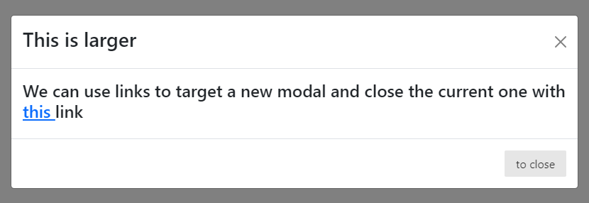
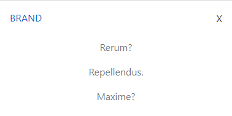
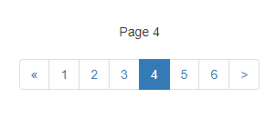
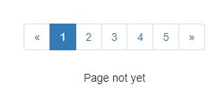
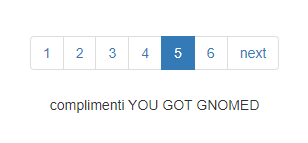

# Boostrap 1 Modal, Collapse button and Pagination

* [Modal & PureCSS](boostrap-1-modal-collapse-button-and-pagination.md#purecss-and-modal)
* [Collapse Buttons](boostrap-1-modal-collapse-button-and-pagination.md#collapse-buttons-and-content)
* [Pagination & Bootpag](boostrap-1-modal-collapse-button-and-pagination.md#pagination-and-bootpag)

Even if we include only some **modules** of bootstrap we use the entire package:

```
//On the <head> or inside the body
<link href="https://cdn.jsdelivr.net/npm/bootstrap@5.2.3/dist/css/bootstrap.min.css" rel="stylesheet" integrity="sha384-rbsA2VBKQhggwzxH7pPCaAqO46MgnOM80zW1RWuH61DGLwZJEdK2Kadq2F9CUG65" crossorigin="anonymous">
<script src="https://cdn.jsdelivr.net/npm/bootstrap@5.2.3/dist/js/bootstrap.bundle.min.js" integrity="sha384-kenU1KFdBIe4zVF0s0G1M5b4hcpxyD9F7jL+jjXkk+Q2h455rYXK/7HAuoJl+0I4" crossorigin="anonymous"></script>

```

### Boostrap Spacing & Display

We can use classes to add **margin** and **padding**:

```
//so, we can use m_- or p_- for Margin or Padding, from 0-5 and even negative numbers
<div class="ms-3"></div>

//we can use x/y for left/right or top/bottom 
<p class="my-2"></p> 

//or if we want left/rigth/top bottom, s(tart),e(nd), t(op), b(ottom)
<h3 class="pe-4"></h3> 

```

And for _**display**_ and _**media-query** breakpoints_:

```
//we display with d-
d-flex /d-block /d-inline-block

//and media-query START from their breakpoints

d-block d-sm-none    //D(isplay)-block but AFTER -sm-D(isplay)-none, only visible in small
d-none d-sm-block    //D(isplay) AFTER small-block but BEFORE is -none
d-none d-sm-block d-md-none    //visible only in md (none in default and AFTER md)

```

### PureCSS and Modal

For modals we have _buttons_ opening **extra windows** with content, through **data-bs-toggle="modal"** and **data-bs-target**:&#x20;

```
//the button will have the -toggle for the modal and the target for the modal content
<button class="pure-button" data-bs-toggle="modal" data-bs-target="#uno">Stati</button>

//parent tag has a modal class to hide the modal before the click/fade for animation 
//and the ID for the target button
//the structure is modal-dialog>
                                 modal-content>
                                                modal-header...                                                   

<div class="modal fade" id="uno">
  <div class="modal-dialog">
    <div class="modal-content">
      <div class="modal-header">
        <button class="btn-close" data-bs-dismiss="modal"></button>
      </div>
      <div class="modal-body">
      </div>
      <div class="modal-footer">
      </div>
    </div>
  </div>
</div>

//to close we use the btn-close bootstrap and close our modal -dismiss="modal"

```











In the **modal content**, we can add Extra PureCSS pure-g(rid), images, forms, and bootstrap effects:

<details>

<summary>Bootstrap double modal guide</summary>

We create **2 modal** inside the other.

**data-bs-backdrop="static"** disables the click-off from the modal.

**modal-dialog-scrollable** will overflow: scroll the modal if Y space is smaller.

We can **bs-dismiss** the current **modal** and **bs-toggle** a new one.

**modal-dialog-centered** centers the modal by X and Y.

**modal-fullscreen-sm-down** will expand the modal to **fullscreen** if screen **below sm** media query.

```
<button class="pure-button" data-bs-toggle="modal" data-bs-target="#tutto"> 
    Mixing 
</button>

<div id="tutto" class="modal fade" data-bs-backdrop="static">

    <div class="modal-dialog modal-dialog-scrollable">
        <div class="modal-content">

            <div class="modal-header">
                <h2>We start </h2>
                <button class="btn-close" data-bs-dismiss="modal"></button>
            </div>

            <div class="modal-body pure-g">
                <div class="pure-u-1 pure-u-sm-1-2">
                    <p> We have the menu here </p>
                </div>
                <div class="pure-u-1 pure-u-sm-1-2">
                    
                </div>
            </div>

            <div class="modal-footer">
                <button class="pure-button" data-bs-dismiss="modal" >Close </button>

                <button class="pure-button" data-bs-target="#secundum" data-bs-dismiss="modal" data-bs-toggle="modal">
                    Avanti 
                </button>
            </div>

        </div>
    </div>

</div>

<div class="modal fade" id="secundum" >

    <div class="modal-dialog modal-lg modal-dialog-centered modal-fullscreen-sm-down">
        <div class="modal-content">

            <div class="modal-header">
                <h3>This is larger </h3>
                <button class="btn-close" data-bs-dismiss="modal"></button>
            </div>
            <div class="modal-body">
            
                <h3>So we can close stuff with a link to the next modal
                    with <a href="#linkato" data-bs-dismiss="modal" data-bs-toggle="modal" >this </a> LINK
                </h3>

            </div>
            <div class="modal-footer">

            </div>

        </div>
    </div>
</div>

```

</details>











### Collapse Buttons and content

So, the **Collapse** Js plugin allows us to toggle the height visibility of **Target** content:

```
//We can use both buttons or <a> links as buttons, it toggles the "collapse" plugin
//AND the target for the content to collapse/show

<a href="" 
    class="pure-button close" 
    data-bs-toggle="collapse" 
    data-bs-target="#opened"> 
    X 
</a>

//we need the COLLAPSE class and target, the rest is PureCSS
<div class="collapse" id="opened">
    <ul class="pure-menu-list centered">
        <li class="pure-menu-item"><a href="" class="pure-menu-link">Rerum?</a></li>
        <li class="pure-menu-item"><a href="" class="pure-menu-link">Repellendus.</a></li>
        <li class="pure-menu-item last"><a href="" class="pure-menu-link">Maxime?</a></li>
    </ul>
</div>

```











Also, it's possible to open **multiple** collapses by targeting tags with the same class:

```
<button class="btn btn-primary" type="button" 
      data-bs-target=".multi-collapse" data-bs-toggle="collapse">
  Toggle both elements
</button>

//even if separated the 2 will open at the same time
<div class="collapse multi-collapse" id="multiCollapseExample1">
  <div class="card card-body">
    Some placeholder content for the first collapse component of this multi-collapse example. This panel is hidden by default but revealed when the user activates the relevant trigger.
  </div>
</div>

<div class="collapse multi-collapse" id="multiCollapseExample2">
  <div class="card card-body">
    Some placeholder content for the second collapse component of this multi-collapse example. This panel is hidden by default but revealed when the user activates the relevant trigger.
  </div>
</div>

```

### Pagination and bootpag

On **pagination** we create a list of links:

```
//pagination-sm/md/lg sets the size of the list 

<ul class="pagination pagination-lg justify-content-center my-5">

    <li class=""><a class="page-link" href="#">
      <span> &laquo;</span></a>
    </li>
    <li class=""><a class="page-link" href="#">1</a></li>
    <li class=""><a class="page-link" href="#">2</a></li>
    <li class=""><a class="page-link" href="#">3</a></li>
    <li class="page-item active"><a class="page-link" href="#">
      <span>&raquo;</span>
    </a></li>

</ul>

```


To have a _**dynamic pagination**_ bar we can use a Jquery Plugin [**Bootpag**](https://botmonster.com/jquery-bootpag/#pro-page-7):

```
//to start using it we need Jquery and Bootpag in the <head> (and of course bootstrap)

<script src="http://code.jquery.com/jquery-2.1.3.min.js"></script>
<script type="text/javascript" src="http://botmonster.com/jquery-bootpag/jquery.bootpag.js"></script>
<link rel="stylesheet" href="http://netdna.bootstrapcdn.com/bootstrap/3.3.4/css/bootstrap.min.css">

```

With the **plug-in** we only need an **id** for the **pagination and content**:

```
<div style="text-align: center">
	<div id="dynamic_content">Pagination goes here</div>
	
	<div id="show_paginator"></div>
</div>

```

Everything is done on **javascript** :

```
//we load the parameters of the paginator with bootpag

$('#show_paginator').bootpag({
      total: 24,      //total pages/links
      page: 1,        //starting page
      maxVisible: 6,  //max number of visible
      next: ">",      //we can change the next button default arrow
      //href: "https://www.amazon.it/" //we can also give each page an automatic link

}).on('page', function(event, num){
     $("#dynamic_content").html("Page " + num); //onclick of the page link we change the html
});

```











We can change the **pagination property** by using **$(this).bootpag({  }).**

```
<div class="text-center">
    <div class="demo1" >Pagination goes here</div>

    <div class="content"></div>
</div>


$('.demo1').bootpag({
    total: 5
}).on("page", function(event, num){
    $(".content").html("Page " + num); 
 
    //we can modify the bootpag after the click with new properties
    $(this).bootpag({
      total: 10,                   //we add more pag elements
      maxVisible: 6,
      next: 'next',
      href: "#pro-page-{{number}}", //we can give each button clicked an href
      prev: null   		    //we can delete the prev button 
    });
 
    if(num==5){
      $(".content").html("complimenti YOU GOT GNOMED")
    }
    //and we can add conditions on specific clicked buttons
});

```










