# Boostrap 1 Modal, Pagination, form layout and input component

* [Modal & PureCSS](boostrap-1-modal-pagination-form-layout-and-input-component.md#purecss-and-modal)
* [Bootstrap collapse button and content](boostrap-1-modal-pagination-form-layout-and-input-component.md#bootstrap-collapse-buttons-and-content)
* [Pagination & Bootpag](boostrap-1-modal-pagination-form-layout-and-input-component.md#pagination-and-bootpag)

Even if we include only some **modules** of bootstrap we use the entire package:

```jsx
//On the <head> or inside the body
<link href="https://cdn.jsdelivr.net/npm/bootstrap@5.2.3/dist/css/bootstrap.min.css" rel="stylesheet" integrity="sha384-rbsA2VBKQhggwzxH7pPCaAqO46MgnOM80zW1RWuH61DGLwZJEdK2Kadq2F9CUG65" crossorigin="anonymous">
<script src="https://cdn.jsdelivr.net/npm/bootstrap@5.2.3/dist/js/bootstrap.bundle.min.js" integrity="sha384-kenU1KFdBIe4zVF0s0G1M5b4hcpxyD9F7jL+jjXkk+Q2h455rYXK/7HAuoJl+0I4" crossorigin="anonymous"></script>

//In React.js we:
npm i bootstrap
import 'bootstrap/dist/css/bootstrap.css';
```

### Boostrap Spacing & Display

We can use classes to add **margin** and **padding**:

```html
//so, we can use m_- or p_- for Margin or Padding, from 0-5 and even negative numbers
<div class="ms-3"></div>

//we can use x/y for left/right or top/bottom 
<p class="my-2"></p> 

//or if we want left/rigth/top bottom, s(tart),e(nd), t(op), b(ottom)
<h3 class="pe-4"></h3> 
```

And for _**display**_ and _**media-query** breakpoints_:

```jsx
//we display with d-
d-flex /d-block /d-inline-block

//and media-query START from their breakpoints

d-block d-sm-none    //D(isplay)-block but AFTER -sm-D(isplay)-none, only visible in small
d-none d-sm-block    //D(isplay) AFTER small-block but BEFORE is -none
d-none d-sm-block d-md-none    //visible only in md (none in default and AFTER md)
```

### PureCSS and Modal

For modals we have _buttons_ opening **extra windows** with content, through **data-bs-toggle="modal"** and **data-bs-target**:&#x20;

```jsx
//the button will have the -toggle for the modal and the target for the modal content
<button class="pure-button" data-bs-toggle="modal" data-bs-target="#uno">Stati</button>

//parent tag has a modal class to hide the modal before the click/fade for animation 
//and the ID for the target button
//the structure is modal-dialog>
                                 modal-content>
                                                modal-header...                                                   

<div class="modal fade" id="uno">
  <div class="modal-dialog">
    <div class="modal-content">
      <div class="modal-header">
        <button class="btn-close" data-bs-dismiss="modal"></button>
      </div>
      <div class="modal-body">
      </div>
      <div class="modal-footer">
      </div>
    </div>
  </div>
</div>

//to close we use the btn-close bootstrap and close our modal -dismiss="modal"

```



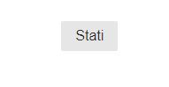







In the **modal content**, we can add Extra PureCSS pure-g(rid), images, forms, and bootstrap effects:

<details>

<summary>Bootstrap double modal guide</summary>

We create **2 modal** inside the other.

**data-bs-backdrop="static"** disables the click-off from the modal.

**modal-dialog-scrollable** will overflow: scroll the modal if Y space is smaller.

We can **bs-dismiss** the current **modal** and **bs-toggle** a new one.

**modal-dialog-centered** centers the modal by X and Y.

**modal-fullscreen-sm-down** will expand the modal to **fullscreen** if screen **below sm** media query.

```jsx
<button class="pure-button" data-bs-toggle="modal" data-bs-target="#tutto"> 
    Mixing 
</button>

<div id="tutto" class="modal fade" data-bs-backdrop="static">

    <div class="modal-dialog modal-dialog-scrollable">
        <div class="modal-content">

            <div class="modal-header">
                <h2>We start </h2>
                <button class="btn-close" data-bs-dismiss="modal"></button>
            </div>

            <div class="modal-body pure-g">
                <div class="pure-u-1 pure-u-sm-1-2">
                    <p> We have the menu here </p>
                </div>
                <div class="pure-u-1 pure-u-sm-1-2">
                    
                </div>
            </div>

            <div class="modal-footer">
                <button class="pure-button" data-bs-dismiss="modal" >Close </button>

                <button class="pure-button" data-bs-target="#secundum" data-bs-dismiss="modal" data-bs-toggle="modal">
                    Avanti 
                </button>
            </div>

        </div>
    </div>

</div>

<div class="modal fade" id="secundum" >

    <div class="modal-dialog modal-lg modal-dialog-centered modal-fullscreen-sm-down">
        <div class="modal-content">

            <div class="modal-header">
                <h3>This is larger </h3>
                <button class="btn-close" data-bs-dismiss="modal"></button>
            </div>
            <div class="modal-body">
            
                <h3>So we can close stuff with a link to the next modal
                    with <a href="#linkato" data-bs-dismiss="modal" data-bs-toggle="modal" >this </a> LINK
                </h3>

            </div>
            <div class="modal-footer">

            </div>

        </div>
    </div>
</div>

```

</details>



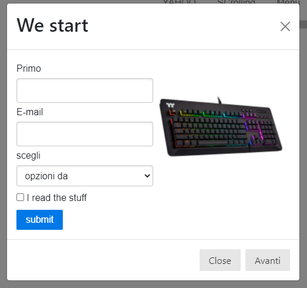



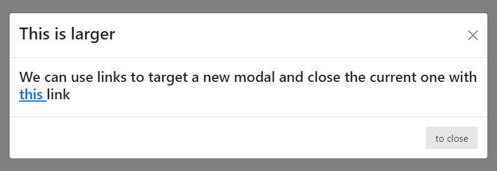



### Pagination and bootpag

On **pagination** we create a list of links:

```jsx
//pagination-sm/md/lg sets the size of the list 

<ul class="pagination pagination-lg justify-content-center my-5">

    <li class=""><a class="page-link" href="#">
      <span> &laquo;</span></a>
    </li>
    <li class=""><a class="page-link" href="#">1</a></li>
    <li class=""><a class="page-link" href="#">2</a></li>
    <li class=""><a class="page-link" href="#">3</a></li>
    <li class="page-item active"><a class="page-link" href="#">
      <span>&raquo;</span>
    </a></li>

</ul>

```

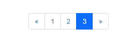

To have a _**dynamic pagination**_ bar we can use a Jquery Plugin [**Bootpag**](https://botmonster.com/jquery-bootpag/#pro-page-7):

```
//to start using it we need Jquery and Bootpag in the <head> (and of course bootstrap)

<script src="http://code.jquery.com/jquery-2.1.3.min.js"></script>
<script type="text/javascript" src="http://botmonster.com/jquery-bootpag/jquery.bootpag.js"></script>
<link rel="stylesheet" href="http://netdna.bootstrapcdn.com/bootstrap/3.3.4/css/bootstrap.min.css">

```

With the **plug-in** we only need an **id** for the **pagination and content**:

```jsx
<div style="text-align: center">
  <div id="dynamic_content">Pagination goes here</div>
	
  <div id="show_paginator"></div>
</div>

```

Everything is done on **javascript** :

```
//we load the parameters of the paginator with bootpag

$('#show_paginator').bootpag({
      total: 24,      //total pages/links
      page: 1,        //starting page
      maxVisible: 6,  //max number of visible
      next: ">",      //we can change the next button default arrow
      //href: "https://www.amazon.it/" //we can also give each page an automatic link

}).on('page', function(event, num){
     $("#dynamic_content").html("Page " + num); //onclick of the page link we change the html
});

```



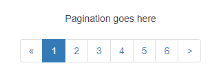



.PNG>)



We can change the **pagination property** by using **$(this).bootpag({  }).**

```
<div class="text-center">
    <div class="demo1" >Pagination goes here</div>

    <div class="content"></div>
</div>


$('.demo1').bootpag({
    total: 5
}).on("page", function(event, num){
    $(".content").html("Page " + num); 
 
    //we can modify the bootpag after the click with new properties
    $(this).bootpag({
      total: 10,                   //we add more pag elements
      maxVisible: 6,
      next: 'next',
      href: "#pro-page-{{number}}", //we can give each button clicked an href
      prev: null   		    //we can delete the prev button 
    });
 
    if(num==5){
      $(".content").html("complimenti YOU GOT GNOMED")
    }
    //and we can add conditions on specific clicked buttons
});

```



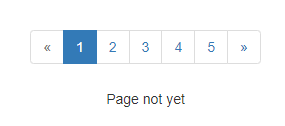



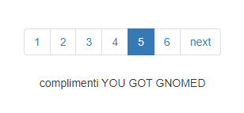



### Bootstrap collapse buttons and content

The **data-bs-toggle="collapse"** uses **href/data-bs-target** to animate the height/width of the **collapse** element.



When using a non-button we use **href="#"** to target the collapse Id content,&#x20;

```jsx
//The trigger container and the collapse can be located anywhere

<div className="row justify-content-center me-0">
  <div className="col-5">

    <div className="d-flex justify-content-between align-items-center p-2" 
         href="#apri" role='button' data-bs-toggle="collapse">
      <p>Click to collapse</p>
      <i className="fa-solid fa-angle-down"></i>
    </div>

    <div className="collapse" id="apri">
      <div className='card card-body'>
        ...Lorem
      </div>
    </div>

  </div>
</div>

```

<figure>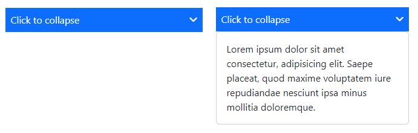<figcaption><p>Vertical collapse trigger</p></figcaption></figure>

To **data-bs-target/href** multiple collapse we use _classes_.



We add **collapse-horizontal** to the collapse content.

```jsx
//By adding role="button" we can use data-bs-target

<div className="row">

  <div className="col-4 d-flex justify-content-between align-items-start pt-3" 
       role='button' data-bs-toggle="collapse" data-bs-target="#ampio">
    <h1>Title</h1>
    <i className="fa-solid fa-angles-right my-3"></i>
  </div>

  <div className="col-8 collapse collapse-horizontal" id='ampio'>
    <div className="card card-body">

      <h1>This is the start</h1>
      <div className="row me-0">
        <div className="col-3">
          
        </div>
        <div className="col-9">
          <p> ...Lorem </p>
        </div>
      </div>

    </div>
  </div>

</div>
```

<figure>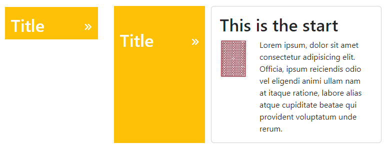<figcaption><p>Vertical collapse content</p></figcaption></figure>



### Bootstrap Forms

We design Boostrap forms using **form-label/form-input** pairs, linked by **htmlfor/ID** attributes.



Each input occupies 100% of the width unless a row>col is set.

```jsx
//We can add read-only and form-control-plaintext to an input

<div className="row justify-content-center">
  <div className="col-6">
    <form>

      <div className="mb-3">
        <label htmlFor="scritta" className="form-label">Primo texto</label>
        <input id="scritta" type="text" className="form-control" />
      </div>

      <div className="mb-3">
        <label htmlFor="plain" className="form-label">Set email</label>
        <input id="plain" type="text" className="form-control-plaintext" 
                value="clash92@gmail.com" readOnly />
      </div>
        
      ....

    </form>
  </div>
</div>

```

<figure>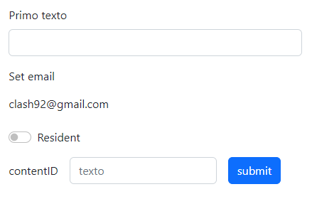<figcaption><p>form with Readonly input, switch checkbox and inline form</p></figcaption></figure>



The **switch** is a styled checkbox input, so we need a **form-switch** container.

```jsx
<div className="mb-3">

  <div className="form-check form-switch">
    <label for="spring" className="form-check-label">Resident </label>
    <input id="spring" type="checkbox" className="form-check-input" />
  </div>

</div>
```

<figure>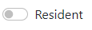<figcaption><p>switch checkox</p></figcaption></figure>



An inline form can be added with a **row** container and col label/input.

```jsx
//we use g(utters) to space the col, col-form-label is for the align

<div className="row g-3 mb-3">

  <div className="col-auto">
    <label for="bugatti" className="col-form-label">contentID</label>
  </div>
  <div className="col-auto">
    <input id="bugatti" type="text" className="form-control" placeholder="texto" />
  </div>
  <div className="col-auto">
    <button className="btn btn-primary">submit</button>
  </div>

</div>

```



We can add the **disabled** or **readOnly** attribute to remove the interaction with inputs.

We can add **multiple input**s to a single form **row,** like **floating-form, Datalist,** and **\<select>.**



We add a row container to the form to create **col** inputs.

```jsx
//Textarea can increase its height with rows=""

<div className="row justify-content-center">
  <div className="col-6">
  
  <form>
    <div className="row">

      <div className="col-6"> floating input... </div>
      <div className="col-6"> input+form-text... </div
      <div className="col-12 mb-3">
        <label for="muro" className="form-label">Your text here</label>
        <textarea id="muro" rows="3" className="form-control"></textarea>
      </div>

      <div className="col-8 mb-2"> datalist... </div>
      <div className="col-4 mb-2"> select... </div>

      <div className="col-3"> radioButton... </div>
      <div className="col-4"> radioButton... </div>
      <div className="col-5"> reverseCheck... </div>

      <div className="col-10 mt-3">
        <button className="btn btn-primary" type="submit">Submit</button>
      </div>

    </div>
    </form>

  </div>
</div>

```

<figure>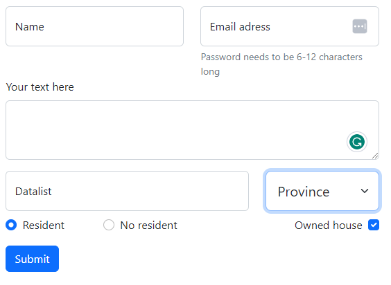<figcaption><p>Floating label, form text, textarea, datalist, option, radio/reverse-checkbox</p></figcaption></figure>



**Form-floating** sets the **label inside** the input and keeps it visible when the input is set, for it to work we need the **input on top of the label**.

**Form-text** puts text **below** the input, we can use aria-describedby/for to link it and input.

```jsx
//we also need form-floating as a container

<div className="col-6">
  <div className="form-floating">
    <input id="mailin" type="password" className="form-control" 
            placeholder="mail" aria-describedby="mailindesc"/>
    <label htmlFor="mailin">Email adress</label>

    <div id="mailindesc" className="form-text">Password needs to be 6-12 characters long</div>
  </div>
</div>

```

<figure>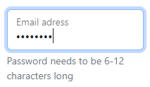<figcaption><p>Form floating + form-text</p></figcaption></figure>

We can use **\<select>** with **form-floating**.

```jsx
//select goes on top of lab

<form>
  <div className="form-floating">
    <select name="simple" id="nope" className="form-select">
      <option value="1">goblin</option>
      <option value="2">Barb</option>
      <option value="3">Arch</option>
      <option value="4">miner</option>
    </select>
    <label htmlFor="basic">base your choice</label>
  </div>
</form>

```

<figure>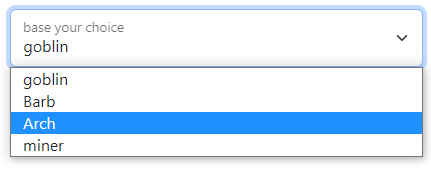<figcaption><p>select component with form-floating</p></figcaption></figure>



**Datalist** allows us to include a series of options for the input-type text.

We need to add **list** to the \<input> and link it to the **datalist** using **ID.**

```jsx
//We can add extra text in <option>, but only value will appear in the input

<div className="col-8 mb-2">
  <div className="form-floating">

    <input id="lista" type="text" className="form-control" list="multipli" 
            placeholder="molti"/>
    <label htmlFor="lista">Datalist</label>
    <datalist id="multipli">
      <option value="ancona">provincia</option>
      <option value="bari"></option>
      <option value="Catania"></option>
      <option value="Duccio"></option>
      <option value="Empoli"></option>
    </datalist>

  </div>
</div>
```

<figure>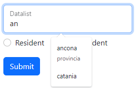<figcaption><p>Datalost options on input text</p></figcaption></figure>



**Form-select** creates a select scrollbar with \<option>, the **selected** one appears first.

```jsx
//form-select-lg was still smaller so we had to add style

<div className="col-4 mb-2">

  <select className="form-select form-select-lg" style={{height: "58px"}}>
    <option selected>Province</option>
    <option value="ancona">AN</option>
    <option value="bari">BA</option>
    <option value="catania">CA</option>
  </select>

</div>

```

<figure>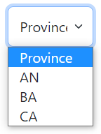<figcaption><p>Select options on the form</p></figcaption></figure>



We use **form-check** (or **form-check reverse**) to add radio **form-check-input** buttons and **form-check-label,** in order to display them **inline** we used **col** containers for eac&#x68;**.**

```jsx
//Radio buttons need to share the Input Name
//Reverse swaps places between input and label

<div className="col-3">

  <div className="form-check">
    <input id="uno" type="radio" className="form-check-input" name="residenza" />
    <label for="uno" className="form-check-label">Resident</label>
  </div>

</div>

<div className="col-4">

  <div className="form-check">
    <input id="due" type="radio" className="form-check-input" name="residenza" />
    <label for="due" className="form-check-label">No resident</label>
  </div>

</div>

<div className="col-5">

  <div className="form-check form-check-reverse">
    <input id="resident" type="checkbox" className="form-check-input" />
    <label for="resident" className="form-check-label">Owned house</label>
  </div>

</div>
```

**Input-groups** can extend a **form-control** and include labels and buttons.

We use **required** to validate the input before the form **submit**s.

<details>

<summary>Input-groups form and basic validation.</summary>

**Input-groups** need a container class and an **input-group-text span.**

```jsx
<div className="input-group mb-3 " >
  <span className="input-group-text"> Name </span>
  <input type="text" className="form-control" 
         placeholder="What's your name?" required
   />
</div>
```

We can chain **multiple span/input** in the same form row, and implement form-control functions like **datalist**.

```jsx
//span space will depend only on their text, can't use col

<div className="input-group mb-3">
  <input type="text" list="molti" className="form-control" placeholder="Set your email name" />
  <datalist id="molti">
    <option value="Catania"></option>
    <option value="catanzaro"></option>
    <option value="corsica"></option>
    <option value="costanza"></option>
  </datalist>
  <span className="input-group-text">@</span>
  <span className="input-group-text">gmail.com</span>
</div>
```

It works with **textarea rows**, and the span text self-aligns.

```jsx
<div className="input-group mb-3">
  <span className="input-group-text">Write a short description</span>
  <textarea type="text" className="form-control" rows="3"/>              
</div>
```

It works for **\<select>** input and **button**s.

```jsx
<div className="input-group">
  <select className="form-select">
    <option selected> Payment method </option>
    <option value="mas">Mastercard</option>
    <option value="pay">Paypal</option>
    <option value="visa">Visa</option>
  </select>
  <button className="btn btn-primary">Submit</button>
</div>
```

</details>

<figure>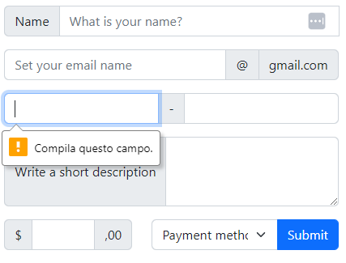<figcaption><p>Input-groups with option,uttons and textarea</p></figcaption></figure>

Bootstrap **validation** is implemented with the **has-validation** container class.

<details>

<summary>Implementing validation using is-valid/invalid and valid/invalid-feedback</summary>

We can use **is-valid/invalid** to style **input, checkboxes, options, and input-groups.**

The **valid/invalid-feedback** will appear depending on the is-valid/invalid input container.

```
//It will make the border/label red/green depending if valid or not

<div className="input-group has-validation">
  <span className="input-group-text">$</span>

  <div className="form-floating is-valid">
    <input type="text" className="form-control" id="float" placeholder="none" required/>
    <label htmlFor="float">How much exactly</label>
  </div>

  <div className="valid-feedback">
    This text is ok
  </div>
  <div className="invalid-feedback">
    Retry the text
  </div>
</div>

```

</details>

<figure>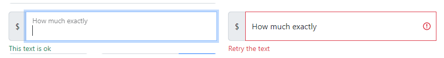<figcaption><p>valid/invalid-feedback HTML and is-valid/invalid style</p></figcaption></figure>

The bootstrap form button, on adaptive columns, needs a **set** width **input** and an **auto** width in **button**.

<details>

<summary>Adaptive input button and floating-form</summary>

The input button needs both widths not overflow into the button.

```jsx
//Floating requires the px-0

<div className="row vol-12 mx-0">
  <div className="col-2">
  </div>

  <div className="col-8 row mx-0 px-0 bg-primary d-flex">
    <form onSubmit={segna} className="row col-6 d-flex">
      <div className="px-0" style={{ width: "50%" }}>
        <input type="text" className="form-controll w-100" name="indi" 
          value={testo} onChange={(e)=> setTesto(e.target.value)} />
      </div>
      <div className="px-0" style={{ width: "auto" }}>
        <button className="btn btn-sm btn-success">
          Sign-in 
        </button>
      </div>
    </form>

    <div className="row mx-0 px-0 col-6 d-flex">
      <div className='form-floating px-0'>
        <input name='name' id="nome" required type="text" 
           className="form-control" placeholder='name'/>
        <label htmlFor="#nome" className="form-label">Name</label>
      </div>
    </div>
  </div>

  <div className="col-2">
  </div>
</div>
```

</details>

<figure><figcaption><p>adaptive form input on bootstrap column </p></figcaption></figure>

We use the **form-range** bootstrap for the **range input type.**

We can set its **min-max** value (by default 0-100) and **steps** for the value of each range snap.

```jsx
//It can be disabled and has a line background and a thumb

<div>
  <label htmlFor="follow" className="form-label">Range of values</label>
  <input id="follow" min="0" max="5" steps="1" type="range" className="form-range" />
</div>
```

<figure>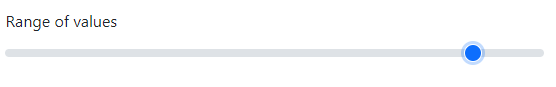<figcaption><p>form-range input</p></figcaption></figure>

We use the **form-control-color** Bootstrap for the **input type color.**

```
//We get rounded color window

<div>
  <label htmlFor="crayon" className="form-label">Pick a color</label>
  <input id="crayon" type="color" className="form-control form-control-color" />
</div>
```

<figure>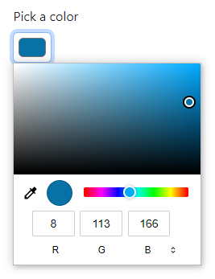<figcaption><p>input type color</p></figcaption></figure>

We use **form-control** for the **type="file" input**.

```
//we get the "scegli file" text included in the form-control with the file name

<div>
  <label htmlFor="face" className="form-label">Upload file</label>
  <input id="face" type="file" className="form-control" />
</div>

```

<figure>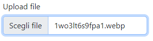<figcaption><p>Input type file</p></figcaption></figure>
