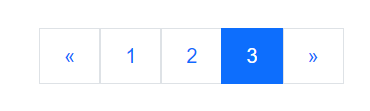
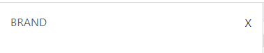
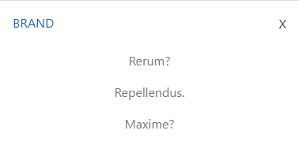
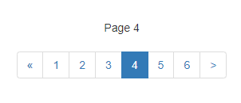

# Boostrap 1

* [Modal & PureCSS](boostrap-1.md#purecss-and-modal)
* [Collapse Buttons](boostrap-1.md#collapse-buttons-and-content)
* [Pagination & Bootpag](boostrap-1.md#pagination-and-bootpag)

Even if we include only some **modules** of **** bootstrap we use the entire package:

```
//On the <head> or inside the body
<link href="https://cdn.jsdelivr.net/npm/bootstrap@5.0.2/dist/css/bootstrap.min.css" rel="stylesheet" integrity="sha384-EVSTQN3/azprG1Anm3QDgpJLIm9Nao0Yz1ztcQTwFspd3yD65VohhpuuCOmLASjC" crossorigin="anonymous">
<script src="https://cdn.jsdelivr.net/npm/bootstrap@5.0.2/dist/js/bootstrap.bundle.min.js" integrity="sha384-MrcW6ZMFYlzcLA8Nl+NtUVF0sA7MsXsP1UyJoMp4YLEuNSfAP+JcXn/tWtIaxVXM" crossorigin="anonymous"></script>

```

### Boostrap Spacing & Display

We can use classes to add **margin** and **padding**:

```
//so, we can use m_- or p_- for Margin or Padding, from 0-5 and even negative numbers
<div class="ms-3"></div>

//we can use x/y for left/right or top/bottom 
<p class="my-2"></p> 

//or if we want left/rigth/top bottom, s(tart),e(nd), t(op), b(ottom)
<h3 class="pe-4"></h3> 

```

And for _**display**_ and _**media-query** breakpoints_:

```
//we display with d-
d-flex /d-block /d-inline-block

//and media-query START from their breakpoints

d-block d-sm-none    //D(isplay)-block but AFTER -sm-D(isplay)-none, only visible in small
d-none d-sm-block    //D(isplay) AFTER small-block but BEFORE is -none
d-none d-sm-block d-md-none    //visible only in md (none in default and AFTER md)

```

So, we can create a **pagination** block of links:

```
//SO, we just need pagination for the style of the list

<ul class="pagination pagination-lg justify-content-center my-5">
  <li class=""><a class="page-link" href="#">
    <span> &laquo;</span></a>
  </li>
  <li class=""><a class="page-link" href="#">1</a></li>
  <li class=""><a class="page-link" href="#">2</a></li>
  <li class=""><a class="page-link" href="#">3</a></li>
  <li class="page-item active"><a class="page-link" href="#">
    <span>&raquo;</span>
  </a></li>
</ul>

//we can use pagination-lg/sm to style size of the options
//Also we can justify-content-start/end/center
//if we want the active background we use both page-item + active

```



### PureCSS and Modal

For modals we have _buttons_ opening **extra windows** with content, through **data-bs-toggle="modal"** and **data-bs-target**:&#x20;

```
//the button will have the -toggle for the modal and the target for the modal content
<button class="pure-button" data-bs-toggle="modal" data-bs-target="#uno">Stati</button>

//parent tag has a modal class to hide the modal before the click/fade for animation 
//and the ID for the target button
//the structure is modal-dialog>
                                 modal-content>
                                                modal-header...                                                   

<div class="modal fade" id="uno">
  <div class="modal-dialog">
    <div class="modal-content">
      <div class="modal-header">
        <button class="btn-close" data-bs-dismiss="modal"></button>
      </div>
      <div class="modal-body">
      </div>
      <div class="modal-footer">
      </div>
    </div>
  </div>
</div>

//to close we use the btn-close bootstrap and close our modal -dismiss="modal"

```











In the **modal content**, we can add Extra PureCSS pure-g(rid), images, forms, and bootstrap effects:

```
//in the parent tag we can use DATA-BS-BACKDROP="static" to block the click-out of modal

<button class="pure-button" data-bs-toggle="modal" data-bs-target="#tutto" >Mixing </button>

<div id="tutto" class="modal fade" data-bs-backdrop="static">

//If the content is too long we can focus the scoll inside the modal
    <div class="modal-dialog modal-dialog-scrollable">
        <div class="modal-content">
            <div class="modal-header">
                <h2>We start </h2>
                <button class="btn-close" data-bs-dismiss="modal"></button>
            </div>
            <div class="modal-body pure-g">
                <div class="pure-u-1-2 pure-u-sm-1">

                </div>
                <div class="pure-u-1-2 pure-u-sm-1">

//So, pure-img allows the image to respond to the screen without being cut
                    

                </div>
            </div>
            <div class="modal-footer">
                <button class="pure-button" data-bs-dismiss="modal" >Close </button>
//In case we have more modals we can -target="#" -dismiss the modal we have and -toggle the new one
                <button class="pure-button" data-bs-target="#secundum" data-bs-dismiss="modal" data-bs-toggle="modal" >Avanti </button>
            </div>
        </div>
    </div>

</div>

//we after-dismiss and -toggle the current modal we can open anew one

<div class="modal fade" id="secundum" >

//In dialog we can add the -centered that will center page the modal if its little enough
//-fullscreen/-fullscreen-sm-down are to have a modal occupy the ENTIRE PAGE, SM-DOWN will do it on smaller screens
    <div class="modal-dialog modal-lg modal-dialog-centered modal-fullscreen-sm-down">
        <div class="modal-content">
            <div class="modal-header">
                <h3>This is larger </h3>
                <button class="btn-close" data-bs-dismiss="modal"></button>
            </div>
            <div class="modal-body">
            
//we can target a modal with <a> and -dismiss/-toggle modal
                <h3>So we can close stuff with a link to the next modal
                    with <a href="#linkato" data-bs-dismiss="modal" data-bs-toggle="modal" >this </a> LINK
                </h3>
            </div>
            <div class="modal-footer">

            </div>
        </div>
    </div>
</div>

```











### Collapse Buttons and content

So, the **Collapse** Js plugin allows us to toggle the height visibility of **Target** content:

```
//We can use both buttons or <a> links as buttons, it needs to toggle the "collapse" plugin
//AND the target for the content to collapse/show

<a href="" 
 class="pure-button close" 
 data-bs-toggle="collapse" 
 data-bs-target="#opened"> 
 X 
</a>

//we need the COLLAPSE class and target, the rest is PureCSS
<div class="collapse" id="opened">
    <ul class="pure-menu-list centered">
        <li class="pure-menu-item"><a href="" class="pure-menu-link">Rerum?</a></li>
        <li class="pure-menu-item"><a href="" class="pure-menu-link">Repellendus.</a></li>
        <li class="pure-menu-item last"><a href="" class="pure-menu-link">Maxime?</a></li>
    </ul>
</div>

```











Also, it's possible to open **multiple** collapses by targetting classes:

```
<button data-bs-target=".multi-collapse" class="btn btn-primary" type="button" data-bs-toggle="collapse" aria-expanded="false" aria-controls="multiCollapseExample1 multiCollapseExample2">
  Toggle both elements
</button>

//We can open both the collapse r have buttons for each
<div class="collapse multi-collapse" id="multiCollapseExample1">
  <div class="card card-body">
    Some placeholder content for the first collapse component of this multi-collapse example. This panel is hidden by default but revealed when the user activates the relevant trigger.
  </div>
</div>

<div class="collapse multi-collapse" id="multiCollapseExample2">
  <div class="card card-body">
    Some placeholder content for the second collapse component of this multi-collapse example. This panel is hidden by default but revealed when the user activates the relevant trigger.
  </div>
</div>

```

### Pagination and bootpag

We create a block of connected links for webpage navigation:

```
//we can add classes active/disable for selected or not active links
//ALSO we can make the navigation bigger/smaller with navigation-lg/-sm additional classes

<nav style="text-align: center">
  <ul class="pagination ">
    <li class=""><a class="page-link" href="#">
        <span aria-hidden="true">&laquo;</span></a>
    </li>
    <li class="disabled"><a class="page-link" href="#">1</a></li>
    <li class=""><a class="page-link" href="#">2</a></li>
    <li class="page-item active"><a class="page-link" href="#">3</a></li>
    <li class=""><a class="page-link" href="#">
      <span aria-hidden="true">&raquo;</span>
    </a></li>
  </ul>  
</nav>

```


To have a _**dynamic pagination**_ bar we can use a Jquery Plugin [**Bootpag**](https://botmonster.com/jquery-bootpag/#pro-page-7):

```
//to start using it we need Jquery and Bootpag in the <head> (and of course bootstrap)

<script src="http://code.jquery.com/jquery-2.1.3.min.js"></script>
<script type="text/javascript" src="http://botmonster.com/jquery-bootpag/jquery.bootpag.js"></script>
<link rel="stylesheet" href="http://netdna.bootstrapcdn.com/bootstrap/3.3.4/css/bootstrap.min.css">

```

In HTML we just need div containers:

```
//one for the content we may show and another for navigation

<div style="text-align: center">
	<div id="dynamic_content">Pagination goes here</div>
	<div id="show_paginator"></div>
</div>

```

Most is done in Javscript:

```
//we load the paramethers of the paginator with bootpag

$('#show_paginator').bootpag({
      total: 24,      //total pages/links
      page: 1,        //starting page
      maxVisible: 6,  //max number of visible
      next: ">",      //we can change the next button default arrow
      //href: "https://www.amazon.it/" //we can also give each page an automatic link

}).on('page', function(event, num){
     $("#dynamic_content").html("Page " + num); //onclick of the page link we change the html
});

```











We can add more properties or events or even change them after the onclick page:

```
//we modify the $(this).bootpag({}) 

$('.demo1').bootpag({
    total: 5
}).on("page", function(event, num){
    $(".content").html("Page " + num); 
 
    //we can modify the bootpag after the click with new properties
    $(this).bootpag({
      total: 10, 
      maxVisible: 6,
      next: 'next',
      href: "#pro-page-{{number}}", //we can give each button clicked an href
      prev: null   		    //we can delete the prev button 
    });
 
    if(num==5){
      $(".content").html("complimenti YOU GOT GNOMED")
    }
    //and we can add conditions on specific clicked buttons
});

```










