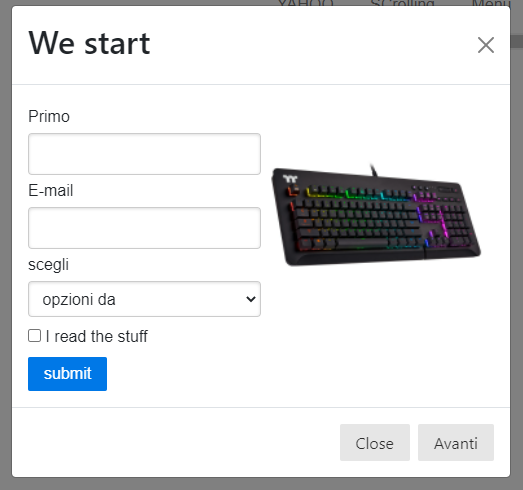

# Boostrap 1

* list
* are
* some
* here

Even if we include only some **modules** of **** bootstrap we use the entire package:

```
//On the <head> or inside the body
<link href="https://cdn.jsdelivr.net/npm/bootstrap@5.0.2/dist/css/bootstrap.min.css" rel="stylesheet" integrity="sha384-EVSTQN3/azprG1Anm3QDgpJLIm9Nao0Yz1ztcQTwFspd3yD65VohhpuuCOmLASjC" crossorigin="anonymous">
<script src="https://cdn.jsdelivr.net/npm/bootstrap@5.0.2/dist/js/bootstrap.bundle.min.js" integrity="sha384-MrcW6ZMFYlzcLA8Nl+NtUVF0sA7MsXsP1UyJoMp4YLEuNSfAP+JcXn/tWtIaxVXM" crossorigin="anonymous"></script>

```

### PureCSS and Modal

For modals we have _buttons_ opening **extra windows** with content:&#x20;

```
//the button will have the -toggle for the modal and the target for the modal
<button class="pure-button" data-bs-toggle="modal" data-bs-target="#uno">Stati</button>

//parent tag has a modal to hide the modal before the click/fade for animation and ID for the target button
//the structure is modal-dialog>
                                 modal-content>
                                                modal-header...                                                   

<div class="modal fade" id="uno">
  <div class="modal-dialog">
    <div class="modal-content">
      <div class="modal-header">
        <button class="btn-close" data-bs-dismiss="modal"></button>
      </div>
      <div class="modal-body">
      </div>
      <div class="modal-footer">
      </div>
    </div>
  </div>
</div>

//to close we use the btn-close boostrap and close our modal -dismiss="modal"

```











In the content, we can add Extra PureCSS pure-g(rid), images, forms, and bootsrap effects:

```
//in the parent tag we can use DATA-BS-BACKDROP="static" to block the click-out of modal

<button class="pure-button" data-bs-toggle="modal" data-bs-target="#tutto" >Mixing </button>

<div id="tutto" class="modal fade" data-bs-backdrop="static">

//If the content is too long we can focus the scoll inside the modal
    <div class="modal-dialog modal-dialog-scrollable">
        <div class="modal-content">
            <div class="modal-header">
                <h2>We start </h2>
                <button class="btn-close" data-bs-dismiss="modal"></button>
            </div>
            <div class="modal-body pure-g">
                <div class="pure-u-1-2 pure-u-sm-1">

                </div>
                <div class="pure-u-1-2 pure-u-sm-1">

//So, pure-img allows the image to respond to the screen without being cut
                    

                </div>
            </div>
            <div class="modal-footer">
                <button class="pure-button" data-bs-dismiss="modal" >Close </button>
//In case we have more modals we can -target="#" -dismiss the modal we have and -toggle the new one
                <button class="pure-button" data-bs-target="#secundum" data-bs-dismiss="modal" data-bs-toggle="modal" >Avanti </button>
            </div>
        </div>
    </div>

</div>

//we after-dismiss and -toggle the current modal we can open anew one

<div class="modal fade" id="secundum" >

//In dialog we can add the -centered that will center page the modal if its little enough
//-fullscreen/-fullscreen-sm-down are to have a modal occupy the ENTIRE PAGE, SM-DOWN will do it on smaller screens
    <div class="modal-dialog modal-lg modal-dialog-centered modal-fullscreen-sm-down">
        <div class="modal-content">
            <div class="modal-header">
                <h3>This is larger </h3>
                <button class="btn-close" data-bs-dismiss="modal"></button>
            </div>
            <div class="modal-body">
            
//we can target a modal with <a> and -dismiss/-toggle modal
                <h3>So we can close stuff with a link to the next modal
                    with <a href="#linkato" data-bs-dismiss="modal" data-bs-toggle="modal" >this </a> LINK
                </h3>
            </div>
            <div class="modal-footer">

            </div>
        </div>
    </div>
</div>

```











here smore
