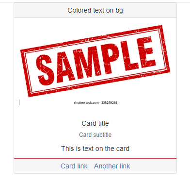
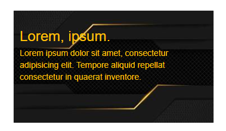
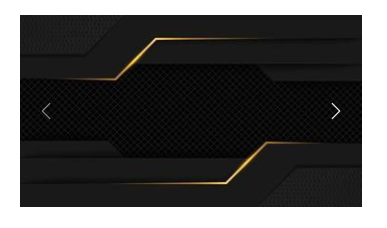

# Boostrap 2 Cards,Carousel, image overlay and dropdown

* [Image overlay & Carousel](boostrap-2-cards-carousel-image-overlay-and-dropdown.md#image-overlay-and-carousel)
* [Dropdown & Extra buttons](boostrap-2-cards-carousel-image-overlay-and-dropdown.md#dropdown-breadcrumbs-and-button-extra-effects)

We use **text-break** to avoid strings overflowing their available width :

```jsx
//This will work only on single-long strings
//It applies word-wrap: break-word/word-break: break-word.

<div className="row col-4 mx-0 text-break">
  <p> ReallyLongEmail@gmail.com </p>
</div>
```

<figure><figcaption><p>text-break on single string</p></figcaption></figure>

### Cards and color/text customization

Cards are blocks of content easily customizable, with **card-header, card-body,** and **card-footer** :

```
//card class gives it the border
//card-header for the gray background and the extra border
//images outside the card-body get extra width

<div class="card">
  <div class="card-header">Colored text on bg</div>

  
  <div class="card-body">
    <h5 class="card-title">Card title</h5>
    <h6 class="text-muted">Card subtitle</h6>  //text muted for the gray effect

  </div>
  
  <div class="card-footer border-danger">      //card-footer similar to header
    <a href="#" class="card-link">Card link</a>
    <a href="#" class="card-link">Another link</a>
  </div>

</div>

```



We can use pureCSS grid layout to display **cards** in a row, with **padding** and **border-box**:

<details>

<summary>Row of cards with padding guide</summary>

Check also the **bootstrap classes colors**:

```
.pure-g > .card{
    box-sizing: border-box;
}

//ALSO we need to use P(adding) instead of margin to keep the grid
<div class="pure-g ">
  <div class="pure-u-1-4 text-center px-3">
    <div class="card border-danger">
    
      <div class="card-header text-start bg-warning">
        Header gray background
      </div>
      
      
      <div class="card-body bg-info">
        <h5 class="card-title"> Title and margins from text</h5>
        <p class="card-text"> Some quick example text to build on the card title and make up the bulk of the card's content.</p>
        <a href="#" class="btn btn-primary"> Go somewhere</a>
      </div>
      
      <div class="card-footer text-muted text-start ">
        grey text for posted time of the post
      </div>
    </div>
  </div>
  
  <div class="pure-u-1-4 text-center px-3">
    <div class="card">
    
      <div class="card-header text-start text-danger bg-success">Colored text on bg</div>
      
      <div class="card-body text-white bg-warning ">
        <h5 class="card-title">Card title</h5>
        <h6 class="text-muted">Card subtitle</h6>
        <p class="card-text">Card-links will have their own borders </p>
      </div>
      
      <div class="card-footer border-danger">
        <a href="#" class="card-link">Card link</a>    //card-link have margin
        <a href="#" class="card-link">Another link</a>
      </div>
    </div>

  </div>
  <div class="pure-u-1-4 text-start px-3">
    ...
  </div>
  <div class="pure-u-1-4 text-center px-3 ">
    ...
  </div>
</div>

```

</details>


Bootstrap **borders** can use **border-1/5** for width, **border-top/start** for position, and **border-top-0** to hide one margin.

```
//for border-top-0 we need border to show the other orderr
<div class="border-bottom border-warning border-3">
  Lorem, ipsum dolor sit amet consectetur adipisicing elit. Dignissimos, 
</div>

<div class="border-top-0 border border-danger border-5">
  Lorem, ipsum dolor sit amet consectetur adipisicing elit. Dignissimos, 
</div>
```

<figure><figcaption><p>margin positions, width and colors</p></figcaption></figure>

Or we could use **Bootstrap W(idth)** and wrap flex:

```
//First need the CSS for the container tag
.riga{
  display: flex;
  flex-wrap: wrap;
  flex-direction: row;
}

<div class="riga">
  <div class="w-25">
  
    <div class="card mx-3">
      
      <div class="card-body ">
        <h5 class="card-title">Card title</h5>
        <p class="card-text">Some quick example text to build on the card title and make up the bulk of the card's content.</p>
        <a href="#" class="btn btn-primary">Go somewhere</a>
      </div>
    </div>
    
  </div>
  <div class="w-25">
  	...
  </div>
  <div class="w-25">
  	...
  </div>
  <div class="w-25">
  	...
  </div>
</div>

```

**Colors** and **text-align** are:

```
text-start/ text-center/ text-end
left      / center     / right

//we can color bg(background), text-, border- using
-primary/-secondary/-warning/-danger/-dark/-info

```

We can also have **Nav**(igation) in our card, with nav, **nav-tabs**, and **card-header-tabs**:

```
//we include a navbar in our card-header with .card-header-tabs

<div class="pure-u-1-3 card">
    <div class="card-header">
      <ul class="nav nav-tabs card-header-tabs">

        <li class="nav-item disabled">    //we disable the nav element
          <a href="" class="nav-link">Navin</a>
        </li>
        
        <li class="nav-item active">      //active gives white nav background
          <a href="" class="nav-link">Navin</a>
        </li>
        <li class="nav-item">
          <a href="" class="nav-link">Navin</a>
        </li>
      </ul>
      
    </div>
    <div class="card-body ">
      <div class="card-text">Lorem ipsum dolor sit amet consectetur adipisicing elit. Ipsum, ratione.</div>
    </div>
</div>

```


For **horizontal cards** we use grids:

```
//We just have to use the pure-grid units, 
for the borders, we contain everything in a card class

<div class="card">
  <div class="pure-g">
    <div class="pure-u-1-3">
      
    </div>
    <div class="pure-u-2-3 card-body">
      <h4 class="card-title">Lorem, ipsum.</h4>
      <p class="card-text">
        Lorem, ipsum dolor sit amet consectetur adipisicing elit. Officia, beatae!
      </p>
    </div>
  </div>
</div>

```


### Image overlay and carousel

To **overlay** text on an image in a **card** unit we use **card-img-overlay** for the **text card**:

```
<div class="card text-warning pure-u-5-12 ">
  
  
  <div class="card-img-overlay">
    <h3 class="card-title">Lorem, ipsum.</h3>
    <p class="card-text">Lorem ipsum dolor sit amet, consectetur adipisicing elit. 
        Tempore aliquid repellat consectetur in quaerat inventore.
    </p>
  </div>
</div>

```



For a basic **carousel**, we need a carousel class and **id target** and **data-bs-ride="carousel"** in the carousel container.

Carousel images go into the **carousel-inner** container, and one of the **carousel-item** needs to be **active class** for the carousel to be visible.

We use **data-bs-target** and **data-bs-slide** for the side control arrows.

```
//we use w-100 and pure-img for the images to fit into the given space
<div class="pure-u-1-4">
  <div class="carousel slide " id="clicked" data-bs-ride="carousel">
  
    <div class="carousel-inner">
       <div class="carousel-item active">
       </div>

       <div class="carousel-item">
            
       </div> 
     </div>

     <button class="carousel-control-prev" data-bs-target="#clicked" data-bs-slide="prev">
       <span class="carousel-control-prev-icon"></span>
     </button>
     <button class="carousel-control-next" data-bs-target="#clicked" data-bs-slide="next">
       <span class="carousel-control-next-icon"></span>
     </button>
     
  </div>
</div>
```



We can also add **text-captions** to the carousel, **timed slides**, and **carousel indicators/buttons**:

<details>

<summary>Carousel indicators, interval and captions guide</summary>

Indicators work as a navbar, but we need extra CSS to style the **active** one:

```
//we color the active indicator
.carousel .carousel-indicators .active{
  width: 30px;
  height: 3px;
  margin: 1.6px 3px;;
  background-color: yellow;
}

```

**Carousel-indicators** is a list of the carousel images, each **item** needs the **id target** of the carousel and **data-bs-slide-to** for its position, and like images it needs one item to be **class="active"**.

By default there is a 5 seconds **auto-scroll**, we can change it with **data-bs-interval**, **hover**ing the slide will stop it.

We add text in the **carousel-caption** container, and we use **breakpoints** to hide them on smaller screens.

```
<div class="carousel slide" id="eccolato" data-bs-ride="carousel">

   <ol class="carousel-indicators">
     <li data-bs-target="#eccolato" data-bs-slide-to="0" class="active" ></li>
     <li data-bs-target="#eccolato" data-bs-slide-to="1"></li>
   </ol>

   <div class="carousel-inner">
   
       <div class="carousel-item active" data-bs-interval="100">
            
            
            <div class="carousel-caption text-light d-none d-md-block">
                <p>This should be the super fast one</p>
            </div>
       </div>
       <div class="carousel-item" data-bs-interval="1000">
            
            
            <div class="carousel-caption text-light d-none d-md-block">
                <p>This should be the super fast one</p>
            </div>
       </div>
   </div>

    <button class="carousel-control-prev" data-bs-target="#eccolato" data-bs-slide="prev">
        <span class="carousel-control-prev-icon"></span>
    </button>
    <button class="carousel-control-next" data-bs-target="#eccolato" data-bs-slide="next">
        <span class="carousel-control-next-icon"></span>
    </button>
</div>

```

</details>


### Dropdown, breadcrumbs, and button extra effects

For a dropdown button, we need **dropdown-toggle**, **data-bs-toggle,** and **data-bs-offset.**

For the dropdown items, we need **dropdown-menu** > **dropdown-item**.

```
//dropdown-toggle is the arrow in the button
//dropdown-menu-dark is for white text and hover effect on dropdown items
//offset is about the X,Y position of the dropdown after being opened

<div class="pure-u-1-6 dropup">
  <button class="btn btn-warning btn-sm dropdown-toggle" 
  data-bs-toggle="dropdown" data-bs-offset="5,20">Lorem</button>

  <ul class="dropdown-menu dropdown-menu-dark bg-danger ">
    <li><a href="" class="dropdown-item active">uno</a></li>
    <li><a href="" class="dropdown-item">due</a></li>
    <li><a href="" class="dropdown-item">tre</a></li>
  </ul>
</div>

```


We have **button+arrow dropdown** and **direction** dropdown content, we need **btn-group** and **dropdown-menu-** .

```
//dropdown-menu-lg-start will set the dropdown content to start when below lg 
//if we add dropdown-menu-md-end we get end direction content ONLY in md width

<div class="pure-u-1-3 btn-group">
    <button type="button" class="btn btn-danger">Very long button</button>
    
    <button data-bs-toggle="dropdown" type="button" 
    class="btn btn-danger dropdown-toggle dropdown-toggle-split">
    </button>
    <div class="dropdown-menu">
        <a class="dropdown-item" href="#">Action</a>
        <a class="dropdown-item" href="#">Something else here</a>
        <div class="dropdown-divider"></div>
        <a class="dropdown-item" href="#">Separated link</a>
    </div>
</div>

<div class="pure-u-1-3">
    <button class="btn btn-success dropdown-toggle" data-bs-toggle="dropdown" 
    data-bs-auto-close="inside">Lorem ipsum dolor sit amet.</button>
    
    <ul class="dropdown-menu dropdown-menu-lg-start dropdown-menu-md-end">
        <li><a href="" class="dropdown-item">Lorem.</a></li>
        <li><a href="" class="dropdown-item">Have the </a></li>
        <li><a href="" class="dropdown-item">Have the </a></li>
    </ul>
</div>

```


**Badges** are small labels that can be put inside or on the border of buttons, we need **badge** and **translate-middle** classes on span elements:

```
//we need a position-relative button and absolute span layers
//then we need to position the rounded-pill badges on the border
//we can also have them on text

<div class="pure-u-1-3">
  <button class="btn btn-secondary position-relative">
  So we have <span class="badge bg-info">6</span> 

  <span class="position-absolute top-0 start-0 translate-middle badge rounded-pill bg-danger p-3"> 
  </span>
  <span class="position-absolute top-100 start-100 translate-middle badge rounded-pill bg-success">
    99+
  </span>
  </button>
</div>


```


We can use **breadcrumbs** to organize navigation links:

```
//it's just a list with breadcrumb list with -item

<nav class="pure-u-1-3 my-5">
  <ol class="breadcrumb">
    <li class="breadcrumb-item"><a href="">Lorem.</a></li>
    <li class="breadcrumb-item"><a href="">Reiciendis.</a></li>
    <li class="breadcrumb-item"><a href="">Magnam?</a></li>
    <li class="breadcrumb-item"><a href="">Aspernatur.</a></li>
  </ol>
</nav>

```


