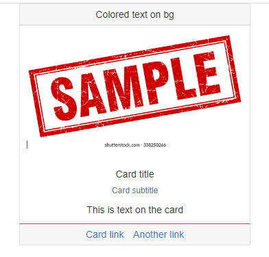
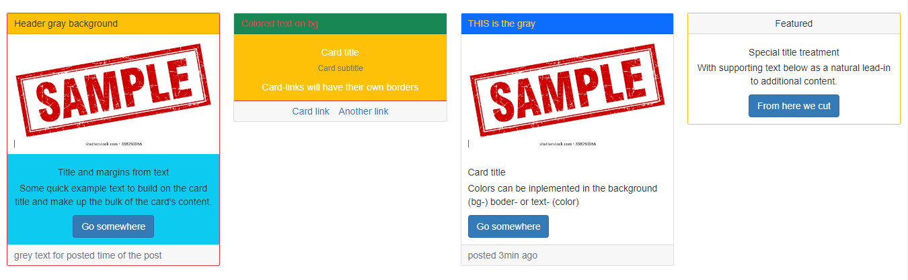
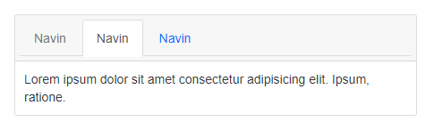
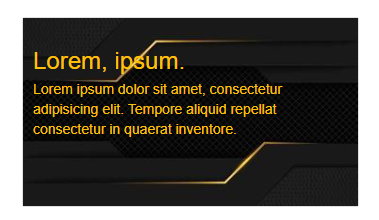
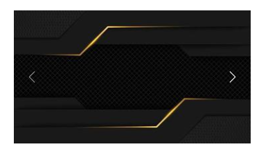
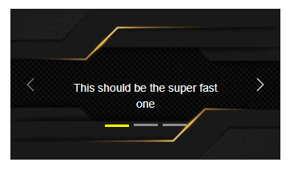

# Boostrap 2

* Cards and stuff
* more
* MORE

### Cards and color customitation

Cards are block of content easily customizable:

```
//Example of a single card structure, card in the container tag gives it the borders

<div class="card">
  <div class="card-header">Colored text on bg</div>
//card header gives it the gray background and border to the rest of the card

  
  <div class="card-body">
    <h5 class="card-title">Card title</h5>
    <h6 class="text-muted">Card subtitle</h6>
//images can beput inside/outside the body in case you want extra margin and need pure-img to adapt it to the space
//text-muted has teh grey effect

  </div>
  <div class="card-footer border-danger">
    <a href="#" class="card-link">Card link</a>
    <a href="#" class="card-link">Another link</a>
  </div>
//footer has the same as heaer, grey background  

</div>

```



To put more cards in row with padding between we can use pureCSS columns:

```
//Using the pureCSS, we need to include for each card

.pure-g > .card{
    box-sizing: border-box;
}

//ALSO we need to use P(adding) instead of margin to keep the grid
<div class="pure-g ">
  <div class="pure-u-1-4 text-center px-3">

//we put card after the padding to keep the borders separated
    <div class="card border-danger">
      <div class="card-header text-start bg-warning">
        Header gray background
      </div>
      
      <div class="card-body bg-info">
        <h5 class="card-title"> Title and margins from text</h5>
        <p class="card-text">Some quick example text to build on the card title and make up the bulk of the card's content.</p>
        <a href="#" class="btn btn-primary">Go somewhere</a>
      </div>
      <div class="card-footer text-muted text-start ">
        grey text for posted time of the post
      </div>
    </div>
  </div>
  <div class="pure-u-1-4 text-center px-3">
    <div class="card">
      <div class="card-header text-start text-danger bg-success">Colored text on bg</div>
      <div class="card-body text-white bg-warning ">
        <h5 class="card-title">Card title</h5>
        <h6 class="text-muted">Card subtitle</h6>
        <p class="card-text">Card-links will have their own borders </p>
      </div>
      <div class="card-footer border-danger">
      
//card-link elements have margin included
        <a href="#" class="card-link">Card link</a>
        <a href="#" class="card-link">Another link</a>
      </div>
    </div>

  </div>
  <div class="pure-u-1-4 text-start px-3">
  	...
  </div>
  <div class="pure-u-1-4 text-center px-3 ">
  	...
  </div>
</div>

```



Or we could use Bootstrap W(idth) and wrap flex:

```
//First need the CSS for the container tag

.riga{
  display: flex;
  flex-wrap: wrap;
  flex-direction: row;
}

<div class="riga">
  <div class="w-25">
  
//to keep the card borders we have to use m(argins) in the same tag as card 
    <div class="card mx-3">
      
      <div class="card-body ">
        <h5 class="card-title">Card title</h5>
        <p class="card-text">Some quick example text to build on the card title and make up the bulk of the card's content.</p>
        <a href="#" class="btn btn-primary">Go somewhere</a>
      </div>
    </div>
  </div>
  <div class="w-25">
  	...
  </div>
  <div class="w-25">
  	...
  </div>
  <div class="w-25">
  	...
  </div>
</div>

```

**Colors** and **text-align** are:

```
text-start/ text-center/ text-end
left      / center     / right

//we can color bg(background), text-, border- using
-primary/-secondary/-warning/-danger/-dark/-info

```

We can also have **Nav**(igation) in our card:

```
//we include a navbar in our card-header with .card-header-tabs

<div class="pure-u-1-3 card">
    <div class="card-header">
      <ul class="nav nav-tabs card-header-tabs">
      
//we can both disabled the list element or the link
        <li class="nav-item disabled">
          <a href="" class="nav-link">Navin</a>
        </li>
        
//active will just have the white background on the link, a nice effect but doesnt work on colored bg-
        <li class="nav-item active">
          <a href="" class="nav-link">Navin</a>
        </li>
        <li class="nav-item">
          <a href="" class="nav-link">Navin</a>
        </li>
      </ul>
    </div>
    <div class="card-body ">
      <div class="card-text">Lorem ipsum dolor sit amet consectetur adipisicing elit. Ipsum, ratione.</div>
    </div>
</div>

```



For horizontal cards we can:

```
//We just have to use the pure-grid units, for the borders we contain everything in a card calss

<div class="card">
<div class="pure-g">
  <div class="pure-u-1-3">
    
  </div>
  <div class="pure-u-2-3 card-body">
    <h4 class="card-title">Lorem, ipsum.</h4>
    <p class="card-text">
      Lorem, ipsum dolor sit amet consectetur adipisicing elit. Officia, beatae!
    </p>
  </div>
</div>
</div>

```


### Image overlay and carousel

To overlay text on an image in a card unit we can:

```
//we put the card-img-overlay class to the TEXT

<div class="card text-warning pure-u-1-4 ">
  
  <div class="card-img-overlay">
    <h3 class="card-title">Lorem, ipsum.</h3>
    <p class="card-text">Lorem ipsum dolor sit amet, consectetur adipisicing elit. 
        Tempore aliquid repellat consectetur in quaerat inventore.
    </p>
  </div>
</div>

```



For a basic carousel we need images and arrows to scroll through them:

```
//for starters we need .carousel .slide for the container tag, with an id target and data-bs-RIDE="carousel"

<div class="pure-u-1-4">

//here we can add the .fade to change the slide to a fede effect
  <div class="carousel slide " id="clicked" data-bs-ride="carousel">
  
//the content images will go in carousel-inner AND you need to have a carousel-item active for the entire thing to be visible
	<div class="carousel-inner">
	   <div class="carousel-item active">
	   </div>
//also you may need W(idth)-100 & pure-img for the images to fit or adapt
	   ...
	 </div>

//for the side buttons we just need the target to the carousel and data-bs-slide "prev" "next" for the action
	 <button class="carousel-control-prev" data-bs-target="#clicked" data-bs-slide="prev">
	   <span class="carousel-control-prev-icon"></span>
	 </button>
	 <button class="carousel-control-next" data-bs-target="#clicked" data-bs-slide="next">
	   <span class="carousel-control-next-icon"></span>
	 </button>
  </div>
</div>

```



We can also add text-captions to the carousel, timed slides, and carousel indicators/buttons:

```
//carousel-indicators works like a list, we need the data-bs-target and a data-bs-slide="0/1/2"
//ALSO we need some extra CSS to style the active indicator

.carousel .carousel-indicators .active{
    width: 30px;
    height: 3px;
    margin: 1.6px 3px;;
    background-color: yellow;
}

<div class="carousel slide" id="eccolato" data-bs-ride="carousel">
   <ol class="carousel-indicators">
     <li data-bs-target="#eccolato" data-bs-slide-to="0" class="active" ></li>
     <li data-bs-target="#eccolato" data-bs-slide-to="1"></li>
     <li data-bs-target="#eccolato" data-bs-slide-to="2"></li>
   </ol>

   <div class="carousel-inner">
   
 //so, normally there is a delay of 5 seconds on auto scroll but we can change it with data-bs-interwal="milliseconds"
 //also being :hover the slide stops it
       <div class="carousel-item" data-bs-interval="100">
         
         
//we add carousel-caption with the image in carousel item, we can use D(isplay) and breackpoits to hide it for smaller screens
//d-none d-md-block, after the -md- its block visible, before it's not
         <div class="carousel-caption text-light d-none d-md-block">
           <p>This should be the super fast one</p>
         </div>
       </div>
       <div class="carousel-item" data-bs-interval="1000">
         ...
       </div>
       <div class="carousel-item active" data-bs-interval="2000">
         ...
       </div>
   </div>

   <button class="carousel-control-prev" data-bs-target="#eccolato" data-bs-slide="prev">
       ...
   </button>
</div>

```



### Dropdown and button extra effects

A basic dropdown button:

```
//dropdown-toggle is the small arrow near the text while we can modify button size with btn-sm/lg

<div class="pure-u-1-6">
  <button class="btn btn-warning btn-sm dropdown-toggle" data-bs-toggle="dropdown" data-bs-offset="5,20">Lorem</button>

//this menu wont be visible before the button click
  <ul class="dropdown-menu">
    <li><a href="" class="dropdown-item active">uno</a></li>
    <li><a href="" class="dropdown-item">due</a></li>
    <li><a href="" class="dropdown-item">tre</a></li>
  </ul>
</div>

```
