# Boostrap 3 Bootstrap grid, Scrollspy, Toast and responsive navbar

* [ScrollSpy](boostrap-3-bootstrap-grid-scrollspy-toast-and-responsive-navbar.md#scrollspy-implementation)
* [Toast & Pop-up](boostrap-3-bootstrap-grid-scrollspy-toast-and-responsive-navbar.md#toast-and-pop-up-messages)
* [Responsive and toggle Navbar](boostrap-3-bootstrap-grid-scrollspy-toast-and-responsive-navbar.md#responsive-bootstrap-navbar-and-toggle-button)
* [Complete responsive page](boostrap-3-bootstrap-grid-scrollspy-toast-and-responsive-navbar.md#complete-responsive-page)

> We can check frontEnd designs from [here ](https://preview.colorlib.com/#boxus)

The **bootstrap grid** layout is based on flexbox, it uses **container**, **row**, and **col**(uns).

The width is organized into **12 units**, **col**umns can be **auto** to adapt to their content.

The bootstrap **col**umns implement media query **breakpoints** using **sm**,**md**, and **lg**.&#x20;

```jsx
//we can use container-fluid to remove the container default margins
//the breakpoints will take effect AFTER the md, from a 1-5-auto to 3-3-3 on smaller

<div class="container">
  <div class="row">

    <div class="col-3 bg-warning col-md-1">
      Lorem
    </div>
    <div class="col-3 bg-danger col-md-5">
      Lorem
    </div>
    <div class="col-3 bg-success col-md-auto">
      L
    </div>
    
  </div>
</div>
```

<figure>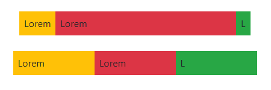<figcaption><p>Grid columns on md and not-md screen</p></figcaption></figure>

We can **align** and **justify col** elements in the container:

<details>

<summary>Bootstrap align and justify</summary>

For **align** we need extra classes and CSS height:

```jsx
.altezza{
  height: 7em;
  background-color: lightcoral;
}

//we need flex on container to align on row to work, also on content inside
<div class="container d-flex altezza">
  <div class="row align-items-center">

    <div class="col-3">
      One of three columns
    </div>
    <div class="col-3">
      One of three columns
    </div>
    <div class="col-3">
      One of three columns
    </div>
    <div class="col-3 align-self-start">
      Another column
    </div>
    
  </div>
</div>

```

While **justify** doesn't need extra CSS.

```jsx
//it uses between/around to justify space them
<div class="container ">
  <div class="row justify-content-end">

    <div class="col-2">
      lorem
    </div>
    <div class="col-2">
      lorem
    </div>
    <div class="col-2">
      lorem
    </div>

  </div>
</div>

```

</details>

<figure>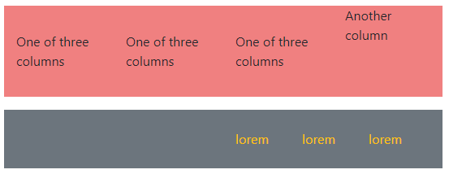<figcaption><p>align-items and justify-content</p></figcaption></figure>

The d-flex **justify** goes before the row/**col** class.

```jsx
//First we set the justify ad then the row/col
<div className="d-flex justify-content-center mt-5">
  <div className="row mx-0 col-8 bg-primary" style={{ height: "20vh" }}>

  </div>
</div>
```

<figure><figcaption><p>Centered d-flex col-8 element</p></figcaption></figure>

We create a **break-line** between columns using a div with **w-100**:

<details>

<summary>break-line and breakpoints</summary>

Without the div the columns share space:

```
<div class="container">
  <div class="row">

    <div class="col-4 bg-primary">social skill</div>
    <div class="col-4 bg-warning">social skill</div>

    <div class="w-100"></div>

    <div class="col-3 bg-danger">Soldier </div>
    <div class="col-3 bg-success">Soldier </div>

  </div>
</div>

```

We use d-block to remove the break-line on breakpoint.

```
//will be removed on sm, while display on md after
<div class="container">
  <div class="row">
    <div class="col-4 bg-primary">social skill</div>
    <div class="col-4 bg-warning">social skill</div>

    <div class="w-100 d-none d-md-block"></div>

    <div class="col-3 bg-danger">Soldier </div>
    <div class="col-3 bg-success">Soldier </div>

  </div>
</div>


```

</details>

<figure>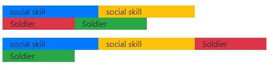<figcaption><p>w-100 breakpoint and without</p></figcaption></figure>

We can use **m**argin-auto to space columns on the sides.

<details>

<summary>margin-auto guide</summary>

We use **mr/ml-auto** to push the column to a side.

```
//the second push the third to the max right
<div class="row my-1">

  <div class="col-3 bg-primary">
    Lorem
  </div>
  <div class="col-3 mr-auto bg-warning">
    Lorem
  </div>
  <div class="col-3 bg-danger">
    Lorem
  </div>
  
</div>
```

We can use **m**argin on **breakpoints**, but we need to nullify it first.

```
//on md and after we push it to the right, after null the ml, on below md
//we push it to the left  
<div class="row">

  <div class="col-4 col-md-6 bg-primary">
    Bordato
  </div>
  <div class="col-4 ml-auto col-md-1 mr-md-auto ml-md-0 bg-warning">
    Bordato1
  </div>

</div>
```

</details>

<figure>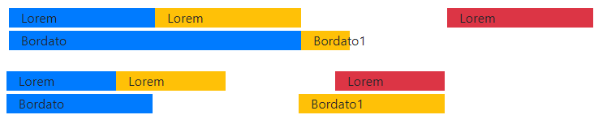<figcaption><p>mr-md-auto and ml auto on media query</p></figcaption></figure>

We can use **offset** to move them by column **units** to the **right**.

<details>

<summary>Bootstrap offset guide</summary>

On **md**, we increase the offset on the smaller col, below md we invert offset and columns width to alternate between,&#x20;

```
<div class="container">

  <div class="row">
    <div class="col-3">sound register </div>
    <div class="col-3 offset-3">sound register </div>
  </div>

  <div class="row">
    <div class="col-3 offset-3 col-md-1 offset-md-2">sound register </div>
    <div class="col-3 offset-3 col-md-1 offset-md-5">sound register </div>
  </div>

</div>
```

</details>

When **nesting rows** we keep the 12 units width.&#x20;

<details>

<summary>Row nesting guide</summary>

We need a **row** class on the container.

```
<div class="container m-2">

  <div class="row">
    <div class="col-3 bg-primary d-flex justify-content-center align-items-center text-white">
      nesting 
    </div>

    <div class="col-8 bg-warning">
      nesting 

      <div class="row">
        <div class="col-8 bg-secondary">
          nested 
        </div>
        <div class="col-3 bg-danger">
          nested 
        </div>
      </div>
    </div>
  </div>

</div>

```

</details>

<figure><figcaption><p>row nesting with align/justify flex</p></figcaption></figure>

### Scrollspy and getBoundingClientRect()

The **getBoundingClientRect()** method returns an object, its properties provide the **position** relative to its **viewpoint** and the **size** of the viewpoint, with the position value updated on **scroll**.

```
//we get x7y position or width/height

highlight.getBoundingClientRect().y/x/height/width
```

<details>

<summary>getBoundingClientRect() as scrollspy guide</summary>

In the HTML we need **nav-pills** (on containers to have the active bg color on nav-items child elements):

```
<div class="col-md-6 ">
  <nav class="navbar bg-light ">

    <nav class="nav nav-pills bounding flex-column w-100">

      <a href="" class="navbar-brand ms-2">Navbrand</a>
      <a href="" class="nav-link">
        Read text
      </a>

      <div class="nav-link text-dark">
        Top position:
        <p id="movimento"></p>
        Scroll window height:
        <p id="altezza"></p>
        Scroll window width:
        <p id="larghezza"></p>
      </div>

    </nav>

  </nav>
</div>
<div class="col-md-6 bounding" id="window">

  <p class="obiettivo" >
    We use <b>getBoundingClientRect()</b> to link specific js functions 
    to a specific scrolling position of the element, the starting 
    top value is given by the navbar
  </p>

</div>

//while on CSS we need the overflow scroll and a height
.bounding{
    position: relative;
    height: 400px;
}

.row .bounding:nth-child(2){
    overflow-y: scroll;
}

.bounding > p{
    padding: 600px 0 100px 0;
}

```

The starter **x/y** value of **getBoundingClientRect**() includes all the other elements on the page, we add **active** to the nav-link:

```
//we first select the window, the element to scroll to, and the nav-link
let finestra= document.getElementById("window")
let highlight = document.querySelector(".obiettivo")
let navi= document.querySelectorAll(".bounding .nav-link")

let visible = highlight.getBoundingClientRect().y
movimento.innerText= visible

finestra.addEventListener("scroll", ()=>{

  visible= highlight.getBoundingClientRect().y
  movimento.innerText= visible

  altezza.innerText= highlight.getBoundingClientRect().height
  larghezza.innerText= highlight.getBoundingClientRect().width

  if( visible< -70){
      navi[0].classList.add("active")
  }else{
      navi[0].classList.remove("active")
  }
  
})

```

To **calculate** where an element be **visible** we:

```
//We take the total top distance (padding-top) - window height - starting top
// 600px - 400px - 131px= -70px (we scrolling down so we need negative)

```

The problem is that the getBoundingClientRect().x/y value changes on **smaller screens**.

</details>

<figure>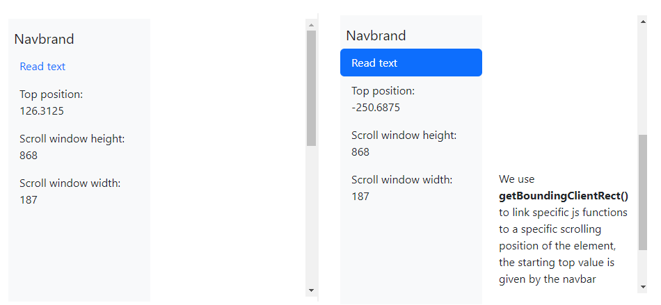<figcaption><p>Using <strong>getBoundingClientRect()</strong> for navlist-item <strong>scrollspy</strong></p></figcaption></figure>

Being getBoundingClientRect() an **object** we can get all its **properties** with a loop:

```
let bounded = highlight.getBoundingClientRect()

for( const xx in bounded ){
    console.log( xx + " : " + bounded[xx] )
}
```

The **scrollspy Bootstrap component** updates **nav-item** elements based on **scroll position**.

<details>

<summary>Column navbar and scrollspy guide</summary>

For the column navbar, we need, an **ID** target, **flex-column** for the navbar direction, and **align-items-stretch** for the width (due to the inverted flex-direction).

```
//also we need h-100 for the flex to cover the height
<div class="col-4">

  <nav id="colonna" class="h-100 flex-column align-items-stretch pe-4 border-end mt-4">
    <nav class="nav nav-pills flex-column">

    <a href="" class="navbar-brand my-2">Navbrand </a>
      <a class="nav-link" href="#item-1">Item 1</a>
      <nav class="nav nav-pills flex-column">
        <a class="nav-link ms-3 my-1" href="#item-1-1">Item 1-1</a>
        <a class="nav-link ms-3 my-1" href="#item-1-2">Item 1-2</a>
      </nav>
      <a class="nav-link" href="#item-2">Item 2</a>
      <a class="nav-link" href="#item-3">Item 3</a>
      <nav class="nav nav-pills flex-column">
        <a class="nav-link ms-3 my-1" href="#item-3-1">Item 3-1</a>
        <a class="nav-link ms-3 my-1" href="#item-3-2">Item 3-2</a>
      </nav>
    </nav>
  </nav>

</div>
```

On the **scroll** div, we need **data-bs-spy="scroll"** and **data-bs-target** for the navbar id.

Each time an element **ID** referenced by a **nav-link href** is scrolled into view, the nav-link gets .**active** .

```
<div class="col-8">

  <div data-bs-spy="scroll" data-bs-target="#colonna" data-bs-smooth-scroll="true" 
  class="scrolling">
    <div id="item-1">
      <h4>Item 1</h4>
      <p>
        Lorem ipsum dolor sit amet consectetur adipisicing elit. 
        Distinctio maiores saepe quis nihil ab esse consequuntur 
        recusandae expedita inventore unde alias, atque qui possimus 
        eum enim quas magni quibusdam id.
      </p>
    </div>
    <div id="item-1-1">
      <h5>Item 1-1</h5>
      <p>
        ...
      </p>
    </div>
    <div id="item-1-2">
      <h5>Item 1-2</h5>
      <p>
        ...
      </p>
    </div>
    <div id="item-2">
      <h4>Item 2</h4>
      <p>
        ...
      </p>
    </div>
    <div id="item-3">
      <h4>Item 3</h4>
      <p>
        ...
      </p>
    </div>
    <div id="item-3-1">
      <h5>Item 3-1</h5>
      <p>
        ...
      </p>
    </div>
    <div id="item-3-2">
      <h5>Item 3-2</h5>
      <p>
        ...
      </p>
    </div>
  </div>
  
</div>

```

</details>

<figure>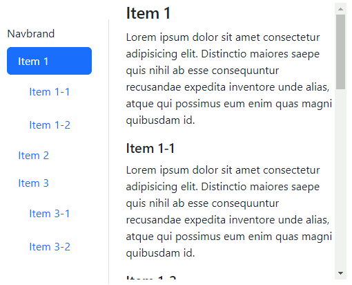<figcaption><p>Scrollspy on column navbar</p></figcaption></figure>

For more **navbar layout** check the complete project:


navbar scrollspy page


### Toast cards and functions

The **toast** component mimics the push notifications, composed of a **toast** and **show** class, **toast-header, toast-body,** and a **data-bs-dismiss="toast"** to close it.

We use **position-fixed** to have the toast always visible and position with **top/bottom/start/end-0/50**.

```
//The toast-body has a level of transparency, and add some margin and position

<div class="toast-container position-fixed bottom-0 start-0 ms-2 mb-2">
  <div class="toast show " style="z-index: 2;">

    <div class="toast-header">
      
      <strong class="me-auto">Header bold</strong>

      <small>small text</small>
      <button type="button" class="btn-close" data-bs-dismiss="toast"></button>
    </div>

    <div class="toast-body">
      In order to be always visible we use position fixed
    </div>

  </div>
</div>

```

<figure>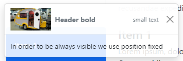<figcaption><p>Toast with margin and position</p></figcaption></figure>

For multiple overlaying toasts and **position-static** on the **toast-container**:

<details>

<summary>Toast-container and position-static guide</summary>

We can't use absolute positions like with static position, so we need an extra parent to **d-flex** and **justify** the toast-container,&#x20;

```
//The toast-container adds margins to the toasts

<div class="d-flex justify-content-center">
  <div class="toast-container position-static mb-2">

    <div class="toast show" role="alert">
      <div class="toast-header">
        
        <strong class="me-auto">Overlaying</strong>

        <button type="button" class="btn-close" data-bs-dismiss="toast" ></button>
      </div>
      <div class="toast-body">
        toast-container adds a margin 
      </div>
    </div>
  
    <div class="toast show" role="alert">
      <div class="toast-header">
        
        <strong class="me-auto">toast bootstrap</strong>
        
        <small class="text-muted">2 seconds ago</small>
        <button type="button" class="btn-close" data-bs-dismiss="toast" ></button>
      </div>
      <div class="toast-body">
        between the 2 toasts
      </div>
    </div>

  </div>
</div>

```

1

1

1

1

</details>

<figure>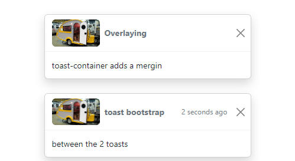<figcaption><p>fixed-position, overlay and justify toasts</p></figcaption></figure>

We use extra **js** to **trigger a toast** on **button** click, triggered toats will close after a delay.

<details>

<summary>Toast button trigger</summary>

Triggered toast will automatically close, you can add **data-bs-delay=""** to change the delay or use **data-bs-autohide="false"** to keep it open.

```
//we also need an ID for the toast and the button
<div class="my-4">
  <button type="button" class="btn btn-primary" id="liveToastBtn">Show live toast</button>
</div>

<div class="toast-container position-fixed bottom-0 start-0 ms-3 mb-3">
  <div id="liveToast" class="toast" data-bs-autohide="false" >
    <div class="toast-header">
      
      <strong class="me-auto">Toast on button</strong>

      <button type="button" class="btn-close" data-bs-dismiss="toast"></button>
    </div>
    <div class="toast-body">
      we used new bootstrap.Toast() on js
    </div>
  </div>
</div>

```

On **Js** we use the button and toast **ID**:

```
//we create a Toast() instance and then trigger the show() method
const toastTrigger = document.getElementById('liveToastBtn')
const toastLiveExample = document.getElementById('liveToast')

toastTrigger.addEventListener('click', () => {
    const toast = new bootstrap.Toast(toastLiveExample)
  
    toast.show()
})

```

</details>

<figure>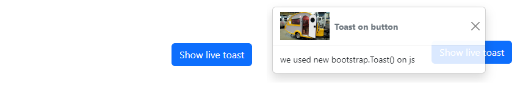<figcaption><p>Toast on button click</p></figcaption></figure>

We can use **external buttons** to **close** a toast:

```
//we need a target and a dismiss on the button
<div class="toast-container top-0 start-50">
  <div class="toast show" id="chiude">

    <div class="toast-body">
      Just a body without a dismiss button
    </div>

  </div>
</div>

<div class="position-fixed top-0 end-0">
  <button type="button" class="btn btn-primary top-0 start-50" data-bs-dismiss="toast" data-bs-target="#chiude">
    close 
  </button>
</div>
```

### Bootstrap offcanvas&#x20;

**Offcanvas** are hidden sidebars, using **data-bs-toggle** and **data-bs-target** on the button**.**

While using **offcanvas** and **offcanvas-(position)** on the content.

```
//like modal it also can use data-bs-backdrop, we can close with data-bs-dismiss
//data-bs-scroll is for the scroll to work only on open offcanvas.

<button class="btn btn-warning" data-bs-toggle="offcanvas" data-bs-target="#ecco">
  Sinistra
</button>

<div id="ecco" class="offcanvas offcanvas-start" data-bs-scroll="true" data-bs-backdrop="false" >
  <div class="offcanvas-header ">
    <h3>This sidebar </h3>
    
    <button class="btn-close" data-bs-dismiss="offcanvas"></button>
  </div>
  <div class="offcanvas-body">
    <p> So, we can implement limit scroll and close on click outside offcanvas </p>
  </div>
</div>

```

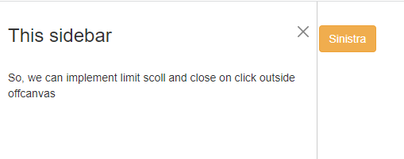

### Responsive bootstrap navbar and toggle button

The responsive navigation **navbar** bootstrap component can implement **navbar-brand**, **navbar-collapse** content, and **input-groups**.

We implement the **responsive toggler-button** using **navbar-expand**.

<details>

<summary>Responsive navbar with input group guide</summary>

We use **navbar-expand-** on the nav to **expand** the **nav-items** over md breakpoint and **collapse** them when below.

When **collapse**d we display the **navbar-toggler** button, which **data-bs-target** the **navbar-collapse** collapsed content using **data-bs-toggle="collapse".**

For the navbar content, we use **navbar-nav> nav-item> nav-link.**

```
//we also need a container-fluid as an added container for the margins

<nav class="navbar navbar-expand-md bg-primary navbar-dark">
    <div class="container-fluid">

        <a href="" class="navbar-brand">Titolo</a>

        <button class="navbar-toggler" data-bs-toggle="collapse" 
                data-bs-target="#primo">
            <span class="navbar-toggler-icon"></span>
        </button>

        <div class="collapse navbar-collapse" id="primo">
            <ul class="navbar-nav me-auto">
                <li class="nav-item">
                    <a href="" class="nav-link">Element </a>
                </li>
                <li class="nav-item">
                    <a href="" class="nav-link">Element </a>
                </li>
                <li class="nav-item">
                    <a href="" class="nav-link">Element </a>
                </li>
            </ul>

            <div class="input-group w-50">
                <span class="input-group-text">Text</span>
                <input type="text" class="form-control"></input>
                <button class="btn btn-outline-warning">Change</button>
            </div>
        </div>

    </div>
</nav>
```

</details>

<figure>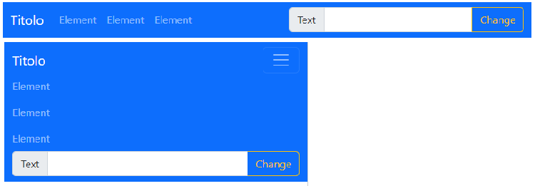<figcaption><p><strong>navbar-expand</strong> and <strong>navbar-collapse</strong></p></figcaption></figure>

We can implement **dropdown**, **navbar-brand** images,**overflow-y,** and **multiple collapse** containers to the navbar.

<details>

<summary>Dropdown and set height navbar guide</summary>

On the **navbar-collapse** we add **navbar-nav-scroll** and **style="--bs-scroll-height: 120px",** this set height scroll will work on the toggle content.

```
//The set height/width on the navbar-brand  and align with the text
<nav class="navbar navbar-expand-md bg-warning">
  <div class="container-fluid">
    <a href="" class="navbar-brand">
      
      Walter 
    </a>
    ...
    <div class="navbar-collapse collapse mt-2" id="noor">
      <ul class="navbar-nav ms-auto navbar-nav-scroll" style="--bs-scroll-height: 120px">

        <li class="nav-item">
          <a href="" class="nav-link">
              item
          </a>
        </li>
        <li class="nav-item">
          <a href="" class="nav-link">
              item
          </a>
        </li>
      </ul>
    </div>

  </div>
</nav>
```

For a **dropdown nav-item** on the navbar-nav we:

```
//remember that dropdown-item goes in the <A>

<li class="nav-item dropdown">
  <a href="" class="nav-link dropdown-toggle" data-bs-toggle="dropdown"> item </a>
  
  <ul class="dropdown-menu">
    <li><a href="" class="dropdown-item">Farina </a></li>
    <li><hr class="dropdown-divider"> </li>
    <li><a href="" class="dropdown-item">Farina </a></li>
    <li><a href="" class="dropdown-item">KFC </a></li>
  </ul>
</li>
```

We can create **multiple collapse** container by using the **same ID**

```
//we make it appear at the bottom and the transition is the same
<div class="collapse position-fixed bottom-0 w-100" id="noor">
  <div class="bg-success text-white p-1">
    <h1>Title of video</h1>
    <p class="m-0">This is at the bottom</p>
  </div>
</div>
```

For the **divider line** in the dropdown we:

```
<li><hr class="dropdown-divider"></li>
```

</details>

<figure>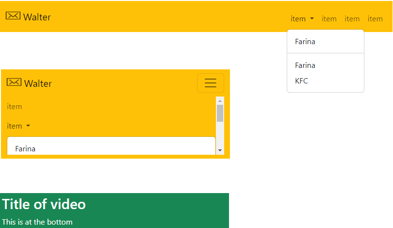<figcaption><p>expanded navbar with dropdown and multiple collapsed</p></figcaption></figure>

We set the navbar **\<nav>** position using **fixed-top/bottom**, **sticky-top/bottom.**

### Bootstrap complete responsive page

Here's a complete **triple-layout** bootstrap page:



For the **layout** , we nest the **bootstrap** rows:

<details>

<summary>Triple layout guide</summary>

We create a **col-2 sidebar**, that's gonna become a **top navbar** on a small screen.

Then we nest 2 other **columns** on the right side to then make them into full rows on smaller screens.

```
//we use breakpoints to choose layouts
<div class="container-fluid">
    <div class="row">
        <div class="col-12 col-sm-2 bg-warning sidebar">

        </div>
        <div class="col-12 col-sm-10">

            <div class="row">
                <div class="col-12 col-lg-4 bg-danger toppo">

                </div>
                <div class="col-12 col-lg-8 bg-info contenuto">

                </div>
            </div>

        </div>
    </div>
</div>
```

Remember to use **vh** for the height of different layout components.

```
//to cover the entire screen height 100%/vh
.sidebar{
    height: 100vh;
}

@media only screen and (max-width: 950px) {
    .toppo{
        height: 30vh;
    }
    
    .contenuto{
        height: 70vh;
    }
}

@media only screen and (max-width: 550px) {
    .sidebar{
        height: 15vh;
    }
    .toppo{
        height: 20vh;
    }
    
    .contenuto{
        height: 55vh;
    }
}

```

</details>

<figure>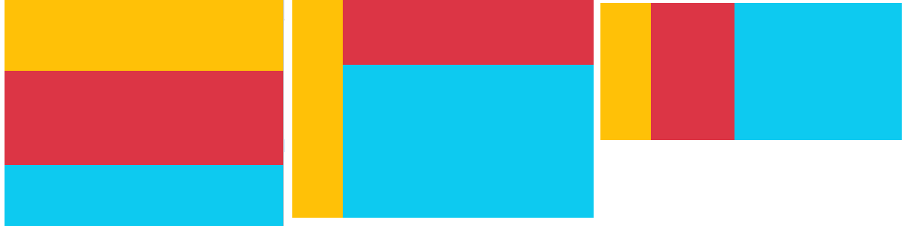<figcaption><p>small, medium and large screen layout</p></figcaption></figure>

We used **overflow** and **vh** for the fixed scroll container.

<details>

<summary>Fixed scroll container guide</summary>

We don't need to use position-fixed, we need an **overflow-y** and a **vh** to cover **100**% of the screen.

```
//we create an image + text column
<div class="col-lg-4 listato">
    
  <div class="row mt-2 border-bottom border-warning">
      <div class="col-2 mt-2">
          
      </div>
      <div class="col-10 pe-0">
          <h6 class="email-name mb-0"> Hello from Toronto </h6>
          <p class="email-subject mb-0"> Article by <a href="" class="email-author">Minimister </a> about 
              <button class="btn btn-success btn-sm text-sm"> CSS </button> & 
              <button class="btn btn-danger btn-sm"> Js </button>
          </p>
          <p class="email-desc">
              Hey, I just wanted to check in with you from Toronto. I got here earlier today.
          </p>
      </div>
  </div>

  <div class="row mt-2 border-bottom border-warning">
      <div class="col-2 mt-2">
        ...
      </div>
      <div class="col-10 pe-0">
        ...
      </div>
  </div>

  <div class="row mt-2 border-bottom border-warning">
      <div class="col-2 mt-2">
        ...
      </div>
      <div class="col-10 pe-0">
        ...
      </div>
  </div>

</div>

```

On the **CSS**:

```
.listato{
    max-height: 100vh;
    overflow-y: scroll;
}
```

</details>

<figure>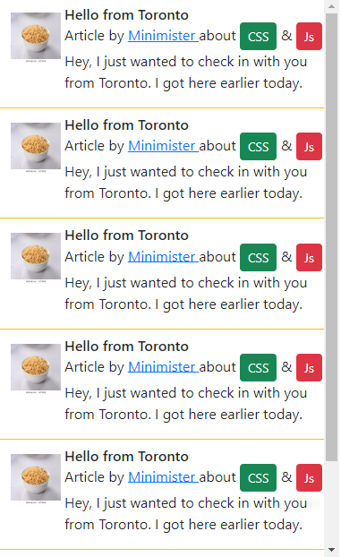<figcaption><p>Scrollable column on 100vh </p></figcaption></figure>

For the **image rows** with links on the smaller screen, we used **img-fluid**, (fixed) **height**, and position **absolute**:

<details>

<summary>Images rows guide</summary>

We use **img-fluid** and **height** to keep images' size responsive.

```
<div class="col-4 p-0 image">
    <a href="">
        
    </a>

    <aside> 
        <span>by
          <a href="http://www.dillonmcintosh.tumblr.com/" class="text-white">
            Dillon McIntosh
          </a>
        </span>
    </aside>
</div>

<div class="col-8 p-2 bg-dark text-warning riga">
    <h5>This is the odd space </h5>
    <p>
        A collection of beautiful photos gathered from Unsplash.com.
    </p>
</div>

```

For the **absolute**-positon **text** on the **images**:

```
.image{
    position: relative;
}

.image .riga{
    height: 150px;
}

.image aside {
    position: absolute;
    bottom: 0;

    padding: 0.5em 0.5em;
    color: white;
    width: 100%;
    font-size: 80%;
    text-align: right;

    background: -webkit-linear-gradient(
        top,
        #ffffff00 0%,
        rgba(12,2,2,0.7) 100%
    );
}
```

</details>

<figure><figcaption><p>responsive row images with absolute text</p></figcaption></figure>

For the **footer** to cover the entire width, we need an extra **row** with a single **col-12**.

```
//for position-fixed we need absolute position bottom-0
<div class="row">
  <div class="col-12 bg-dark text-warning p-2 text-center position-fixed bottom-0 " style="font-size: 70%;">
    View the source of this layout to learn more. Made with love by the Pure Team.
  </div>
</div>
```

<figure>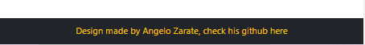<figcaption><p>fixed-position footer </p></figcaption></figure>
