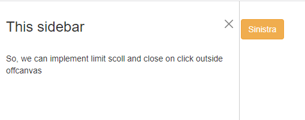

# Boostrap 3

* uno
* due
* tre

**Offcanvas** are hidden sidebars we can trigger with buttons:

```
//we need data-bs-target="#" or href="#" to trigger the hidden sidebar(offcanvas)

<button class="btn btn-warning" data-bs-toggle="offcanvas" data-bs-target="#ecco">
  Sinistra
</button>

//we need offcanvas and -(position) to choose where it's gonna appear, data-bs-backdrop="false" is to disable the close-offcanvas on click outside the sidebar
//while data-bs-scroll true is to limit the scoll on only the sidebar
<div id="ecco" class="offcanvas offcanvas-start" data-bs-scroll="true" data-bs-backdrop="false" >
  <div class="offcanvas-header ">
    <h3>This sidebar </h3>
    
//to add a close botton we just use -dismiss="offcanvas"
    <button class="btn-close" data-bs-dismiss="offcanvas"></button>
  </div>
  <div class="offcanvas-body">
    <p> So, we can implement limit scoll and close on click outside offcanvas </p>
  </div>
</div>

```



### ScrollSpy Implementation

We can use the scrollSpy component even without Boostrap:


ScrollSpy with simple JS


A scollSpy is structured in a **menu** and a **content scroll:**

```
//in 2 columns

<div class="pure-g">
<div class="pure-u-1-2 ">
  <menu>
    <nav id="select" class="navbar flex-column p3 align-items-stretch">
      <a class="navbar-brand" href="#">Navbar</a>
      
<!-- nav-pills is what allows the active to have the color background -->      
      <ul class="nav nav-pills flex-column">
        <li class="nav-item active">
        
<!--a class for the <a> links isnt needed -->
          <a href="#uno" >Lorem.</a>
        </li>
        <li class="nav-item">
          <a href="#due">Lorem.</a>
        </li>
        <li class="nav-item">
          ...
        </li>
        
//we just added margin to group the nav-item
        <li class="nav-item ms-3">
          <a href="#cinc">margin items</a>
        </li>
      </ul>
    </nav>
  </menu>
</div>

//here we have the scroll content, each section has a menu-item correspondant
<div class="pure-u-1-2 contenuto" id="serve">
  <div>
    <section>
      <h2 id="uno">Id on title</h2>
      <p>
        So, the text on menu click is based on href="#" link and id on title
      </p>
    </section>
    <section>
      ...
    </section>

  </div>
</div>

</div>

```

For the Javascript we need to use the .**active** bootsrap class on click:

```
//we select each menu-item 

let eccoli = document.querySelectorAll("menu li")

//foreach on click we REMOVE the active class from each one, then we add ONLY to the clicked element
eccoli.forEach(i=>{
  i.onclick = (()=>{
      eccoli.forEach(o=> o.classList.remove("active"))
      i.classList.add("active")
  })
})

```

On scroll you need to use [**\_\_.getBoundingClientRect().y**](https://www.w3schools.com/jsref/tryit.asp?filename=tryjsref\_element\_getboundingclientrect):

```
//We don't scroll the entire page so we need a selector for the scroll section we use
let scrolling = document.getElementById("serve")

//and we need another one for the singular paragraphs
let singoli = document.querySelectorAll("#serve section")

scrolling.addEventListener("scroll", ()=>{

//while we scroll the selected for each of the paragraph we get the position relative to the viewpoint
  singoli.forEach((x,y)=>{
    let space = x.getBoundingClientRect().y

//we check x.getBoundingClientRect at the start and at the end of the scroll to calculate
//the space for each paragraèh using also the window.innerHeight
    if(space < window.innerHeight - 456){
    
//here we just do the same as with the click function
      eccoli.forEach( z=> z.classList.remove("active"))
      eccoli[y].classList.add("active")
    }
  })
})

```

### Toast and pop-up messages

With toast, we can add close-ready messages to the page:

```
//Toast structure is similar to card

<div class="toast-container position-fixed bottom-0 end-0 me-3 mb-3">
//to keep the toast fixed on the border of the page we just need position-fixed, it needs
//a coordinates to be visible, bottom/start/end/top

  <div class="toast show hide" id="tuno">
//we include the .hide for js toggle later, toaster-header will have a bottom-border from body
  
      <div class="toast-header">
        <h5>This is the left </h5>
        <button class="btn-close ms-auto" id="ecco1"></button>
      </div>
//like organizing grid in the toast
      <div class="toast-body pure-g">
        <div class="pure-u-1-3">
          
        </div>
        <div class="pure-u-2-3 p-3">
          <p>Lorem ipsum dolor sit amet consectetur, adipisicing elit. Iusto esse maiores, id a delectus quisquam!</p>
        </div>
      </div>
 
  </div>
</div>

```

For the JS we can toggle the .**show** .**hide:**

```
//with .toggle we can add .show if absent OR remove it if present
let ecco = document.getElementById("ecco")
let ecco1 = document.getElementById("ecco1")

function hiding(dele){
  dele.classList.toggle("show")
}

ecco1.onclick=(()=>{
  hiding(ecco)
})

```

### Responsive navbar with Toggle button

Check the final result:

.PNG>)

```
//navbar includes the justify-content-between, while bg gives it the background-color

<nav class="navbar bg-warning">
        <div>
//navbar-brand will be thicker and no text-link decoration
            <a href="" class="navbar-brand ps-3">Lorem.</a>
        </div>

//the navbar will be not displayed on smaller screens
        <div class="d-sm-flex d-none align-items-center">
//align-items in the container class is to vertically align the children tags

            <div class="mx-1">simao.</div>
            <div class="pure-menu-item pure-menu-has-children pure-menu-allow-hover pe-0">
                <a href="" class="pure-menu-link">SCROLL </a>
                <ul class="pure-menu-children">
                    <li class="pure-menu-item">
                        <a href="" class="pure-menu-link">daje</a>
                    </li>
                    <li class="pure-menu-item">
                        <a href="" class="pure-menu-link">daje</a>
                    </li>
                    <li class="pure-menu-item">
                        <a href="" class="pure-menu-link">allargato may</a>
                    </li>
                </ul>
            </div>
    
//In a navbar we need to have the .dropdown class in the container tag
            <div class=" dropdown">
                <a class="nav-link dropdown-toggle" data-bs-toggle="dropdown" href="#">Tutorials</a>
                <div class="dropdown-menu">
                    <a class="dropdown-item" href="#">Microsoft</a>
                    <a class="dropdown-item" href="#">JAVA</a>
                    <a class="dropdown-item" href="#">Database</a>
                </div>
            </div>

//for form we will need d-flex in the container tag
            <div>
                <form class="pure-form d-flex">
                    <input type="text" class="pure-input" placeholder="search">
                    <button class="pure-button btn-sm">try </button>
                </form>
            </div>
    
        </div>

```

We won't use Navbar-expand- and instead will create a new **navbar-toggle:**


For the code:

```
//for it to be visible only on a small screen we d-block AND d-sm-none

        <div class="d-block d-sm-none">
            <button class="navbar-toggle" data-bs-toggle="collapse" 
            data-bs-target="#tuo">
                <span class="navbar-toggler-icon"></span>
            </button>
        </div>

//the .collapse class keeps the content hidden until the data-bs-toggle="collapse is clicked
//and the navbar-collapse has the id = data-bs-target
            <div class="navbar-collapse collapse text-dark" id="tuo">
            <ul class="navbar-nav text-center">
                <li class="nav-item"><a href="" class="nav-link"> COSETTE </a></li>
                <li class="nav-item"><a href="" class="nav-link">Ipsam?</a></li>
                <li class="nav-item"><a href="" class="nav-link">Quo.</a></li>
                <li class=" mx-auto ">
                    <form class="pure-form d-flex">
                        <input type="text" class="pure-input" placeholder="search">
                        <button class="pure-button">try </button>
                    </form>
                </li>
            </ul>
        </div>  
</nav>

```

### Complete responsive page

Check this exercise:



About the responsive Layout:

```
//The HTML structure is based of:

<div class="pure-g">

    <div id="nav" class="pure-u-1">
    </div>

    <div id="list" class="pure-u-1">
        <p>column is here</p>
    </div>

    <div id="main" class="pure-u-1">
        <p>main text is here</p>
    </div>
</div>

```





The CSS code is:

```
// The Nav needs width/height and no position

#nav{
    background-color: orange;
    height: auto;
    width: 100%;
}

```





For CSS we:

```
//#nav, #list and #main will have fixed position, overflow is for the scrollable content og List

#nav, #list, #main {
    position: fixed;
    overflow: auto;
}

//with height 100% we occupy the entire page with sidenav
#nav {
    width: 9.5em;
    height: 100%;
}

//the margin is the width occupied by the sidebar
#list {
    margin-left: 9.5em;
    width: 90% ;
    height: 33%; 
    border-bottom: 1px solid #ddd;
}

//is top-position is the height occupied by the #list, we need bottom if we want it to cover the Y space
//and we include the sidenav margin
#main {
    top: 33%;
    bottom: 0; 
    left: 9.5em;
    background-color: violet;
}

```





For the large screen CSS:

```
//we make columns with height

#list {
    width: 22em;
    height: 100%;
    border-right: 1px solid #ddd;
}

//we use static position to avoid the previous media-query positioning
#main {
    position: static;
    margin-left: 30em;
    bottom: 0;
}

```



About every single layout now:


```
//For the sticky scrollable image:

<div class="splash-container d-block d-sm-none w-100">
    <div class="splash text-center text-dark">
        <h1 class="splash-head py-2">Big Bold Text</h1>
        <p class="splash-subhead mb-1">
            Lorem ipsum dolor sit amet, consectetur adipisicing elit.
        </p>
        <a href="http://purecss.io" class="btn btn-primary">Get Started</a>
    </div>
</div>

//height is for the image BUT the space is given by the margin between fixed elements
.splash-container {
    background: url("https://..");
    height: 54%;
    position: fixed !important;
}
//we can create the space with absolute and top position
#main{
    position: absolute;
    top: 46%;
}

//For the overlay-image content we need absolute and left/right position to center it
//width reduces the space occupied by the content to avoid spreading with margin

.splash {
    width: 55%;
    margin: auto;
    position: absolute;
    top: 100px;
    left: 0; 
    right: 0;
}

```

For the image grid with bottom-shadow + author link and Footer:


```
//for each row of images we use the pureCSS grid
//To keep different images at the same height we add to use extra CSS inside the img tag

<div class="image pure-u-1-3">
    <a href="">
      
    </a>

    <aside><span>by
        <a href="http://..">
          Dillon McIntosh
        </a></span>
    </aside>
</div>

<div class="texto pure-u-2-3 p-3 riga">
    <h4>This is the odd space </h4>
    <p>A collection of beautiful photos gathered from Unsplash.com.</p>
</div>

//first we need each image to be relative (to then apply the effect)
.image{
    position: relative;
}
//in case we want to stretch images in the grid layout
.image img{
    width: 100%;
}

//with position absolute we can be inside the image, bottom and text align give the text position
//while width 100% will cover the entire single image
.image aside {
    position: absolute;
    bottom: 0;
    padding: 0.5em 0.5em;
    color: white;
    width: 100%;
    font-size: 80%;
    text-align: right;

/*the shadow can be done with abackground, the top(white) from the black 90% down*/
    background: -webkit-linear-gradient(top,#ffffff00 0%,rgba(12,2,2,0.7) 100%);
}

//For the footer

<div class="footer text-center bg-dark p-2 w-100">
  <div class="pure-u-1">
      View the source of this layout to learn more. Made with love by the Pure
      Team.
  </div>
</div>

//fixed position and bottom will stick the footer and not be moved by scroll
.footer {
    color: orange;
    font-size: 70%;
    bottom: 0;
    position: fixed;
}

```

For the **scrollable messages** in the **MD** screen:


```
// we used CSS on the images and grid on the text

<div class="px-3 py-2 border-bottom border-warning email-item-selected pure-g">
    <div class="pure-u">
        
    </div>

    <div class="pure-u-3-4">
        <h6 class="email-name mb-0"> Hello from Toronto </h6>
        <p class="email-subject mb-0"> Article by 
            <a class="email-author">Minimister </a> about 
            <button class="btn btn-success btn-sm text-sm"> CSS </button> & 
            <button class="brn btn-danger btn-sm"> Js </button>
        </p>
        <p class="email-desc">
            Hey, I just wanted to check in with you from Toronto. I got here earlier today.
        </p>
    </div>
</div>

//The email-name is UpperCase , and email-subject is font-size 90%, for btn we just added
.btn-danger:hover{
    text-decoration: underline;
}

```
