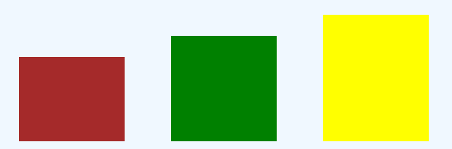
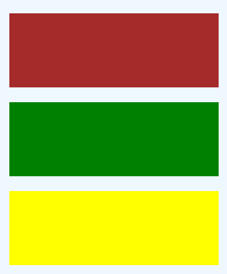

# CSS 1

* [Position, Canvas and Animation](css-1.md#position-canvas-and-animation)
* [Buttons and effects](css-1.md#buttons-and-effects)
* [CSS effects and :before:after](css-1.md#css-effects-and-before-after)
* [Flex layout](css-1.md#flex-and-media-query)

## Get the css working

**In the HTML file by EMMET**

```sql
link 

<link rel="stylesheet" type="text/css" href="style.css">
```

**Cascading style sheets** files .CSS is organized in:

```sql
-external
<link rel="stylesheet" type="text/css" href="style.css">
(rel stands for relantionship)

-internal
Selectors {
  properties: values !important;
}

-inline
<p style="color:red"> indeed </p>

id# > class. > tag
```

Selectors mirror html tags for priority ( tag > id# > .class )

Here some **Inline, Inline-block and block:**



```
//inline elements won't have height/width and will be placed on a single line
//inline-block won't still start a new line, included in the tags span/img/a for example

<span class="linea">
    <div></div>
    <div></div>
    <div></div>
</span>

```



With inline-block we can use width/height and keep the boxes in a new line:

```
.linea div:first-child{
    width: 100px;
    height: 80px;
    background-color: brown;
    margin: 20px;
    display: inline-block;

}

.linea div:nth-child(2){
    width: 100px;
    height: 100px;
    background-color: green;
    margin: 20px;
    display: inline-block;

}

.linea div:nth-child(3){
    width: 100px;
    height: 120px;
    background-color: yellow;
    margin: 20px;
    display: inline-block;
}

```







display:block will occupy the entire line and accept width/height, with the tags div, h1, p, li:

```
<span class="linea1">
    <span></span>
    <span></span>
    <span></span>
</span>
```



```
.linea1 span:first-child{
    height: 100px;
    background-color: brown;
    margin: 20px;
    display: block;

}

.linea1 span:nth-child(2){
    height: 100px;
    background-color: green;
    margin: 20px;
    display: block;
}

.linea1 span:nth-child(3){
    height: 100px;
    background-color: yellow;
    margin: 20px;
    display: block;
}

```





### CSS Selectors

Consider the following **example**:



So, the syntax for them is:

```
<plate> 
  <orange/>
  <orange/>
  <orange/>
</plate>

plate > * (for every tag inside <plate)
#x.y (to select with both tag x AND class y)
.x, .y (to select classes with x OR x)
x + .y (to select only the first .y to follow the x [children not included])
x > y (to select children on parent tag)
plate:only-child/first-child/last-child (to select specific positions)
*[for] (all properties with the attribute selector)
p[for]:not([for="non"]) (to exclude a specific attribute selector)
input[type="checkbox"] (or even with specific)
[class*="heading"] (to select classes with "heading" in the name)
:nth-child(1) (using numbers for position)

```

To adapt elements for different screens we use **media queries**:

```
@media only screen and (max-width: 400px) {
    .head > h1{
        font-size: 1.1em;
    }
    .type{
        font-size: 80%;
    }
    @keyframes left {
        0% { background-position: -805px 0; }
        100% { background-position: 0px 0; 
               left:5%;}
    }
}
  
//like we choose a smaller font for an H1, and the complete 
keyframe statuses
```

Also, the properties are inherited and so we have to change only the different ones.

### **Position, Canvas and Animation**

check this example:


animation on html/css page


We used animations/transition/canvas and pixel art.

#### Transitions and animations

So, to modify CSS properties trought different states we can use:

```
.box{
  background: blueviolet;
  width: 200px;
  height: 150px;
  transition: 1s;
}

.box:hover{
  width: 300px;
}

//we transition in 1second the box's width from 200 to 300 
after a :hover, but we have to use transform to do more like rotate()

.type{
  border-right: .1em solid green;
  animation: color 1s step-end infinite;
}

@keyframes color{
  0% { border-color: green; }
  50% { border-color: transparent; }
  100% { border-color: green; }
}

//we animate the border to intermit in 1 second, infinite
some elements can't be animated
```

The syntax  is \[all]\[0.5s]\[ease] / **\[target]\[time]\[way]**.

We can use **Tranform** for more properties and multiple animations:

```
.box{
    background: blueviolet;
    width: 50px;
    height: 50px;
    transition: height 1s linear, width 4s ease-out, transform 3s;
    transition-delay: 1s
}

//to multiple or add a transform to a transition

.box:hover{
    width: 200px;
    height: 150px;
    transform: rotate(180deg);
}

```

To animate the sprite pixel art (and the text on the title) we used **steps()**:

```
animation: left 8s steps( 10,start) infinite;

steps( start, end)
```

which allows to divide the animating sequence in parts and choose which frame at the **start/end.**

To use pixel art we use it as **background**:

```
.rotate{
    background:url("image") 0 0 no-repeat;
    width: 32px;
    height: 64px;
    animation: example 8s steps(21) infinite;
}

background :url("./yosi3.png") -730px 0px;

//and we can choose the frame of start by changing x/y
```

and for our **animated text** and effect we had:

```
<h2 class="type"> This line is (almost) automatically animated </h2>

.type{
    white-space: nowrap;
    overflow: hidden;
    border-right: .1em solid green;
    
    transition: all 5s steps( 35, end);
    animation: color 1s step-end infinite;
}

//nowrap is to have it all text in one line
while hidden is to have the text limited by the starter width
(to then animate the final 30em width)

body:hover .type{
    width: 30em;
}

@keyframes color{
    0% { border-color: green; }
    50% { border-color: transparent; }
    100% { border-color: green; }
}
```

Here we have the text expanding, with steps for each letter, also for the buttons we can use the \~ :

```
first-sequence ~ second-sequence {
  /* property:value; */
}

//the 2 siblings tags dont have to be close, just in sequence
```

Instead of importing an image for the egg, we used **Canvas** to "code" the image:

```
<body>
    <canvas id="egg" width="300px" height="350px" style="border:solid transparent 2px">
    </canvas>

</body>

<script>
  var c = document.getElementById("myCanvas");
  var ctx = c.getContext("2d");
  ctx.beginPath();
  ctx.arc(100, 75, 50, 0, 2 * Math.PI);
  ctx.stroke();
</script> 

//we get the id, we set the "2d" and we beging tracing
we draw a circle with (Xposition, Yposition, Ray,
starting radiant, end radiant) we can also set rotation. 
```

we set up a space with the **\<canvas>** tag with id, width and height to then script the image in. For our exercise, we also needed to draw an ellipse:

```
inn.ellipse( 95, 100, 10, 15, 0, 0, Math.PI*2);

//half an ellipse with 10/15 as different axis measures
the 5^ value is for rotation
```

we can also script **gradients** for the canvas:

```javascript
var grd = ctx.createLinearGradient(0, 0, 200, 0);
grd.addColorStop(0, "red");
grd.addColorStop(1, "white");

//we create a gradient with x1,y1,x2,y2 and then we add the colors
in state 0 or 1, to then add it to the existing shape

ctx.fillStyle = grd;
ctx.fill();
```

### Buttons and effects

In this exercise we can see new CSS:


A carousel of buttons


We are gonna start with the **gradient Background:**

```
background:
repeating-linear-gradient(10deg, red, yellow 30%, green 50%);

//we can set degree(or just (To bottom/top left/right)
//colors and percentages (the last % is for the total of the gradient
//and the % colors before (except the first) has to be minor
//also "repeating-" allows us to do more
```

and for the **text** with the linear background we use **background-clip**:

```javascript
background: linear-gradient(170deg, pink,purple, pink , purple);
background-clip: text;
-webkit-background-clip: text;
color: rgba(0,0,0,.1);

//I had to include the -webkit to make it work
//background-clip affect the text and it needs less than 1 opacity 
or color
//Background-clip can be used on images.
//and in order of area we can use
//Content-box / Padding-box / border-box
```

**Link to section**, we can create links for a section of the page:

```
<a href="primo"> button </div>
<div id="#primo"> section </div>

//it will have the text from the top of the screen
//we can also use links for Phone and Email

<a href="tel:+4733378901">+47 333 78 901</a>
<a href="mailto:someone@example.com">Send email</a>
```

and to **import** css icons and custom **fonts**:

```
Google fonts can be installed in the HTML:
<link href="https://fonts.googleapis.com/css2?family=Source+Sans+Pro:ital,wght@1,300&display=swap" rel="stylesheet">

or imported in the CSS:
@import url('https://fonts.googleapis.com/css2?family=Montagu+Slab:wght@200&display=swap');

to then use as:
font-family: 'Montagu Slab', serif;

//remember that not all imported fonts will be edited width, unless you download the specific weight

font-style: italic
font-weight: 100-900/lighter/bold/bolder

for icons we can use in HTML:
<script src="https://kit.fontawesome.com/331132e12f.js" crossorigin="anonymous"></script>

<i class="fab fa-angellist"></i>
```

### CSS effects and :before:after

For our buttons in the exercise we had to **position:**

```
.more{
  border: 2px rgba(161, 19, 161, 0.767) solid;
  padding: 1em 3em;
  color: antiquewhite;
  position: relative;
  overflow: hidden;
  background: purple;
}

//the position Relative allows the button to follow the flex columns
it's into
//and for the effects to be visible only on the button we use overflow
hidden
```

While for the effects we use **position** absolute:

```
.more::after{
  content: '';
  width: 1.5em;
  height: 8em;
  background: yellow;
  opacity: 30%;
  transform: rotate(-45deg);

  position: absolute;

  top: -2em;
  left: -2.6em;
}

//so, we use absolute to have the effect linked to the relative
it's after.
//we set up the background of the layer effect on the button
```

To insert multiple **layers** of CSS to the buttons we use **:before:after** selectors:

```
//We already used this on the previous exercise

.colonna > .invisible:before{
    content: "this line wasnt done with HTML";
    color: brown;
}

//we put text in the previous layer
//for our buttons we put layers of colors and animations

.more::after{
  content: '';
  width: 1.5em;
  height: 8em;
  background: yellow;
  opacity: 30%;
  transform: rotate(-45deg);
  position: absolute;
  top: -2em;
  left: -2.6em;
}

.more:hover:after{
  left: 140%;
  transition: all 600ms linear;
   -webkit-transition: all 600ms cubic-bezier(0.3, 1, 0.2, 1);
}

//so, this layer of color is positioned (top/left) outside the button
to then be transitioned to the left (left: 140%) to get the shining
```

to get the **expanded background** effect remember that:

```
.vis::after{
	content: "";
	position: absolute;
	height: 0%;
	width: 150%;
  	z-index: -1;
	background: rgba(161, 19, 161, 0.767) ;
	transition: all 1s ease 0s;
}

//so, any :after to be visible needs a content, even if empty
//the expansion effect starts from the center so to cover both sides
//at the same time

.vis:hover::after{
  height: 250%;
}
```

This happens for most similar effects, it changes the center of animation.

On more complex button color **transformation**:

```
.vis2{
	background: pink;
	border: 2px solid rgba(161, 19, 161, 0.767);
	color: rgba(161, 19, 161, 0.767);
	z-index: 1;
	transition: all 1s linear;
}

//starting condition

.vis2::after{
	content: '';
	left: 0%;
	top: 0%;
	height: 0px;
	width: 150%;
	z-index: -1;
	background: rgba(161, 19, 161, 0.767);
	transition: all 0.4s cubic-bezier(0.215, 0.61, 0.355, 1) 0s;
}

//we can set the ending point for the :hover (left/top 0%)
//and the starting point from the bottom 0%, including the auto top
//and to cover all the button (height 100%) 

.vis2:hover::after{
  	bottom: 0%;
	top: auto;
	height: 100%;
}

//and to set a background color in between while hover/hover-off

.vis2:hover{
	background: rgba(161, 19, 161, 0.767);
}

```

For the **animated border:**&#x20;

```sql
//to animate only 1 border and avoid the default we put none

.vis7{
	border: none;
	color: rgba(161, 19, 161, 0.767);
}

//we set ending position (bottom,right) and set height

.vis7::after{
	position: absolute;
	content: '';
	width: 0;
	bottom: 0;
	right: 0;
	height: 3px;
	background: rgb(114, 7, 114);
	transition: all 0.3s ease;
}

//we set starting position left and width

.vis7:hover::after{
	width: 100%;
	left: 0;
}
```

For the bubble effect we need to know **radial gradient**:

```sql
background-image: 
radial-gradient(circle, red 30%, yellow 45%, green 100%);

//like the normal gradient, the percentages define the blur and 
//closeness of the color areas
//unless we define the circle, it comes as ellipse

  background-image: 
  repeating-radial-gradient(red 10%, yellow 20%, green 35%);

//in case of repeating, the last percentage is the total 
//of the gradients on 100% of the screen, like the example below.
```

.PNG>)

So, for the **circles' background** fade-in/out effect:

```
.vis8{
background: radial-gradient(circle, purple 0.35em, pink 0.25em) center/ 1.5em 1.2em;
}

```



In the gradient part, we define how much space the color occupy and blur

```
radial-gradient(circle, purple 0.35em, pink 0.25em)
```



To define X/Y spaces for the radiant circles, **we can also get stripes** by closing them up.

```
center/ 1.5em 1.2em;}
```



And about the animation:

```
.vis8:hover{
background: radial-gradient(circle, pink 0.25em, rgba(161, 19, 161, 0.767) 0.45em) center/0.1em 0.1em;
}

//we inverted the colors to have a pink ending background
//the center is animated too and the small circles' blend 
//in the background
```

For the **double layer** effect on the coming soon button:

```
<button class="vis9">
  <a>
    Coming soon
  </a>
</button>

//we will need the extra tag for the text to be visible

.vis9 a{
	position: absolute;
	z-index: 2;
}

```



We create them at the same time:

```
.vis9::before,
.vis9::after{
	top: 0;
	left: -7em;
	right: 0;
	bottom: 0;
	margin: auto;
	
	transition: box-shadow 0.5s ease-out;
	transition-delay: 0.75s;
}
```

we set where the effect gonna start by centering with **top,right,bottom and left** , the delay is gonna take place when hover-off on the **:before layer**.

```
.vis9::after{l
	transition-delay: 0.25s;
}
```

while this is the hover-off of the **:after layer**



for the text we used @keyframes:

```
.vis9:hover{
	color: #fff;
	animation: minn 1.5s ease;
}

@keyframes minn {
	0% {
	  color: #d3b7f7;
	}
	50% {
	  color: #50514f;
	}
	100% {
	  color: #fff;
	}
}
```

this will place independently from the :after:before on hover.

```
.vis9:hover::before{
	box-shadow: inset 0 0 0 11em palevioletred;
	transition-delay: 0.05s;
}

.vis9:hover::after{
	box-shadow: inset 0 0 0 11em purple;
	transition-delay: 0.5s;
}
```

**inset** spreads the color/shadow on the inside of the button, and the **transition** set will be "shared" between the 2 layers in hover with the dalay, the before layer delay sets how visible its gonna be from the after layer delay.



for the **incoming** button effect:

```
.vis10::before{
  color: white;
  width: 1%;
  height: 100%;
  background: rgb(182, 25, 182);
  top: 0;
  left: 0;
  transition: all 0.8s cubic-bezier(0.7, -0.5, 0.2, 2);
  mix-blend-mode: hue;
}

//so, at the start we have a "border" set to the left.
//we use the mix-blend-mode here to get the color visible trought
//the effect, this mix will work on hover-off

.vis10:hover:before {
	color: white;
  	background: rgb(182, 25, 182);
  	width: 100%;
  	mix-blend-mode: hue;
}

//we extend the border and mix the color
```

fort the **animated border effect:**

```
.vis11{
  border: 0;
  padding: 10px 20px;
}

//we start from an invisible border so we don't use none

.vis11:before, .vis11:after{
  box-sizing: border-box;
  border: 3px solid transparent;
  width: 0;
  height: 0;
}

//we set 2 layers, the border that has to be colored yet 
//so it's transparent, and the width/height of the border 
//we set the starting points of the 2 "sections" he
.vis11::before {
  top: 0;
  left: 0;
}

.vis11::after {
  bottom: 0;
  right: 0;
}

.vis11:hover::before, .vis11:hover::after {
  width: 100%;
  height: 100%;
}

.vis11:hover::before {
  border-top-color: rgba(161, 19, 161, 0.767);
  border-right-color: rgba(161, 19, 161, 0.767);
  transition: width 0.3s ease-out, height 0.3s ease-out 0.3s;
}

.vis11:hover::after {
  border-bottom-color: rgba(161, 19, 161, 0.767);
  border-left-color: rgba(161, 19, 161, 0.767);
  transition: border-color 0s ease-out 0.6s, width 0.3s ease-out 0.6s, height 0.3s ease-out 1s;
}

//so, here we animate the border on hover, setting delays to make
//the transitions in order, while in the after we animate the 
//also the border color to make it appear at the start of hover:after
//then we total delay of (0.6s+0.4=1s)
```

for the **glow** effect:

```
.vis12:hover {
  	box-shadow: 10px 10px 99px 6px pink;
}

//the glow is by contrast with the background
//box-shadow is X / Y(space)/ blur / spread and color
```

### Flex and media query

Check this **Flex layout**:



Flex allows us to create templates that adapt automatically to the page, with the structure of **row>column**:



```
<div class='row'>
  <div class='column'>
    <div class='orange-column'>
      Some Text in Column One
    </div>
  </div>
  <div class='column'>
    <div class='blue-column'>
      Some Text in Column Two
    </div>
  </div>
  <div class='column'>
    <div class='green-column'>
      Some Text in Column Three
    </div>
  </div>
</div>
```

This structure allow us to use the row



```
.row {
  display: flex;
  flex-direction: row;
  flex-wrap: wrap;
  width: 100%;
}
//to use any flex property we need the Display the elements inside in a row
.column {
  display: flex;
  flex-direction: column;
  flex-basis: 100%;
  flex: 1;
}
//we have to display again and affects all the elements inside the column
//flex:1 is to set it proportion with other flex and the basis 
.orange-column {
  background-color: orange;
  height: 100px;
}
```

Considering the HTML structure this allows us to add multiple .orange-column that are gonna adapt automatically to the screen no matter the number, needing only the height.



How to use **flex** to create bigger columns:

```
<div class='row'>
    <div class='column'>
        <div class='blue-column'>
            Some Text in Column Two
        </div>
    </div>
    <div class='triple-column'>
        <div class='blue-column'>
            Some Text in Column Three
        </div>
    </div>
</div>

//we change the column CSS flex

.triple-column {
  display: flex;
  flex-direction: column;
  flex-basis: 100%;
  flex: 3;
}

//everything is the same as .column except for flex, with the color of blue-column
```

now, about our "custom" design flex design:


on the button **columns** and text&#x20;




```
<div class="contained">

  <div class="flex-col">
  
    <div class="flex-left">
      <div class="secondo">
          <button class="more"> 
              shine
          </button>
      </div>
    </div>
    <div class="flex-center">
      <div class="secondo">
        <button class="vis6"> Melt </button>
      </div>

    </div>
  </div>
  
  <div class="flex-long">
    <div class="flex-right">
      a line below wraps/break lines
    <br>
      Press the buttons to be directed to a different paragraph.
    <hr>
      while here we have a line
    </div>
  </div>
  
</div>
```

Under a .contained we set 2 columns **flex-col, flex-long.**&#x20;

Then in the flex-col we set 2 columns **flex-left/flex-center** each one containing all the buttons with **.secondo** for the position.

**Flex-long** will have only one column inside **flex-right** which will go with flex.left and flex-center



```
.contained {
	display: flex;
	flex-direction: row;
}

.flex-col {
	display: flex;
	flex-direction: row;

	flex: 70%; 
}

.flex-long{
	display: flex;

	flex: 33%;
}

.flex-col .flex-left {
	flex: 33%;
}
  
.flex-col .flex-center{
	flex: 33%;
}

.flex-long .flex-right {
	padding-top: 1em;
	flex: 33%;
}

```

we are gonna have a bigger flex row and the 2 columns with flex proportions and a flex row for the columns left/center.

for the @media-query:

```
@media (max-width: 800px) {
	
	.contained {
		flex-direction: column;
		display: flex;
	}

}
```

to have our layout we just change the .contained direction to **column** considering the HTML structure and pre-existent selectors, to have text below the 2 columns.



### Some flex syntax

The **flex property** can allow us to:

```
.container {
  displa:flex
  flex-direction: row | row-reverse | column | column-reverse;
}

//to order the elements inside the .container
//and to justify orizontal (row) content 

justify-content: center/flex-start (left)/flex-end/ space-between (them) /space-around (total space including borders)

//and for vertical (column) elements

align-items: center/flex-start (top)/flex-end/baseline(share common Y center)

//row-reverse and column reverse change the starting point 

 order: 0/1 (to the left)/-1 (right)
 align-self: 0/1/etc.
 
//in case to change one of multiple elements order

flex-wrap: nowrap (no using extra rows), wrap ,wrap-reverse(starting from bottom)

//on how to handle multiple elements, by putting them in the same line or use extra rows (wrap)
//we can use both direction + wrap

flex-flow: column wrap

//we can use for the width of columns elements

flex-basis: 100%/auto/etc.
```

in case you need more [check this again.](https://flexboxfroggy.com/#it)

****
