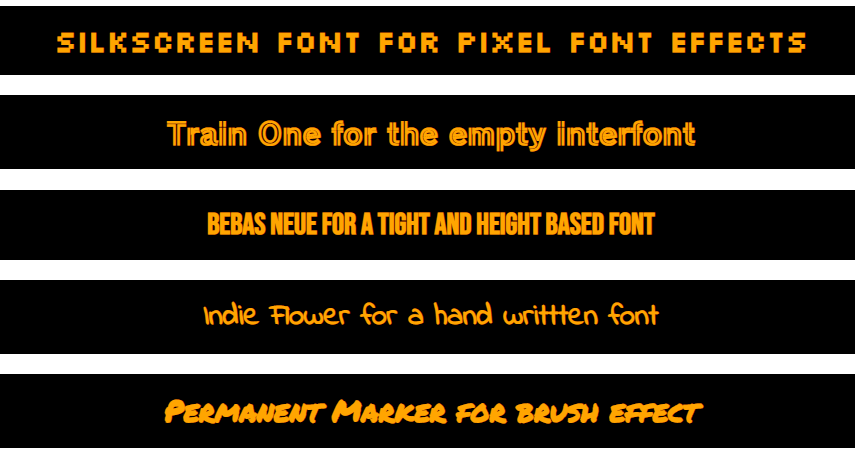
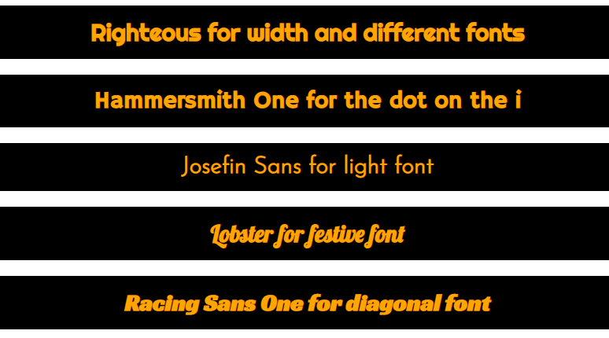
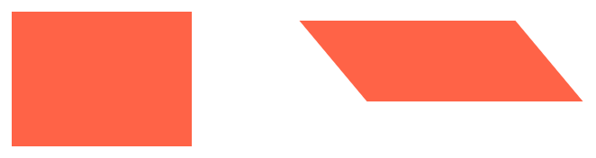
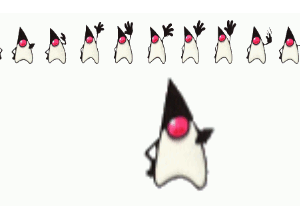
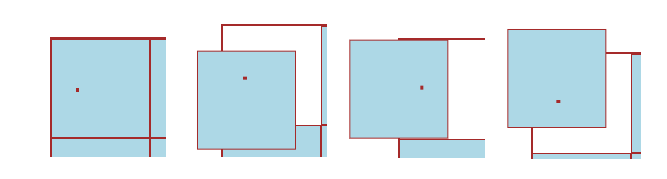
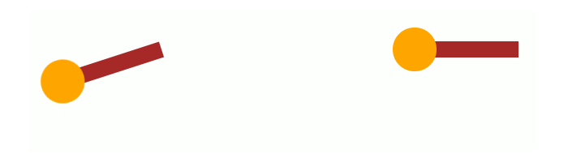
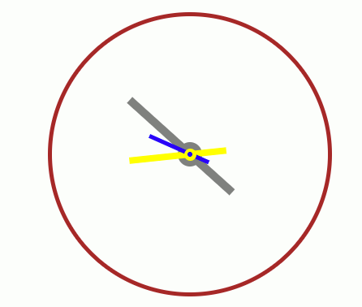
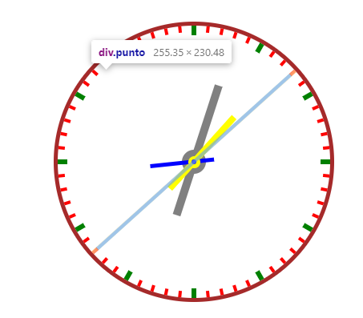

# CSS 1

[Position, Canvas and Animation](css-1.md#position-canvas-and-animation)

* [Buttons and effects](css-1.md#buttons-and-effects)
* [CSS effects and :before:after](css-1.md#css-effects-and-before-after)
* [Flex layout](css-1.md#flex-and-media-query)

## Get the css working

**In the HTML file by EMMET**

```sql
link + tab //will result in

<link rel="stylesheet" type="text/css" href="style.css">
```

**Cascading style sheets** files .CSS is organized in:

```sql
-external
<link rel="stylesheet" type="text/css" href="style.css">
(rel stands for relationship)

-internal
Selectors {
  properties: values !important;
}

-inline
<p style="color:red"> indeed </p>

id# > class. > tag
```

To implement **Google Fonts** in our CSS file we:



```
//we can use Google fonts
@import url('https://fonts.googleapis.com/css2?family=Silkscreen&display=swap');
font-family: 'Silkscreen', cursive;

//or we can also import a .ttf file while using font-face import
@font-face{
    font-family: myFirstFont;
    src: url(./Open\ 24\ Display\ St.ttf);
}
font-family: myFirstFont;

```



```
@import url('https://fonts.googleapis.com/css2?family=Silkscreen&display=swap');
/* https://fonts.google.com/specimen/Silkscreen */
font-family: 'Silkscreen', cursive;

@import url('https://fonts.googleapis.com/css2?family=Train+One&display=swap');
/*https://fonts.google.com/specimen/Train+One*/
font-family: 'Train One', cursive;

@import url('https://fonts.googleapis.com/css2?family=Bebas+Neue&display=swap');
/*https://fonts.google.com/specimen/Bebas+Neue*/
font-family: 'Bebas Neue', cursive;

@import url('https://fonts.googleapis.com/css2?family=Indie+Flower&display=swap');
/*https://fonts.google.com/specimen/Indie+Flower */
font-family: 'Indie Flower', cursive;

@import url('https://fonts.googleapis.com/css2?family=Permanent+Marker&display=swap');
/* https://fonts.google.com/specimen/Permanent+Marker */
font-family: 'Permanent Marker', cursive;
```

<figure><figcaption></figcaption></figure>



```
@import url('https://fonts.googleapis.com/css2?family=Righteous&display=swap');
/*https://fonts.google.com/specimen/Righteous*/
font-family: 'Righteous', cursive;

@import url('https://fonts.googleapis.com/css2?family=Hammersmith+One&display=swap');
/*https://fonts.google.com/specimen/Hammersmith+One*/
font-family: 'Hammersmith One', sans-serif;

@import url('https://fonts.googleapis.com/css2?family=Josefin+Sans:wght@300&display=swap');
/* https://fonts.google.com/specimen/Josefin+Sans */
font-family: 'Josefin Sans', sans-serif;

@import url('https://fonts.googleapis.com/css2?family=Lobster&display=swap');
/*https://fonts.google.com/specimen/Lobster*/
font-family: 'Lobster', cursive;

@import url('https://fonts.googleapis.com/css2?family=Racing+Sans+One&display=swap');
/* https://fonts.google.com/specimen/Racing+Sans+One */
font-family: 'Racing Sans One', cursive;
```

<figure><figcaption></figcaption></figure>



**Selectors** mirror HTML tags for priority ( tag > id# > .class ).

Here are some **Inline, Inline-block, and block:**



```
//inline elements won't have height/width and will be placed on a single line
//inline-block won't still start a new line, included in the tags span/img/a for example

<span class="linea">
    <div></div>
    <div></div>
    <div></div>
</span>

```



With inline-block we can use width/height and keep the boxes in a new line:

```
.linea div:first-child{
    width: 100px;
    height: 80px;
    background-color: brown;
    margin: 20px;
    display: inline-block;

}

.linea div:nth-child(2){
    width: 100px;
    height: 100px;
    background-color: green;
    margin: 20px;
    display: inline-block;

}

.linea div:nth-child(3){
    width: 100px;
    height: 120px;
    background-color: yellow;
    margin: 20px;
    display: inline-block;
}

```






display:block will occupy the entire line and accept width/height, with the tags div, h1, p, li:

```
<span class="linea1">
    <span></span>
    <span></span>
    <span></span>
</span>
```



```
.linea1 span:first-child{
    height: 100px;
    background-color: brown;
    margin: 20px;
    display: block;

}

.linea1 span:nth-child(2){
    height: 100px;
    background-color: green;
    margin: 20px;
    display: block;
}

.linea1 span:nth-child(3){
    height: 100px;
    background-color: yellow;
    margin: 20px;
    display: block;
}

```




### CSS Selectors

We use it to _select HTML **elements**_** ** to style with CSS **properties**:


Interactive CSS selector exercise


<details>

<summary>List of CSS selectors</summary>

```
//we can also use * to select any element inside

plate > *                       //for every inside tag
tag + .class1                   //only first and if following class
.class1.class2                  //classes with BOTH 
.class1, .class2                //classes with ANY
.class1 .class2                 //any child class2 inside class1
.class1 + .class2               //only the direct children of class1
.class1[href="www.."]           //selection based on an attribute
.class1[href]:not[href="www.."] //selecting EXCEPT said attribute

```

</details>

### Media query

A media query consists of a **media type** that adapts elements to different screens:

```
@media only screen and (max-width: 400px) {
    .head > h1{
        font-size: 1.1em;
    }
    .type{
        font-size: 80%;
    }
    @keyframes left {
        0% { background-position: -805px 0; }
        100% { background-position: 0px 0; 
               left:5%;}
    }
}
  
//we changed the font-size and animation position for smaller screens
```

**CSS selectors inherit their properties**, any changes are limited to the media query.

### **Position, Canvas, and Animation**

### CSS transform

The transform property allows us to **move, rotate, scale, and skew** HTML elements:

```
//We can use matrix() method to 
//(scaleX(), skewY(), skewX(), scaleY(), translateX(), translateY())

.com{
    background-color: tomato;
    width: 200px;
    height: 150px;
}

.fat{
    background-color: tomato;
    width: 200px;
    height: 150px;

    transform: matrix(1.2, 0, 0.5, 0.6, -100, -20);
}

//for multiple transform we just
.cof{
    transform: scale( 2, 0.5 ) translate( 150px, -30px);
}

```

<figure><figcaption><p>Width scaled 1.2 and height 0.6, skey(0, 0.5) and translate left 100px and top 20px</p></figcaption></figure>

<details>

<summary>Transform property guide</summary>

The **translate()** method moves the element's **current position by X/Y:**

```
// -/+ X values being left and right, while -/x top and bottom on Y axis

.cor{
    background-color: lightsalmon;
    width: 250px;
    height: 300px; 

    position: relative;
    top: 50px;
    left: 30px;

    transform: translate(-30px, 100px)
}

```

The **rotate()** method rotates the element clock/anti-clockwise in degrees:

```
//negative numbers for anti-clockwise

.prin{
    background-color: darkgoldenrod;
    width: 300px;
    height: 330px;
    
    transform: rotate(90deg);
}

```

The **scale()** method increases or decreases the width/height of an element:

```
//scale() X/Y are multipliers, you can also scaleX() or scaleY()

#avv{
    background-color: green;
    width: 300px;
    height: 330px;
    
    transform: scale( 2,2 );
}

```

The **skew()** method skews elements on their X/Y axis by degrees:

```
//it can also modify its width/height

.oll{
    background-color: lightskyblue;
    width: 300px;
    height: 330px;

    transform: skewX(90deg);
}

```

</details>

### CSS transition&#x20;

The transition **property** allows us to change CSS values over a duration.

```
transition: width 2s linear 1s;

//Transition being a shorthand for 

transition-property= "width"
transition-duration= 2s
transition-timing-function: "linear"
transition-delay= 1s

```

<details>

<summary>Transition property guide</summary>

The transition property **covers any changes** the selectors receive, **after an event**:

```
//the event can be a CSS pseudo:class or a javascript event

.gir{
    background-color: sienna;
    width: 200px;
    height: 150px;

    transition: 1s;
}

.gir:hover{
    width: 450px;
    background-color: slateblue;
}

//Both width and color will transition at 1s after an :hover
```

You will need a transition-property when **different durations** for properties:

```
#face{
    background-color: fuchsia;
    width: 200px;
    height: 150px;

    transition: width 3s, background-color 1s;
}

let face= document.getElementById("face")
face.addEventListener("click", ()=>{
    face.style.width= "350px"
    face.style.backgroundColor= "red"
})

//width will take 3s while the color will be done in 1s
```

We can change the **timing function** at each stage of the transition:

```
//remember to always put the timing AFTER the normal transition 

#book{
    background-color: lawngreen;
    width: 200px;
    height: 150px;

    transition: width 3s, background-color 1s;
    transition-timing-function: ease-in-out;
}

//ease(default) faster middle, slow start/end
//linear, same speed everywhere
//ease-in/out ease-in-out, slower at start/end or both
```

we can delay the **transition** in between the event and the property change:&#x20;

```
#face{
    background-color: fuchsia;
    width: 200px;
    height: 150px;

    transition: width 3s, background-color 3s;
    transition-delay: 2s;
}

```

</details>

### Transition + Transform CSS property

We can add the transition **effect** to a transformation **method**.

```
//we transition the width property AND also transform by degrees

.prin{
    background-color: darkgoldenrod;
    width: 300px;
    height: 330px;

    transition: transform 3s, width 3s;
}

.prin:hover{
    transform: rotate(90deg);
    width: 220px;
}

```

### CSS animation property

This property allows us to **control every step** of a CSS animation with **keyframe rule:**

```
//animation property includes
/*
animation-name: example;
animation-duration: 5s;
animation-timing-function: linear;
animation-delay: 2s;
animation-iteration-count: infinite;
animation-direction: alternate;
*/

animation: example 5s linear 2s infinite alternate;

//@keyframes to change any property at any % step
@keyframes example {
  0%   {background-color: red;}
  100% {background-color: green;}
}

```

<details>

<summary>Animation property guide</summary>

An **animation requires** the name of its **keyframe** rule and its **duration**.

```
//we can use from/to for 0%/100%

.robe{
    background-color: brown;
    width: 250px;
    height: 200px;

    animation: example 10s;
}

@keyframes example {
    from {background-color: red;}
    to {background-color: yellow;}
}

```

The **animation-delay** specifies a delay for it to start:

```
//the delay can be negative, it will skip forward to the animation

.cose{
    background-color: brown;
    width: 250px;
    height: 200px;

    animation: plane 10s;
    animation-delay: 2s;
}

```

The **animation-iteration-count** for how many **times** it should **run,** (can be **infinite**):

```
//each re-run will start back at its starting properties

.magi{
    background-color: pink;
    width: 250px;
    height: 200px;

    animation: adesso 10s;
    animation-delay: -2s;
    animation-iteration-count: 3;
}

```

We use **animation-direction** to choose in which order the keyframe will run:

```
//normal(default), reverse for same animation reverse keyframes.
//alternate will smoothly reverse once done
//while alternate-reverse will reverse first to them default keyframes

.nag{
    background-color: navy;
    width: 250px;
    height: 200px;

    animation: finali 5s;
    animation-iteration-count: 4;
    animation-direction: reverse;
}

```

The **animation-timing-function** property is the same as transition, including **steps()**:

```
//the speed will influence the keyframe speed

animation-timing-function: ease/ linear/ ease-in/ ease-out/ ease-in-out/ steps()

```

The **animation-fill-mode** property sets the **properties** that are gonna be **retained at the end** of the animation:

```
//forwards will retain last frame properties, while backwards the default's

.n26{
    background-color: lightgreen;
    width: 250px;
    height: 200px;

    animation: uffa 10s;
    animation-fill-mode: backwards;
}

```

</details>

We can use the **animation-timing-function** steps() to use image frames.

```
steps(<number_of_steps>, <direction>)
```

<details>

<summary>steps() animation</summary>

We move the pixel images as background, on a 1-frame width window:

```

<div class="hi"></div>

//remember to calculate the exact width of 1 frame, 500px/10(frames)
.hi {
  width: 50px;
  height: 72px;
  background-image: url("http://s.cdpn.io/79/sprite-steps.png");
  
  transform: scale(3);
  animation: play 5s infinite;
  animation-timing-function: steps(10);
}

@keyframes play {
  from { background-position: 50px; }
  to { background-position: -500px; }
}

```

</details>

<figure><figcaption><p>Example of it in action with pixel art</p></figcaption></figure>

in the next example we will use **transform-origin**:&#x20;



Starting point from which the transform starts, Internal to the element, and center/50% 50% by default:

```
//keywords or X/Y percentages depending on the dimensions of the element

transform: top/bottom/left/right/(X% Y%)

```



For a transform-origin: **25% 25%**, and a transform: rotate().

<figure><figcaption><p>(0deg), (90deg), (180deg) and (270deg)</p></figcaption></figure>



<details>

<summary>Steps(&#x3C;direction>) and animation-fill-mode</summary>

For single-dimension elements we need only 1 Transform-origin **** keyword**:**

```
.pendolo{
    margin: 15em auto;
    position: relative;
    width: 30px;
    height: 200px;
    background-color: brown;

    display: flex;
    justify-content: center;
    align-items: flex-end;
    
    ...

```

The steps(**start/end**) sets the starting frame, while the **forwards/backwards** the frame to have at the end.

```
    transform-origin: top;
    animation: pendo 15s steps(10, start) ;
    animation-fill-mode: forwards;
}
```

</details>



**Steps(start)** will "skip" the first frame, while completely ending, while **steps(end**) will start from the very first frame but end 1 frame before

<figure><figcaption><p>steps(start) and steps(end)</p></figcaption></figure>



**Forwards** will keep the last frame at the end of the animation, while **backwards** will rollback to the first.

<figure><figcaption></figcaption></figure>




<details>

<summary>Typewriter effect usin transition and steps() animation</summary>

We create a text that gets visible on hover and includes a _typing effect for each letter_:

```
//we just need one class
<div class="typewriter">
    <p>123456789 10</p>
</div>

//for the transition with steps()
.typewriter p{
    color: brown;
    margin: auto;
    font-size: 2em;

    white-space: nowrap;         //keeps the text in-line, to avoid smooth transition
    overflow: hidden;            //text is not deleted, we just use width 
    width: 0;                    //to show it later
    transition:  width 10s steps(12) ;    //steps() based on the letters
}

//then on hover the container (remember the width of the entire text)
.typewriter:hover p{
    width: 250px;
}

```

The animated part being:

```
.typewriter p{
    border-right: 0.3em solid black;
    animation: colon 1s step-end infinite;
}

@keyframes colon{
    0% { border-color: black; }
    50% { border-color: transparent; }
    100% { border-color: black; }
}

```

</details>

<figure><figcaption><p>typewriter effect gif (kinda)</p></figcaption></figure>

### Clock CSS Designs and JS-based animation

We start with a basic CSS clock design:

<details>

<summary>Clock design and animation</summary>

HTML and basic clock is:

```
<div class="orologio">

  <div class="centro">
    <div class="ora"></div>
    <div class="minuti"></div>
    <div class="secondi"></div>
  </div>

</div>

//we need position: relative for later
.orologio{
    margin: auto;
    width: 350px;
    height: 350px;

    border: 5px solid brown;
    border-radius: 50%;

    display: flex;
    justify-content: center;
    align-items: center;

    position: relative;
}
//with display flex we center/align any children element inside

```

For the tri-color center, they **overlay** the same space, so they need **position: absolute** :

```
.centro{
    width: 30px;
    height: 30px;
    background-color: gray;

    border-radius: 50%;
    position: absolute;

    display: flex;
    justify-content: center;
    align-items: center;
}

//we use :before :after, both needing display and content
//the smallest has a higher Z-index
.centro::before{
    content: "";
    display: block;
    position: absolute;

    width: 6px;
    height: 6px;
    background-color: blue;

    border-radius: 50%;
    z-index: 2;
}

.centro::after{
    content: "";
    display: block;
    position: absolute;

    width: 15px;
    height: 15px;
    background-color: yellow;

    border-radius: 50%;
    z-index: 1;
}
```

For the clock hands we:

```
//all share position: absolute
.ora{
    position: absolute;
    height: 170px;
    width: 10px;

    z-index: 0;
    background-color: gray;
    animation: girando 80s steps(60) infinite;
}

.minuti{
    position: absolute;
    height: 120px;
    width: 8px;

    z-index: 0;
    background-color: yellow;
    animation: girando 40s steps(60) infinite;
}

//the seconds arm will take priority over the others
.secondi{
    position: absolute;
    height: 80px;
    width: 4.5px;

    z-index: 1;
    background-color: blue; 
    animation: girando 60s steps(60) infinite;
}
```

In the animation we include **translateY()** for the center/hand **intersect**:

<pre><code><strong>//we need to include both transform values in same transform property
</strong><strong>//we use a negative value to not flip the hands
</strong>
@keyframes girando{
    from{
        transform: rotate(0deg) translateY(-15px);
    }
    to{
        transform: rotate(360deg) translateY(-15px);
    }
}

</code></pre>

</details>

<figure><figcaption><p>animated clock hands with center intersection</p></figcaption></figure>

For the next part, we need the [**insertAdjacentElement()**](https://developer.mozilla.org/en-US/docs/Web/API/Element/insertAdjacentElement) **** method **;**

```
//To insert an element node in a position relative to another element
element.insertAdjacentElement(<position>, <inserted element>)

// <position> being beforebegin, afterbegin, beforeend and afterend.
<!-- beforebegin -->
<p>
  <!-- afterbegin -->
  foo
  <!-- beforeend -->
</p>
<!-- afterend -->

//Example we are gonna use now
document.head.insertAdjacentElement('beforeend', styleTag);
//we insert in <head> tag inside the HTML document, 
```

<details>

<summary>Added clock ticks with javascript</summary>

We first design the CSS ticks in couples:

```
//Like the clock hands, they overlay so position absolute
//we get the ticks with transparent lines and colored borders top/bottom

.punto{
    width: 4px;
    height: 100%;

    top: 0%;
    left: calc(50% - 2px);    //50%- 1/2 width for better centering

    border-top: 8px solid red;
    border-bottom: 8px solid red;

    position: absolute;
}

//and more width for the 5minutes ticks
.punto:nth-of-type(5n){
    width: 6px;
    height: 100%;

    top: 0px;
    left: calc(50% - 3px);

    border-top: 12px solid green;
    border-bottom: 12px solid green;
    z-index: 2;
}
```

Now for the HTML and Js implementation:

```
//first we need an HTML 
<div class="orologio">
  <div id="marche">
  </div>
</div>

let marche= document.getElementById("marche")

//To avoid creating 30 CSS selectors we create a js loop

for(let x= 0; x<= 30; x++ ){
    let uno= document.createElement("div")
    uno.className= "punto"


}


```

1

1

1

1

1

</details>

<figure><figcaption><p>Js implemented design</p></figcaption></figure>


To animate the sprite pixel art (and the text on the title) we used **steps()**:

```
animation: left 8s steps( 10,start) infinite;

steps( start, end)
```

which allows to divide the animating sequence in parts and choose which frame at the **start/end.**

To use pixel art we use it as **background**:

```
.rotate{
    background:url("image") 0 0 no-repeat;
    width: 32px;
    height: 64px;
    animation: example 8s steps(21) infinite;
}

background :url("./yosi3.png") -730px 0px;

//and we can choose the frame of start by changing x/y
```

and for our **animated text** and effect we had:

```
<h2 class="type"> This line is (almost) automatically animated </h2>

.type{
    white-space: nowrap;
    overflow: hidden;
    border-right: .1em solid green;
    
    transition: all 5s steps( 35, end);
    animation: color 1s step-end infinite;
}

//nowrap is to have it all text in one line
while hidden is to have the text limited by the starter width
(to then animate the final 30em width)

body:hover .type{
    width: 30em;
}

@keyframes color{
    0% { border-color: green; }
    50% { border-color: transparent; }
    100% { border-color: green; }
}
```

Here we have the text expanding, with steps for each letter, also for the buttons we can use the \~ :

```
first-sequence ~ second-sequence {
  /* property:value; */
}

//the 2 siblings tags dont have to be close, just in sequence
```

Instead of importing an image for the egg, we used **Canvas** to "code" the image:

```
<body>
    <canvas id="egg" width="300px" height="350px" style="border:solid transparent 2px">
    </canvas>

</body>

<script>
  var c = document.getElementById("myCanvas");
  var ctx = c.getContext("2d");
  ctx.beginPath();
  ctx.arc(100, 75, 50, 0, 2 * Math.PI);
  ctx.stroke();
</script> 

//we get the id, we set the "2d" and we beging tracing
we draw a circle with (Xposition, Yposition, Ray,
starting radiant, end radiant) we can also set rotation. 
```

we set up a space with the **\<canvas>** tag with id, width and height to then script the image in. For our exercise, we also needed to draw an ellipse:

```
inn.ellipse( 95, 100, 10, 15, 0, 0, Math.PI*2);

//half an ellipse with 10/15 as different axis measures
the 5^ value is for rotation
```

we can also script **gradients** for the canvas:

```javascript
var grd = ctx.createLinearGradient(0, 0, 200, 0);
grd.addColorStop(0, "red");
grd.addColorStop(1, "white");

//we create a gradient with x1,y1,x2,y2 and then we add the colors
in state 0 or 1, to then add it to the existing shape

ctx.fillStyle = grd;
ctx.fill();
```

###

###

### Buttons and effects

In this exercise we can see new CSS:


A carousel of buttons


We are gonna start with the **gradient Background:**

```
background:
repeating-linear-gradient(10deg, red, yellow 30%, green 50%);

//we can set degree(or just (To bottom/top left/right)
//colors and percentages (the last % is for the total of the gradient
//and the % colors before (except the first) has to be minor
//also "repeating-" allows us to do more
```

and for the **text** with the linear background we use **background-clip**:

```javascript
background: linear-gradient(170deg, pink,purple, pink , purple);
background-clip: text;
-webkit-background-clip: text;
color: rgba(0,0,0,.1);

//I had to include the -webkit to make it work
//background-clip affect the text and it needs less than 1 opacity 
or color
//Background-clip can be used on images.
//and in order of area we can use
//Content-box / Padding-box / border-box
```

**Link to section**, we can create links for a section of the page:

```
<a href="primo"> button </div>
<div id="#primo"> section </div>

//it will have the text from the top of the screen
//we can also use links for Phone and Email

<a href="tel:+4733378901">+47 333 78 901</a>
<a href="mailto:someone@example.com">Send email</a>
```

and to **import** css icons and custom **fonts**:

```
Google fonts can be installed in the HTML:
<link href="https://fonts.googleapis.com/css2?family=Source+Sans+Pro:ital,wght@1,300&display=swap" rel="stylesheet">

or imported in the CSS:
@import url('https://fonts.googleapis.com/css2?family=Montagu+Slab:wght@200&display=swap');

to then use as:
font-family: 'Montagu Slab', serif;

//remember that not all imported fonts will be edited width, unless you download the specific weight

font-style: italic
font-weight: 100-900/lighter/bold/bolder

for icons we can use in HTML:
<script src="https://kit.fontawesome.com/331132e12f.js" crossorigin="anonymous"></script>

<i class="fab fa-angellist"></i>
```

For more _Font-Awesome_, we can **stack** various icons:

```
//We need a parent tag for the -stack and -1x & -2x for the child icons
//and the fa-sm/md/lg for the size of the entire icon
//we can use -o for a borded version and we can use fa-inverse to invert the black/white color

<span class="fa-stack fa-sm">
  <i class="fa fa-square-o fa-stack-2x "></i>
  <i class="fa fa-twitter fa-stack-1x"></i>
</span>

<span class="fa-stack fa-sm">
  <i class="fa fa-square fa-stack-2x "></i>
  <i class="fa fa-twitter fa-stack-1x fa-inverse"></i>
</span>

<span class="fa-stack fa-lg">
  <i class="fa fa-circle-o fa-stack-2x "></i>
  <i class="fa fa-flag fa-stack-1x"></i>
</span>

<span class="fa-stack fa-md">
  <i class="fa fa-ban fa-stack-2x"></i>
  <i class="fa fa-solid fa-igloo fa-stack-1x "></i>
</span>

```


### CSS effects and :before:after

For our buttons in the exercise we had to **position:**

```
.more{
  border: 2px rgba(161, 19, 161, 0.767) solid;
  padding: 1em 3em;
  color: antiquewhite;
  position: relative;
  overflow: hidden;
  background: purple;
}

//the position Relative allows the button to follow the flex columns
it's into
//and for the effects to be visible only on the button we use overflow
hidden
```

While for the effects we use **position** absolute:

```
.more::after{
  content: '';
  width: 1.5em;
  height: 8em;
  background: yellow;
  opacity: 30%;
  transform: rotate(-45deg);

  position: absolute;

  top: -2em;
  left: -2.6em;
}

//so, we use absolute to have the effect linked to the relative
it's after.
//we set up the background of the layer effect on the button
```

To insert multiple **layers** of CSS to the buttons we use **:before:after** selectors:

```
//We already used this on the previous exercise

.colonna > .invisible:before{
    content: "this line wasnt done with HTML";
    color: brown;
}

//we put text in the previous layer
//for our buttons we put layers of colors and animations

.more::after{
  content: '';
  width: 1.5em;
  height: 8em;
  background: yellow;
  opacity: 30%;
  transform: rotate(-45deg);
  position: absolute;
  top: -2em;
  left: -2.6em;
}

.more:hover:after{
  left: 140%;
  transition: all 600ms linear;
   -webkit-transition: all 600ms cubic-bezier(0.3, 1, 0.2, 1);
}

//so, this layer of color is positioned (top/left) outside the button
to then be transitioned to the left (left: 140%) to get the shining
```

to get the **expanded background** effect remember that:

```
.vis::after{
	content: "";
	position: absolute;
	height: 0%;
	width: 150%;
  	z-index: -1;
	background: rgba(161, 19, 161, 0.767) ;
	transition: all 1s ease 0s;
}

//so, any :after to be visible needs a content, even if empty
//the expansion effect starts from the center so to cover both sides
//at the same time

.vis:hover::after{
  height: 250%;
}
```

This happens for most similar effects, it changes the center of animation.

On more complex button color **transformation**:

```
.vis2{
	background: pink;
	border: 2px solid rgba(161, 19, 161, 0.767);
	color: rgba(161, 19, 161, 0.767);
	z-index: 1;
	transition: all 1s linear;
}

//starting condition

.vis2::after{
	content: '';
	left: 0%;
	top: 0%;
	height: 0px;
	width: 150%;
	z-index: -1;
	background: rgba(161, 19, 161, 0.767);
	transition: all 0.4s cubic-bezier(0.215, 0.61, 0.355, 1) 0s;
}

//we can set the ending point for the :hover (left/top 0%)
//and the starting point from the bottom 0%, including the auto top
//and to cover all the button (height 100%) 

.vis2:hover::after{
  	bottom: 0%;
	top: auto;
	height: 100%;
}

//and to set a background color in between while hover/hover-off

.vis2:hover{
	background: rgba(161, 19, 161, 0.767);
}

```

For the **animated border:**&#x20;

```sql
//to animate only 1 border and avoid the default we put none

.vis7{
	border: none;
	color: rgba(161, 19, 161, 0.767);
}

//we set ending position (bottom,right) and set height

.vis7::after{
	position: absolute;
	content: '';
	width: 0;
	bottom: 0;
	right: 0;
	height: 3px;
	background: rgb(114, 7, 114);
	transition: all 0.3s ease;
}

//we set starting position left and width

.vis7:hover::after{
	width: 100%;
	left: 0;
}
```

For the bubble effect we need to know **radial gradient**:

```sql
background-image: 
radial-gradient(circle, red 30%, yellow 45%, green 100%);

//like the normal gradient, the percentages define the blur and 
//closeness of the color areas
//unless we define the circle, it comes as ellipse

  background-image: 
  repeating-radial-gradient(red 10%, yellow 20%, green 35%);

//in case of repeating, the last percentage is the total 
//of the gradients on 100% of the screen, like the example below.
```

.PNG>)

So, for the **circles' background** fade-in/out effect:

```
.vis8{
background: radial-gradient(circle, purple 0.35em, pink 0.25em) center/ 1.5em 1.2em;
}

```



In the gradient part, we define how much space the color occupy and blur

```
radial-gradient(circle, purple 0.35em, pink 0.25em)
```



To define X/Y spaces for the radiant circles, **we can also get stripes** by closing them up.

```
center/ 1.5em 1.2em;}
```



And about the animation:

```
.vis8:hover{
background: radial-gradient(circle, pink 0.25em, rgba(161, 19, 161, 0.767) 0.45em) center/0.1em 0.1em;
}

//we inverted the colors to have a pink ending background
//the center is animated too and the small circles' blend 
//in the background
```

For the **double layer** effect on the coming soon button:

```
<button class="vis9">
  <a>
    Coming soon
  </a>
</button>

//we will need the extra tag for the text to be visible

.vis9 a{
	position: absolute;
	z-index: 2;
}

```



We create them at the same time:

```
.vis9::before,
.vis9::after{
	top: 0;
	left: -7em;
	right: 0;
	bottom: 0;
	margin: auto;
	
	transition: box-shadow 0.5s ease-out;
	transition-delay: 0.75s;
}
```

we set where the effect gonna start by centering with **top,right,bottom and left** , the delay is gonna take place when hover-off on the **:before layer**.

```
.vis9::after{l
	transition-delay: 0.25s;
}
```

while this is the hover-off of the **:after layer**



for the text we used @keyframes:

```
.vis9:hover{
	color: #fff;
	animation: minn 1.5s ease;
}

@keyframes minn {
	0% {
	  color: #d3b7f7;
	}
	50% {
	  color: #50514f;
	}
	100% {
	  color: #fff;
	}
}
```

this will place independently from the :after:before on hover.

```
.vis9:hover::before{
	box-shadow: inset 0 0 0 11em palevioletred;
	transition-delay: 0.05s;
}

.vis9:hover::after{
	box-shadow: inset 0 0 0 11em purple;
	transition-delay: 0.5s;
}
```

**inset** spreads the color/shadow on the inside of the button, and the **transition** set will be "shared" between the 2 layers in hover with the dalay, the before layer delay sets how visible its gonna be from the after layer delay.



for the **incoming** button effect:

```
.vis10::before{
  color: white;
  width: 1%;
  height: 100%;
  background: rgb(182, 25, 182);
  top: 0;
  left: 0;
  transition: all 0.8s cubic-bezier(0.7, -0.5, 0.2, 2);
  mix-blend-mode: hue;
}

//so, at the start we have a "border" set to the left.
//we use the mix-blend-mode here to get the color visible trought
//the effect, this mix will work on hover-off

.vis10:hover:before {
	color: white;
  	background: rgb(182, 25, 182);
  	width: 100%;
  	mix-blend-mode: hue;
}

//we extend the border and mix the color
```

fort the **animated border effect:**

```
.vis11{
  border: 0;
  padding: 10px 20px;
}

//we start from an invisible border so we don't use none

.vis11:before, .vis11:after{
  box-sizing: border-box;
  border: 3px solid transparent;
  width: 0;
  height: 0;
}

//we set 2 layers, the border that has to be colored yet 
//so it's transparent, and the width/height of the border 
//we set the starting points of the 2 "sections" he
.vis11::before {
  top: 0;
  left: 0;
}

.vis11::after {
  bottom: 0;
  right: 0;
}

.vis11:hover::before, .vis11:hover::after {
  width: 100%;
  height: 100%;
}

.vis11:hover::before {
  border-top-color: rgba(161, 19, 161, 0.767);
  border-right-color: rgba(161, 19, 161, 0.767);
  transition: width 0.3s ease-out, height 0.3s ease-out 0.3s;
}

.vis11:hover::after {
  border-bottom-color: rgba(161, 19, 161, 0.767);
  border-left-color: rgba(161, 19, 161, 0.767);
  transition: border-color 0s ease-out 0.6s, width 0.3s ease-out 0.6s, height 0.3s ease-out 1s;
}

//so, here we animate the border on hover, setting delays to make
//the transitions in order, while in the after we animate the 
//also the border color to make it appear at the start of hover:after
//then we total delay of (0.6s+0.4=1s)
```

for the **glow** effect:

```
.vis12:hover {
  	box-shadow: 10px 10px 99px 6px pink;
}

//the glow is by contrast with the background
//box-shadow is X / Y(space)/ blur / spread and color
```

### Flex and media query

Check this **Flex layout**:



Flex allows us to create templates that adapt automatically to the page, with the structure of **row>column**:



```
<div class='row'>
  <div class='column'>
    <div class='orange-column'>
      Some Text in Column One
    </div>
  </div>
  <div class='column'>
    <div class='blue-column'>
      Some Text in Column Two
    </div>
  </div>
  <div class='column'>
    <div class='green-column'>
      Some Text in Column Three
    </div>
  </div>
</div>
```

This structure allow us to use the row



```
.row {
  display: flex;
  flex-direction: row;
  flex-wrap: wrap;
  width: 100%;
}
//to use any flex property we need the Display the elements inside in a row
.column {
  display: flex;
  flex-direction: column;
  flex-basis: 100%;
  flex: 1;
}
//we have to display again and affects all the elements inside the column
//flex:1 is to set it proportion with other flex and the basis 
.orange-column {
  background-color: orange;
  height: 100px;
}
```

Considering the HTML structure this allows us to add multiple .orange-column that are gonna adapt automatically to the screen no matter the number, needing only the height.



How to use **flex** to create bigger columns:

```
<div class='row'>
    <div class='column'>
        <div class='blue-column'>
            Some Text in Column Two
        </div>
    </div>
    <div class='triple-column'>
        <div class='blue-column'>
            Some Text in Column Three
        </div>
    </div>
</div>

//we change the column CSS flex

.triple-column {
  display: flex;
  flex-direction: column;
  flex-basis: 100%;
  flex: 3;
}

//everything is the same as .column except for flex, with the color of blue-column
```

now, about our "custom" design flex design:


on the button **columns** and text&#x20;




```
<div class="contained">

  <div class="flex-col">
  
    <div class="flex-left">
      <div class="secondo">
          <button class="more"> 
              shine
          </button>
      </div>
    </div>
    <div class="flex-center">
      <div class="secondo">
        <button class="vis6"> Melt </button>
      </div>

    </div>
  </div>
  
  <div class="flex-long">
    <div class="flex-right">
      a line below wraps/break lines
    <br>
      Press the buttons to be directed to a different paragraph.
    <hr>
      while here we have a line
    </div>
  </div>
  
</div>
```

Under a .contained we set 2 columns **flex-col, flex-long.**&#x20;

Then in the flex-col we set 2 columns **flex-left/flex-center** each one containing all the buttons with **.secondo** for the position.

**Flex-long** will have only one column inside **flex-right** which will go with flex.left and flex-center



```
.contained {
	display: flex;
	flex-direction: row;
}

.flex-col {
	display: flex;
	flex-direction: row;

	flex: 70%; 
}

.flex-long{
	display: flex;

	flex: 33%;
}

.flex-col .flex-left {
	flex: 33%;
}
  
.flex-col .flex-center{
	flex: 33%;
}

.flex-long .flex-right {
	padding-top: 1em;
	flex: 33%;
}

```

we are gonna have a bigger flex row and the 2 columns with flex proportions and a flex row for the columns left/center.

for the @media-query:

```
@media (max-width: 800px) {
	
	.contained {
		flex-direction: column;
		display: flex;
	}

}
```

to have our layout we just change the .contained direction to **column** considering the HTML structure and pre-existent selectors, to have text below the 2 columns.



### Some flex syntax

The **flex property** can allow us to:

```
.container {
  displa:flex
  flex-direction: row | row-reverse | column | column-reverse;
}

//to order the elements inside the .container
//and to justify orizontal (row) content 

justify-content: center/flex-start (left)/flex-end/ space-between (them) /space-around (total space including borders)

//and for vertical (column) elements

align-items: center/flex-start (top)/flex-end/baseline(share common Y center)

//row-reverse and column reverse change the starting point 

 order: 0/1 (to the left)/-1 (right)
 align-self: 0/1/etc.
 
//in case to change one of multiple elements order

flex-wrap: nowrap (no using extra rows), wrap ,wrap-reverse(starting from bottom)

//on how to handle multiple elements, by putting them in the same line or use extra rows (wrap)
//we can use both direction + wrap

flex-flow: column wrap

//we can use for the width of columns elements

flex-basis: 100%/auto/etc.
```

in case you need more [check this again.](https://flexboxfroggy.com/#it)

****
