# CSS 1: Animation, gradients and buttons effects

* [CSS selector and Media query](css-1.md#css-selectors-and-media-query)
* [CSS transition and Animation](css-1.md#css-transition-and-animation)
* [Clock CSS :before:after designs and JS-based animation](css-1.md#clock-css-designs-and-js-based-animation)
* [CSS Gradients and effects](css-1.md#css-gradients-and-effects)
* [Grany gradient, Clip-path(), smoke, and scrolling JS animation](css-1.md#grany-gradient-clip-path-smoke-and-scrolling-animation)
* [CSS borders and border-box](css-1.md#css-borders-and-border-box)
* [Custom popup, checklist, expandable and buttons effects](css-1.md#custom-popup-checklist-expandable-and-buttons-effects)

### CSS Display and Google fonts

To implement a CSS file into our HTML we:

```sql
link + tab //will result in

<link rel="stylesheet" type="text/css" href="style.css">
```

CSS stands for **Cascading style sheets,** and can be implemented in:

```sql
-external
<link rel="stylesheet" type="text/css" href="style.css">
(rel stands for relationship)

-internal
Selectors {
  properties: values !important;
}

-inline
<p style="color:red"> indeed </p>

id# > class. > tag
```

To implement **Google Fonts** in our CSS file we:



```
//we can use Google fonts
@import url('https://fonts.googleapis.com/css2?family=Silkscreen&display=swap');
font-family: 'Silkscreen', cursive;

//or we can also import a .ttf file while using font-face import
@font-face{
    font-family: myFirstFont;
    src: url(./Open\ 24\ Display\ St.ttf);
}
font-family: myFirstFont;

```



```
@import url('https://fonts.googleapis.com/css2?family=Silkscreen&display=swap');
/* https://fonts.google.com/specimen/Silkscreen */
font-family: 'Silkscreen', cursive;

@import url('https://fonts.googleapis.com/css2?family=Train+One&display=swap');
/*https://fonts.google.com/specimen/Train+One*/
font-family: 'Train One', cursive;

@import url('https://fonts.googleapis.com/css2?family=Bebas+Neue&display=swap');
/*https://fonts.google.com/specimen/Bebas+Neue*/
font-family: 'Bebas Neue', cursive;

@import url('https://fonts.googleapis.com/css2?family=Indie+Flower&display=swap');
/*https://fonts.google.com/specimen/Indie+Flower */
font-family: 'Indie Flower', cursive;

@import url('https://fonts.googleapis.com/css2?family=Permanent+Marker&display=swap');
/* https://fonts.google.com/specimen/Permanent+Marker */
font-family: 'Permanent Marker', cursive;
```

<figure><figcaption></figcaption></figure>



```
@import url('https://fonts.googleapis.com/css2?family=Righteous&display=swap');
/*https://fonts.google.com/specimen/Righteous*/
font-family: 'Righteous', cursive;

@import url('https://fonts.googleapis.com/css2?family=Hammersmith+One&display=swap');
/*https://fonts.google.com/specimen/Hammersmith+One*/
font-family: 'Hammersmith One', sans-serif;

@import url('https://fonts.googleapis.com/css2?family=Josefin+Sans:wght@300&display=swap');
/* https://fonts.google.com/specimen/Josefin+Sans */
font-family: 'Josefin Sans', sans-serif;

@import url('https://fonts.googleapis.com/css2?family=Lobster&display=swap');
/*https://fonts.google.com/specimen/Lobster*/
font-family: 'Lobster', cursive;

@import url('https://fonts.googleapis.com/css2?family=Racing+Sans+One&display=swap');
/* https://fonts.google.com/specimen/Racing+Sans+One */
font-family: 'Racing Sans One', cursive;
```

<figure><figcaption></figcaption></figure>



**Selectors** mirror HTML tags for priority ( tag > id# > .class ).

Here are some **Inline, Inline-block, and block:**



```
//inline elements won't have height/width and will be placed on a single line
//inline-block won't still start a new line, included in the tags span/img/a for example

<span class="linea">
    <div></div>
    <div></div>
    <div></div>
</span>

```



With inline-block we can use width/height and keep the boxes in a new line:

```
.linea div:first-child{
    width: 100px;
    height: 80px;
    background-color: brown;
    margin: 20px;
    display: inline-block;

}

.linea div:nth-child(2){
    width: 100px;
    height: 100px;
    background-color: green;
    margin: 20px;
    display: inline-block;

}

.linea div:nth-child(3){
    width: 100px;
    height: 120px;
    background-color: yellow;
    margin: 20px;
    display: inline-block;
}

```






display:block will occupy the entire line and accept width/height, with the tags div, h1, p, li:

```
<span class="linea1">
    <span></span>
    <span></span>
    <span></span>
</span>
```



```
.linea1 span:first-child{
    height: 100px;
    background-color: brown;
    margin: 20px;
    display: block;

}

.linea1 span:nth-child(2){
    height: 100px;
    background-color: green;
    margin: 20px;
    display: block;
}

.linea1 span:nth-child(3){
    height: 100px;
    background-color: yellow;
    margin: 20px;
    display: block;
}

```




## CSS Selectors and Media Query

We use it to _select HTML **elements**_ to style with CSS **properties**:


Interactive CSS selector exercise


<details>

<summary>List of CSS selectors</summary>

```
//we can also use * to select any element inside

plate > *                       //for every inside tag
tag + .class1                   //only first and if following class
.class1.class2                  //classes with BOTH 
.class1, .class2                //classes with ANY
.class1 .class2                 //any child class2 inside class1
.class1 + .class2               //only the direct children of class1
.class1[href="www.."]           //selection based on an attribute
.class1[href]:not[href="www.."] //selecting EXCEPT said attribute

```

</details>

A **media query** consists of a **media type** that adapts elements to different screens:

```
@media only screen and (max-width: 400px) {
    .head > h1{
        font-size: 1.1em;
    }
    .type{
        font-size: 80%;
    }
    @keyframes left {
        0% { background-position: -805px 0; }
        100% { background-position: 0px 0; 
               left:5%;}
    }
}
  
//we changed the font-size and animation position for smaller screens
```

**CSS selectors inherit their properties**, any changes are limited to the media query.

Also, **more specific selectors will take priority**, including the media query ones:

```
//2 class selectors
.sidenav .title{
    display: flex;
}

@media only screen and (max-width: 850px){
    .contiene .title{
        display: none;            //this won't work, even if inside a media query
    }

    .contiene .sidebar .title{
        display: none;            //3 class selectors will work
    } 
}
```

## CSS transition and Animation

The transform property allows us to **move, rotate, scale, and skew** HTML elements:

```
//We can use matrix() method to 
//(scaleX(), skewY(), skewX(), scaleY(), translateX(), translateY())

.com{
    background-color: tomato;
    width: 200px;
    height: 150px;
}

.fat{
    background-color: tomato;
    width: 200px;
    height: 150px;

    transform: matrix(1.2, 0, 0.5, 0.6, -100, -20);
}

//for multiple transform we just
.cof{
    transform: scale( 2, 0.5 ) translate( 150px, -30px);
}

```

<figure><figcaption><p>Width scale(1.2) and height 0.6, skew(30deg) and translate(100px, 200px)</p></figcaption></figure>

<details>

<summary>Transform property guide</summary>

The **translate()** method moves the element's **current position by X/Y:**

```
// -/+ X values being left and right, while -/x top and bottom on Y axis

.cor{
    background-color: lightsalmon;
    width: 250px;
    height: 300px; 

    position: relative;
    top: 50px;
    left: 30px;

    transform: translate(-30px, 100px)
}

```

The **rotate()** method rotates the element clock/anti-clockwise in degrees:

```
//negative numbers for anti-clockwise

.prin{
    background-color: darkgoldenrod;
    width: 300px;
    height: 330px;
    
    transform: rotate(90deg);
}

```

The **scale()** method increases or decreases the width/height of an element:

```
//scale() X/Y are multipliers, you can also scaleX() or scaleY()

#avv{
    background-color: green;
    width: 300px;
    height: 330px;
    
    transform: scale( 2,2 );
}

```

The **skew()** method skews elements on their X/Y axis by degrees:

```
//it can also modify its width/height

.oll{
    background-color: lightskyblue;
    width: 300px;
    height: 330px;

    transform: skewX(90deg);
}

```

</details>

### CSS transition&#x20;

The transition **property** allows us to change CSS values over a duration.

```
transition: width 2s linear 1s;

//Transition being a shorthand for 

transition-property= "width"
transition-duration= 2s
transition-timing-function: "linear"
transition-delay= 1s

```

<details>

<summary>Transition property guide</summary>

The transition property **covers any changes** the selectors receive, **after an event**:

```
//the event can be a CSS pseudo:class or a javascript event

.gir{
    background-color: sienna;
    width: 200px;
    height: 150px;

    transition: 1s;
}

.gir:hover{
    width: 450px;
    background-color: slateblue;
}

//Both width and color will transition at 1s after an :hover
```

You will need a transition-property when **different durations** for properties:

```
#face{
    background-color: fuchsia;
    width: 200px;
    height: 150px;

    transition: width 3s, background-color 1s;
}

let face= document.getElementById("face")
face.addEventListener("click", ()=>{
    face.style.width= "350px"
    face.style.backgroundColor= "red"
})

//width will take 3s while the color will be done in 1s
```

We can change the **timing function** at each stage of the transition:

```
//remember to always put the timing AFTER the normal transition 

#book{
    background-color: lawngreen;
    width: 200px;
    height: 150px;

    transition: width 3s, background-color 1s;
    transition-timing-function: ease-in-out;
}

//ease(default) faster middle, slow start/end
//linear, same speed everywhere
//ease-in/out ease-in-out, slower at start/end or both
```

we can delay the **transition** in between the event and the property change:&#x20;

```
#face{
    background-color: fuchsia;
    width: 200px;
    height: 150px;

    transition: width 3s, background-color 3s;
    transition-delay: 2s;
}

```

</details>

### Transition + Transform CSS property

We can add the transition **effect** to a transformation **method**.

```
//we transition the width property AND also transform by degrees

.prin{
    background-color: darkgoldenrod;
    width: 300px;
    height: 330px;

    transition: transform 3s, width 3s;
}

.prin:hover{
    transform: rotate(90deg);
    width: 220px;
}

```

### CSS animation property

This property allows us to **control every step** of a CSS animation with **keyframe rule:**

```
//animation property includes

animation-name: example;
animation-duration: 5s;
animation-timing-function: linear;
animation-delay: 2s;
animation-iteration-count: infinite;
animation-direction: alternate;


animation: example 5s linear 2s infinite alternate;

//@keyframes to change any property at any % step
@keyframes example {
  0%   {background-color: red;}
  100% {background-color: green;}
}

```

<details>

<summary>Animation property guide</summary>

An **animation requires** the name of its **keyframe** rule and its **duration**.

```
//we can use from/to for 0%/100%

.robe{
    background-color: brown;
    width: 250px;
    height: 200px;

    animation: example 10s;
}

@keyframes example {
    from {background-color: red;}
    to {background-color: yellow;}
}

```

The **animation-delay** specifies a delay for it to start:

```
//the delay can be negative, it will skip forward to the animation

.cose{
    background-color: brown;
    width: 250px;
    height: 200px;

    animation: plane 10s;
    animation-delay: 2s;
}

```

The **animation-iteration-count** for how many **times** it should **run,** (can be **infinite**):

```
//each re-run will start back at its starting properties

.magi{
    background-color: pink;
    width: 250px;
    height: 200px;

    animation: adesso 10s;
    animation-delay: -2s;
    animation-iteration-count: 3;
}

```

We use **animation-direction** to choose in which order the keyframe will run:

```
//normal(default), reverse for same animation reverse keyframes.
//alternate will smoothly reverse once done
//while alternate-reverse will reverse first to them default keyframes

.nag{
    background-color: navy;
    width: 250px;
    height: 200px;

    animation: finali 5s;
    animation-iteration-count: 4;
    animation-direction: reverse;
}

```

The **animation-timing-function** property is the same as transition, including **steps()**:

```
//the speed will influence the keyframe speed

animation-timing-function: ease/ linear/ ease-in/ ease-out/ ease-in-out/ steps()

```

The **animation-fill-mode** property sets the **properties** that are gonna be **retained at the end** of the animation:

```
//forwards will retain last frame properties, while backwards the default's

.n26{
    background-color: lightgreen;
    width: 250px;
    height: 200px;

    animation: uffa 10s;
    animation-fill-mode: backwards;
}

```

</details>

We can use the **animation-timing-function** steps() to use image frames.

```
steps(<number_of_steps>, <direction>)
```

<details>

<summary>steps() animation</summary>

We move the pixel images as background, on a 1-frame width window:

```

<div class="hi"></div>

//remember to calculate the exact width of 1 frame, 500px/10(frames)
.hi {
  width: 50px;
  height: 72px;
  background-image: url("http://s.cdpn.io/79/sprite-steps.png");
  
  transform: scale(3);
  animation: play 5s infinite;
  animation-timing-function: steps(10);
}

@keyframes play {
  from { background-position: 50px; }
  to { background-position: -500px; }
}

```

</details>

<figure><figcaption><p>Example of it in action with pixel art</p></figcaption></figure>

in the next example we will use **transform-origin**:&#x20;



Starting point from which the transform starts, Internal to the element, and center/50% 50% by default:

```
//keywords or X/Y percentages depending on the dimensions of the element

transform: top/bottom/left/right/(X% Y%)

```



For a transform-origin: **25% 25%**, and a transform: rotate().

<figure><figcaption><p>(0deg), (90deg), (180deg) and (270deg)</p></figcaption></figure>



<details>

<summary>Steps(&#x3C;direction>) and animation-fill-mode</summary>

For single-dimension elements we need only 1 Transform-origin keyword**:**

```
.pendolo{
    margin: 15em auto;
    position: relative;
    width: 30px;
    height: 200px;
    background-color: brown;

    display: flex;
    justify-content: center;
    align-items: flex-end;
    
    ...

```

The steps(**start/end**) sets the starting frame, while the **forwards/backwards** the frame to have at the end.

```
    transform-origin: top;
    animation: pendo 15s steps(10, start) ;
    animation-fill-mode: forwards;
}
```

</details>



**Steps(start)** will "skip" the first frame, while completely ending, while **steps(end**) will start from the very first frame but end 1 frame before

<figure><figcaption><p>steps(start) and steps(end)</p></figcaption></figure>



**Forwards** will keep the last frame at the end of the animation, while **backwards** will rollback to the first.

<figure><figcaption></figcaption></figure>




<details>

<summary>Typewriter effect usin transition and steps() animation</summary>

We create a text that gets visible on hover and includes a _typing effect for each letter_:

```
//we just need one class
<div class="typewriter">
    <p>123456789 10</p>
</div>

//for the transition with steps()
.typewriter p{
    color: brown;
    margin: auto;
    font-size: 2em;

    white-space: nowrap;         //keeps the text in-line, to avoid smooth transition
    overflow: hidden;            //text is not deleted, we just use width 
    width: 0;                    //to show it later
    transition:  width 10s steps(12) ;    //steps() based on the letters
}

//then on hover the container (remember the width of the entire text)
.typewriter:hover p{
    width: 250px;
}

```

The animated part being:

```
.typewriter p{
    border-right: 0.3em solid black;
    animation: colon 1s step-end infinite;
}

@keyframes colon{
    0% { border-color: black; }
    50% { border-color: transparent; }
    100% { border-color: black; }
}

```

</details>

<figure><figcaption><p>typewriter effect gif (kinda)</p></figcaption></figure>

## Clock CSS Designs and JS-based animation

We start with a basic CSS clock design:

<details>

<summary>Clock design and animation</summary>

HTML and basic clock is:

```
<div class="orologio">

  <div class="centro">
    <div class="ora"></div>
    <div class="minuti"></div>
    <div class="secondi"></div>
  </div>

</div>

//we need position: relative for later
.orologio{
    margin: auto;
    width: 350px;
    height: 350px;

    border: 5px solid brown;
    border-radius: 50%;

    display: flex;
    justify-content: center;
    align-items: center;

    position: relative;
}
//with display flex we center/align any children element inside

```

For the tri-color center, they **overlay** the same space, so they need **position: absolute** :

```
.centro{
    width: 30px;
    height: 30px;
    background-color: gray;

    border-radius: 50%;
    position: absolute;

    display: flex;
    justify-content: center;
    align-items: center;
}

//we use :before :after, both needing display and content
//the smallest has a higher Z-index
.centro::before{
    content: "";
    display: block;
    position: absolute;

    width: 6px;
    height: 6px;
    background-color: blue;

    border-radius: 50%;
    z-index: 2;
}

.centro::after{
    content: "";
    display: block;
    position: absolute;

    width: 15px;
    height: 15px;
    background-color: yellow;

    border-radius: 50%;
    z-index: 1;
}
```

For the clock hands we:

```
//all share position: absolute
.ora{
    position: absolute;
    height: 170px;
    width: 10px;

    z-index: 0;
    background-color: gray;
    animation: girando 80s steps(60) infinite;
}

.minuti{
    position: absolute;
    height: 120px;
    width: 8px;

    z-index: 0;
    background-color: yellow;
    animation: girando 40s steps(60) infinite;
}

//the seconds arm will take priority over the others
.secondi{
    position: absolute;
    height: 80px;
    width: 4.5px;

    z-index: 1;
    background-color: blue; 
    animation: girando 60s steps(60) infinite;
}
```

In the animation we include **translateY()** for the center/hand **intersect**:

<pre><code><strong>//we need to include both transform values in same transform property
</strong><strong>//we use a negative value to not flip the hands
</strong>
@keyframes girando{
    from{
        transform: rotate(0deg) translateY(-15px);
    }
    to{
        transform: rotate(360deg) translateY(-15px);
    }
}

</code></pre>

</details>

<figure><figcaption><p>animated clock hands with center intersection</p></figcaption></figure>

For the next part, we need the [**insertAdjacentElement()**](https://developer.mozilla.org/en-US/docs/Web/API/Element/insertAdjacentElement) method **;**

```
//To insert an element node in a position relative to another element
element.insertAdjacentElement(<position>, <inserted element>)

// <position> being beforebegin, afterbegin, beforeend and afterend.
<!-- beforebegin -->
<p>
  <!-- afterbegin -->
  foo
  <!-- beforeend -->
</p>
<!-- afterend -->

//Example we are gonna use now
document.head.insertAdjacentElement('beforeend', styleTag);
//we insert in <head> tag inside the HTML document, 
```

<details>

<summary>Added clock ticks with javascript</summary>

We first design the CSS ticks in couples:

```
//Like the clock hands, they overlay so position absolute
//we get the ticks with transparent lines and colored borders top/bottom

.punto{
    width: 4px;
    height: 100%;

    top: 0%;
    left: calc(50% - 2px);    //50%- 1/2 width for better centering

    border-top: 8px solid red;
    border-bottom: 8px solid red;

    position: absolute;
}

//and more width for the 5minutes ticks
.punto:nth-of-type(5n){
    width: 6px;
    height: 100%;

    top: 0px;
    left: calc(50% - 3px);

    border-top: 12px solid green;
    border-bottom: 12px solid green;
    z-index: 2;
}
```

Now for the HTML and Js implementation:

```
//first we need an HTML 
<div class="orologio">
  <div id="marche">
  </div>
</div>

let marche= document.getElementById("marche")

//we loop 30 div with .punto class, we append to the HTML
//then a <style> tag for the CSS selectors each increased by 6deg, as innerHTML
for(let x= 0; x<= 30; x++ ){
    let uno= document.createElement("div")
    uno.className= "punto"

    marche.appendChild( uno)
    const cssTemplateString1 = `.punto:nth-child(${x}){ transform: rotate( calc(6deg * ${x} ) ) }`;
    
    const styleTag = document.createElement("style");
    styleTag.innerHTML = cssTemplateString1;

    document.head.insertAdjacentElement('beforeend', styleTag);
}

```

We **insertAdjacentElement()** the created **\<style>** tag with the 30 CSS selectors right into(beforeend) the **\<head>** of the HTML document:

```
<head>
    <script src="https://cdn.jsdelivr.net/npm/bootstrap@5.0.2/dist/js/bootstrap.bundle.min.js" integrity="sha384-MrcW6ZMFYlzcLA8Nl+NtUVF0sA7MsXsP1UyJoMp4YLEuNSfAP+JcXn/tWtIaxVXM" crossorigin="anonymous"></script>

    <link rel="stylesheet" href="./style.css">
    <title>Document</title>
    <style>.punto:nth-child(0){ transform: rotate( calc(6deg * 0 ) ) }</style>
</head>

```

</details>

<figure><figcaption><p>Js implemented design</p></figcaption></figure>

<details>

<summary>Animating the clock hands for javascript current time</summary>

We need to set the animation **duration** for a **360deg clock rotation**:

```
//A duration must be in seconds, for 12 hours clock we 3600* 12

.secondi{
    animation: girando 60s steps(60) infinite;
}
.minuti{
    animation: girando 3600s steps(60) infinite;
}
.ora{
    animation: girando 43200s steps(24) infinite;
}

@keyframes girando{
    from{
        transform: rotate(0deg) translateY(-15px);
    }
    to{
        transform: rotate(360deg) translateY(-15px);
    }
}
```

On the **Js** file, we only **set the starting current time** and let the animation run its course :

```
//We set animation-delay property of CSS (query) selectors
//All delays have to be in Seconds

let d= new Date()

let delayseconds= d.getSeconds() +1
document.querySelector(".secondi").style.animationDelay= ( (delayseconds*-1) + "s" )
//we get the current seconds + 1

let delaymin= d.getMinutes() *60
document.querySelector(".minuti").style.animationDelay= ( (delaymin* -1) + "s" )
//we do the same for minutes *60 to get it in seconds

let delayora= d.getHours() *3600
document.querySelector(".ora").style.animationDelay= ( (delayora* -1) + "s" )
//and for hours

```

We can change the **animation-timing-function** from **steps()** to **linear** if we want _gradual movement_, etc,

</details>

Now we are gonna add extra CSS animated elements to the clock:

<details>

<summary>Pendolum animated effect</summary>

```
/Both being children of the clock element

<div class="orologio">For the botto 
  <div class="asse">
  </div>

  <div class="pendolo">
  </div>

</div>

```

We get the **bottom** part with a **box-shadow**:

```
//we create it to be the same area of the clock and add a box-shadow
.pendolo{
    position: absolute;
    width: 350px;
    height: 350px;

    border-radius: 50%;
    box-shadow: 0px 15px 0px 0px rgb(116, 13, 13); 
    animation: nord 1s alternate-reverse infinite;
}

//the same for the upper part, we just lower z-index and push it to top
.asse{
    position: absolute;
    height: 215px;
    width: 45px;
    background-color: rgb(116, 13, 13);
    z-index: -2;

    margin-top: -60%;
    transform-origin: bottom;
    animation: nord 1s alternate-reverse infinite;
}
```

We can animate both with **same keyframes**:

```
@keyframes nord{
    from {
        transform: rotate(-50deg);
    }
    to {
        transform: rotate(50deg);
    }
}
```

</details>

<figure>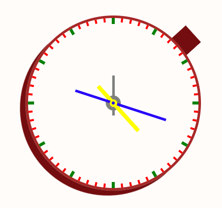<figcaption><p>animated pendolum CSS added</p></figcaption></figure>

Here are more examples of how **linear-gradient degree rotation** works:

```
//Where does the 0deg/90deg/180deg and 270deg start?

.nel div:nth-child(1){
    width: 120px;
    height: 120px;
    background: linear-gradient(0deg/90deg/180deg/270deg, yellow, blue);
}

```

<figure>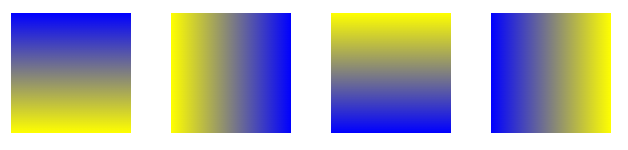<figcaption><p>bottom, left, top, and right </p></figcaption></figure>

## CSS Gradients and effects

The **Linear-gradient() function** creates a smooth color transition as a **background-image**, which can include a starting point, direction, and angle.

```
    background-image: linear-gradient( <Direction>, color1, color2, etc...);
```

<details>

<summary>Guide to linear-gradients()</summary>

We use Degrees as **starting point**:

```
.nel div:nth-child(1){
    width: 120px;
    height: 120px;
    background: linear-gradient(0deg, yellow, blue);
}

```

If we use keywords it's the **to ending point**:

```
.nel div:nth-child(2){
    width: 120px;
    height: 120px;
    background: linear-gradient(to right bottom , yellow, blue, pink );
}

```

We can also use **background-image** and **transparent** gradients;

```
//we got the blue on transparent gradient

.nel div:nth-child(3){
    width: 120px;
    height: 120px;

    background-image: 
        linear-gradient(
            to bottom right, 
            yellow, 
            transparent, 
            pink 
        );
    background-color: blue;
}

```

We can use **%** or **px** for **color-stops** on the gradient:

```
//we set where the color will change

.nel div:nth-child(4){
    width: 120px;
    height: 120px;

    background-image: 
        linear-gradient(
            110deg, 
            yellow, 
            transparent 15%,
            pink 40%
        );
    background-color: blue;
}

```

if we want rigid color transition we can:

```
.nel div:nth-child(5){
    width: 120px;
    height: 120px;

    background-image: 
        linear-gradient(
            90deg,
            orange 30px,
            blue 30px,
            blue 70px,
            orange 70px
        );
}

```

</details>

<figure>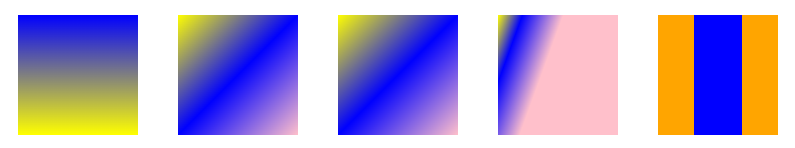<figcaption><p>differet linear-gradient </p></figcaption></figure>

A **radial-gradient()** function radiates **from** the **center**, on an ellipse(default) or circle shape:

```
    background-image: 
        radial-gradient( <shape> <starting-point>, color1, color2, etc );
```

<details>

<summary>Radial gradient guide</summary>

We can change the gradient's ending areas with:

```
//closest-corner, closest-side, farthest-corner, farthest-side

.alto div:nth-child(1){
    width: 180px;
    height: 120px;

    background-color: yellow;
    background-image: 
        radial-gradient(
            circle closest-corner,
            transparent, 
            red
    );
}

//corner or side
.alto div:nth-child(2){
    width: 180px;
    height: 120px;

    background-color: yellow;
    background-image: 
        radial-gradient(
            circle closest-side, 
            transparent, 
            red
        );
}
```

We set the **starting point** for the radial:

```
//we didn't set the shape and get an ellipse

.alto div:nth-child(3){
    width: 180px;
    height: 120px;

    background-color: yellow;
    background-image: 
        radial-gradient(
            at top,
            transparent 30%,
            red 
        );
}
```

And use rigid gradients:

```

.alto div:nth-child(4){
    width: 180px;
    height: 120px;

    background-color: yellow;
    background-image: 
        radial-gradient(
            circle at top left ,
            transparent 30%,
            red 30%
        );
}
```

</details>

<figure>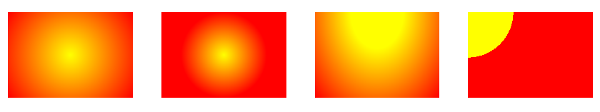<figcaption><p>radial on different shapes, areas and positions</p></figcaption></figure>

A **conic-gradient** is a circular gradient that **rotates on** a center point

<details>

<summary>Conic-gradient guide</summary>

We can set **AT** its center (with both % and px):

```
.conico div:nth-child(1){
    width: 150px;
    height: 120px;

    background-image: 
        conic-gradient(
            at 50% 70%,
            yellow, 
            red
        );
}

```

We can also set **FROM** which degree they start and color stops(only in **deg** and **%**)

```
.conico div:nth-child(2){
    width: 150px;
    height: 120px;

    background-image: 
        conic-gradient(
            from 50deg,
            yellow 10%,
            red 10%
        );
}

```

</details>

<figure>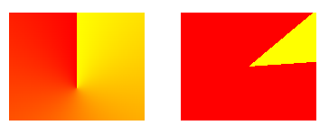<figcaption><p>conic gradient position, degree and color stop</p></figcaption></figure>

We can add **repeating-** for all of the gradients.

<details>

<summary>Repeating-gradients guide</summary>

To have **repeating** gradients we need to set an **ending point** in %, deg, and px:

```
.conico div:nth-child(3){
    width: 150px;
    height: 120px;

    background-image: 
        repeating-linear-gradient(
            45deg,
            yellow,
            yellow 10%,
            red 10%,
            red 20% 
        );
}
```

for **repeating-radial-gradient** we have:

```
.conico div:nth-child(4){
    width: 150px;
    height: 120px;
    background-color: red;

    background-image: 
        repeating-radial-gradient(
            circle at 90px -20px,
            red 0,
            red 45px,
            yellow 80px
        );
}
```

for **repeating-conic-gradient** we:

```
// Some code

.conico div:nth-child(5){
    width: 150px;
    height: 120px;

    background-image: 
        repeating-conic-gradient(
            at 10% 50%,
            yellow,
            yellow 10deg,
            red 10deg,
            red 20deg,
            orange 20deg,
            orange 35deg
        );
}

```

</details>

<figure>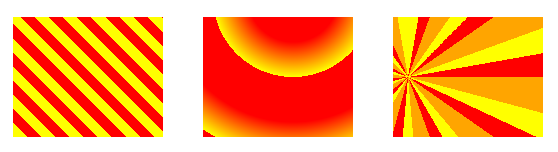<figcaption><p>repeating linear, radial, conic</p></figcaption></figure>

We can use **background-size** (and background-position) to **multiply** the background effect:

<details>

<summary>Checkboard conic-gradient effect </summary>

We use **color-stop** to set each color for **1/4 of the area**, then we set this gradient for 1/4 (**50%, 50%**) of the **size** available:

```
//background size 50% doubles the number of gradients

.nel div:nth-child(4){
    width: 120px;
    height: 120px;

    background-image: 
        conic-gradient(
            #fff 90deg, 
            #000 90deg 180deg, 
            #fff 180deg 270deg, 
            270deg,
            #000 300deg
        );
    background-size: 50% 50%;
}
```

we use **background-position** to display it in a different **order**:&#x20;

```
.nel div:nth-child(5){
    width: 120px;
    height: 120px;

    background-image: 
        conic-gradient(
            #000 0deg 45deg,
            #fff 45deg 135deg, 
            #000 135deg 225deg, 
            #fff 225deg 315deg, 
            315deg,
            #000 360deg
        );
    background-position: top;
    background-size: 25% 25%;
}
```

</details>

<figure>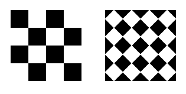<figcaption><p>different background-size and background position</p></figcaption></figure>

The same works for **radial-gradients**:

<details>

<summary>Radial-radient circles effects</summary>

**Background-size** defines **colors-stops** size:

```
//the purple gradient will cover 25% of 1/10 of the space
.filone div:first-child{
  height: 180px;
  background: 
    radial-gradient(
      circle,
      purple 10%,
      pink 25%
    );

  background-size: 10% 10%;
  background-position: left;
}
//ALSO position left moves the dots up/down

```

Only **even-numbered** gradients will e "cut" on the sides by **position**:

```
//position top moves the gradients on the sides
.filone div:nth-child(2){
  height: 180px;

  background: 
    radial-gradient(
      circle,
      purple 10%,
      pink 15%
    );

  background-size: 25% 25%;
  background-position: top;
}

```

We can use percentages for position:

```
//we started the gradient in the top left using %
.filone div:nth-child(3){
  height: 180px;

  background: 
    radial-gradient(
      circle,
      purple 10%,
      pink 20%
    );

  background-size: 20% 20%;
  background-position: 50% 50%;
}

```

</details>

<figure>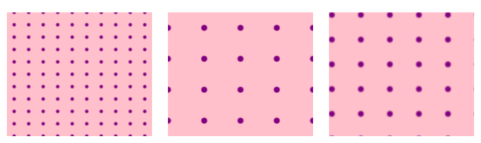<figcaption><p>10%, 25% and 20% sizes</p></figcaption></figure>

We can find many more **gradient designs** [HERE](https://projects.verou.me/css3patterns/) and [Here](https://www.magicpattern.design/tools/css-backgrounds).

<details>

<summary>Conic Metal shiny effect with 6 HSL colors</summary>

We use a **conic-gradient** as **background**, It works on any [HSL ](https://hslpicker.com/)color; _Hue, Saturation, and Lightess:_

```
//remember that the differences between lightness are what matters

background: 
conic-gradient(
  hsla(353, 68%, 42%, 1), hsla(353, 68%, 27%, 1), hsla(353, 68%, 20%, 1), 
  hsla(353, 68%, 54%, 1), hsla(353, 68%, 57%, 1),

  hsla(353, 68%, 42%, 1),
  hsla(353, 68%, 67%, 1), hsla(353, 68%, 54%, 1), hsla(353, 68%, 57%, 1),

  hsla(353, 68%, 42%, 1), hsla(353, 68%, 27%, 1), hsla(353, 68%, 20%, 1), 
  hsla(353, 68%, 54%, 1), hsla(353, 68%, 57%, 1),

  hsla(353, 68%, 42%, 1),
  hsla(353, 68%, 67%, 1), hsla(353, 68%, 54%, 1), hsla(353, 68%, 57%, 1),

  hsla(353, 68%, 42%, 1)
);

//The color lightness rule being:
x   / -15 / -7
+34 / +3  / +10

```

In order to **add more internal colors** we don't use borders (harder to color) but :before/:after:

```
//we add children tags to get more layers

.captain::before{
    content: "";
    width: 220px;
    height: 220px;
    border-radius: 50%;

    background: 
        conic-gradient(
            hsla(0, 0%, 71%, 1), hsla(0, 0%, 54%, 1), hsla(0, 0%, 47%, 1),
            hsla(0, 0%, 80%, 1), hsla(0, 0%, 83%, 1),

            hsla(0, 0%, 71%, 1),
            hsla(0, 0%, 93%, 1), hsla(0, 0%, 80%, 1), hsla(0, 0%, 83%, 1),

            hsla(0, 0%, 71%, 1), hsla(0, 0%, 54%, 1), hsla(0, 0%, 47%, 1),
            hsla(0, 0%, 80%, 1), hsla(0, 0%, 83%, 1),

            hsla(0, 0%, 71%, 1),
            hsla(0, 0%, 93%, 1), hsla(0, 0%, 80%, 1), hsla(0, 0%, 83%, 1),

            hsla(0, 0%, 71%, 1)
        );
} 

```

</details>

<figure>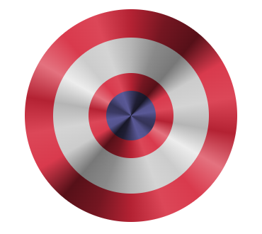<figcaption><p>multiple shiny layers</p></figcaption></figure>

## Grany gradient, Clip-path(), smoke and scrolling animation

By using a **noise image** in the gradient **background**, we can:

<details>

<summary>Grany gradient guide</summary>

We use **transparent in gradient** and _noise background-image_:

```
.secondo div{
    background-image: 
        linear-gradient(
            to left,
            red,
            transparent
        ),
        url(https://grainy-gradients.vercel.app/noise.svg);
}
```

For a more visible grany effect we use **filter()**, more **contrast()** for more _color space_, and more **brightness()** for more _grains visible_:

```
//filters will also change the color

.terzo{
  background-image: 
      linear-gradient(
          to left,
          red,
          transparent
      ),
      url(https://grainy-gradients.vercel.app/noise.svg);

  filter: contrast(150%) brightness(350%);
}
```

We overlay by putting the **gradient below** the color:&#x20;

```
//Colors will change, but not too much
.primo div:nth-child(1){
    position: absolute;
    width: 100%;
    height: 100%;

    background-color: blue;
}

//
.primo div:nth-child(2){
  position: absolute;

  background-image: 
    linear-gradient(
        to left,
        red,
        transparent
    ),
    url(https://grainy-gradients.vercel.app/noise.svg);

  filter: contrast(150%) brightness(350%);
}

```

</details>

<figure>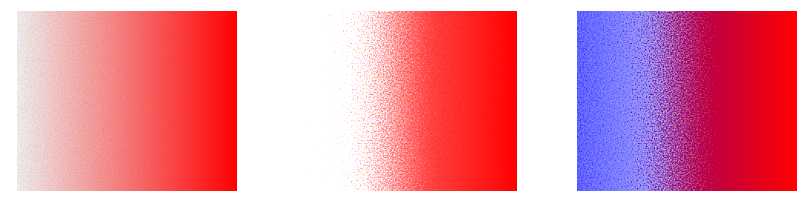<figcaption><p>raw gradient, filter and overlayed colors</p></figcaption></figure>

To use **grany radial gradients** as an overlay:

<details>

<summary>Grany radial-gradient() guide</summary>

For the HTML we need 2 containers:

```
//one for the background and the other for the gradient+circle

<div class="radi">

  <div class="figurina">
    <div class="raggi"></div>
    <div class="luna"></div>
  </div>

</div>
```

We need a **relative position background** to move internal layers:

```
//except for the area, gradient and flex display we need
.radi{
    position: relative;
    overflow: hidden;
}  

//while we set position of the internal layers
.figurina{
    position: absolute;

    bottom: 50%;
    left: 50%;
}
```

While the 2 _absolute_ layers:

```
//we spread the gradient 100% on the parent tag
.raggi{
    position: absolute;
    width: 100%;
    height: 100%;

    background: 
        radial-gradient(
            circle,
            black,
            transparent
        ),
        url(https://grainy-gradients.vercel.app/noise.svg);

    filter: brightness(400%) contrast(100%) invert(100%);
    mix-blend-mode: screen;
}
//mix blend mode screen/multiply will show bright/dark colors
//we invert() the black and show the white

.luna{
    width: 25%;
    height: 25%;
    border-radius: 50%;

    background-color: antiquewhite;
}

```

</details>

<figure>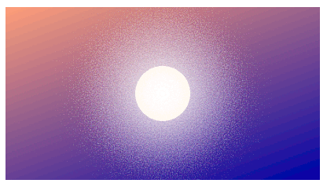<figcaption><p>Radial gradient on single layer</p></figcaption></figure>

We can create a **3D shadow** with a double **radial-gradient():**

<details>

<summary>Double gradient layer </summary>

In the HTML, remember the **order of the shadow tags**:

```
<div class="narancia">

    <p>Grainy <br/> Shadows</p>
    
    <div class="spazio">
        <div class="veraombra"></div>

        <div class="succo">
            <div class="pallaombra"></div>
            <div class="palla"></div>
        </div>
    </div>

</div>

```

We don't need text and the sphere to overlay, position **relative**:

```
//relative container and relative childrens, to space them
.narancia{
  position: relative;
}

.narancia p{
  transform: skewX(-14deg) rotateX(37deg);
  position: relative;
}
.spazio{
  position: relative;
}

```

The _external shadow_ will be:

```
//we mix multiply the shadow on the background with a gradient
.veraombra{
  position: absolute;
  border-radius: 50%;

  background: 
      radial-gradient(
          ellipse,
          navy,
          transparent
      ),
      url(https://grainy-gradients.vercel.app/noise.svg);
      
  filter: contrast(150%) brightness(700%);
  mix-blend-mode: multiply;
  transform: rotateZ(7deg);
}

```

For the _sphere_ and its _internal shadow_ we:

```
//we put the shadow first, by changing its center and the overlay hidden
//we can show it only on one side
.pallaombra{
  position: absolute;
  height: 100%;
  width: 100%;

  background: 
      radial-gradient(
          circle at 65% 35%,
          transparent,
          blue
      ),
      url(https://grainy-gradients.vercel.app/noise.svg); 

  filter: contrast(120%) brightness(900%);
}

//we need the mix multiply for it to be visible
.palla{
  position: absolute;
  width: 100%;
  height: 100%;

  background: 
      radial-gradient(
          circle,
          lightsalmon,
          crimson
      );
  mix-blend-mode: multiply;
}

```

</details>

<figure>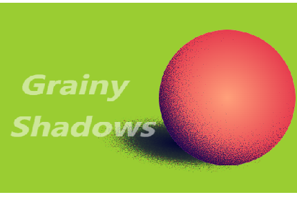<figcaption></figcaption></figure>

We can use **mix-blend-mode** and **filters** to create animated text gradient effect:

<details>

<summary>Gradient invisible effect guide</summary>

We will need an extra HTML tag:

```
//we will need an extra tag below the text for the background
<div class="lamincard">

  <div class="noise2">holo ••• graphic type •••</div>
  <div class="sottofonda"></div>

</div>

//we animate the background to rotate(30deg)
.lamincard{
  animation: cube-rotate 2s alternate infinite ease-in-out;
}
```

For the **text color**, we use **background-clip** and **color: invisible** to use the background **gradient()** as text color:

```
//The gradient text is also animated
.noise2{
  width: 100%;
  height: 100%;

  background: 
    linear-gradient(
      24deg, 
      rgba(50, 0, 255, 0.1),
      CornflowerBlue
    ),
    url(https://grainy-gradients.vercel.app/noise.svg); 

  color: transparent;
  background-clip: text;
  -webkit-background-clip: text;
  
  animation: shimmer 2s alternate infinite
}

//the animation uses brightness to turn the color white
@keyframes shimmer {
    from {
      filter: contrast(190%) brightness(500%);
    }
    to {
      filter: contrast(190%) brightness(130%);
    }
}

```

For the mix-blend background, we use **multiply/screen** to show the **dark/white colors**:

```
//if we use multiply and the color is white, it becomes invisible
.sottofonda{
    position: absolute;
    background: antiquewhite;
    width: 100%;
    height: 100%;

    mix-blend-mode: multiply;
}
```

</details>

<figure>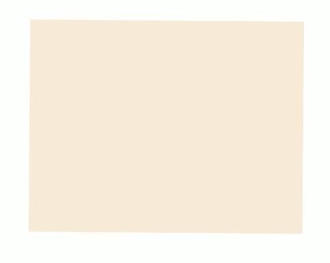<figcaption><p>invisible gradient tet effect</p></figcaption></figure>

For multiple grany gradient backgrounds effect:

<details>

<summary>Multiple radial gradient guide</summary>

```
//we use 2 gradient layers in the container
<div class="wheel">

  <div class="grany">
    <div class="nucleus"></div>
  </div>

</div>
```

To avoid having our transparent be mixed with other background colors, we **isolate**:

```
.wheel{
    position: relative;
      
    isolation: isolate;
    background-color: white;
    overflow: hidden;
}
```

We leave an **empty space at the center** of the first layer with the color-stop at 8%, remember that, the **difference between color stops makes the grany more visible**:

```
// we use transparent as white
.grany{
  background: 
    radial-gradient(
        hsla(353, 68%, 42%, 1) 8%,
        transparent 40%,
        hsla(353, 68%, 42%, 1) 70%),
    url(https://grainy-gradients.vercel.app/noise.svg);

  filter: contrast(200%) brightness(250%);
}

```

We use a **partial-transparency** for the blue center:

```
//to fill and pass to the red part of the gradient
.nucleus{
  background: radial-gradient( 
      rgba(0, 0, 255, 1) 34%, 
      rgba(255, 0, 0, 0.1) 110% ),
      url(https://grainy-gradients.vercel.app/noise.svg);

  filter: contrast(150%) brightness(500%) ;
}
```

</details>

<figure>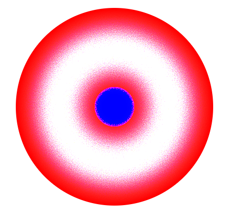<figcaption><p>double grany radial gradient CSS</p></figcaption></figure>

### The clip-path() property

Clip-path() is a CSS property to cut a geometrical region from a region:



We use **circle( radius, center )**:

```
//we can use % and px for the center, 50% takes the entire space
.circolo{
    background-color: red;
    clip-path: circle(40% at 20% 75% );
}

```

<figure><figcaption><p>clip circle on different center</p></figcaption></figure>



We use **ellipse( Xaxis, Yaxis, center)**:

```
//you can also use %
.ellipse{
    background-color: blue;
    clip-path: ellipse(70px 100px at 135px 40px);
}

```

<figure>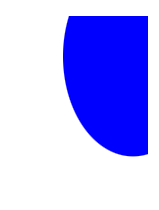<figcaption><p>ellipse with different center</p></figcaption></figure>



We get a rectangle with **inset( Xinset, Yinset ):**

```
//we cut 10% on both X sides, while 355 on the other
.siren{    
    background-color: darkmagenta;
    clip-path: inset( 10% 35% );
}

```

<figure><figcaption><p>clip inset rectangle</p></figcaption></figure>



We can have **border-radius** on inset clips:

<details>

<summary>Border radius examples</summary>

Unlike **inset()** that can take **2 values max**, we can use up to 4 with border-radius:

```
.commo{
    background-color: crimson;
    clip-path: inset( 5% 15% round 50% 50% 0 0 );
}

.pizza{
    background-color: goldenrod;
    clip-path: inset( 15% 5% round 50% 50% );
}

.tower{
    background-color: dodgerblue;
    clip-path: inset( 10% round 50% 0 50% 0 );
}

.quarto{
    background-color: rosybrown;
    clip-path: inset( 15% round 0 50% 0 0 );
}

```

</details>

<figure>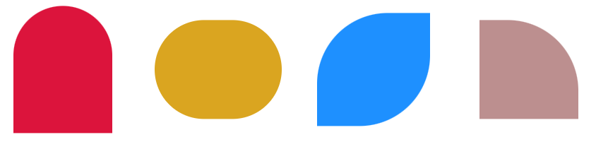<figcaption><p>inset with border radius</p></figcaption></figure>

We can clip entire **polygon()**, you can use this as a [guide](https://www.cssportal.com/css-clip-path-generator/):



We draw **(X,Y)** points for each point of the polygon:

```
//remember to NOT put a (,) for the last point
.stalle{
    background-color: white;
    clip-path: polygon(
        50% 0%, 
        61% 35%, 
        98% 35%, 
        68% 57%, 
        79% 91%, 
        50% 70%, 
        21% 91%, 
        32% 57%, 
        2% 35%, 
        39% 35%
    );
}
```

<figure>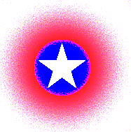<figcaption><p>star polygon on gradient</p></figcaption></figure>



We use the border-radius and clip for the slice:

```
.poligono{
    border-radius: 50%;
    clip-path: polygon(
        0 0, 
        0 100%, 
        100% 100%, 
        100% 0, 
        65% 0, 
        50% 50%, 
        35% 0
    );
}

```

<figure>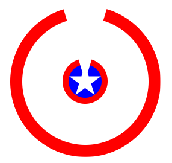<figcaption><p>the sliced circle clip</p></figcaption></figure>



### Animated smoke CSS effect

We are gonna animate a list of layers in a different order:

<details>

<summary>CSS smoke guide</summary>

For the absolute layers, we need a relative container.

```
<div class="fumo">
  <li></li>
  <li></li>
  <li></li>
  <li></li>
  <li></li>
</div>

.fumo{
  position: relative;
}

```

We style each smokeball:

```
//they are gonna be overlayed and share the same space
.fumo li{
  position: absolute;
  list-style: none;

  height: 30px;
  width: 30px;
  border-radius: 50%;
  background-color: rgba(0, 140, 255, 0.6);
}

```

To create a **spread smoke** effect we use **2 animations**:

```
//one for the even smokeballs and another for the odd
.fumo li:nth-child(even){
  animation: fuceven 1s linear infinite;
}

.fumo li:nth-child(odd){
  animation: fucodd 1s linear infinite;
}

```

And we also add a **different delay** to each smokeball:

```
//we keep the last smoke fixed for a better stream
.fumo li:nth-child(1){
  animation-delay: 0.2s;
}
.fumo li:nth-child(2){
  animation-delay: 0.3s;
}
.fumo li:nth-child(3){
  animation-delay: 0.4s;
}
.fumo li:nth-child(4){
  animation-delay: 0.8s;
}
.fumo li:nth-child(5){
  animation: none;
  filter: blur(15px);
}

```

For the actual animated frames:

```
//from their actual position (0,0) to any (x,y)
@keyframes fuceven {
  0%{
      transform: translate(0,0) scale(1);
      opacity: 1;
      filter: blur(5px);
  }
  100%{
      transform: translate( 20px, -150px ) scale(3);
      opacity: 0;
      filter: blur(10px);
  }
}

@keyframes fucodd{
  0%{
      transform: translate(0,0) scale(1);
      opacity: 1;
      filter: blur(5px);
  }
  100%{
      transform: translate( -20px, -150px ) scale(3);
      opacity: 0;
      filter: blur(10px);
  }
}

```

</details>

<figure><figcaption><p>smoke effect</p></figcaption></figure>

### CSS and JS scrolling timer effect

The HTML structure of the clock is gonna be:

```
//each time value is gonna be a container of 2 values
<div class="hours1">
  <div class="first">
    <div class="number">0</div>
  </div>
  <div class="second">
    <div class="number">0</div>
  </div>
</div>

<div class="tick">:</div>

```

<details>

<summary>Scrolling effect JS animation</summary>

On the script.js file we get the **Date()** object for the **timezone**, and **we convert the time numbers to string data**:

```
//Take each time HTML sections 
var hoursContainer = document.querySelector('.hours1')
var minutesContainer = document.querySelector('.minutes1')
var secondsContainer = document.querySelector('.seconds1')

function updateTime (){
    var now = new Date(new Date().toLocaleString("en-US", {timeZone: "Europe/Kiev"})); 

    var nowHours = now.getHours().toString()
    var nowMinutes = now.getMinutes().toString()
    var nowSeconds = now.getSeconds().toString()

    updateContainer(hoursContainer, nowHours)
    updateContainer(minutesContainer, nowMinutes)
    updateContainer(secondsContainer, nowSeconds)
}

```

We **split()** the time string into an **array** of 2, and we **unshift()** a 0 in case _single digit._

We separate the **first/last child** of the container and update if the current time value differs (with \<div> and value);

```
//arguments being the HTML container and the time number value
function updateContainer (container, newTime) {
    var time = newTime.split('')

    if (time.length === 1) {
      time.unshift('0')
    }

    var first = container.firstElementChild
    if (first.firstElementChild.textContent !== time[0]) {
      updateNumber(first, time[0])
    }

    var last = container.lastElementChild
    if (last.firstElementChild.textContent !== time[1]) {
      updateNumber(last, time[1])
    }
}
```

We **create/clone** the same **HTML** element with **updated** time, append it (below) to the current HTML, and animate it.

After the animation is complete we **remove** the CSS and **remove** the old element.firstElementChild with the new/cloned one:

```
//element.firstChildelement being the old/current HTML element
function updateNumber(element, number) {
    var second = element.firstElementChild.cloneNode(true)
    second.textContent = number
  
    element.appendChild(second)
    element.classList.add('move')
  
    setTimeout(function () {
      element.classList.remove('move')
    }, 980)
  
    setTimeout(function () {
      element.removeChild(element.firstElementChild)
    }, 980)
}

//we update the time each second
setInterval(updateTime, 1000)
```

The CSS animations being:

```
//we translateY() the height of the container
.move {
  animation: move linear 1s infinite;
}

@keyframes move {
  from {
    transform: translateY(0em);
  }
  to {
    transform: translateY(-2.1em);
  }
}

```

</details>

<figure>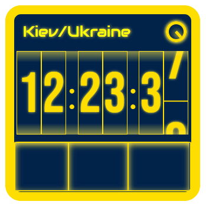<figcaption><p>scrolling clock js animation</p></figcaption></figure>

## CSS borders and border-box

Using the border property we can specify **width, color and style** of a border

<details>

<summary>Borders guide</summary>

About **border-style**:

```
.dot{
    border: dotted 5px brown;
}

.dash{
    border: dashed 5px brown;
}

.solid{
    border: solid 5px brown;
}

//all get a complementary darker border-color 
.groove{
    border: groove 10px red;
}

.ridge{
    border: ridge 10px red;
}

.inset{
    border: inset  10px red;
}

.outset{
    border: outset 10px red;
}

```

We can style/width each side of the border

```
//order being top/right/bottom/left
.chiuso{
    border: outset red;
    border-width: 8px 4px 2px 20px;
}
```

</details>

<figure>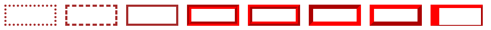<figcaption><p>border examples</p></figcaption></figure>

We can use border-style: **double** or the **outline** property for a double border:

<details>

<summary>Border: double and Outline guide </summary>

The **width** of border-style: **double** is equally divided:

```
//between the external border, the offset, and the internal
.dou{
    border: double 10px red;    //3px red, 3px white, 3px red
}
```

The **outline property** draws a line outside the border.

It shared properties with border but **can't use** border-**radius**, it can **conflict with margin:**

```
//outline-style: dotted, dashed, solid, double, groove, ridge, inset, outset
.groove{
    background-color: darkorange;
    border: 5px dotted brown;
    outline: 5px dashed lightskyblue;
    outline-offset: 5px;
}

```

Outline-offset is _not in the shortcut_ and can be negative:

```
//calculate outline width when setting offset
.dash{
    background-color: darkorange;

    border: 5px dashed lightskyblue;
    outline: 5px dotted brown;
    outline-offset: -15px;
}

```

</details>

<figure>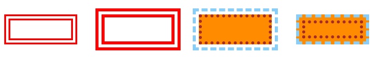<figcaption><p>border-style double and outlines</p></figcaption></figure>

For an internal border, we can use **:before:after, box-shadow, or background-clip:**



We space each side:

```
//relative>absolute needed 
.tasti{
    position: relative;
    border: 8px solid red;
}

.tasti::after{
    content: " ";
    position: absolute;

    top: 5px;
    left: 5px;
    right: 5px;
    bottom: 5px;
    border: 3px solid green;
}
```

<figure>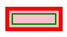<figcaption><p>after layer on the relative</p></figcaption></figure>



We center the :after with the **flex** display :

```
//justify and align
.flexo{
    position: relative;
    border: 8px solid red;

    display: flex;
    justify-content: center;
    align-items: center;
}

.flexo::after{
    content: "";
    position: absolute;

    width: 80%;
    height: 80%;
    border: 3px solid green;
}
```

<figure>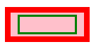<figcaption><p>flex display</p></figcaption></figure>



We draw a shadow-box with **blur** and **offset to 0**:

```
//they won't any space between, and the second needs to exceed the first
.ombra{
    height: 50px;
    width: 120px;

    background-color: pink;
    box-shadow: 
    0 0 0 5px blue,
    0 0 0 10px orange;
}

```

<figure>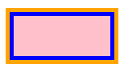<figcaption><p>double shadow </p></figcaption></figure>



We use **background-clip: content-box** to stop the background before the padding, only on white:

```
.breaking{
    background-color: pink;

    border: 7px solid rgb(36, 85, 7);
    padding: 5px;
    background-clip: content-box;
}

```

<figure>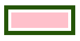<figcaption><p>padding on content-box</p></figcaption></figure>



The **border width** sets the _difference_ between **content-box** and **border-box**:

```
//box-sizing: content-box is set by default, it adds border and padding to the width
//border-box sums border and padding to the set width
.come{
    background-color: pink;
    box-sizing: content-box;
    
    padding: 20px;
    border: 10px blue solid;
}

.cane{
    background-color: pink;

    border: 10px blue solid;
    box-sizing: content-box;
}
```

<figure>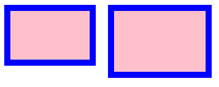<figcaption><p>border-box and content-box</p></figcaption></figure>

We use **border-images** to use **gradients** or url images for our borders:

<details>

<summary>Border-image guide</summary>

We can't use the shorthand for images/gradients:

```
.lineare{
    border-style: solid;
    border-width: 15px;
    border-image: linear-gradient(90deg, rgb(0,143,104), rgb(250,224,66));
    border-image-slice: 1;
}

.gradiale{
    border-image: radial-gradient(rgb(0,143,104), rgb(250,224,66)) 1;
}

.conico{
    border-image: conic-gradient(red, yellow, lime, aqua, blue, magenta, red) 1;
}

//border-image-slice is needed in border-image
//it's X,Y and can use px/%, for how the image will be cut
.test{
  border-style: solid;
  border-width: 15px;
  border-image: url( https://live.staticflickr.com/65535/49927594376_d7c5d1d0e6_c.jpg );
  border-image-slice: 60 30;
}

.grand{
  border-style: solid;
  border-width: 15px;
  border-image: url(https://live.staticflickr.com/65535/49927594376_d7c5d1d0e6_c.jpg);
  border-image-slice: 80 fill;
}
//fill will use the image as background+border
```

</details>

<figure>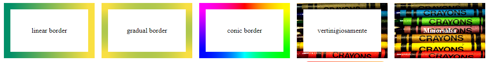<figcaption><p>background-images</p></figcaption></figure>

We **can't use border-radius** not border-left/right/top/bottom for **border-image** but:

<details>

<summary>Border image radius guide</summary>

We can use **padding-box** and **border-box** background:

```
//we need to use a gradient in the padding-box only to keep the border colored
.granola{
    padding: 15px;

    border: 8px solid transparent;
    border-radius: 15px;
    background: 
        linear-gradient(white 0 0) padding-box,
        linear-gradient(to left, blue, pink) border-box;
}
```

We could use **border-image-slice** to cut borders:

```
//we need % for that
.meta{
    border-style: solid;
    border-width: 15px;

    border-image: linear-gradient(to left, pink, blue);
    border-image-slice: 100% 1;
}
```

Or cut specific border-width:

```
.chris{
    padding: 5px;

    border-width: 10px 0 10px 0;
    border-style: solid;
    border-color: transparent;
    
    background: 
        linear-gradient(white 0 0) padding-box,
        linear-gradient(to right, blue, pink) border-box;
}

```

It works the same for border-radius:

```
//you will need +1 radius on width
.vas{
    padding: 5px;

    border-width: 0 0 10px 20px;
    border-radius: 50% 0 50% 50%;
    border-style: solid;
    border-color: transparent;

    background: 
        linear-gradient(white 0 0) padding-box,
        linear-gradient(to right, blue, pink) border-box;
}

```

</details>

<figure>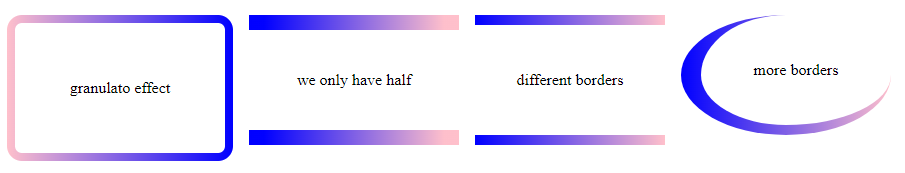<figcaption><p>different border-image styles</p></figcaption></figure>

## Custom popup, checklist, expandable and buttons effects

We use _first-of-type_ pseudo selector and **attr()** CSS _content property_:

<details>

<summary>Capital letter and Popup text guide</summary>

The popup **attr()** content is gonna be contained in the **tooltip-data:**

```
<div class="apri">
  <p>
    ...
    <span class="tooltip" tooltip-data="Whoever tries to do that you won't use it 
    I guess, maybe we should have javascript for this">
    content
    </span>
    nisi!
  </p>
</div>

```

For the capital we use **first-of-type::first-letter**:

```
//float is necessary, while the rest is for style
.apri p:first-of-type::first-letter {
  color: orange;
  font-size: 2.5em;

  float: left;
  line-height: 0.9em;
  padding-right: 4px;
}

```

After getting the HTML content **attr**ibute, we use before:after :

```
//Relative is for absolute layers before/after, while display is for
//positioning the popup
.tooltip{
  position: relative;
  border-bottom: 1px dotted black;
  cursor: pointer;

  display: inline-block;
}

```

We use **opacity** to make it _invisible_, but also **visibility:hidden/visible** or **display:none/inline-block** for the transition effect:

```
//so the effect triggers only on the text and not on the popup width
.tooltip::before{
  content: attr(tooltip-data);
  position: absolute;

  width: 250px;
  color: white;
  background-color: orange;
  padding: 5px;

  bottom: 110%;
  left: -60%;

  opacity: 0;
  visibility: hidden;
  transition: opacity 0.5s;
}

//we use borders for a triangle at the base
.tooltip::after{
  content: "";
  position: absolute;

  right: 60%;

  opacity: 0;
  display: none;
  transition: opacity .5s;

  border-width: 5px;
  border-style: solid;
  border-color: #000 transparent transparent transparent;
}

.tooltip:hover:before, 
.tooltip:hover:after {
    opacity: 1;
	display: inline-block;
}

```

</details>

<figure>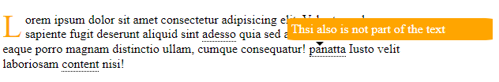<figcaption><p>Capital letter and popup on hover</p></figcaption></figure>

### CSS custom checklist&#x20;

We can **display:none** the \<input> and still have a checkbox:

<details>

<summary>CSS custom checklist guide</summary>

In the HTML we create the \<label> for the \<input> tag:

```
//<i> is the customcheckbox
<div class="check">

  <h2>This is our version </h2>
  <label>
    <input type="checkbox" name="" id="" />

    <i></i>
    <span> First element </span>
  </label>

</div>

```

We can use _border-bottom_ and _underline_:

```
//they have a margin included 
//inline-blocks limit the border only on the text, not the entire tag
.check h2{
	color: palegoldenrod;
	display: inline-block;
	border-bottom: 2px solid palegoldenrod;
	text-decoration: underline;
}

//block is to have each label as new line
.check label{
  display: block;
  margin: 30px 0;
  ...
}

```

For the actual **input**:

```
//we hide the actual input checkbox
.check input{
  display: none;
}

//custom checkbox, absolute for actual width/height
.check i{
  position: absolute;

  width: 25px;
  height: 25px;
  border: 2px solid palegoldenrod;
}

//while the text is
.check span{
  position: relative;

  top: 4px;
  left: 40px;
  transition: 0.5s;
}

```

For the transition effect we:

```
//we cut 2 sides of the checkbox, and rotate it with different width/height
.check input:checked ~ i{
  height: 15px;
  width: 25px;

  border-top: none;
  border-right: none;
  transform: rotate(-45deg);
}

//we add the strikethrough decoration text
.check input:checked ~ span {
  color: palegoldenrod;
  text-decoration: line-through;
}

```

</details>

<figure>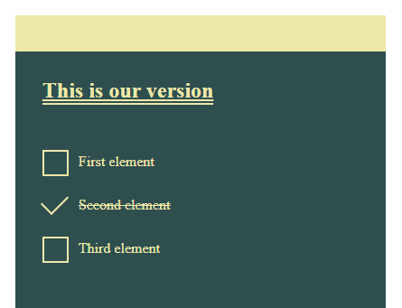<figcaption></figcaption></figure>

### Expandable text and animated sidebars.

We use the **\<details>** tag and _absolute+hover_ **transition**:

<details>

<summary>Expandable and sidebars guide</summary>

In the HTML the **\<detail>** tag includes a **triangle icon** near **\<summary>** text, it also adds the attribute **open** to the tag if opened:

```
<div class="expand">
  ...
  <details open>
    <summary> Second tab to click </summary>
    
    <div class="tab-content">
      <p>
        We Have a list of options
      </p>

      <div class="sidebar">

        <nav class="menu">
          <p><a href="">what you </a></p>
          <p><a href="">what you1 </a></p>
          <p><a href="">what you2 </a></p>
          <p><a href="">what you4 </a></p>
        </nav>

      </div>
    </div>

  </details>
</div>

```

We add another -/+ **icon** to the right side of **\<summary>**:

```
.expand summary{
  position: relative;
  padding: 1em;
  background-color: antiquewhite;
}

//absolute +right fixes the content to the right
details > summary::after {
  position: absolute;
  content: "+";
  right: 20px;
}

//if the <details> is open we change icon
details[open] > summary::after {
  position: absolute;
  content: "-";
  right: 20px;
}

```

For a **fade-in effect** of the expandables:

```
//on click it will gain the attribute open
details[open] summary ~ * {
  animation: sweep .5s ease-in-out;
}

@keyframes sweep {
  0%{
    opacity: 0; 
    margin-top: -10px
  }
  100%{
    opacity: 1; 
    margin-top: 0px
  }
}

```

For the relative **sidebar,** we **overflow:hidden** and _absolute right: 100%_ before the hover_:_

```
.sidebar{
  position: relative;
  overflow: hidden;

  width: 30%;
  height: 150px;
}

//we need a padding+translateX() for the hover
.menu{
  position: absolute;
  width: 60%;
  right: 100%;

  display: flex;
  flex-direction: column;

  background-color: darkkhaki;
  padding: 1em;

  transform: translateX(1em);
  transition: 0.2s transform;
}

```

**On hover** we move the menu visible again:

```
//we translate back the right:100%
.menu:hover,
.menu:focus-within {
  transform: translateX(100%);
}

```

</details>

<figure>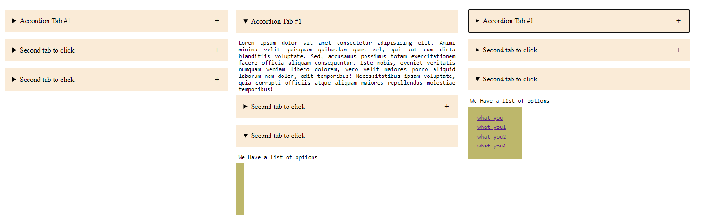<figcaption><p>Expandable and sidenav on hover</p></figcaption></figure>

### CSS :before:after effects

We can see a gallery of **CSS transition effects** here:


A gallery of CSS effects

