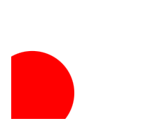
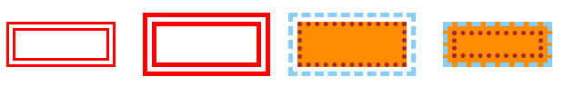
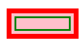
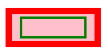
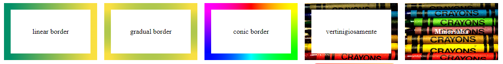

# Clip-Path and border

1

1

1

### The clip-path() property

Clip-path() is a CSS property to cut a geometrical region from a region:



We use **circle( radius, center )**:

```css
//we can use % and px for the center, 50% takes the entire space
.circolo{
    background-color: red;
    clip-path: circle(40% at 20% 75% );
}
```

<figure><figcaption><p>clip circle on different center</p></figcaption></figure>



We use **ellipse( Xaxis, Yaxis, center)**:

```css
//you can also use %
.ellipse{
    background-color: blue;
    clip-path: ellipse(70px 100px at 135px 40px);
}

```

<figure><figcaption><p>ellipse with different center</p></figcaption></figure>



We get a rectangle with **inset( Xinset, Yinset ):**

```css
//we cut 10% on both X sides, while 355 on the other
.siren{    
    background-color: darkmagenta;
    clip-path: inset( 10% 35% );
}

```

<figure><figcaption><p>clip inset rectangle</p></figcaption></figure>



We can have **border-radius** on inset clips:

<details>

<summary>Border radius examples</summary>

Unlike **inset()** that can take **2 values max**, we can use up to 4 with border-radius:

```
.commo{
    background-color: crimson;
    clip-path: inset( 5% 15% round 50% 50% 0 0 );
}

.pizza{
    background-color: goldenrod;
    clip-path: inset( 15% 5% round 50% 50% );
}

.tower{
    background-color: dodgerblue;
    clip-path: inset( 10% round 50% 0 50% 0 );
}

.quarto{
    background-color: rosybrown;
    clip-path: inset( 15% round 0 50% 0 0 );
}

```

</details>

<figure><figcaption><p>inset with border radius</p></figcaption></figure>

We can clip entire **polygon()**, you can use this as a [guide](https://www.cssportal.com/css-clip-path-generator/):



We draw **(X,Y)** points for each point of the polygon:

```css
//remember to NOT put a (,) for the last point
.stalle{
    background-color: white;
    clip-path: polygon(
        50% 0%, 
        61% 35%, 
        98% 35%, 
        68% 57%, 
        79% 91%, 
        50% 70%, 
        21% 91%, 
        32% 57%, 
        2% 35%, 
        39% 35%
    );
}
```

<figure><figcaption><p>star polygon on gradient</p></figcaption></figure>



We use the border-radius and clip for the slice:

```css
.poligono{
    border-radius: 50%;
    clip-path: polygon(
        0 0, 
        0 100%, 
        100% 100%, 
        100% 0, 
        65% 0, 
        50% 50%, 
        35% 0
    );
}
```

<figure><figcaption><p>the sliced circle clip</p></figcaption></figure>



## CSS borders and border-box

Using the border property we can specify **width, color and style** of a border

<details>

<summary>Borders guide</summary>

About **border-style**:

```
.dot{
    border: dotted 5px brown;
}

.dash{
    border: dashed 5px brown;
}

.solid{
    border: solid 5px brown;
}

//all get a complementary darker border-color 
.groove{
    border: groove 10px red;
}

.ridge{
    border: ridge 10px red;
}

.inset{
    border: inset  10px red;
}

.outset{
    border: outset 10px red;
}

```

We can style/width each side of the border

```
//order being top/right/bottom/left
.chiuso{
    border: outset red;
    border-width: 8px 4px 2px 20px;
}
```

</details>

<figure><figcaption><p>border examples</p></figcaption></figure>

We can use border-style: **double** or the **outline** property for a double border:

<details>

<summary>Border: double and Outline guide </summary>

The **width** of border-style: **double** is equally divided:

```
//between the external border, the offset, and the internal
.dou{
    border: double 10px red;    //3px red, 3px white, 3px red
}
```

The **outline property** draws a line outside the border.

It shared properties with border but **can't use** border-**radius**, it can **conflict with margin:**

```
//outline-style: dotted, dashed, solid, double, groove, ridge, inset, outset
.groove{
    background-color: darkorange;
    border: 5px dotted brown;
    outline: 5px dashed lightskyblue;
    outline-offset: 5px;
}

```

Outline-offset is _not in the shortcut_ and can be negative:

```
//calculate outline width when setting offset
.dash{
    background-color: darkorange;

    border: 5px dashed lightskyblue;
    outline: 5px dotted brown;
    outline-offset: -15px;
}

```

</details>

<figure><figcaption><p>border-style double and outlines</p></figcaption></figure>

For an internal border, we can use **:before:after, box-shadow, or background-clip:**



We space each side:

```css
//relative>absolute needed 
.tasti{
    position: relative;
    border: 8px solid red;
}

.tasti::after{
    content: " ";
    position: absolute;

    top: 5px;
    left: 5px;
    right: 5px;
    bottom: 5px;
    border: 3px solid green;
}
```

<figure><figcaption><p>after layer on the relative</p></figcaption></figure>



We center the :after with the **flex** display :

```css
//justify and align
.flexo{
    position: relative;
    border: 8px solid red;

    display: flex;
    justify-content: center;
    align-items: center;
}

.flexo::after{
    content: "";
    position: absolute;

    width: 80%;
    height: 80%;
    border: 3px solid green;
}
```

<figure><figcaption><p>flex display</p></figcaption></figure>



We draw a shadow-box with **blur** and **offset to 0**:

```css
//they won't any space between, and the second needs to exceed the first
.ombra{
    height: 50px;
    width: 120px;

    background-color: pink;
    box-shadow: 
    0 0 0 5px blue,
    0 0 0 10px orange;
}
```

<figure><figcaption><p>double shadow </p></figcaption></figure>



We use **background-clip: content-box** to stop the background before the padding, only on white:

```css
.breaking{
    background-color: pink;

    border: 7px solid rgb(36, 85, 7);
    padding: 5px;
    background-clip: content-box;
}
```

<figure><figcaption><p>padding on content-box</p></figcaption></figure>



The **border width** sets the _difference_ between **content-box** and **border-box**:

```css
//box-sizing: content-box is set by default, it adds border and padding to the width
//border-box sums border and padding to the set width
.come{
    background-color: pink;
    box-sizing: content-box;
    
    padding: 20px;
    border: 10px blue solid;
}

.cane{
    background-color: pink;

    border: 10px blue solid;
    box-sizing: content-box;
}
```

<figure><figcaption><p>border-box and content-box</p></figcaption></figure>

We use **border-images** to use **gradients** or url images for our borders:

<details>

<summary>Border-image guide</summary>

We can't use the shorthand for images/gradients:

```css
.lineare{
    border-style: solid;
    border-width: 15px;
    border-image: linear-gradient(90deg, rgb(0,143,104), rgb(250,224,66));
    border-image-slice: 1;
}

.gradiale{
    border-image: radial-gradient(rgb(0,143,104), rgb(250,224,66)) 1;
}

.conico{
    border-image: conic-gradient(red, yellow, lime, aqua, blue, magenta, red) 1;
}

//border-image-slice is needed in border-image
//it's X,Y and can use px/%, for how the image will be cut
.test{
  border-style: solid;
  border-width: 15px;
  border-image: url( https://live.staticflickr.com/65535/49927594376_d7c5d1d0e6_c.jpg );
  border-image-slice: 60 30;
}

.grand{
  border-style: solid;
  border-width: 15px;
  border-image: url(https://live.staticflickr.com/65535/49927594376_d7c5d1d0e6_c.jpg);
  border-image-slice: 80 fill;
}
//fill will use the image as background+border
```

</details>

<figure><figcaption><p>background-images</p></figcaption></figure>

We **can't use border-radius** not border-left/right/top/bottom for **border-image** but:

<details>

<summary>Border image radius guide</summary>

We can use **padding-box** and **border-box** background:

```css
//we need to use a gradient in the padding-box only to keep the border colored
.granola{
    padding: 15px;

    border: 8px solid transparent;
    border-radius: 15px;
    background: 
        linear-gradient(white 0 0) padding-box,
        linear-gradient(to left, blue, pink) border-box;
}
```

We could use **border-image-slice** to cut borders:

```css
//we need % for that
.meta{
    border-style: solid;
    border-width: 15px;

    border-image: linear-gradient(to left, pink, blue);
    border-image-slice: 100% 1;
}
```

Or cut specific border-width:

```css
.chris{
    padding: 5px;

    border-width: 10px 0 10px 0;
    border-style: solid;
    border-color: transparent;
    
    background: 
        linear-gradient(white 0 0) padding-box,
        linear-gradient(to right, blue, pink) border-box;
}

```

It works the same for border-radius:

```css
//you will need +1 radius on width
.vas{
    padding: 5px;

    border-width: 0 0 10px 20px;
    border-radius: 50% 0 50% 50%;
    border-style: solid;
    border-color: transparent;

    background: 
        linear-gradient(white 0 0) padding-box,
        linear-gradient(to right, blue, pink) border-box;
}

```

</details>

<figure><figcaption><p>different border-image styles</p></figcaption></figure>

1
