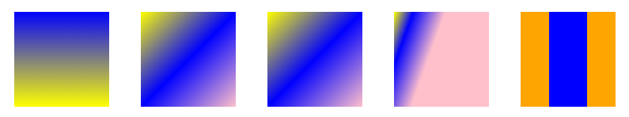
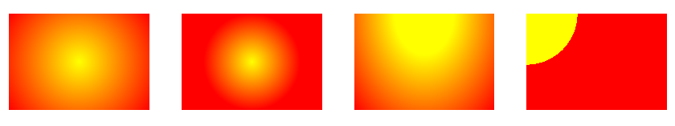
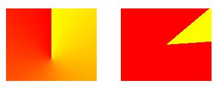
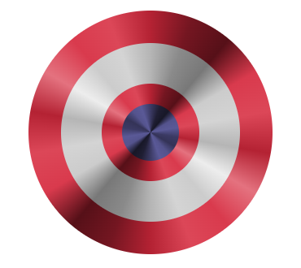

# Gradients and Mask Layers

* 1
* 1
* 1
* 1

## CSS Gradients and effects

The **Linear-gradient() function** creates a smooth color transition as a **background-image**, which can include a starting point, direction, and angle.

```css
background: linear-gradient( <Direction>, color1, color2, etc...);
```

<details>

<summary>Guide to linear-gradients()</summary>

We use Degrees as **starting point**:

<pre class="language-css"><code class="lang-css"><strong>//by default is 0deg horizontal
</strong><strong>.nel div:nth-child(1){
</strong>  width: 120px;
  height: 120px;
  background: linear-gradient(90deg, yellow, blue);
}
</code></pre>

If we use keywords it's the **to ending point**:

```css
.nel div:nth-child(2){
  width: 120px;
  height: 120px;
  background: linear-gradient(to right bottom , yellow, blue, pink );
}
```

We can also use **background-image** and **transparent** gradients;

```css
//Transparent on blue background
.nel div:nth-child(4) {
  width: 120px;
  height: 120px;

  background-image:
    linear-gradient(110deg,
      yellow,
      transparent 15%,
      pink 40%);
  background-color: blue;
}
```

We can use **%** or **px** for **color-stops** on the gradient:

```css
//we set where the color will change
.nel div:nth-child(4) {
  width: 120px;
  height: 120px;

  background-image:
    linear-gradient(110deg,
      yellow,
      transparent 15%,
      pink 40%);
  background-color: blue;
}
```

if we want rigid color transition we can:

```css
//repeated to avoid blue gradient
.nel div:nth-child(5) {
  width: 120px;
  height: 120px;

  background-image:
    linear-gradient(90deg,
      orange 30px,
      blue 30px,
      blue 70px,
      orange 70px);
}
```

</details>

<figure><figcaption><p>differet linear-gradient </p></figcaption></figure>

A **radial-gradient()** function radiates **from** the **center**, on an ellipse(default) or circle shape:

```css
background-image: 
  radial-gradient( <shape> <starting-point>, color1, color2, etc );
```

<details>

<summary>Radial gradient guide</summary>

We can change the gradient's ending areas with:

```css
//closest-corner, closest-side, farthest-corner, farthest-side
.alto div:nth-child(1) {
  width: 180px;
  height: 120px;

  background-color: yellow;
  background-image:
    radial-gradient(circle closest-corner,
      transparent,
      red);
}

//corner or side
.alto div:nth-child(2) {
  width: 180px;
  height: 120px;

  background-color: yellow;
  background-image:
    radial-gradient(circle closest-side,
      transparent,
      red);
}
```

We set the **starting point** for the radial:

```css
//we didn't set the shape and get an ellipse
.alto div:nth-child(3) {
  width: 180px;
  height: 120px;

  background-color: yellow;
  background-image:
    radial-gradient(at top,
      transparent 30%,
      red);
}
```

And use rigid gradients:

```css
.alto div:nth-child(4) {
  width: 180px;
  height: 120px;

  background-color: yellow;
  background-image:
    radial-gradient(circle at top left,
      transparent 30%,
      red 30%);
}
```

</details>

<figure><figcaption><p>radial on different shapes, areas and positions</p></figcaption></figure>

A **conic-gradient** is a circular gradient that **rotates on** a center point

<details>

<summary>Conic-gradient guide</summary>

We can set **AT** its center (with both % and px):

```css
.conico div:nth-child(1) {
  width: 150px;
  height: 120px;

  background-image:
    conic-gradient(at 50% 70%,
      yellow,
      red);
}
```

We can also set **FROM** which degree they start and color stops(only in **deg** and **%**)

```css
//Default 0deg is from the top
.conico div:nth-child(2) {
  width: 150px;
  height: 120px;

  background-image:
    conic-gradient(from 50deg,
      yellow 10%,
      red 10%);
}
```

</details>

<figure><figcaption><p>conic gradient position, degree and color stop</p></figcaption></figure>

We can add **repeating-** for all of the gradients.

<details>

<summary>Repeatng gradient lines</summary>

To have **repeating** gradients we need to set an **ending point** in %, deg, and px:

```css
.conico div:nth-child(3) {
  width: 150px;
  height: 120px;

  background-image:
    repeating-linear-gradient(45deg,
      yellow,
      yellow 10%,
      red 10%,
      red 20%);
}
```

for **repeating-radial-gradient** we have:

```css
.conico div:nth-child(4) {
  width: 150px;
  height: 120px;
  background-color: red;

  background-image:
    repeating-radial-gradient(circle at 90px -20px,
      red 0,
      red 45px,
      yellow 80px);
}
```

for **repeating-conic-gradient** we:

```css
.conico div:nth-child(5) {
  width: 150px;
  height: 120px;

  background-image:
    repeating-conic-gradient(at 10% 50%,
      yellow,
      yellow 10deg,
      red 10deg,
      red 20deg,
      orange 20deg,
      orange 35deg);
}
```

</details>

<figure><figcaption><p>repeating linear, radial, conic</p></figcaption></figure>

We can use **background-size** (and background-position) to **multiply** the background effect:

<details>

<summary>Checkboard conic-gradient effect </summary>

We use **color-stop** to set each color for **1/4 of the area**, then we set this gradient for 1/4 (**50%, 50%**) of the **size** available:

```css
//background size 50% doubles the number of gradients
.nel div:nth-child(4) {
  width: 120px;
  height: 120px;

  background-image:
    conic-gradient(
      #fff 90deg,
      #000 90deg 180deg,
      #fff 180deg 270deg,
      270deg,
      #000 300deg);
  background-size: 50% 50%;
}
```

we use **background-position** to display it in a different **order**:&#x20;

```css
.nel div:nth-child(5) {
  width: 120px;
  height: 120px;

  background-image:
    conic-gradient(#000 0deg 45deg,
      #fff 45deg 135deg,
      #000 135deg 225deg,
      #fff 225deg 315deg,
      315deg,
      #000 360deg);
  background-position: top;
  background-size: 25% 25%;
}
```

</details>

<figure><figcaption><p>different background-size and background position</p></figcaption></figure>

The same works for **radial-gradients**:

<details>

<summary>Radial-radient circles effects</summary>

**Background-size** defines **colors-stops** size:

```css
//the purple gradient will cover 25% of 1/10 of the space
.filone div:first-child{
  height: 180px;
  background: 
    radial-gradient(
      circle,
      purple 10%,
      pink 25%
    );

  background-size: 10% 10%;
  background-position: left;
}
//ALSO position left moves the dots up/down
```

Only **even-numbered** gradients will we "cut" on the sides by **position**:

```css
//position top moves the gradients on the sides
.filone div:nth-child(2){
  height: 180px;

  background: 
    radial-gradient(
      circle,
      purple 10%,
      pink 15%
    );

  background-size: 25% 25%;
  background-position: top;
}

```

We can use percentages for position:

```css
//we started the gradient in the top left using %
.filone div:nth-child(3){
  height: 180px;

  background: 
    radial-gradient(
      circle,
      purple 10%,
      pink 20%
    );

  background-size: 20% 20%;
  background-position: 50% 50%;
}
```

</details>

<figure><figcaption><p>10%, 25% and 20% sizes</p></figcaption></figure>

We can find many more **gradient designs** [HERE](https://projects.verou.me/css3patterns/) and [Here](https://www.magicpattern.design/tools/css-backgrounds).

<details>

<summary>Conic Metal shiny effect with 6 HSL colors</summary>

We use a **conic-gradient** as **background**, It works on any [HSL ](https://hslpicker.com/)color; _Hue, Saturation, and Lightess:_

```css
//remember that the differences between lightness are what matters
background: 
conic-gradient(
  hsla(353, 68%, 42%, 1), hsla(353, 68%, 27%, 1), hsla(353, 68%, 20%, 1), 
  hsla(353, 68%, 54%, 1), hsla(353, 68%, 57%, 1),

  hsla(353, 68%, 42%, 1),
  hsla(353, 68%, 67%, 1), hsla(353, 68%, 54%, 1), hsla(353, 68%, 57%, 1),

  hsla(353, 68%, 42%, 1), hsla(353, 68%, 27%, 1), hsla(353, 68%, 20%, 1), 
  hsla(353, 68%, 54%, 1), hsla(353, 68%, 57%, 1),

  hsla(353, 68%, 42%, 1),
  hsla(353, 68%, 67%, 1), hsla(353, 68%, 54%, 1), hsla(353, 68%, 57%, 1),

  hsla(353, 68%, 42%, 1)
);

//The color lightness rule being:
x   / -15 / -7
+34 / +3  / +10
```

In order to **add more internal colors** we don't use borders (harder to color) but :before/:after:

```css
//we add children tags to get more layers
.captain::before {
  content: "";
  width: 220px;
  height: 220px;
  border-radius: 50%;

  background:
    conic-gradient(
      hsla(0, 0%, 71%, 1), hsla(0, 0%, 54%, 1), hsla(0, 0%, 47%, 1),
      hsla(0, 0%, 80%, 1), hsla(0, 0%, 83%, 1),

      hsla(0, 0%, 71%, 1),
      hsla(0, 0%, 93%, 1), hsla(0, 0%, 80%, 1), hsla(0, 0%, 83%, 1),

      hsla(0, 0%, 71%, 1), hsla(0, 0%, 54%, 1), hsla(0, 0%, 47%, 1),
      hsla(0, 0%, 80%, 1), hsla(0, 0%, 83%, 1),

      hsla(0, 0%, 71%, 1),
      hsla(0, 0%, 93%, 1), hsla(0, 0%, 80%, 1), hsla(0, 0%, 83%, 1),

      hsla(0, 0%, 71%, 1));
}
```

</details>

<figure><figcaption><p>multiple shiny layers</p></figcaption></figure>

## Mask layers and images

The **mask** property hides portions of the background based on its **opacity** values. Transparent areas of the mask make the background visible, while opaque areas hide it.

```css
//A mask-image, gradient or other graphical element, as long as transparent.
.masked{
  width: 300px;
  aspect-ratio: 3/2;
  background-image: url("https://live.staticflickr.com/2673/___.jpg");
  background-size: cover;
  mask-image: url("https://cdn-icons-png.freepik.com/512/16611/16611607.png");
  mask-repeat: no-repeat;
  mask-size: contain;
}
```

<figure><figcaption><p>SVG icon mask with image </p></figcaption></figure>

The mask layer varies based on the **transparency**, defined with rgba() opacity values.

There can be **multiple masks** on the same container, and the background will be visible only where all the masks are opaque, regardless of the mask size, while leaving the remaining areas transparent.

```css
//It's part of the CSS rules on masks, make sure to mask-repeat or use 100% size.
//Multiple sizes and position values for masks with a (,) comma
.completo2{
  width: 300px;
  aspect-ratio: 3/2;
  background-image: url("https://miro.medium.com/v2/___.jpeg");
  mask: radial-gradient(circle at 50% 50%, #000 20%, rgba(0, 0, 0, 0.5) 25%);
}

.completo3{
  width: 300px;
  aspect-ratio: 3/2;
  background-color: blue;
  mask-size: 50% 50%;
  mask-image: url("https://cdn-icons-png.freepik.com/512/11809/11809122.png"),
    radial-gradient(transparent 50%, black);

  mask-repeat: no-repeat;
  mask-position: 0% 50%, 0% 0%;
}
```

<figure><figcaption><p>Transparent and limited background on mask</p></figcaption></figure>

The mask-size/position/repeat properties are the same as background. **Mask-clip** defines the padding/border/content-box area of the mask.

The **mask-compose** defines how to combine multiple mask layers:

* **add**: The mask layers are overlayed.&#x20;
* **subtract**: The second mask is subtracted from the first, creating a hole in it.&#x20;
* **intersect**: Only the areas where all the masks overlap will be visible.&#x20;
* **exclude**: The first mask is excluded from the second, like substract but in reverse order

```css
//Only 2 masks can be composite at the time, if more only the last 2 will be taken
.completo31{
  width: 300px;
  aspect-ratio: 3/2;
  background-color: blue;
  mask: url("https://cdn-icons-png.freepik.com/512/11809/11809122.png"),
    radial-gradient(circle at 30% 25%,#0000 10%,#000 60%) 0% 0%/ 100% 100% no-repeat;

  mask-size: 100% 100%, 100% 100%;
  mask-composite: add; //subtract, intersect, exclude
}
```

<figure><figcaption><p>mask-composite property on 2 layers</p></figcaption></figure>

1

1

1

1

1

1

1

1

1
