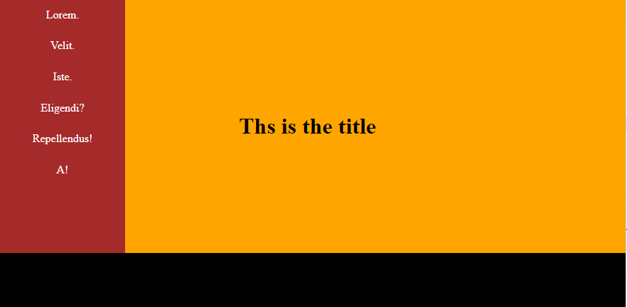
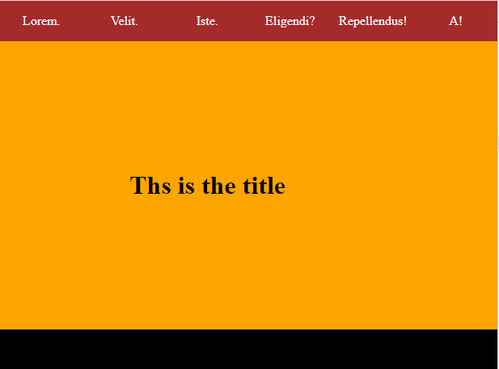
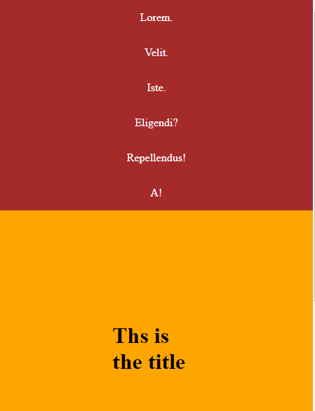
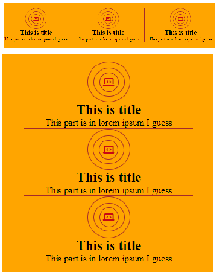
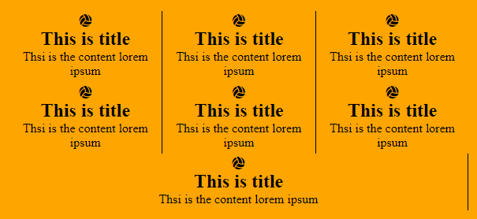
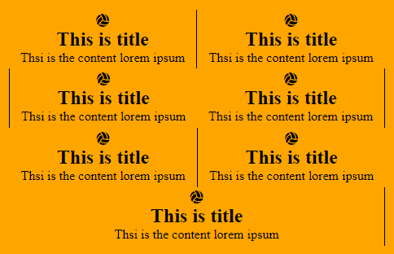
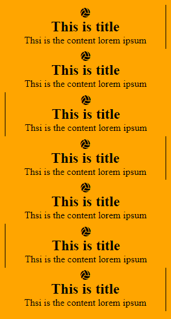
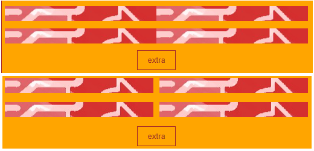
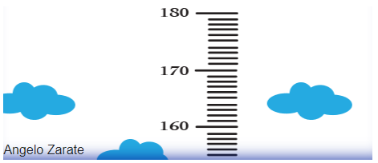
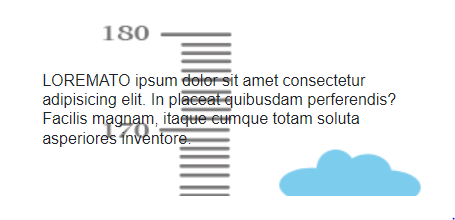

# CSS 2

[Image gallery and Carousel](css-2.md#image-galleries-and-carousels)

* [Dropdown and Hover effects](css-2.md#dropdown-and-hover-on-navbars)

### Flex and page layout

The **Flex**box layout justifies and aligns items within its container, while flex child elements **dynamically** expand their width to **fill**.



To justify/align any element we need to use **display:flex each time**, also position will follow the HTML layout:&#x20;

```
//The height will be given by the content
<div class="contiene">
    <div class="sidebar">

    </div>
    <div class="stuff">

    </div>
</div>
<div class="footer">

</div>

```

In the CSS we use **Flex** to dynamically set the **width** of each div:

```
//Flex-direction is row by default
.contiene{
    display: flex;
}

//1/5 of flex for sidebar while 4/5 for stuff
.contiene .sidebar{
    flex: 1;
    background-color: brown;
}

.contiene .stuff{
    display: flex;
    flex: 4;
    justify-content: center;
    background-color: orange;
}

//while footer can just be
.footer{
    display: flex;
    background-color: black;
}

```

<figure><figcaption><p>full page flex layout</p></figcaption></figure>



We use **flex-direction column** for the navbar to be on the top, and use **flex to change the list** direction:

```
//from default row to column direction
.contiene{
    flex-direction: column;
}

//The list is now flex-direction row
.contiene .sidebar ul{
    display: flex;
}

```

<figure><figcaption><p>smaller page layout</p></figcaption></figure>



For smaller screens we just set the navbar as column **on column flex container**:

```
//we need to use display: flex for it to work
.contiene .sidebar ul{
  display: flex;
  flex-direction: column;
}

```

<figure><figcaption><p>mobile pae layout</p></figcaption></figure>



We can use **inline-flex** to use flex only on a text element width:

<details>

<summary>Inline-flex, triple border and limited border guide </summary>

We use font-awesome icons \<i> that work as text:

```
<ul class="trino">
  <li>
    <i class="fas fa-laptop-code"></i>
    ...
  </li>
  <li>
    <i class="fas fa-laptop-code"></i>
    ...
  </li>
  <li>
    <i class="fas fa-laptop-code"></i>
    ...
  </li>
</ul>

```

We use **inline-flex** to have the border circle **only the text width** and **not the entire container,** and also to use all flex properties:

```
//we need justify and align for the :before:after layers
.trino li i{
    color: #C80815;
    border: 1px brown solid;
    padding: 0.6em;
    border-radius: 100%;

    display: inline-flex;
    justify-content: center;
    align-items: center;
}

.trino li i::before{
    padding: 1em;
    border-radius: 100%;
    border: 1px brown solid;
}

.trino li i::after{
    content: "";
    position: absolute;

    padding: 1em;
    border-radius: 100%;
    border: 1px brown solid;
}

```

To get a smaller border we reduced the container:

```
.trino li:nth-child(2){
    width: 80%;
    margin: 0 auto;
    border-bottom: 2px solid brown;
}

```

</details>

<figure><figcaption><p>row and column flex layout</p></figcaption></figure>

The **flex-wrap** property sets if flex element will **fit in one line (nowrap)** or can **warp onto multiple lines,** we can use **flex with %** to set more precise for the elements.


{% tab title="Flex-wrap and 33%" %}
We don't need to create row containers, the **CSS can split** by itself.

```
//for each 3 elements we change a line
<div class="griglia">
  <div>
    <i class="fas fa-volleyball-ball"></i>
    ...
  </div>
  <div>
    <i class="fas fa-volleyball-ball"></i>
    ...
  </div>
  ...
</div>

```

We can also use **wrap-reverse** if we needed to change the order.

```
//3 for each line
.griglia{
    display: flex;
    flex-wrap: wrap;
}

.griglia div{
    flex: 33%;
    text-align: center;
}

//then we border the third and forth for the effect
.griglia div:nth-child(3n+1){
    border-right: 1px black solid;
}

.griglia div:nth-child(3n){
    border-left: 1px black solid;
}

```

<figure><figcaption><p>33% flex layout</p></figcaption></figure>


{% tab title="Flex-wrap and 50%" %}
We go from 1/3 to 1/2 of the page for the elements:

```
.griglia div{
    flex: 50%;
}

```

<figure><figcaption><p>50% flex </p></figcaption></figure>


{% tab title="Flex-wrap and 100%" %}
A single element per line:

```
.griglia div{
    flex: 100%;
}

```

<figure><figcaption><p>100% flex-wrap</p></figcaption></figure>



When using a flex-container with **multiple items** we can space them using **align-content** (different from align-items) or **gap:**

<details>

<summary>Align-content and gap guide</summary>

We have a flex-container that flex wraps,&#x20;

```
<div class="quatto">
  <div></div>
  <div></div>
  <div></div>
  <div></div>
</div>

```

We use **align-content** to space the vertical space of **multiple** flex items:

```
//each image wrapping at 40%
.quatto div{
    flex: 40%;
    height: 25px;
}

//we give space to the top/bottom using align-content, while padding is for outside
.oltre .quatto{
    display: flex;
    flex-wrap: wrap;

    align-content: space-around;
    padding: 5px;
}

```

If we want to define the **space between** the flex elements we use **gap**:

```
//it won't work with align-content
.oltre .quatto{
    display: flex;
    flex-wrap: wrap;
    
    gap: 10px;
    padding: 5px;
}

```

</details>

<figure><figcaption><p>align-content and gap </p></figcaption></figure>


## Navbar and Flex use

Check this flex-sample webpage:


Responsive flex page


For the **Sidebar** setting of the page we have:

```
<div class="contiene">
    <div class="sidenav">
    </div>
    <div class="resto">
    </div>
</div>
<div class="foot">
    <div class="fine">
        <div class="parole">
        </div>
        <ul class="fa-ul">
        </ul>
    </div>
</div>

//We separate the sidebar+content from the footer to have it cover the entire width
//we set a flex row and give the sidebar color and less space

.contiene{
    display: flex;
    flex-direction: row;
}
.sidenav{
    flex:1;
    background-color: brown;
}
.resto{
    flex: 4;
}
.sidenav ul li{
    display: flex;
    color: white;
}

//for the sidebar elements as a column we just use flex
.foot{
    display: flex;
    flex-direction: row;
    background-color: black;
    color: white
}
.fine{
    display: flex;
    flex-direction: row;
    flex: 100%;
    margin: 1em 3em;
}
.fine .parole, ul{
    flex: 1;
}

//the footer is also a row to avoid becoming an extra sidebar AND we add an additional row
//with the margins for the content of the content of the footer
```

And the @media-query for a smaller screen:

```
@media only screen and (max-width: 900px)  {
    .contiene{
        flex-direction: column;
    }
    .sidenav ul{
        display: flex;
        flex-direction: row;
        justify-content: space-around;
    }
    .fine{
        flex-direction: column;
    }
}

//for the first media-query we change the sidenav with a navbar AND changing the list
//and setting the nav elements in a single row, for the footer we just put the content as a column for space
```

And for the smallest screen we:

```
@media only screen and (max-width: 500px){
    .sidenav ul{
        flex-direction: column;
    }
    .foot{
        flex-direction: column;
    }
}

//here we give each navbar element its line and the footer adapts the other flex row it had
```

About **how to background-position the images** (both in sidebar and content), including **text**:

```
<div class="title">
    Angelo Zarate
</div>

.sidenav .title{
    background-image: url("./img.png");
    background-position: top right;
    height: 12em;
    display: flex;
    align-items: flex-end;
    box-shadow: 0px -20px 20px -20px #001f9c inset;
}

//here we have text over image, a set height space, and the flex to align the text on the bottom with align-item
//background-position= X%/Y% or left-right/top-bottom/center
//simply allows us to set the starting point of image display
//Also in case you want a precise centered text:

  position: absolute;
  top: 50%;
  left: 50%;
  transform: translate(-50%, -50%);

```

About [**Background-size**](https://www.w3schools.com/csSref/playit.asp?filename=playcss\_background-size\&preval=contain):

```
//we haven't used it much prefering width/flex 

background-size:contain;
background-size:cover; 

//contain gets and adapts the entire image in but can result in smaller or bigger result
//cover uses the entire space, considering our image was big already its not usable

```

Remember some rules for the use of **box-shadow** use:

```
//in the previous example 
box-shadow: 0px -20px 20px -20px #001f9c inset; (bottom)
            0px -20px -20px black inset; (right)
            0px 20px 20px -20px #001f9c inset; (top)
            20px 0px 20px -20px #001f9c inset; (left)
            
//we can set the side of the shadow with the X/Y position, also using inset for the intern shadow
//remember: X / Y(space)/ blur / spread and color
```



In _**alternative**_ we can also use an \:

```
//This will allow us to have more control over the background-image

<div class="demo-wrap">
    
  <div class="demo-content">
    <h1>
        Lorem ipsum dolor sit amet consectetur adipisicing elit. In 
        placeat quibusdam perferendis? Facilis magnam, itaque cumque totam 
        soluta asperiores inventore.
    </h1>
  </div>
</div>

//the css will use position relative/absolute for image/text

.demo-wrap {
    overflow: hidden;
    position: relative;
}
  
.demo-bg {
  opacity: 0.6;
  position: absolute;
  width: 100%;
}

.demo-content {
  padding: 3em;
}

```



We can also have a **fixed** image background with content and scroll:

```
//We embed the text in an image

<div class="banner">
  <div>
    <h1>This is the Reason we are here</h1>
    <button>ECCOCI</button>
  </div>
</div>

//we set fixed and cover over the 
.banner {
    background: url("https://bit.ly/3NwLCLI") 50% -7em no-repeat fixed;
  
    background-size: cover;
    height: 20em;
    margin-bottom: 3em;
}

```

.PNG>)

How to **flex** space and **style borders** on icons:

```
<ul class="ombra">
    <li>
        <i class="fas fa-laptop-code"></i>
        <h1>Icons and</h1>
        <p>
            Lorem 
        </p>
    </li>
        <li>
        <i class="fas fa-laptop-code"></i>
        <h1>Double </h1>
        <p>
            This
        </p>
    </li>
    <li>
        <i class="fas fa-laptop-code"></i>
        <h1>Border effect </h1>
        <p>
            The
        </br>
            Lorem
        </p>
    </li>
</ul>

//line of 3 elements with equal space, also </br> is to break the line
//to style the icons in li with a double border:

.ombra{
    display: flex;
    flex-direction: row;
    text-align: center;
}

.ombra li{
    flex: 1;
}

/*first border and setting the ray with padding */
.ombra i{
    border: 1px brown solid;
    padding: 0.6em;
    border-radius: 100%;
    color: #C80815;
}

//we use :before for the second layer and display inline-block
.ombra i::before{
    display: inline-block;
    padding: 1em;
    border-radius: 100%;
    border: 1px rgba(165, 42, 42, 0.6) solid;
}

//To rotate a square border you will need 2 transforms:

.square li{
    border: 1px pink solid;
    padding: 1em;
    transform: rotate(-45deg);
}

.square li i{
    transform: rotate(45deg)
}

```

Adaptive **Row** with centered text and button:

```
<div class="incluso1">
    <div class="dentro">
        
    </div>
    <div class="dentro">
        <h2>Title </h2>
        <p>
            Text on
        </p>
        <button>Buttoned </button>
    </div>
</div>

//we both need align for the text to be in the same line and the justify for space them

.incluso1{
    display: flex;
    flex-direction: row-reverse;
    align-items: center;
    justify-content: space-between;
}

.dentro{
    text-align: center;
}

.dentro img{
    width: 100%;
}

//setting width 100% will adapt it to its flex space, also for smaller screens we simply

.incluso1{
    flex-direction: column;
}
.incluso img{
    width: 50%;
}
//the width is just to leave some margin on the sides
```

&#x20;Also check the difference in **the use of flex** n/% on the grid and colorband:

```
<div class="griglia">
    <div>
        <i class="fas fa-volleyball-ball"></i>
        <h2>Using the </h2>
        <p>Lorem </p>
    </div>
</div>

//Using % on flex elements and Wrap allows us to organize rows of 3 elements styling only the li elements

.griglia{
    display: flex;
    flex-direction: row;
    flex-wrap: wrap;
}

.griglia div{
    flex: 33%;
}

//in case we want to have all elements in a line using flex:n we:

<ul class="colorato">
    <li> 
        <i class="fas fa-hamburger"></i>
        <p>Here we have the </p>
    </li>
    etc...
</ul>

.colorato{
    display: flex;
    flex-direction: row;
}

.colorato li{
    flex: 1;
}

//with this, the elements added will be kept all in the same line, for smaller screens we just flex it as columns
```

And for the style of **list** , icons, and spacing:

```
<ul class="fa-ul">
    <h2>Contacts </h2>
    <li>
        <div>
            Email
            <i class="fa-li fa-spin fas fa-spinner"></i>
        </div>
        <div>Lorem ipsum dolor sit amet. </div>
    </li>
</ul>

//We use the FA-UL to set a list with the icons and the FA-LI to set the list icon 
//and we space the icon+text from the Lorem

.fine ul li{
    display: flex;
    justify-content: space-between;
}
```

Also **to make fonts-awesome spin we use** fa-spin like up here.

For **centering**, remember that **text-align** works with images too, **justify** on flex works only when multiple elements as children and you can also use **margin:auto**.

For each flex-direction: row we **don't need** to set the children as columns.

And, that the **href=""** in the \<a> tag stops some **animation** for showing.We can use the **calc()** to calculate some properties like:

```
max-width: calc(100% - 4em);
```

we didn't need to use **overflow** for the sidebar, in case:

```
overflow: visible (lets the content exceeding visible)
          hidden  (cuts the content by the space it has)
          scroll  (adds the scroll to fit the space)
          auto    (adds scroll only if necessary on content) 
          
```

About the **CSS Reset** , in case we need to have a standard css without browser inconsistencies, for smaller projects go:

```
*,
*::before,
*::after {
  box-sizing: border-box;
  margin: 0;
  padding: 0;
}
```

But to handle bigger projects and more efficiently we use in the **CSS file**:

```
html,body,div,form,fieldset,h1,h2,h3,h4,h5,h6,p,blockquote,pre
{
    font-size: 100%;
    font-weight: normal;

    margin: 0;
    padding: 0;

    vertical-align: baseline;

    border: 0;
    outline: 0;
    background: transparent;
}

table
{
    border-spacing: 0;
    border-collapse: collapse;
}

th,
td
{
    text-align: left;
    vertical-align: top;
}

img
{
    border: 0;
}

```

### Image galleries and Carousels



In this exercise, we created multiple columns of images, we added **hover effects** for each and used CSS **counter:**

```
.completo{
    display: flex;
    counter-reset: oll;
}

.completo p::after{
    counter-increment: oll;
    content: "il " counter(oll);
}

//counter-reset is used to start the VARiable, setting the selector from which it will work 
//counter-increment is to set the repeated selector which will increase the counter
//content: its not linked to counter BUT we can use it to display the counter as text with counter(Var) 

```

For the **Zoom** effect on images:

```
.colonna img{
    width: 100%;

    z-index: 0;
    transition: transform .2s;
    mix-blend-mode: luminosity;
}

//transform is a property we use during transition
//position relative is used to overlap the Zoomed image to the others

.colonna img:hover{
    position: relative;
    transform: scale(1.5);
    mix-blend-mode: normal;
    z-index: 1;
}

//mix-blends is for the color effect with the background, transform scale is for the Zoome effect

```

And now for the **carousel structure**, we start with the carousel **window** and the **scroll** property for mobile:

```
.contenuto1{
    display: flex;
    width: 13.3em;
    height: 8em;

    overflow-x: scroll;
    overflow-y: hidden;

    scroll-behavior: smooth;
    scroll-snap-type: x mandatory;
}

//we haven't found a way to use % on the width/height
//scroll-behavior to pass smoothly between the images
//scroll-snap-type won't allow the carousel to stop midway during scroll

```

We also add some -webkit to **style the scroll**:

```
.contenuto1::-webkit-scrollbar{
    height: 8px;
}

.contenuto1::-webkit-scrollbar-thumb{
    background: chocolate;
    border-radius: 25%;
}

//we set the height of the scrollbar while thumb for color and round

```

And now we handle the images within:

```
.contenuto1 div div{
    display: flex;

    width: 100%;
    height: 100%;

    scroll-snap-align: center;
    -webkit-overflow-scrolling: touch;
}

//we don't modify the img directly
//scoll-snap-align is used to set the point of image view 
//the webkit-overflow is used on mobile view to scroll with touch

```

To navigate throught images we will use **side arrows** on each image and a list of **buttons** on the bottom:

```
<div class="contenuto1">
    <div id="eco1">
        <div>
            
        </div>

        <div class="allay">
            <a href="#eco2" class="previsto">
                <i class="fas fa-arrow-circle-left"></i>
            </a>
            <a href="#eco2" class="nexto">
                <i class="fas fa-arrow-circle-right"></i>
            </a>
        </div>
    </div>
    ...
</div>

//each button has a href to direct it to the ID card image
//we use some flex to display the arrows, we also need overflow-y to avoid the space of the buttons showing in the image

.contenuto1 div .allay{
    display: flex;
    flex-direction: row;
    justify-content: space-between;
}

//we use the space-between to space them at the sides of it

.previsto,
.nexto{
    position: relative;
    bottom: 55%;
    background-color: transparent;
    width: 1.5rem;
    height: 1.5rem;
  
    border-radius: 50%;
}

//then we just position the area of the A tag to coincide with the arrow icon from the button to have it show in the middle of the image

```

And for the **buttonbar** to jump throught images on the bottom:

```
<div class="riga">
    <div class="colato1">
        <div class="contenuto1">
        ...
        </div>
        <ul class="botonera">
            <a href="#eco1">
                <li>
                    1
                </li>
            </a>
            <a href="#eco2">
                <li>
                    2
                </li>
            </a>
        </ul>
        ...
    </div>
</div>

//it's located as a row outside the image and arrows, and to style thinks

.botonera{
    display: flex;
    flex-direction: row;
    justify-content: center;
}

.botonera li{
    background-color: brown;
    border-radius: 50%;
    margin: 0px 3px;
    padding: 0.3em 0.6em;
}

//the justify-content will work on the entire flex space, not relative to the carousel

```

And for a carousel with an entire row and **different sized** images:

```
.bigger{
    display: flex;
    justify-content: center;
}

//we needed a bigger div to position it at the center without it changing the image display

.contenuto11 div div{
    margin: 0em 2em;
    justify-content: center;
}

//we add margins to the images to have more space for smaller screens and we also need justify center 

.contenuto11 div div .rede{
    height: 38%;
    margin-top: 30%;
}

//in case of different sized images we just need to modify the height and margin-top

```

### Dropdown and Hover on navbars

The structure of the navbar is similar to the last exercise but we included **dropdown** button  and **hover** showing hidden content:

```
<nav>
    <ul class="naviga">
        <div class="lati">
            <li><a href="">Lorem.</a></li>

            <label for="cli">
                <li class="cliccare">
                    <div>
                        <a >Ipsam! </a>
                        <i class="fas fa-chevron-down"></i>   
                    </div>
                    
                    <input type="checkbox" id="cli">
                    <div class="cliccato">
                        <div><a href="">Lorem.</a></div>
                        <div><a href="">Et.</a></div>
                        <div><a href="">Similique.</a></div>
                        <div><a href="">Obcaecati.</a></div>
                        <div><a href="">In.</a></div>
                    </div>
                </li>
            </label>
        </div>
        <div class="lati">
        ...
        </div>
    </ul>
</nav>

//we have a checkbox that includes the entire LI nav element (id + for) with the label
//to display the arrow icon at the side of the LI sidenav

.cliccare{
    display: flex;
    flex-direction: column;
}

//to have the scrolled content show below the LI nav

.cliccare + div{
    flex-direction: row;
    display: flex;
}

//specifically for the LI nav and the icon
//and to avoid the checkbox to occupy space 

#cli{
    height: 0px;
    width: 0px;
}
```

To style and animate the **dropdown content** after the checkbox click:

```
.cliccato{
    position: relative;
    display: flex;
    flex-direction: column;
    height: 0em;
    padding: 0px;
    overflow: hidden;
  
    transition: 
      0.8s height linear,
      0.6s padding linear;
}

//here we are gonna animate the height and padding from 0
//position: Relative to have it occupy space on the sidebar with the others nav LI

.cliccato div a{
    text-decoration: none;
    color: white;
}

//to modify the text we have to modify the link
//to activate on click with the checkbox

#cli:checked + .cliccato, .cliccato div{
    height: 10em;
    padding: 6px;
}

//label includes the entirety of nav Li but the id="cli" has inside before the hidden content
//when clicked the height and padding gets animated

```

For the **hover** effect.

```
<li><a href="">Quibusdam!</a></li>

<li class="over">
    <div>
        <a href="" class="toover">Recusandae.</a>
    </div>
    <div class="overato">
        <div><a href="">Lorem.</a></div>
        <div><a href="">Eaque!</a></div>
        <div><a href="">Alias?</a></div>
        <div><a href="">Consectetur?</a></div>
    </div>
</li>

.overato{
    display: flex;
    flex-direction: column;
}

.overato div{
    display: none;
    background-color: rgb(206, 127, 31);
}

//a simpler structure passing from a display:none to flex

.over:hover .overato div{
    display: flex;
    padding: 10px;
}

//after hovering the nav LI with also extra padding for the elements
//Extra effect with the border before the :hover effect

.over:not(:hover) .toover{
    border-bottom: 1.2px solid wheat;
}

```

Some notes for the **Responsive**

To position Nav elements on **different sides** of the navbar we use flex

```
<nav>
    <ul class="naviga">
        <div class="lati">
            <li><a href="">Lorem.</a></li>   
                     
        </div>
        <div class="lati">
            <li><a href="">Quibusdam!</a></li>
            <li><a href="">Nisi!</a></li>

        </div>
    </ul>
</nav>

nav .naviga{
    flex-direction: row;
    justify-content: space-between;
}

//we need extra div for the flex to work and the justify content to position the nav LI

.naviga .lati{
    display: flex;
}

//this is just to display the 2 groups of NAV li as a row
```

How do the dropdown and hover content **change** with a row navbar.

```
.cliccato{
    position: absolute;
}

#cli:checked + .cliccato, .cliccato{
    margin-top: 1.3em;
    margin-left: -0.8em;
}

//we need the position:absolute to have it render outside the navbar 
//while the rest is css to center more the content 

.overato{
    position: absolute;
}
.over:hover .overato div{
    margin-left: -0.6em;
}

//basically the same with the hover content
```

The footer is almost similar to the last exercise but we removed the arrows on carousel:

```
.contenuto11 div .allay1{
    display: none;
}

//for screens so small its being used a mobile device that have already the touch scroll
```
