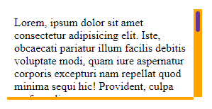
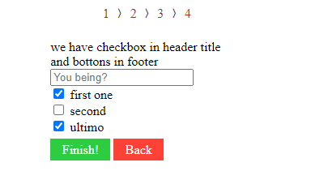

# CSS 2: Flex, flex page layout and background-image

* [CSS reset and flex navbar](css-2.md#css-reset-and-flex-navbar)
* [HTML  and Background image](css-2.md#html-less-than-img-greater-than-and-background-image)
* [CSS box-shadow](css-2.md#css-box-shadow)
* [CSS scrollbar styling](css-2.md#css-scrollbar-styling)
* [CSS form carousel](css-2.md#css-form-carousel)

### Flex and page layout

The **Flex**box layout justifies and aligns items within its container, while flex child elements expand their width to **fill it dynamically**.

```
//we still need to set height, and justify won't change how the space managed
<div class="stripe">
    <div></div>
    <div></div>
    <div></div>
    <div></div>
    <div></div>
</div>

.goleador{
    display: flex;
    height: 50px;
    flex-direction: column/ row;
}

.goleador div:nth-child(odd){
    flex: 1;
    background-color: purple;
}

.goleador div:nth-child(even){
    flex: 1;
    background-color: yellow;
}

```

<figure><figcaption><p>column and row</p></figcaption></figure>



To justify/align any element we need to use **display:flex each time**, also position will follow the HTML layout:&#x20;

```
//The height will be given by the content
<div class="contiene">
    <div class="sidebar">

    </div>
    <div class="stuff">

    </div>
</div>
<div class="footer">

</div>

```

In the CSS we use **Flex** to dynamically set the **width** of each div:

```
//Flex-direction is row by default
.contiene{
    display: flex;
}

//1/5 of flex for sidebar while 4/5 for stuff
.contiene .sidebar{
    flex: 1;
    background-color: brown;
}

.contiene .stuff{
    display: flex;
    flex: 4;
    justify-content: center;
    background-color: orange;
}

//while footer can just be
.footer{
    display: flex;
    background-color: black;
}

```

<figure><figcaption><p>full page flex layout</p></figcaption></figure>



We use **flex-direction column** for the navbar to be on the top, and use **flex to change the list** direction:

```
//from default row to column direction
.contiene{
    flex-direction: column;
}

//The list is now flex-direction row
.contiene .sidebar ul{
    display: flex;
}

```

<figure><figcaption><p>smaller page layout</p></figcaption></figure>



For smaller screens we just set the navbar as column **on column flex container**:

```
//we need to use display: flex for it to work
.contiene .sidebar ul{
  display: flex;
  flex-direction: column;
}

```

<figure><figcaption><p>mobile pae layout</p></figcaption></figure>



The values for both **justify-content** and **align-items**:

```
flex-start | flex-end | center         //left, right, center
space-between |                        //uses all the space to space the elements
space-around |                         //uses spaces for he border
stretch |                              //will stretch elements to use all the space                
baseline                               //align for baseline

```

We can use **inline-flex** to use flex only on a text element width:

<details>

<summary>Inline-flex, triple border and limited border guide </summary>

We use font-awesome icons \<i> that work as text:

```
<ul class="trino">
  <li>
    <i class="fas fa-laptop-code"></i>
    ...
  </li>
  <li>
    <i class="fas fa-laptop-code"></i>
    ...
  </li>
  <li>
    <i class="fas fa-laptop-code"></i>
    ...
  </li>
</ul>

```

We use **inline-flex** to have the border circle **only the text width** and **not the entire container,** and also to use all flex properties:

```
//we need justify and align for the :before:after layers
.trino li i{
    color: #C80815;
    border: 1px brown solid;
    padding: 0.6em;
    border-radius: 100%;

    display: inline-flex;
    justify-content: center;
    align-items: center;
}

.trino li i::before{
    padding: 1em;
    border-radius: 100%;
    border: 1px brown solid;
}

.trino li i::after{
    content: "";
    position: absolute;

    padding: 1em;
    border-radius: 100%;
    border: 1px brown solid;
}

```

To get a smaller border we reduced the container:

```
.trino li:nth-child(2){
    width: 80%;
    margin: 0 auto;
    border-bottom: 2px solid brown;
}

```

</details>

<figure><figcaption><p>row and column flex layout</p></figcaption></figure>

The **flex-wrap** property sets if flex element will **fit in one line (nowrap)** or can **warp onto multiple lines,** we can use **flex with %** to set more precise for the elements.


{% tab title="Flex-wrap and 33%" %}
We don't need to create row containers, the **CSS can split** by itself.

```
//for each 3 elements we change a line
<div class="griglia">
  <div>
    <i class="fas fa-volleyball-ball"></i>
    ...
  </div>
  <div>
    <i class="fas fa-volleyball-ball"></i>
    ...
  </div>
  ...
</div>

```

We can also use **wrap-reverse** if we needed to change the order.

```
//3 for each line
.griglia{
    display: flex;
    flex-wrap: wrap;
}

.griglia div{
    flex: 33%;
    text-align: center;
}

//then we border the third and forth for the effect
.griglia div:nth-child(3n+1){
    border-right: 1px black solid;
}

.griglia div:nth-child(3n){
    border-left: 1px black solid;
}

```

<figure><figcaption><p>33% flex layout</p></figcaption></figure>


{% tab title="Flex-wrap and 50%" %}
We go from 1/3 to 1/2 of the page for the elements:

```
.griglia div{
    flex: 50%;
}

```

<figure><figcaption><p>50% flex </p></figcaption></figure>


{% tab title="Flex-wrap and 100%" %}
A single element per line:

```
.griglia div{
    flex: 100%;
}

```

<figure><figcaption><p>100% flex-wrap</p></figcaption></figure>



When using a flex-container with **multiple items** we can space them using **align-content** (different from align-items) or **gap:**

<details>

<summary>Align-content and gap guide</summary>

We have a flex-container that flex wraps,&#x20;

```
<div class="quatto">
  <div></div>
  <div></div>
  <div></div>
  <div></div>
</div>

```

We use **align-content** to space the vertical space of **multiple** flex items:

```
//each image wrapping at 40%
.quatto div{
    flex: 40%;
    height: 25px;
}

//we give space to the top/bottom using align-content, while padding is for outside
.oltre .quatto{
    display: flex;
    flex-wrap: wrap;

    align-content: space-around;
    padding: 5px;
}

```

If we want to define the **space between** the flex elements we use **gap**:

```
//it won't work with align-content
.oltre .quatto{
    display: flex;
    flex-wrap: wrap;
    
    gap: 10px;
    padding: 5px;
}

```

</details>

<figure><figcaption><p>align-content and gap </p></figcaption></figure>

### CSS reset and flex navbar

For a **flex navbar**, we need:

```
//we create a row with 2 columns
<div class="naviga">
    <div class="col">
        <div>lorem </div>
        <div>lorem </div>
    </div>

    <div class="col">
        <div>lorem </div>
        <div>lorem </div>
        <div>lorem </div>
    </div>
</div>

//we use justify-content to space the nav-items
.naviga{
    display: flex;
    justify-content: space-between;
    background-color: orangered;
}

.naviga .col{
    display: flex;
}

.col div{
    padding: 0.6em 1em;
    color: blueviolet;
}

.col div:hover{
    color: orangered;
    background-color: blueviolet;
    cursor: pointer;
}

```

<figure><figcaption></figcaption></figure>

We use **CSS reset** to cut **default CSS styling** from the browser:

```
//Without this we would have extra borders, and the navbar wouldn't cover the page
HTML,body, div, form, fieldset, blockquote, header,h1,h2,h3
{
    font-size: 100%;
    font-weight: normal;

    margin: 0;
    padding: 0;

    vertical-align: baseline;

    border: 0;
    outline: 0;
    background: transparent;
}

img
{
    border: 0;
}

```

### HTML \ and Background image

We use the **\** tag for _**images**_, it creates a space to link the image to:

<details>

<summary>Image tag and flex order example</summary>

```
//we can use order to change the order of flex-items
<div class="vedi">
    
    
    
</div>

.vedi{
    display: flex;
    height: 115px;
}

.vedi img:nth-child(1){
    flex: 1;
    order: 2;
}
.vedi img:nth-child(1){
    flex: 2;
    order: 1;
}
.vedi img:nth-child(1){
    flex: 3;
    order: 3;
}
```

</details>

<figure><figcaption><p>&#x3C;img> with flex order</p></figcaption></figure>

**We can't use flex** for single images or absolute layers, we use **width**, then **we use flex centering** for the **img container** and the **img tag**:

```
<div class="testo">
    <div class="immaggine">
        
    </div>
    <h1>We paint</h1>
</div>

//we center the text+image container container
.testo{
    position: relative;
    display: flex;
    justify-content: center;
    align-items: center;
}

//then we set flex and width of the image container for the  tag
.testo .immaggine {
    width: 45%;
    display: flex;
    justify-content: center;
    align-items: center;
}

//THEN we set image width % 
.testo .immaggine img{
    width: 50%;
}

```

The **\ height** will be proportional to its width, we can't use % and the image container won't reduce it.

<figure><figcaption><p>flex centered img container + width% image</p></figcaption></figure>

Remember that **opacity is affected by the HTML tag order**:

```
//if we put the <h1> first it would be affected by the opacity
<div class="immaggine">
    ...
</div>
<h1>We paint</h1>

.testo .immaggine img{
    ...
    opacity: 0.5;
}

```

We can also use the **background** CSS property to style the entire element it's used in, we need a **height/width** for the background.

```
<div class="secondo">
    <div></div>
    <h1>We paint more</h1>
</div>

.secondo{
    position: relative;
    display: flex;
    justify-content: center;
    align-items: center;
}

.secondo div{
    width: 80%;
    height: 10em;
    background-image: url("https://live.staticflickr.com/65535/49197710168_014f46e3a2_w.jpg");
    background-position: center;
    background-size: cover;

    opacity: 0.6;
}

```

<figure><figcaption><p>div tag with url ackround and absolute text</p></figcaption></figure>

**Background-position** and **background-size** work similarly to how they worked with gradients, on CSS 1.

```
//position accepts X/Y values
background-position: top/left/bottom/right/%/px

//its default value is the native size of the image, auto/contain
background-size: X/Y/%
background-size: cover    //it stretches the image to occupy all the space, can crop

```

By default, a **background-image** that is smaller than the element it's in will **repeat** itself to **fill** it.

We use **background-clip** to extend it underneath its border-box, padding-box, or content-box.

<details>

<summary>backround-repeat and background-clip guide</summary>

We can set the **background-repeat** on the X/Y of the element, or not use it.

```
//it has background-repeat: repeat/ background-clip: border-box by default
.cliprepeat div{
    background-image: 
        url("https://live.staticflickr.com/65535/49197710168_014f46e3a2_w.jpg");

    width: 90%;
    border: 10px dotted black;
}

background-repeat: no-repeat            //will use the image only once
                   repeat-x/repeat-y    //will repeat only on width/height
                   space                //repeats only if available space, no clip
                   round                //repeats and stretches to not cut

```

while **background-clip**:

```
//we can use padding-box/ content-box to not include the border
.clipped div{
    background-image: url("https://live.staticflickr.com/65535/49197710168_014f46e3a2_w.jpg");
    background-repeat: no-repeat;
    background-clip: padding-box;

    width: 90%;
    border: 10px dotted black;
}

```

</details>

<figure><figcaption><p>Background.clip and background-repeat different uses</p></figcaption></figure>

We can include most properties with a **background shorthand** and put **multiple background-images** in one element.

<details>

<summary>Multiple background  and shorthand property</summary>

Any space that is not filled by the image can be filled by **background-color**:

```
.molti div{
    background: 
        lightblue 
        url("https://live.staticflickr.com/65535/49197710168_014f46e3a2_w.jpg")
        no-repeat
        right top;

    width: 80%;
}

//background can include
background-color
background-image
background-repeat
background-position
```

We can add **multiple backgrounds** to an image:

```
//remember to use , for any new backround
.altri div{
    background: 
        url("https://live.staticflickr.com/65535/52148924164_6c7a2d74af_m.jpg")
        no-repeat
        left bottom,

        url("https://live.staticflickr.com/65535/49197710168_014f46e3a2_w.jpg")
        repeat;

    width: 80%;
}

```

</details>

<figure><figcaption><p>background shorthand using multiple images and background-color</p></figcaption></figure>

We use a **fixed background-image** to have a fixed **scroll** image:

```
//The fixed navbar will remain visible, while the background will disappear on scroll
<div class="barra">
</div>
<div class="gravity">
</div>

.barra{
    position: fixed;
    top: 0;
    
    height: 3em;
    width: 100%;
    background-color: red;
}

.gravity{
    background: url("https://bit.ly/3NwLCLI") 20% 3em fixed;
    
    background-position: bottom;
    background-size: cover;
    height: 22em;
}

```

<figure><figcaption><p>fixed background-image with fixed top navbar</p></figcaption></figure>

### CSS box-shadow&#x20;

The **box-shadow** property adds **internal/external shadow** effects to an element frame.

```
//It is also affected by the border-radius
//optional inset/ X offset/ Y offset/ blur/ spread(scale)/ color

box-shadow: (inset) 20px -15px 10px 10px teal;

```

<details>

<summary>Box-shadow basic guide</summary>

&#x20;**Box-shadow** requires at least 2 values,  X/Y offset, it will be solid border/outline:

```
.flessi3 div:first-child{    
    background: url("https://live.staticflickr.com/65535/52148924164_6c7a2d74af_m.jpg");
    width: 40%;
    border-radius: 10%;

    box-shadow: 10px 15px brown;
}

```

The third value is **blur**, it pushes the shadow forward but also blurs it.

```
//the shadow covers more, but is less intense
box-shadow: 10px -15px 10px brown;

```

Then there is **spread**, which can **expand/reduce the box-shadow** from the element size:

```
//with a lower spread we keep the blur with less space
box-shadow: -10px -15px 10px -10px brown;

```

Then we can use **inset** to put the shadow **inside** the element

```
//this has the same X/Y offset of the second, inset reverses offsets
box-shadow: inset 10px -15px 10px 10px brown;

```

</details>

<figure><figcaption><p>box-shadow with different offsets/blur and spread</p></figcaption></figure>

We can also have **single-side box-shadow effects**:

<details>

<summary>Single side box-shadow guide</summary>

Box-shadow **directions are bottom/right**, on **inset** its **reversed**, also we need a **negative spread** to avoid any other side shadow from being visible:

```
//Y inset 20px would be bottom shadow, on inset it's top
box-shadow: inset 0px 20px 20px -10px green;

//negative X offset is left, but on inset is on the right
box-shadow: inset -20px 0px 20px -10px green;

//bottom inset negative X-offset
box-shadow: inset 0px -20px 20px -10px green;

//right inset box shadow
box-shadow: inset 20px 0px 20px -10px green;

```

</details>

<figure><figcaption><p>single side box-shadow inset effect</p></figcaption></figure>

### CSS scrollbar styling

We use pseudo-elements to style the **scrollbar/scrollbar-track/scrollbar-thumb**:

<details>

<summary>Scrollbar style guide</summary>

We need to set the **scroll overflow** in the container first:

```
<div class="skrull">
    <div>
        <div>
          Lorem, ipsum dolor sit amet consectetur adipisicing elit. 
          ...
        </div>
    </div>
</div>

.skrull{
    overflow-x: scroll;
    overflow-y: scroll;

    width: 30%;
    height: 8em;
}

```

The **bottom/right scrollbar** area is set by height/width:

```
//width sets the left one, while height the bottom one
.skrull::-webkit-scrollbar{
    width: 12px;
    height: 4px;
}

```

while **scrollbar-track** is the actual areas

```
.skrull::-webkit-scrollbar-track {
    background: orange;
}

```

We use **scrollbar-thumb** for the css thumb:

```
//we can't reduce it, so we use border to color with the backround
.skrull::-webkit-scrollbar-thumb{
    background-color: rebeccapurple;
    border-radius: 10px;
    border: 3px solid orange;
}

```

</details>

<figure><figcaption><p>CSS scrollbar</p></figcaption></figure>

### CSS form carousel&#x20;

We create a carousel made of form cards through radio buttons:


CSS form carousel


First, we create the **navbar** using **radio buttons:**

<details>

<summary>Radio buttons navbar guide</summary>

We create **radio buttons** with their own label:

```
//each label is linked to the radio button
<div class="contenuto">

  <input id='tabC-4' type='radio' name='tabgroupC' checked />
  <label class="salta" for="tabC-4">1</label>
  ❭
  <input id='tabC-5' type='radio' name='tabgroupC'>
  <label class="salta" for="tabC-5">2</label>
  ❭
  <input id='tabC-6' type='radio' name='tabgroupC'>
  <label class="salta" for="tabC-6">3</label>
  ❭
  <input id='tabC-7' type='radio' name='tabgroupC'>
  <label class="salta" for="tabC-7">4</label>

</div>

```

We then hide the radio buttons with CSS:

```
//We keep the buttons position 
[type=radio] {
    opacity: 0;
    width: 0;
    position: absolute;
    display: inline-block; 
}

//and then we style the labels
.salta{
    background: transparent;
    color: brown;
    padding: 0em 0.4em;
}

```

</details>

<figure><figcaption><p>radio buttons navbar</p></figcaption></figure>

Then use **CSS** to create and move the **carousel**.

<details>

<summary>CSS carousel and transition effect</summary>

Every single card is an **HTML table**:

<pre><code><strong>//We add new cards using &#x3C;td>
</strong><strong>&#x3C;div class="contenuto">
</strong>  &#x3C;table class="rigato">

      &#x3C;td>
          &#x3C;div class="cartone">
          &#x3C;header>
              &#x3C;h3 style="font-weight: bolder;">H3 in header&#x3C;/h3>
          &#x3C;/header>
          &#x3C;p>So, we have content in td and THEN card&#x3C;/p>

          &#x3C;footer>
              &#x3C;label class="botto" for="tabC-5">Agree&#x3C;/label>
          &#x3C;/footer>
          &#x3C;/div>
      &#x3C;/td>

  &#x3C;/table>
  ...
&#x3C;/div>

</code></pre>

We use **overflow** to hide the other cards and set their **table-layout** and position:

```
//we set the card container width and overflow
.contenuto{
  text-align: center;
  width: 70%;
  margin: 20px auto;
  overflow: hidden; 
}

//400% width for 4 cards, we are gonna transition using the left position
.contenuto .rigato {
  width: 400%;
  left: 0%; 

  table-layout: fixed;
  position: relative;
  transition: all 0.3s;
  margin: 10px 20px;
}

//then we set the width of the individual card
.rigato .cartone {
  margin: 10px auto;
  text-align: left;

  width: 50%;
}

```

On the CSS we give each **radio button** its specific card **transition margin:**

```
.contenuto input:nth-of-type(1):checked ~ .rigato {
  margin-left: 0%; 
}
.contenuto input:nth-of-type(2):checked ~ .rigato {
  margin-left: -100%; 
}
.contenuto input:nth-of-type(3):checked ~ .rigato {
  margin-left: -200%; 
}
.contenuto input:nth-of-type(4):checked ~ .rigato {
  margin-left: -300%; 
}

//we can use other labels that are linked to the radio buttons
<footer>
  <label class="botto" for="tabC-5">Agree</label>
</footer>

```

</details>

<figure><figcaption><p>Form card</p></figcaption></figure>
