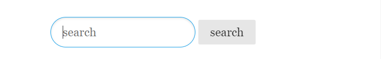
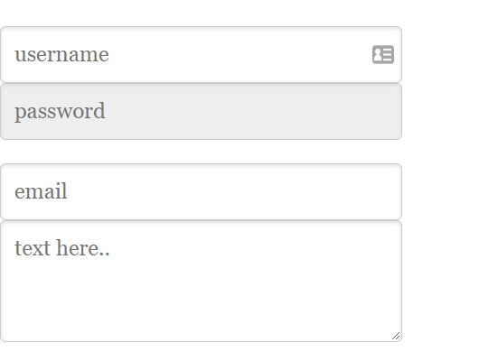
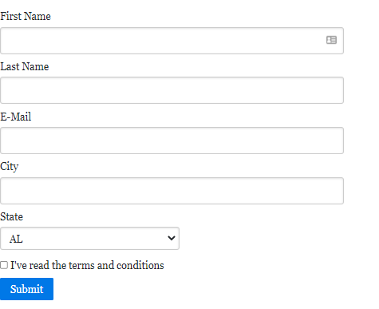
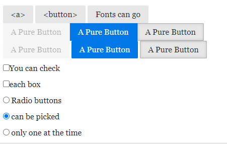
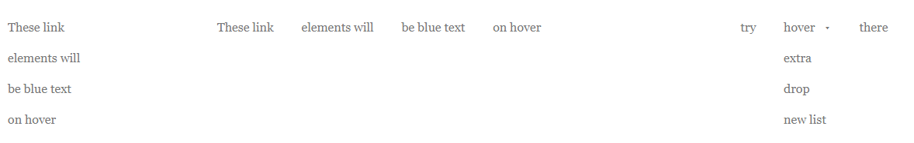

# PureCSS layout grid and menu

* [Menu and Forms](purecss-layout-grid-and-menu.md#menu-and-forms)
* [Buttons, Checkbox & Tables](purecss-layout-grid-and-menu.md#button-checkbox-and-tables)
* [Menu & Dropdowns](purecss-layout-grid-and-menu.md#menus-and-dropdowns)

**PureCSS** is a set of responsive, small (3.7kb) and mobile-focused CSS modules.

To add it we use the **unpkg** **CDN** :

```
<head>
//these 2 first are for the PureCSS and responsive grid modules
    <link rel="stylesheet" href="https://unpkg.com/purecss@2.1.0/build/pure-min.css" integrity="sha384-yHIFVG6ClnONEA5yB5DJXfW2/KC173DIQrYoZMEtBvGzmf0PKiGyNEqe9N6BNDBH" crossorigin="anonymous">
    <link rel="stylesheet" href="https://unpkg.com/purecss@2.1.0/build/grids-responsive-min.css">
    
//we also need to include minimize.css and viewpoint for the zoom 
    <link rel="stylesheet" href="https://unpkg.com/purecss@1.0.1/build/base-min.css">
    <meta name="viewport" content="width=device-width, initial-scale=1">
</head>

```

We can integrate it into our project build with **npm:**

```
//in the terminal we
$ npm install purecss --save 

//to load the project
require('purecss')

```

_**Fonts**_ can be implemented:

<pre><code><strong>//we set the font 
</strong><strong>.pure-g [class *= "pure-u"] {
</strong>  font-family: Georgia, Times, "Times New Roman", serif;
}

</code></pre>

The **responsive grid** is implemented with **pure-g** and **pure-u** classes_**:**_

```
//A pure-g(rid) parent tag, which container pure-u(nits)
<div class="pure-g">
    <div class="pure-u-1-2">
        this will be 1/2 of the screen and a 2-2 won't be the same as a 1-1
    </div>
    <div class="pure-u-1-2">
         the other 1/2, and if exceeding it will create a new line
    </div>
</div>

//for responsive we add sm/md/lg/xl/xxl to the class, as breakpoint for the unit to work
<div class="pure-g">
    <div class="pure-u-1-2 pure-u-sm-1-3">
        from 568px it will be 1/3 of the screen
    </div>
    <div class="pure-u-1-2 pure-u-sm-2-3">
         will this will be 2/3 of the screen
    </div>
</div>

```

.PNG>)

For **responsive images** we need **pure-img,** use **box-sizing** to give each element **padding** without breaking the layout:

```
//It needs to be inside a pure-g parent tag
<div class="pure-g">
    
    
    
</div>
//On screens bigger than 568px we have 1/5,1/5 and 2/5, on smaller 1/3 

//border-box directly on the images
.pure-g > img {
  box-sizing: border-box;
  padding: 1em;
  height: 50px;
}

```

Also, we can add the **hidden attribute**:

```
//It won't show the h1 element, as display: none does
<h1 hidden>NOBODY WILL NOTICE THIS </h1>

```

### Menu and forms&#x20;

We use **pure-form** and **pure-input** for the input container and the input :

```
//We use pure-input-2-3 to space the input width

<div class="pure-g">
    <div class="pure-u-1-2">
    
        <form class="pure-form pure-u-2-3">
            <input type="text" class="pure-input-2-3 pure-input-rounded" placeholder="search" >
            <button class="pure-button">try </button>
        </form>
        
    </div>
</div>

```



We can set the number of **rows on a textarea** and set **input as required,disabled** or **readonly** (can't type):

```
<form class="pure-form">
    <fieldset>
        <input class="pure-input-2-3 placeholder="username" required="">
        <input class="pure-input-2-3 placeholder="password" readonly="">
    </fieldset>
    <fieldset>
        <textarea placeholder="text here.." rows="3" id="" class="pure-input-2-3"></textarea>
    </fieldset>
</form>

```



The **pure-u** can change the **layout** of the form:

```
//let's start with the pure-g mode.

<form class="pure-form pure-form-stacked">
    <fieldset>
        <div class="pure-g">

            <div class="pure-u-1 pure-u-sm-1-3">
                <label for="multi-first-name">First Name</label>
                <input type="text" id="multi-first-name" class="pure-u-23-24" />
            </div>

            <div class="pure-u-1 pure-u-sm-1-3">
                <label for="multi-last-name">Last Name</label>
                <input type="text" id="multi-last-name" class="pure-u-23-24" />
            </div>
            <div class="pure-u-1 pure-u-sm-1-3">
                <label for="multi-email">E-Mail</label>
                <input type="email" id="multi-email" class="pure-u-23-24" required="" />
            </div>
            <div class="pure-u-1 pure-u-sm-1-3">
                <label for="multi-state">State</label>
                <select id="multi-state" class="pure-input-1-2">
                    <option>AL</option>
                    <option>CA</option>
                    <option>IL</option>
                </select>
            </div>

        </div>
//we separate the pure-g from the checkbox and submit button for them to have their own line

        <label for="multi-terms" class="pure-checkbox">
            <input type="checkbox" id="multi-terms" /> I&#x27;ve read the terms and conditions
        </label>
        <button type="submit" class="pure-button pure-button-primary">Submit</button>

    </fieldset>
</form>

```

Due to the **pure-u-1-3** or **pure-u-2-3** on the \<div>inputs we have different layouts, also we need the **pure-form-stacked** to keep the spacing for the inputs and labels**:**



.PNG>)

### Button, checkbox, and Tables

We use **pure-button** for both \<a> and \<button>:

```
//the difference between <a> and <button> will be the link hover blue color

<a href="" class="pure-button"> &#60;a&#62; </a>
<button class="pure-button"> &#60;button&#62; </button>

<button class="pure-button">
    <i class="fa fa-cog"></i>Fonts can go
</button>
//font awesome icons can go there

//we have a class for disabled/active and primary color (the only one)
<div class="pure-button-group" role="group" aria-label="...">
    <button class="pure-button pure-button-disabled">A Pure Button</button>
    <button class="pure-button pure-button-primary">A Pure Button</button>
    <button class="pure-button pure-button-active">A Pure Button</button>
</div>

//pure-button-group just reduces the spaces between buttons
<button class="pure-button pure-button-disabled">A Pure Button</button>
<button class="pure-button pure-button-primary">A Pure Button</button>
<button class="pure-button pure-button-active">A Pure Button</button>  

```



For the checkbox and radio, we need **form, label, and input**:

```
//Pure-checkbox/pure-radio and pure-form are to normalize and vertically align

<form action="" class="pure-form">
    <labels class="pure-checkbox"> 
        <input type="checkbox">You can check
    </labels>
    <labels class="pure-checkbox">
        <input type="checkbox">each box
    </labels>

    <label for="" class="" >
        <input type="radio" name="optionsRadios"/> 
        Radio buttons
    </label>
    <label for="" class="">
        <input type="radio" name="optionsRadios" checked="" /> 
        can be picked
    </label>
    <label for="checkbox-radio-option-three" class="">
        <input type="radio" id="checkbox-radio-option-three" name="optionsRadios" value="option2" /> 
        only one at the time
    </label>
</form>

//To have the radio be checked one at a time we just need NAME inside the input

```

We can style HTML **tables:**

```
//so, we use pure-table-horizontal to remove the vertical lines of the table
//we have <thead> for the first row while <tbody> with both having tROW or tDATA

<table class="pure-table pure-table-horizontal pure-u-1-2">
    <thead>
        <tr>
            <th>Table </th>
            <th>head </th>
            <th>has table </th>
            <th>rows </th>
        </tr>
    </thead>
    <tbody >
        <tr class="pure-table-odd">
            <td>Td are  </td>
            <td>while </td>
            <td>the </td>
            <td>rest </td>    
        </tr>
        <tr>
            <td>Table </td>
            <td>is on </td>
            <td>tbody </td>
            <td>ALSO </td>    
        </tr>
        <tr class="pure-table-odd">
            <td>Data </td>
            <td>we use </td>
            <td>table-odd </td>
            <td>for row color </td>    
        </tr>
    </tbody>
</table>

//for each trow we can put pure-table-odd for the gray background

```

### Menus and dropdowns

Menus are organized like lists, we can use pureCSS **pure-menu**:

```
//Organized as menu-list> menu-item> menu-link

<div class="pure-menu pure-menu-horizontal">
    <ul class="pure-menu-list ">
        <li class="pure-menu-item"> 
            <a href="" class="pure-menu-link">These link </a>
        </li>
        <li class="pure-menu-item"> 
            <a href="" class="pure-menu-link">elements will </a>
        </li>
        <li class="pure-menu-item"> 
            <a href="" class="pure-menu-link">be blue text</a>
        </li>
        <li class="pure-menu-item"> 
            <a href="" class="pure-menu-link">on hover </a>
        </li>
    </ul>
</div>

//To have it VERTICAL we just need to remove the pure-menu-horizontal
//ALSO we can have selected/disabled menu-item elements

<li class="pure-menu-item pure-menu-selected">
<li class="pure-menu-item pure-menu-disabled">

//Also for the vertical we may need css to keep it from occupying the entire space

.pure-menu{
  display: inline-block;
}

```



For the hover dropdown, we need **-menu-has-children**, **-menu-allow-hover** > **-menu-children:**

```
//we add the special classes in the parent LI element THEN the <ul> with item/link into it

<div class="pure-menu pure-menu-horizontal">
    <ul class="pure-menu-list">
        <li class="pure-menu-item">
            <a href="" class="pure-menu-link">uno</a>
        </li>

        <li class="pure-menu-item pure-menu-has-children pure-menu-allow-hover">
            <a href="" class="pure-menu-link">SCROLL </a>

            <ul class="pure-menu-children">
                <li class="pure-menu-item">
                    <a href="" class="pure-menu-link">daje</a>
                </li>
                <li class="pure-menu-item">
                    <a href="" class="pure-menu-link">daje</a>
                </li>
                <li class="pure-menu-item">
                    <a href="" class="pure-menu-link">allargato may</a>
                </li>
            </ul>
        </li>

        <li class="pure-menu-item">
            <a href="" class="pure-menu-link">fatto </a>
        </li>
    </ul>

</div>

```

We can also have **horizontal** scrollable menus with -menu-scrollable:

```
//pure-menu-horizontal will display on the width 
//while -menu-scrollable will allow the scroll for the overflow elements

<div class="pure-menu pure-menu-horizontal pure-menu-scrollable ">
    <a href="#" class="pure-menu-link pure-menu-heading">Yahoo</a>
    <ul class="pure-menu-list">
        <li class="pure-menu-item">
            <a href="#" class="pure-menu-link">SCrolling </a>
        </li>
        <li class="pure-menu-item">
            <a href="#" class="pure-menu-link">Menu </a>
        </li>
        <li class="pure-menu-item">
            <a href="#" class="pure-menu-link">On limit</a>
        </li>
        <li class="pure-menu-item">
            <a href="#" class="pure-menu-link">SPACES </a>
        </li>
        <li class="pure-menu-item">
            <a href="#" class="pure-menu-link">Finance</a>
        </li>
        <li class="pure-menu-item">
            <a href="#" class="pure-menu-link">Movies</a>
        </li>
        <li class="pure-menu-item">
            <a href="#" class="pure-menu-link">Small Business</a>
        </li>
        <li class="pure-menu-item">
            <a href="#" class="pure-menu-link">Cricket</a>
        </li>
        <li class="pure-menu-item">
            <a href="#" class="pure-menu-link">Tech</a>
        </li>
    </ul>
</div>

```


