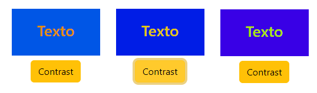

# Sass 1

* [SCSS mixin, include and extend](sass-1.md#scss-mixin-include-and-extend)
* [Export Sass to javascript and CSS color-mix()](sass-1.md#export-sass-to-javascript-and-css-color-mix)
* [Set bootstrap variables with Scss](sass-1.md#set-bootstrap-variables-with-scss)

**Sass** (**S**yntactically **A**wesome **S**tyle**S**heet) is a _CSS_-compatible **pre-processor extension**, developed in 2006.

In React, we **npm install sass** to **transpile** a sass file _into CSS_, due to the browser being unable to read sass.



**Global** and **local variables** are declared outside/inside selectors.

**Sass** variables are **imperative**, any **change** will **only** affect the **following** variables, while **CSS** variables are **declarative**, and any **change** in value will **affect** the **previous** uses **too**.

```jsx
//Sass variables can store strings/numbers/booleans/colors/lists
//Any variables will affect only the selectors below it
$primo: red;

.coral{ 
  color: $primo; 
}

.coral1{ 
  $primo: green;      //use !global to reset the global variable
  color: $primo ; 
}
```



A sass file (extension **.scss**) can **nest properties** part of a **DOM parent selector**.

```sass
.parent{
  color: white;
  background-color: black;
  padding: 3px;

  p{
    margin: 0;
    background-color: yellowgreen;
  }
  h6{
    background-color: $primo;
  }
}

//In the app.js file we import the sass file
import './App.scss';

<div>
  <div className='parent'>
    <p>Nested element </p>
    <h6>Styled with nested sass </h6>
  </div>
<div>
```



<figure><figcaption><p>sass style DOM element</p></figcaption></figure>

Sass can **nest properties names** if they start with the same word.

```sass
//for font-family, font-size and font-weight
//remember the space before {}
.nested{

  font: {
    family: Helvetica, sans-serif;
    size: 18px;
    weight: bold;
  }
}
```

We can **@import** external **sass** files, usually to **separate** the **sass variables** file from the **sass selectors** file.

```sass
//We add a _partial to the file's name to keep it from transpiring
//@import on the top of the sass file for it to have global scope

_Global.scss
$bicolor: yellow;

App.scss
@import "Global";

.exported{
    background-color: $bicolor;
}
```

### SCSS mixin, include and extend

The **@mixin** and **@include** directives **create** and **set** blocks of _sass properties_ to use on selectors.



Both **-** and **\_** are considered the **same digit** on mixin names.

```sass
//@mixin are not selectors, they can be used only with @include
@mixin bordi-y{
  border-bottom: 2px solid blue;
  border-top: 2px solid red;
}

@mixin testo{
  color: purple;
  font: {
    size: 25px; 
  }
}

.paper{
  @include bordi-y;
  @include testo;
}
```

We can also use it to **shorten vendor prefixes**.

```scss
@mixin transform($property) {
  -webkit-transform: $property;
  -ms-transform: $property;
  transform: $property;
}

.myBox {
  @include transform(rotate(20deg));
}
```



Similar to functions, **@mixin parameters** receive their values from the **@include() arguments.**

```sass
@mixin bordo($width, $color, $color1: orange ){
  border-bottom: $width solid $color;
  border-top: $width solid $color1;
}

.mix{
  @include bordo( 3px, lightblue)
}

.mix1{
  @include bordo( 6px, orange, $color1: lightblue )
}
```



<figure><figcaption><p>@mixin and @include sass</p></figcaption></figure>

The **@extend** directive passes a set of properties between selectors.

```scss
.primo{
  border-top: 3px solid green;
  border-bottom: 3px solid red;
}

//gets the .primo orders plus text
.secondo{
  @extend .primo;
  color: lightseagreen;
  font-size: 15px;
}
```

### Export Sass to javascript and CSS color-mix()

We **:export** **sass** variables to javascript:

<pre class="language-scss"><code class="lang-scss"><strong>app.scss
</strong>$giallo: yellow;
:export{
  greeno: $giallo
}

//But we can't modify it on js
App.js
import extra from'./App.scss';
console.log( extra.greeno )        //yellow
</code></pre>

The **Sass** file doesn't exist during **runtime**, so we need **CSS :root** **var**iables to change the Sass variables dynamically.

```sass
App.css
:root{
  --verde: green;
}

App.scss
$greeno: var(--verde);
.verde{
    color: $greeno;
}

//We access and edit the :root CSS variables
App.js

let r = document.querySelector(':root');
var rs = getComputedStyle(r);
console.log( rs.getPropertyValue('--verde') )      //green

r.style.setProperty('--verde', 'red');   //Or ternary theme ? "#262833" : "#fff"
```

<details>

<summary>Dynamically change a CSS property string and set it on sass.</summary>

We **can't interpolate** var(--css) variables in **Sass**.

```scss
//It will be rendered always as var(--rosso)px
App.css
:root{
  --rosso: 20;
}

App.scss
$low: var(--rosso);
.sposta{
    margin-left: $low + px;
}
```

We modify **sass variables** (passed from CSS) by editing the property **value** "**string**".

```sass
App.css
:root{
  --rosso: 20px;
}

App.scss
$left: var(--rosso);
.sposta{
    margin-left: $left ;
}

//we slice() the integer from the "px" and edit it
App.js
let basico = Number( rs.getPropertyValue('--rosso').slice(0, -2) )
basico += 10;
r.style.setProperty("--rosso", basico + "px")

//while still working as a sass variable
```

</details>

The **color-mix(in colorspace, color1 %, color2 %)** is a **CSS functional notation** to mix color values



The default percentage values are 50% and **its return value can be passed as var().**

```scss
App.css
:root{
  --base: color-mix(in srgb, green 70%, red 20%);
  --sopra: color-mix(in lch, green 20%, red 70%);
}

App.scss
$base: var(--base);
$sopra: var(--sopra);

.mac{
  background-color: $base;
  color: $sopra;
}
```



On the hsl **colorspace**, the shorter/longer **interpolation method** sets the color % on the **shorter/longer angle** of the **hsl circle**, the colors need to be in hsl() for it to work.

```scss
//hue is just a keyword
.hue{
  background-color: 
    color-mix(in hsl shorter hue, hsl(270, 100%, 50%) , hsl(115, 100%, 50%) );
  color: 
    color-mix(in hsl longer hue, hsl(270, 100%, 50%) , hsl(115, 100%, 50%) );
}

//We get the 50% mix of 2 colors and their contrast (180deg hsl difference)
```



<figure><figcaption><p>Opposite color-mix() and hsl 50% contrast colors</p></figcaption></figure>


### Set bootstrap variables with Scss

We use **Sass** to modify **npm install bootstrap** _variables_.

```scss
//The scss file has to go AFTER the bootstrap import
App.js
import 'bootstrap/dist/css/bootstrap.css';
import "./Global.scss"

Global.scss
$primary: darkred;
$secondary: lightcoral;
$success: lightgreen;

@import '~bootstrap/scss/bootstrap.scss';

//Also we can't export the global.scss to another scss to avoid slowing down the app
```

<figure><figcaption><p>custom Bootstrap.css </p></figcaption></figure>

_**Sass variables**_ are used as **fallback** values, and are converted to CSS during compilation, without the need for _CSS root{}_ properties.

We can only edit **sass variables when used in a selector**, so we use them to overwrite **bootstrap** props (after **removing** the css bootstrap import from App.js).

```sass
//We remove !important from the bootstrap properties (works only on scss)
//we also added a ID on the parent tag
$enable-important-utilities: false;
$primo: brown;

#overboot .text-primary{
  color: var(--primo, $primo);
}

#overboot .bg-primary{
  background-color: var(--primo, $primo);
}

#overboot .border-primary{
  border-color: var(--primo, $primo);
}

@import '~bootstrap/scss/bootstrap.scss';

//The scss --primo variable won't be immediately available, to use it we first: 
document.documentElement.style.setProperty("--primo", "brown")

//Then in ReactJs, we can edit it.

document.documentElement.style.getPropertyValue("--primo") == "brown" ?
document.documentElement.style.setProperty("--primo", "lightblue") :
document.documentElement.style.setProperty("--primo", "brown")

```


scss variables with js edit


<details>

<summary>Js editing bootstrap selectors with sass variables</summary>

We can var() and **calc()** sass variables on style properties.

```sass
//Like in color-mix() hsl/rgb values
//app.scss

$enable-important-utilities: false;

$dodi: 50;

#bootlock .text-secondary{
  color: color-mix(in hsl shorter hue, 
    hsla( var(--dodi, $dodi) , 100%, 45%, 1), 
    hsla( calc(var(--dodi)/2) , 100%, 45%, 1) );
}

#bootlock .bg-secondary{
  background-color: color-mix(in hsl longer hue, 
    hsla( var(--dodi, $dodi) , 100%, 45%, 1), 
    hsla( calc(var(--dodi)/2) , 100%, 45%, 1) );
}

@import '~bootstrap/scss/bootstrap.scss';
```

We need to **re-set** the sass property in the **js** for it to work.

```jsx
//A single value to keep contrast between text/background
let base = document.documentElement.style;

base.setProperty("--dodi", 50)

function contra(){
  base.setProperty("--dodi", 100);
}

<div>
  <div className="boxo bg-secondary d-flex">
    <h3 className="text-secondary">Texto</h3>
  </div>
  <button className="btn btn-warning my-2" onClick={()=> contra()}>
    Contrast
  </button>
</div>
```

</details>

<figure><figcaption><p>hsl() single sass variable colors edited on js</p></figcaption></figure>

1

1
