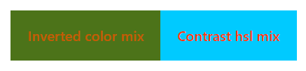
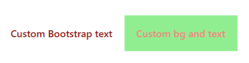

# Sass 1

* 1
* 1
* 1
* 1
* 1

**Sass** (**S**yntactically **A**wesome **S**tyle**S**heet) is a _CSS_-compatible **pre-processor extension**, developed in 2006.

In React, we **npm install sass** to **transpile** a sass file _into CSS_, due to the browser being unable to read sass.



**Global** and **local variables** are declared outside/inside selectors.

**Sass** variables are **imperative**, any **change** will **only** affect the **following** variables, while **CSS** variables are **declarative**, and any **change** in value will **affect** the **previous** uses **too**.

```
//Sass variables can store strings/numbers/booleans/colors/lists
//Any variables will affect only the selectors below it
$primo: red;

.coral{ 
  color: $primo; 
}

.coral1{ 
  $primo: green;      //use !global to reset the global variable
  color: $primo ; 
}
```



A sass file (extension **.scss**) can **nest properties** part of a **DOM parent selector**.

```sass
.parent{
  color: white;
  background-color: black;
  padding: 3px;

  p{
    margin: 0;
    background-color: yellowgreen;
  }
  h6{
    background-color: $primo;
  }
}

//In the app.js file we import the sass file
import './App.scss';

<div>
  <div className='parent'>
    <p>Nested element </p>
    <h6>Styled with nested sass </h6>
  </div>
<div>
```



<figure><figcaption><p>sass style DOM element</p></figcaption></figure>

Sass can **nest properties names** if they start with the same word.

```
//for font-family, font-size and font-weight
//remember the space before {}
.nested{

  font: {
    family: Helvetica, sans-serif;
    size: 18px;
    weight: bold;
  }
}
```

We can **@import** external **sass** files, usually to **separate** the **sass variables** file from the **sass selectors** file.

```sass
//We add a _partial to the file's name to keep it from transpiring
//@import on the top of the sass file for it to have global scope

_Global.scss
$bicolor: yellow;

App.scss
@import "Global";

.exported{
    background-color: $bicolor;
}
```

The **@mixin** and **@include** directives create blocks of sass properties to use on selectors.



Both **-** and **\_** are considered the **same digit** on mixin names.

```sass
@mixin bordi-y{
    border-bottom: 2px solid blue;
    border-top: 2px solid red;
}

@mixin testo{
  font: {
    size: 25px;
    color: purple; 
  }
}

.paper{
    @include bordi-y;
    @include testo;
}
```

We can also use it to **shorten vendor prefixes**.

```
@mixin transform($property) {
  -webkit-transform: $property;
  -ms-transform: $property;
  transform: $property;
}

.myBox {
  @include transform(rotate(20deg));
}
```



Similar to functions, **@mixin parameters** receive their own values from the **@include() arguments.**

```sass
@mixin bordo($width, $color, $color1: orange ){
  border-bottom: $width solid $color;
  border-top: $width solid $color1;
}

.mix{
  @include bordo( 3px, lightblue)
}

.mix1{
  @include bordo( 6px, orange, $color1: lightblue )
}
```



<figure><figcaption><p>@mixin and @include sass</p></figcaption></figure>

The **@extend** directive passes a set of properties between selectors.

```
.primo{
    border-top: 3px solid green;
    border-bottom: 3px solid red;
}

//gets the .primo orders plus text
.secondo{
    @extend .primo;
    color: lightseagreen;
    font-size: 15px;
}
```

We **:export** **sass** variables to javascript:

```
app.scss
$giallo: yellow;
:export{
    greeno: $giallo
}

//But we can't modify it on js
App.js
import extra from'./App.scss';
console.log( extra.greeno )        //yellow
```

The **Sass** file doesn't exist during **runtime**, so we need **CSS :root** **var**iables to change the Sass variables dynamically.

```
App.css
:root{
  --verde: green;
}

App.scss
$greeno: var(--verde);
.verde{
    color: $greeno;
}

//We access and edit the :root CSS variables
App.js

let r = document.querySelector(':root');
var rs = getComputedStyle(r);
console.log( rs.getPropertyValue('--verde') )      //green

r.style.setProperty('--verde', 'red');   //Or ternary theme ? "#262833" : "#fff"
```

<details>

<summary>Dynamically change a CSS property string and set it on sass.</summary>

We **can't interpolate** var(--css) variables in **Sass**.

```
//It will be rendered always as var(--rosso)px
App.css
:root{
  --rosso: 20;
}

App.scss
$low: var(--rosso);
.sposta{
    margin-left: $low + px;
}
```

We modify **sass variables** (passed from CSS) by editing the property **value** "**string**".

```
App.css
:root{
  --rosso: 20px;
}

App.scss
$left: var(--rosso);
.sposta{
    margin-left: $left ;
}

//we slice() the integer from the "px" and edit it
App.js
let basico = Number( rs.getPropertyValue('--rosso').slice(0, -2) )
basico += 10;
r.style.setProperty("--rosso", basico + "px")

//while still working as a sass variable
```

</details>

The **color-mix(in colorspace, color1 %, color2 %)** is a **CSS functional notation** to mix color values



The default percentage values are 50% and **its return value can be passed as var().**

```
App.css
:root{
  --base: color-mix(in srgb, green 70%, red 20%);
  --sopra: color-mix(in lch, green 20%, red 70%);
}

App.scss
$base: var(--base);
$sopra: var(--sopra);

.mac{
  background-color: $base;
  color: $sopra;
}
```



On the hsl **colorspace**, the shorter/longer **interpolation method** sets the color % on the **shorter/longer angle** of the **hsl circle**, the colors need to be in hsl() for it to work.

```
//hue is just a keyword
.hue{
  background-color: 
    color-mix(in hsl shorter hue, hsl(270, 100%, 50%) , hsl(115, 100%, 50%) );
  color: 
    color-mix(in hsl longer hue, hsl(270, 100%, 50%) , hsl(115, 100%, 50%) );
}

//We get the 50% mix of 2 colors and their contrast (180deg hsl difference)
```



<figure><figcaption><p>Opposite color-mix() and hsl 50% contrast colors</p></figcaption></figure>

We use **Sass** to modify **npm install bootstrap** _variables_.

```
//The scss file has to o AFTER the bootstrap import
App.js
import 'bootstrap/dist/css/bootstrap.css';
import "./Global.scss"

Global.scss
$primary: darkred;
$secondary: lightcoral;
$success: lightgreen;

@import '~bootstrap/scss/bootstrap.scss';

//Also we can't export the global.scss to another scss to avoid slowing down the app
```

<figure><figcaption><p>custom Bootstrap.css </p></figcaption></figure>

1

1

1
