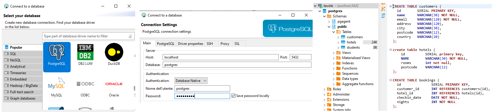

# Database 1: SQL Databases with DBeaver, SQL Scripts, and the Node-Postgres Module

* [Database integration with Node-Postgres (PG)](./#database-integration-with-node-postgres-1)
* 1

A **database** is a structured set of data, it checks **data validity** and **sets relations** between data structures. There are many **Database types**, _relational databases_ (the most used), _key/value_, _graph_, and _document databases_(called NoSQL).

**SQL**, **S**tructured **Q**uery **L**anguage, is the standard language for **relational databases**, it is used to <mark style="background-color:blue;">create</mark>, <mark style="background-color:blue;">insert</mark>, <mark style="background-color:blue;">alter</mark>, <mark style="background-color:blue;">update</mark>, and <mark style="background-color:blue;">drop</mark> database records.                                                                                                **SQL scripts** are processed by an **RDBMS**, **R**elational **D**atabase **M**anagement **S**ystem, to manage a relational database, like _PostgreSQL_.

**PostgreSQL**, an **O**bject-**R**elational **d**atabase **s**ystem, started in 1986 and _extends_ the SQL language to _store and scale_ databases.

**DBeaver** is a _SQL client software application_ and a _relational database administrative tool_, we create PostgreSQL database connections and SQL scripts to create database objects (like tables, etc).

> The **Postmaster** is PostgreSQL's main server process. It initializes new database connections by starting dedicated backend processes called '**postgres**' within RAM. These **backend processes** can execute SQL queries and retrieve data from the database's file system.
> \
> We can control the postmaster's behavior, including starting and stopping the server, using the **pg\_ctl** utility command.

### DBeaver tables and SQL script&#x20;

On DBeaver we create a **connection**-> select the **PostSQL driver**-> open the **SQL script** file (f3).             To find our tables we _schemas_-> _public_-> _tables_.

<figure><figcaption><p>Deaver database startup for the SQL scriopt</p></figcaption></figure>

In a **relational database**, data is stored in **tables** of rows and columns.

We CREATE TABLE() and set its **column** properties **name (keys)** and **data type**, **not null** for mandatory values on user rows.                                                                                                                                                       **Varchar(n)** for strings, **int** for integers, **date** for date() objects, and **boolean** for true/false values.                    The **Serial primary key** is a unique identifier for the user rows, it increments after each insert.

Check the [**composite data type section**](sql-scalar-table-data-types.md#enum-and-array) for insight into PostgreSQL table structure.

```sql
//The Varchar(n) is the max string.length(n)
//In SQL you need to select the code and execute it with crtl+enter
CREATE TABLE multi(
  id		SERIAL primary key,
  name		VARCHAR(15) not null,
  employed	boolean,
  age		int not null,
  birthday	date not null
)
```

<details>

<summary>Reference keys between tables</summary>

To avoid repeating data between related tables we **reference keys** (also called foreign keys).

We set a **data type** (most of the time ID int) and **reference** another **table** property, the referenced key will contain the entire table row.

```sql
//when selecting/executing multiple scripts, remember to use (;)
CREATE TABLE customers (
  id        SERIAL PRIMARY KEY,
  name      VARCHAR(30) NOT NULL,
  email     VARCHAR(120) NOT NULL,
  address   VARCHAR(120),
  city      VARCHAR(30),
  postcode  VARCHAR(12),
  country   VARCHAR(20)
);

//The customer int ID row == bookings.customer_id
CREATE TABLE bookings (
  id               SERIAL PRIMARY KEY,
  customer_id      INT REFERENCES customers(id),
  hotel_id         INT REFERENCES hotels(id),
  checkin_date     DATE NOT NULL,
  nights           INT NOT NULL
);
```

To **insert** values in a **table** with **referenced keys** we:

```sql
//we are basically creating an expanded row with added column
insert into bookings 
( customer_id, hotel_id, checkin_date, nights) 
values 
( 1, 1, '10/4/2010', 5 )
```

</details>

<figure><figcaption><p>Reference keys on different tables</p></figcaption></figure>

To add a row we **Insert into table\_name() Values()**.

```sql
//We use -- to comment in a SQL file, any inserted string needs ''
//to add multiple values use (,)
//Table keys and inserted values need to be the same number

INSERT INTO hotels (name, rooms, postcode)
VALUES 
('Triple Point Hotel', 10, 'CM194JS'),
('The 2-star palace', 7, 'AW124T5');
```

<details>

<summary>Decimal values on SQL tables keys</summary>

SQL tables can store **decimal numbers** using data types like FLOAT, NUMERIC, and DECIMAL.

**NUMERIC** and **DECIMAL** store exact decimal values using the (precision, scale) arguments. Precision defines the max number of digits , while scale defines the number of digits after the decimal point. The maximum representable value is related to 10^(precision - scale).

FLOAT stores decimals values of any length, but the stored value will be approximation in order to save storage data.

```sql
create table decima(
  id	  SERIAL primary key,
  name	  VARCHAR(15) not null,
  age	  NUMERIC(4, 3),
  numero  FLOAT,
  alto    DECIMAL(5, 3),
  mezzo   NUMERIC(3, 3)
)

//The Integer part allowed in the digits will be (precision-scale)
insert into decima (name, age, numero, alto, mezzo) 
       values ('matteo', 1.224, 101.101, 92.292, 0.123)
insert into decima (name, age, numero, alto, mezzo) 
       values ('matteo', 1.2, 101.101, 92.2, 0.1)

//PostSQL overflow errors if
//The integer part overflows even if digits are below the precision value
insert into decima (name, age, numero, alto, mezzo) 
       values ('matteo', 11.2, 101, 92.2, 0.1)
//Same with DECIMAL
insert into decima (name, age, numero, alto, mezzo) 
       values ('matteo', 1.2, 101.101, 923.2, 0.1)
//When precision = scale then the integer can be only 0
insert into decima (name, age, numero, alto, mezzo) 
       values ('matteo', 1.2, 101.101, 92.2, 1.9)
```

</details>

For _logical operations_ use **'='** instead of '=='.

We use **select from** to see Tables' **data**, and we can add logical operators.

```sql
//* selects every column, WHERE used for keys conditions
Select * from customers 
select name, email from customers 
SELECT * FROM hotels WHERE rooms > 7;
SELECT * FROM bookings WHERE checkin_date > '2019/10/01' AND nights >= 2;
SELECT * FROM hotels WHERE name='Royal Cosmos Hotel' OR rooms > 10;
```

<details>

<summary>More Select options and matching pattern table %strings%</summary>

**ORDER** the table rows based on columns.

```sql
//crescent order is the default unless you use DESC
select * from varietas order by anni
select * from varietas order by anni DESC
```

We **Limit** the _number of rows_ selected or their **key values**.

```sql
//We limit the select rows returned
select * from varietas limit 4

//select the rows with id= (1, 3, 5, 6)
select * from varietas where id in (1, 3, 5, 6)

//will work if multiple rows have same column value
select * from varietas where anni in ('22')
```

We select **query** elements by **pattern matching** using **like %**.

```sql
//At the end when matching the first digits of a string
//at the end when matching the last digits of a string
//On both ends when matching any digits inside a string
//doesn't work on int
select * from varietas where name like 'b%'
select * from varietas where name like '%man'
select * from varietas where name like '%in%'
```

</details>

**Alter table** and **Update** are used to modify the **table's keys** and row **properties** respectively.                When **updat**ing any _not-included_ **key** will use its old values.

```sql
//a new date_of_birth column was added to the customer's table,
//it will be empty for every pre-existing row
ALTER TABLE customers ADD COLUMN date_of_birth DATE;

//The night's property on the bookings table will be set at 25 
//if id and customer_id are 1
update bookings set nights=25 where id= 1 and customer_id= 1
```

<details>

<summary>More Alter columns SQL scripts</summary>

**Alter table** can include more table operations, like **drop column**.

```sql
alter table multi drop column employed
```

**Rename** to change the name of the table.

```sql
alter table multi rename to varietas
```

**Rename column** to change a column's name.

```sql
alter table varietas rename column age to anni;
```

We can "**drop**" the **not null** constraint from keys and **change** their **data type**.

```sql
//The key drops or can become mandatory in each INSERT
alter table varietas alter column birthday drop not null/set not null

//Will work only if the previous column elements are convertible
//(int -> Varchar()) will work (varchar() to int) won't
alter table varietas alter column anni type VARCHAR(5)
```

</details>

You can return the **alter** rows by adding **returning**:

```sql
//It returns all columns of the alter row
update varietas set numba=12311 where name='lory' returning *;
```

**INNER** joins multiple **table columns**, we use **(.)** to access a _table property_ and add logical operators, we can select columns from **multiple tables**, as long as we JOIN them.

```sql
//We JOIN the customers and bookings columns when their properties are the same
SELECT * FROM customers INNER JOIN bookings ON customers.id = bookings.customer_id;

//A select made of columns from different tables, with condition
//remember to use the FROM table as the second element in any logical operation
SELECT bookings.checkin_date, customers.name, hotels.name FROM bookings
INNER JOIN customers ON customers.id=bookings.customer_id
INNER JOIN hotels ON hotels.id=bookings.hotel_id
WHERE customers.id=1;
```

**DROP** and **DELETE** to remove _tables_ and _rows_ respectively:

```sql
//To remove a table
table drop varietas

//delete a row with condition
delete from varietas where id=4;                                 
```

1
