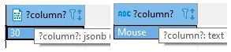

# SQL table Data Types

* 1
* 1
* 1
* 1

**Data types** in PostgreSQL define the data format within table column.

```jsx
//Data types within column definition
TEXT and CHAR(n), VARCHAR(n):        text based types, 
DATE, TIME, TIMESTAMP, and INTERVAL: include date and time types
JSON:                                for semi structured data, 
INT, REAL:                           for numeric types and
ENUM, ARRAY:                         specialized types
```

The **TEXT**, **CHAR(n),** and **VARCHAR(n)** data types store **string** values in table columns.
\
TEXT allows strings of any **length**. While both CHAR(n) and VARCHAR(n) set a **maximum n** length.
\
The CHAR(n) is also a **fixed-length** type, it will pad the end of the string with trailing spaces in order to mantain its specified length.

```sql
//CHAR and VARCHAR without (n) will be treated as CHAR(1) and TEXT respectively.
CREATE TABLE resorce (
    primo   CHAR(20), secondo VARCHAR(20), terzo   TEXT
);

insert into resorce(primo, secondo, terzo) 
values (' accidenti ', ' accidenti ', ' accidenti ');
//(" accidenti              "," accidenti "," accidenti ")
```


The **||** operator concatenates string values, with the return string converted to TEXT regardless of the data types being used.
\
The **substring()** function returns a segment of a string, starting at the FROM index and continuing for the FOR length.
\
The **replace()** function searches each string in a column for a specified substring and replaces all occurrences with a given new string.

```sql
//We can concatenate different data types.
select (text 'prima ' || ' e ' || 211 );    //TEXT "prima  e 211" 

//We can concatenate string values from columns.
SELECT nome || ' ' || titolo as new_sting FROM parole;

//The strings follow the 1-index rule, like the arrays
select substring('parola'::text from 1 for 3);      //par
SELECT substring(nome FROM 1 FOR 5) FROM parole;    //It selects from table columns

//It can either be a specific column or a stirng value, it replaces the substring
select replace('mottura'::text, 'ttu', 'lla' ); //mollara
SELECT replace(nome, 'pre', 'post') FROM parole where id=2;
```

The **INTERVAL** data type represents a time _duration_, which allows adding and subtracting intervals from date and time values.
\
The standard format for an interval value is **years-months days hours:minutes:seconds**, with the hyphen(-) specifically separating years and months.

```sql
//It is not affected by time zones
//We can use either numerical and string values, singular or plural.
create table inte(
    id serial primary key, numero INTERVAL
);

INSERT INTO inte (numero) 
    VALUES ('47'); //single values seconds by default
    VALUES ('12:50');  //Hours and Minutes
    VALUES ('00:21:47');   //necessary 00 for Minutes and Seconds
    VALUES ('21 minutes 47');  //String interval integration

    VALUES ('2 12:12:50');    //Days value
    VALUES ('1 2 12:12:50');   //error, Year required for month int value
    VALUES ('0-1 2 12:12:50');  //correct only month interval value
    VALUES ('1 months 12:12:50'); //stirng intervals can skip element
```

The **justify\_interval** function converts intervals and **interval operations** that exceed their time unit limit.

> The normalized intervals will be more context-dependent than purely arithmetic.
>
> * The **hours-days** and **days-months** (30 days) overflows are more common and standardized conversions.
> * The **months-years** convertion isn't standardized, the number of months in a year can be context-dependants (like in accounting systems).
> * The **seconds-minutes** and **minutes-hours** follow fixed rules and don't typically require justification.

```sql
//Type casting not needed if no operations
select justify_interval('0-1 20 100:20:20');  -- 1 mon 24 days 04:20:20
select justify_interval('2 days 10:90:69');   -- error outide the allowed interval
select justify_interval('0-1 50 10:12:12');   -- 2 mons 20 days 10:12:12

insert into inte(numero) values 
    ('99:59:59' - '10:00:00');                      -- error, type casting necessary
    (interval '99:59:59' - '10 hours 10 seconds');  -- 89:59:49
    ('99:59:59'::interval - '10 hours 10' );        -- 89:59:49

//The justify_interval converts literal/integer string results
select tempo, justify_interval(tempo) as new_value from lista where id=2; 
-- numero       new_value
-- 89:59:49     3 days 17:59:49

//INTERVAL operations on TIME values return TIME.
SELECT TIME '12:30:00' + INTERVAL '30 minutes' AS new_time;     //13:00:00
```

The **JSON** and **JSONB** data types store and manipulate JSON data in the table rows.
\
JSON mantains its original plain text format, while JSONB store data in a **decomposed binary** format, which enhances query performance and storage efficiency.


PostgreSQL validates any JSON data inserted into a JSONB column, converting it to an internal binary format. Upon retrieval, this format is automatically converted back to a JSON literal; the binary representation is for **internal use** only.

```sql
//JSONB supports GIN indexing 
//JSONB also removes any unnecessary whitespace and orders the keys
create table basico(
    id SERIAL primary key,
    parte JSONB
);

insert into basico(parte) values 
('{"name": "Alice", "age": 30, "city": "New York"}'),
('{"products": [{"id": 1, "name": "Laptop"}, {"id": 2, "name": "Mouse"}]}');
```

The '**->**' operator retrieves the JSON value associated with the selected key, preserving its original type.

```sql
//->> will return the string-converted value
//For nested JSON we repeat -> for each layer, using the index to access arrays values
SELECT parte -> 'numero' FROM basico where id = 1;  //30 jsonb 
SELECT parte -> 'products' -> 1 ->> 'name' FROM basico where id = 2;  //Mouse text

//The #> operator extracts JSON values based on a specified path.
//And #>> returns the value as string.
select parte #> '{numero}' from basico where id = 1;    //30 jsonb 
select parte #>> '{products,1,numero}' from basico where id = 2;    //'67' text
```

<figure><figcaption><p>Different data types on JSON select</p></figcaption></figure>

The **@>** operator checks if a JSON object contains a specified subset.

```sql
//While the <@ to check if its contained within another
SELECT * FROM basico WHERE parte @> '{"city": "New York"}';
SELECT * FROM basico WHERE '{"city": "New York"}' <@ parte;
```

The **?** operator checks if a single key exists at the _top level_ of a JSON object and returns the matching JSON object.

```sql
//Can't access nested objects, can return multiple rows
SELECT * FROM basico WHERE parte ? 'numero';    //{..., "numero": 30}
```

The **?|** operator returns rows where any string from the array exists as a top-level key in the JSON.

```sql
//It can return multiple objects, can't access nested objects
select * from basico where torta ?| ARRAY['name', 'chiavi'];  //{"name": "Alice", ...}
```

The **&?** operator returns rows where all keys from the array exist as top-level keys in the JSON.

```sql
//It can return multiple objects, can't access nested objects
select * from basico where torta ?& ARRAY['name', 'chiavi'];  //none
select * from basico where torta ?& ARRAY['name', 'city'];    //{"name":"Alice", ...}.
```

The **REAL** data type stores floating-point and scientific notation values with _approximate precision_.

```sql
//REAL stores data in 4 bytes instead of the 8 of FLOAT
//Can be used fo exponential values or pi()
create table basico(
    id SERIAL primary key,
    numa    REAL
);

insert into basico(numa) values (12.999);
insert into basico(numa) values (1.0e6);
insert into basico(numa) values (1.6E+19);
insert into basico(numa) values ( pi() );
```

The **ENUM** custom data type defines a **set** of allowed values for a table column.
\
It cannot be defined directly in a column definition; we must **CREATE TYPE** it outside the table.&#x20;

PostgreSQL stores ENUM values _internally_ as small **integers**. The **pg\_enum** system catalog maps the integers to theirs ENUM values during queries.

We can add new ENUM values using ALTER TYPE, but we cannot remove or rename existing values, nor change their order.

```sql
//The ENUM order will affect its values sorting and comparison operations
CREATE TYPE status AS ENUM ('primo', 'secondo', 'terzo', 'quarto');
DROP TYPE status; //It won't remove automatically on table delete

CREATE TABLE users (
    id SERIAL PRIMARY KEY,
    username TEXT NOT NULL,
    account_status status 
);

//We can only add column values from the ENUM 
INSERT INTO users (username, account_status) VALUES ('Alice', 'primo'); //secondo, ...

//error: non ENUM value being added
INSERT INTO users (username, account_status) VALUES ('yanico', 'sesto');   

//The BEFORE, AFTER clauses set the position of new ENUM values
ALTER TYPE status ADD VALUE 'quinto' AFTER 'quarto';        //('quarto', 'quinto')
ALTER TYPE status ADD VALUE 'semisecondo' BEFORE 'terzo';   //('semisecondo', 'terzo')
INSERT INTO users (username, account_status) VALUES ('Alice', 'quinto');
INSERT INTO users (username, account_status) VALUES ('Alice', 'semisecond');

//Operations on ENUM values will be based on their set positions
select * from users where account_status < 'terzo'; //{'primo','secondo','semisecond'}
select * from users where account_status > 'terzo'; // {'quarto', 'quinto'}
```

The **ARRAY** data type stores an ordered collection of elements ofthe same data type within a single column.

We define arrays columns using their **data type** and dimention level, we **INSERT** array values as **{}** strings or using the **ARRAY** constructor.

In the current PostgreSQL implementation, the database will not strictly enforce the declared array dimension at runtime; it's mainly for user documentation.

```sql
//All arrays will be considered as one-dimention internally
//Nested array elements must contain the same number of elements
CREATE TABLE resorce (
    id SERIAL PRIMARY KEY,
    lista   INT[2], testo   VARCHAR(5)[]
);

//Error, different nested array elements and above 5-digit string
insert into resorce(lista, TESTO) values ('{{12, 12}, {45}}', '{"ridotto"}');

//Null can be used to mantain the same number of elements in nested arrays
insert into resorce(lista, testo) values 
	( '{{12, 12}, {34, 67}}', ARRAY['List', 'minna'] );
	( '{12, null, 99}', ARRAY['basic'] ); 			-- {12,,99}
	( ARRAY[[33, 33], [null, 43] ], '{pent, ball, prin}' ); --[, 43]

//The PostgreSQL arrays use 1-based indexing for retrieving data.
select testo from resorce where id = 1;         --{List,minna}
select testo[1] from resorce where id = 1;      --List
select lista[1][1] from resorce where id = 1;   --12
```

Array **columns** can convert compatible array data during their **INSERT** operations.
\
**Arrays literals** declared outside a column definition need to be type-casted to be recognized as arrays.

— Array operations in PostgreSQL require identical data types; TEXT\[] and VARCHAR\[] arrays, both containing string literals values, will be treated as different types.
\
For arrays defined with curly braces {}, the PostgreSQL parser performs implicit conversions. It infers and adjusts the array data to match the target column.

— The ARRAY\[] constructor interprets its string literals TEXT by default and do not convert their data based on the target column.
\
Explicit type casting is needed to convert TEXT arrays to the target column's data type. This is particularly useful in complex table structures.

The **\[ : ]** syntax can slice an array section, with both ends being **inclusive**.

```sql
//On multi-dimentional arrays, it wil only slice the outmost array elements
//Empty array bounds are by default infinite, [:] will return the entire array 
INSERT INTO resorce (id, testo, lista) VALUES 
    (3, '{551,"corto", 12, 62, "cinque"}', '{{"12", 5}, {8, 20}}');

select testo[4:] from intero where id = 3;  -- {62,cinque}
SELECT (ARRAY[1, 2, 3, 45, 4])[3:];         -- {3,45,4}
SELECT ('{12, 34, 56, 67}'::int[])[:2];     -- {12,34}
select ('{{{12, 34}, {56, 67}, {null, 99}}}'::int[])[:2];  --{{{12,34},{56,67},{,99}}}
```

PostgreSQL applies the **immutable** principle to its functions and operators.
\
PostgreSQL's built-in **array functions** return new array values, requiring the **UPDATE** command to modify the corresponding table column data.
\
The **array\_append()** function appends a specified element to the end of the array.

```sql
//It doesn't support multi dimentional arrays.
//Will append to each array in the rows if not specified. 
select array_append(testo, 'ultimo') from resorce;  //{corto,min1,ultimo},{...,ultimo}
update resorce set testo = array_append(testo, 'speci') where id = 1;  
```

The **array\_remove()** function returns a new array with the specified element removed.

```sql
//It doesn't support multi-dimantional arrays
select array_remove('{12, 145, 12}', 12);   -- {145}

insert into resorce(id, testo) VALUES (1, '{uno, due , bindolo}');
update resorce set testo = array_remove(testo, 'bindolo')  where id = 1;  -- {uno,due}
```

The **array\_length()** function returns the length its array argument, based on the specified dimension level.

```sql
//Both arguments are required
//It returns the lengths of the arrays contained in the testo columns
select array_length(testo, 1) from resorce;     //1, 1, 2
select array_length(array[ [12, 55], [null, 32], [99, null] ], 2);  //2
```

The **containment** operator **@>** checks if the first array contains all elements of the second array.
\
It ignores duplicates, meaning ARRAY\[1] and ARRAY\[1, 1] are considered equivalent.

```sql
//We add [] to specify the array datatype
insert into resorce(lista, TESTO) values ( '{{12, 12}}', '{"min"}' );
insert into resorce(lista, TESTO) values ( '{{92, 12}}', '{"min1"}' );

SELECT * from resorce where testo @> ARRAY['min1', 'min1']::VARCHAR(5)[];  
//{out,corto,min1}

SELECT * from resorce where lista  @> ARRAY[12, 12]; //{{12,12}, ...}, {{99,12}, ...}
SELECT * from resorce where lista  @> ARRAY[12];    //{{12,12}, ...}, {{99,12}, ...}
```

The **ANY** keyword functions as a **quantifier**, modifying a _comparison operation_ to allow a single value to be compared to each element within an **array**.

```sql
//it returns true if ANY element satisfies the comparison operation.
create table doppio(
    id  serial primary key,
    serie   INT[], numeri  INT
)

//Symilar to how WHERE compares to single values
INSERT into doppio (serie) VALUES (array[101, 12]), (array[12]);
insert into doppio (numeri) values (101), (12);

//It returns the entire array
select * from doppio where 30 > any (serie);    //{12}, {101, 12}
select * from doppio where 30 > numeri;     //12

select 4 = any (array[1, 2, 3, 4, 5]);  //true, an element within the array is = 4
```


The ANY keyword must be placed on the **right side** of the comparison operator. On the left side, it is treated as a function, resulting in an invalid comparison.

```sql
//Different ways to return the "NOT equal to" value from an array.
SELECT * FROM doppio WHERE 23 <> any (serie); 
SELECT * FROM doppio WHERE 23 != any (serie); 
SELECT * FROM doppio WHERE NOT (23 = ANY (serie));
```

Both **ANY** and **IN** compare a value against a series of values:
\
\- ANY works directly with array **literals** and **table array** columns, enabling element-wise comparisons,
\
\- IN is designed for explicit comma-separated value **sets** and **subqueries**, requiring UNNEST for table arrays.

```sql
//We could UNNEST an array, using a temporary table and column
SELECT 4 = ANY ('{1, 2, 3, 4, 5}'::INT[]);    //true
select 4 in (1, 2,3, 4, 5);        //true

SELECT 4 IN (SELECT unnest FROM UNNEST('{1, 2, 3, 4, 5}'::INT[]) AS t(unnest));

//Subqueries return result list, compatible with both ANY and IN
SELECT * FROM numeri
WHERE column1 IN (SELECT column2 FROM table2 WHERE condition);

SELECT * FROM table1
WHERE column1 = ANY (SELECT column2 FROM table2 WHERE condition);
```

The `&&` logical operator returns `true` if the compared **arrays** have any elements **overlapping**.&#x20;

```sql
//It doesn't work on subqueries
CREATE TABLE numeri (
    employee_id SERIAL PRIMARY KEY,
    schedule INT[]
);

INSERT into doppio (serie) VALUES (array[101]), (array[12]), (array[23]);
select * from doppio where ARRAY[30, 12] && serie;  //{12}

select ARRAY[1, 2, 3] && ARRAY[2, 4, 5];    //true
```

The **ALL** keyword is a quantifier that compares a value to every element of an array, returning true only if all comparisons are true. It works on subqueries.

```sql
//Not suited for multi-dimantional arrays unless UNNEST
//ALL needs to be set in the right side, like ANY.
create table doppio(
    serie   INT[];
)

//If 50 is > than all elements in the table array columns
INSERT into doppio (serie) VALUES (array[12, 45]), (array[56, 12]);
select * from doppio where 50 > ALL(serie); //{12,45}

//10 is not equal to than ALL array elements
SELECT 10 != ALL (ARRAY[5, 8, 2, 5]);   //true
```

The **EXISTS** operator is a logical operator that requires a subquery as its operand.
\
It is used in the WHERE clause to specify which rows the main query will process, and returns **true** if its subquery returns at least one row.

We **correlate** the outer query with the subquery by using a variable.
\
This allows the EXISTS condition to evaluate each row of the outer query against related data in the subquery.

```sql
//The subquery correlates to the current outher query column for each row it executes.
CREATE TABLE departments (
    depid   SERIAL PRIMARY KEY,
    depname VARCHAR(100)
);

CREATE TABLE employees (
    empid   SERIAL PRIMARY KEY,
    empname VARCHAR(100), empjob  TEXT
);

insert into departments(depname) values ('human'), ('info'), ('market');

insert into employees(empname, empjob) values
('lowrence', 'market'), ('mike', 'bus'), ('dory', 'walk');

SELECT empname FROM employees AS emp
WHERE EXISTS (
    SELECT 1
    FROM departments AS dept
    WHERE emp.empjob = dept.depname
);
//lowrence
```

Both **IN** and **JOIN** can perform similar operations to EXISTS, but they require the complete evaluation of the subquery or a table join. While EXISTS stops evaluation at the first match, avoiding full table scans.

<details>

<summary>JOIN and IN on conditional query returns.</summary>

The **JOIN** operator combines rows from two tables based on a matching condition.
\
It creates a direct relationship between columns at the same **query level**, unlike the EXISTS subquery correlation.

```sql
//It processes the entire page
//The matchign colummn and teh SELECT column can be different (empname/empjob)
SELECT emp.empname 
FROM employees AS emp
JOIN departments AS dept ON emp.empjob = dept.depname;
```

The **IN** operator returns the rows that match any of the values returned by its subquery.

```sql
//It processes the entire subquery table for each outher query
SELECT empname
FROM employees AS emp
WHERE empjob IN (SELECT depname FROM departments);
```

</details>

The EXISTS operator offers advantages when dealing with large tables correlated to smaller ones,
\
as it can terminate comparisons faster than processing the entire table.

```sql
//We create and populate the table with a large number of values
CREATE TABLE large_customers (
    customer_id SERIAL PRIMARY KEY,
    customer_name VARCHAR(100)
);

//The generate_series() creates a series of unique values for the table
//It is not compatible with INSERT, it returns an unique series instead of being a multiple series of VALUES.
//The SELECT takes data and insertes it into the table
INSERT INTO large_customers (customer_name)
SELECT 'Customer ' || generate_series(1, 1000);

-- we create a smaller table with the same ID as the big one, but with less elements

//We create a smaller table that references the ID values form the largests.
CREATE TABLE customers_with_orders (
    customer_id INT REFERENCES large_customers(customer_id)
);

-- Populate with some customers who have placed orders

//We fill the table with 1/100 of the larget table values,  
INSERT INTO customers_with_orders (customer_id)
SELECT customer_id
FROM large_customers
WHERE customer_id % 100 = 0;

-- Query using EXISTS (efficient)

//The query will return the correlated values faster thna IN and JOIN
SELECT customer_name
FROM large_customers c
WHERE EXISTS (
    SELECT 1
    FROM customers_with_orders o
    WHERE o.customer_id = c.customer_id
);
```

1

1

1

1

1

1

1

1
