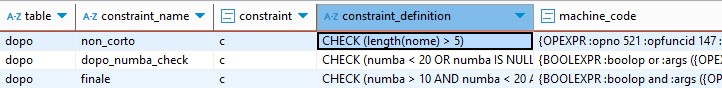

# Database 2: SQL constraints

* 1
* 1
* 1

**Constraints** are declarative rules applied to PostgreSQL table **columns**, designed to enforce data integrity.
&#x20;They will return an error and prevent any data modification that violates the constraint rules.

The DEFAULT constraint **automatically assigns** a specified value to a column during row insertion if no explicit value is provided for that column.

```sql
//The default value needs to be compatible with the table column its in.
//It can be either a literal value or a built-in function return value.
create table multi(
  id        SERIAL primary key,
  name      VARCHAR(15) not null,
  employed  boolean default false,
  tempo     TIME default now(),
  lista     INT[] default array[12, 25]
)

insert into multi (name) values ('jeff');
select * from multi;    //{jeff, false, 16:43:35, [12, 25]}
```

The CHECK constraint applies a SQL **boolean expression** to each value in its column to ensure data validity.

**Table-level** constraints define conditions that include multiple columns, we declare them after all the table columns have been defined.

```sql
//Check constraints can include multiple Boolean operators but not external columns.
//Multiple constraints can be grouped at the end of the table
create table multi(
  id        SERIAL primary key,
  name      VARCHAR(15) not null,
  nomin     text,
  cognomen  text constraint fuori check (cognomen = 'mista' or cognomen = 'luce' ),
  age       int not null check (age >= 10),
  check (name not in  ('valgono', 'rinote') and nomin != 'secondo' and nomin = 'miei')
);

//The NOT IN requires exact strings, 'valgono ' will be a valid INSERT
insert into multi(name, nomin, cognomen, age) values ('valgono ', 'miei', 'luce', 25);

//The name value is included in the NOT IN operator
//The nomin doesn't meet the (='miei') condition in the AND operator
//cognomen is not among the OR allowed values
insert into multi (name, nomin, cognomen, age) values 
  ( 'valgono', 'terzi', 'altro', 15 );  //Error new row violates constraint "fuori
```

We can create **named** CHECK conditions using the CONSTRAINT keyword. These names will identify the constraint in the error messages and allow us to **add** or **drop** that specific constraint from the table columns.

SQL uses the **three-valued logic** in its Boolean expressions, allowing them to return TRUE, FALSE, or UNKNOWN, often when NULL values are involved in a comparison.

<details>

<summary>Named CHECK constraints, NULL conditions and pg_constraint query</summary>

The CHECK constraint only blocks inserts for conditions explicitly returns FALSE.                                   Unlike clauses like WHERE, which filter rows based on conditions explicitly marked as TRUE, CHECK constraints **allow unknown results**—such as NULL values—from INSERT operations involving missing data.


The NOT NULL **keyword**, when used within a CHECK condition, works as a [**predicate**](#user-content-fn-1)[^1] and it can be used with other logical operations. However, if NOT NULL is applied directly to a column definition, it acts as an **independent constraint**.

```sql
//We use length()/char_length() SQL standard functions, not .length
//ADD CONSTRAINT will be validated against existing data before being applied.
//UNKNOWN refers to explicit NULL values, not 0 or empty strings
create table dopo(
    id  SERIAL primary key,
    nome text constraint non_corto CHECK ( length(nome) > 5 ),
    numba int check (numba < 20 or numba is NULL),
    constraint finale CHECK (numba > 10 AND numba < 20 and length(nome) < 15)
);

insert into dopo(nome, numba) values ('lol', 15);   -- error: non_corto
insert into dopo(nome, numba) values ('filippo turati', 15) -- insert
insert into dopo(nome, numba) values ('marco rigati', NULL) -- insert

//We can only ADD and DROP constraint by their names.
ALTER TABLE dopo DROP CONSTRAINT non_corto;
insert into dopo(nome, numba) values ('lol', 15);   -- insert

//Constraints can't be altered directly; we must DROP and re-ADD them.
//Constraints will be added based on the column references in its conditions.
ALTER TABLE dopo ADD constraint non_corto CHECK (LENGTH(nome) > 10); -- error.
```

All the database CHECK constraints are stored as entries in the pg\_constraint system catalog.
\
The <mark style="color:yellow;">conbin</mark> column stores the binary tree representation of the check expression used by the SQL query executor.
\
The <mark style="color:yellow;">OID</mark> column contains the constraint's own unique OID, while the <mark style="color:yellow;">conrelid</mark> column contains the OID of the constraint's table; this OID is shared among all constrains aplied to the same table.
\
The <mark style="color:yellow;">collaname</mark> holds the constraints names, including the default names for unnamed constraints.
\
The <mark style="color:yellow;">contype</mark> column contains the **character code** indicating the constraint's **type**.

The consrc column was discontinued in favor of the <mark style="color:yellow;">pg\_get\_constraintdef</mark>(OID, boolean) pg\_catalog function.
\
This function returns the **textual representation** of the CHECK condition. It requires the OID of the specific constraint and a boolean argument to indicate if the result should be more prettily formatted.

```sql
//c.conname before we DROP non_corto
constraint_name |non_corto |dopo_numba_check |finale 

select
    t.relname AS table_name,
    c.conname AS constraint_name,
    c.contype AS constraint_type_code,
    pg_catalog.pg_get_constraintdef(c.oid, true) AS constraint_definition,
    c.conbin as machine_code
FROM
    pg_catalog.pg_constraint c
JOIN
    pg_catalog.pg_class t ON c.conrelid = t.oid
WHERE
    t.relname = 'dopo' AND c.contype = 'c'; //table name and CHECK constraints

//pg_catalog SELECT output
table_name |constraint_name |constraint_type_code 
-----------+----------------+--------------------
dopo       |finale          |c
-------------------------------------------------
|constraint_definition     |machine_code 
---------------------------+------------
CHECK (numba > 10 AND ...) | {OPEXPR :opno 521 :opfuncid 147 ...}
```

We SELECT columns from **pg\_constraint** entries and JOIN the pg\_constraint with the **pg\_class** catalog, which contains database relations like tables. This ensures that the returned constraints also include their table properties.
\
The JOIN condition matches the **c.conrelid** column with the **table's OID**, so as to return only the constraints contained within the table specified in the FROM condition.

</details>

<figure><figcaption><p>pg_constrant query on unnamed check conditions</p></figcaption></figure>

The pg\_constraint includes multiple single-character codes to filter results based on a specific constraint.

```sql
CASE c.contype
    WHEN 'c' THEN 'CHECK'
    WHEN 'f' THEN 'FOREIGN KEY'
    WHEN 'p' THEN 'PRIMARY KEY'
    WHEN 'u' THEN 'UNIQUE'
    WHEN 't' THEN 'CONSTRAINT TRIGGER'
    WHEN 'x' THEN 'EXCLUSION'
    ELSE 'UNKNOWN'
END AS constraint_type_description
```

### PostgreSQL UNIQUE constraint

The UNIQUE constraint ensures that each row in the table has a **distinct combination** of values for the specified **columns**.

It can be applied to a single column or to multiple columns as a **table-level constraint**.
&#x20;Each UNIQUE constraint operates independently, enforcing uniqueness only for its specified column values.

Before being added, any new constraint **validates** all existing rows in its specified columns.

```sql
//Named constrints appear in error messages
//Rows can repeat single column values, but their value combinations must be unique
create table doppio(
    nome TEXT, numero INT, extra INT UNIQUE,
    constraint coppia unique(nome, numero)
)

//Columns not included in the insert will default to NULL in the table row.
//Repeated NULL values will not be considered equal by the UNIQUE constraint
insert into doppio(nome, extra) values('volan', 12);    //(volan |NULL |12 |)
insert into doppio(nome, extra) values('volan', 12);    //Error, repeated 12 in extra
insert into doppio(nome, extra) values('volan', 21);    //(volan |NULL |21 |)

//We can DROP and ADD only named constraints
ALTER TABLE doppio DROP CONSTRAINT coppia;

ALTER TABLE doppio ADD CONSTRAINT coppianull unique nulls NOT DISTINCT (nome, numero);
//error, when validating the previous rows the second ''volan' is not unique for 21.
```

1

1

1

1

1

1

1

[^1]: an expression that returns a Boolean value
