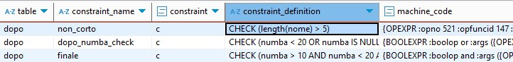

# Database 2: SQL constraints

1

* 1
* 1

**Constraints** are declarative rules applied to PostgreSQL table **columns**, designed to enforce data integrity.
&#x20;They will return an error and prevent any data modification that violates the constraint rules.

The DEFAULT constraint **automatically assigns** a specified value to a column during row insertion if no explicit value is provided for that column.

```sql
//The default value needs to be compatible with the table column its in.
//It can be either a literal value or a built-in function return value.
create table multi(
  id        SERIAL primary key,
  name      VARCHAR(15) not null,
  employed  boolean default false,
  tempo     TIME default now(),
  lista     INT[] default array[12, 25]
)

insert into multi (name) values ('jeff');
select * from multi;    //{jeff, false, 16:43:35, [12, 25]}
```

The CHECK constraint applies a SQL **boolean expression** to each value in its column to ensure data validity.

**Table-level** constraints define conditions that include multiple columns, we declare them after all the table columns have been defined.

```sql
//Check constraints can include multiple Boolean operators but not external columns.
//Multiple constraints can be grouped at the end of the table
create table multi(
  id        SERIAL primary key,
  name      VARCHAR(15) not null,
  nomin     text,
  cognomen  text constraint fuori check (cognomen = 'mista' or cognomen = 'luce' ),
  age       int not null check (age >= 10),
  check (name not in  ('valgono', 'rinote') and nomin != 'secondo' and nomin = 'miei')
);

//The NOT IN requires exact strings, 'valgono ' will be a valid INSERT
insert into multi(name, nomin, cognomen, age) values ('valgono ', 'miei', 'luce', 25);

//The name value is included in the NOT IN operator
//The nomin doesn't meet the (='miei') condition in the AND operator
//cognomen is not among the OR allowed values
insert into multi (name, nomin, cognomen, age) values 
  ( 'valgono', 'terzi', 'altro', 15 );  //Error new row violates constraint "fuori
```

We can create **named** CHECK conditions using the CONSTRAINT keyword. These names will identify the constraint in the error messages and allow us to **add** or **drop** that specific constraint from the table columns.

SQL uses the **three-valued logic** in its Boolean expressions, allowing them to return TRUE, FALSE, or UNKNOWN, often when NULL values are involved in a comparison.

<details>

<summary>Named CHECK constraints, NULL conditions and pg_constraint query</summary>

The CHECK constraint only blocks inserts for conditions explicitly returns FALSE.                                   Unlike clauses like WHERE, which filter rows based on conditions explicitly marked as TRUE, CHECK constraints **allow unknown results**—such as NULL values—from INSERT operations involving missing data.


The NOT NULL **keyword**, when used within a CHECK condition, works as a [**predicate**](#user-content-fn-1)[^1] and it can be used with other logical operations. However, if NOT NULL is applied directly to a column definition, it acts as an **independent constraint**.

```sql
//We use length()/char_length() SQL standard functions, not .length
//ADD CONSTRAINT will be validated against existing data before being applied.
//UNKNOWN refers to explicit NULL values, not 0 or empty strings
create table dopo(
    id  SERIAL primary key,
    nome text constraint non_corto CHECK ( length(nome) > 5 ),
    numba int check (numba < 20 or numba is NULL),
    constraint finale CHECK (numba > 10 AND numba < 20 and length(nome) < 15)
);

insert into dopo(nome, numba) values ('lol', 15);   -- error: non_corto
insert into dopo(nome, numba) values ('filippo turati', 15) -- insert
insert into dopo(nome, numba) values ('marco rigati', NULL) -- insert

//We can only ADD and DROP constraint by their names.
ALTER TABLE dopo DROP CONSTRAINT non_corto;
insert into dopo(nome, numba) values ('lol', 15);   -- insert

//Constraints can't be altered directly; we must DROP and re-ADD them.
//Constraints will be added based on the column references in its conditions.
ALTER TABLE dopo ADD constraint non_corto CHECK (LENGTH(nome) > 10); -- error.
```

All the database CHECK constraints are stored as entries in the pg\_constraint system catalog.
\
The <mark style="color:yellow;">conbin</mark> column stores the binary tree representation of the check expression used by the SQL query executor.
\
The <mark style="color:yellow;">OID</mark> column contains the constraint's own unique OID, while the <mark style="color:yellow;">conrelid</mark> column contains the OID of the constraint's table; this OID is shared among all constrains aplied to the same table.
\
The <mark style="color:yellow;">collaname</mark> holds the constraints names, including the default names for unnamed constraints.
\
The <mark style="color:yellow;">contype</mark> column contains the **character code** indicating the constraint's **type**.

The consrc column was discontinued in favor of the <mark style="color:yellow;">pg\_get\_constraintdef</mark>(OID, boolean) pg\_catalog function.
\
This function returns the **textual representation** of the CHECK condition. It requires the OID of the specific constraint and a boolean argument to indicate if the result should be more prettily formatted.

```sql
//c.conname before we DROP non_corto
constraint_name |non_corto |dopo_numba_check |finale 

select
    t.relname AS table_name,
    c.conname AS constraint_name,
    c.contype AS constraint_type_code,
    pg_catalog.pg_get_constraintdef(c.oid, true) AS constraint_definition,
    c.conbin as machine_code
FROM
    pg_catalog.pg_constraint c
JOIN
    pg_catalog.pg_class t ON c.conrelid = t.oid
WHERE
    t.relname = 'dopo' AND c.contype = 'c'; //table name and CHECK constraints

//pg_catalog SELECT output
table_name |constraint_name |constraint_type_code 
-----------+----------------+--------------------
dopo       |finale          |c
-------------------------------------------------
|constraint_definition     |machine_code 
---------------------------+------------
CHECK (numba > 10 AND ...) | {OPEXPR :opno 521 :opfuncid 147 ...}
```

We SELECT columns from **pg\_constraint** entries and JOIN the pg\_constraint with the **pg\_class** catalog, which contains database relations like tables. This ensures that the returned constraints also include their table properties.
\
The JOIN condition matches the **c.conrelid** column with the **table's OID**, so as to return only the constraints contained within the table specified in the FROM condition.

</details>

<figure><figcaption><p>pg_constrant query on unnamed check conditions</p></figcaption></figure>

The pg\_constraint includes multiple single-character codes to filter results based on a specific constraint.

```sql
CASE c.contype
    WHEN 'c' THEN 'CHECK'
    WHEN 'f' THEN 'FOREIGN KEY'
    WHEN 'p' THEN 'PRIMARY KEY'
    WHEN 'u' THEN 'UNIQUE'
    WHEN 't' THEN 'CONSTRAINT TRIGGER'
    WHEN 'x' THEN 'EXCLUSION'
    ELSE 'UNKNOWN'
END AS constraint_type_description
```

### The PostgreSQL UNIQUE constraint

The UNIQUE constraint ensures that each row in the table has a **distinct combination** of values for the specified **columns**.

It can be applied to a single column or to multiple columns as a **table-level constraint**.
&#x20;Each UNIQUE constraint operates independently, enforcing uniqueness only for its specified column values.

Before being added, any new constraint **validates** all existing rows in its specified columns.

```sql
//Named constrints appear in error messages
//Rows can repeat single column values, but their value combinations must be unique
create table doppio(
    nome TEXT, numero INT, extra INT UNIQUE,
    constraint coppia unique(nome, numero)
)

//Columns not included in the insert will default to NULL in the table row.
//Repeated NULL values will not be considered equal by the UNIQUE constraint
insert into doppio(nome, extra) values('volan', 12);    //(volan |NULL |12 |)
insert into doppio(nome, extra) values('volan', 12);    //Error, repeated 12 in extra
insert into doppio(nome, extra) values('volan', 21);    //(volan |NULL |21 |)

//We can DROP and ADD only named constraints
ALTER TABLE doppio DROP CONSTRAINT coppia;

ALTER TABLE doppio ADD CONSTRAINT coppianull unique nulls NOT DISTINCT (nome, numero);
//error, when validating the previous rows the second ''volan' is not unique for 21.
```

The SQL standard syntax treats each NULL as a **distinct** value; this causes multiple NULL within UNIQUE columns not to violate the constraint.

The **nulls NOT DISTINCT** option explicitly treats NULL values as equal (non-distinct) in the UNIQUE constraint, matching how NULL is evaluated in other database systems.

<details>

<summary>The UNIQUE comparison operator on nulls NOT DISTINCT columns</summary>

The nulls NOT DISTINCT option, introduced in PostgreSQL 15, changes how the NULL values are treated within an UNIQUE constraint **comparison operator**.

Within the SQL standard, any operation involving NULL values returns UNKNOWN, due to its **three-valued logic**.

The UNIQUE constraint triggers an error only when its comparison operator **explicitly** returns TRUE, this will allow multiple NULL entries within the UNIQUE columns.

The nulls NOT DISTINCT option changes the result for NULL comparison operations (NULL = NULL) to TRUE, which enables the UNIQUE constraint to block multiple entries containing NULLs.

```sql
create table cambio(
    uno INT UNIQUE, due INT unique nulls NOT DISTINCT
)

insert into cambio (uno, due) values
    (NULL, NULL),    
    (null, 12),    //The NULL == NULL operation returns UNKNOWN in uno
    (12, NULL);    //Error, NULL == NULL is TRUE for nulls NOT DISTINCT unique
```

</details>

The UNIQUE constraint is **not designed** for effective use with RANGE and ARRAY data types.
\
It enforces uniqueness only for ranges and arrays that share the **exact same order** and **values**; it will not detect range overlaps or check for shared elements within different arrays.

```sql
//It treates RANGE and ARRAY as atomic values
create table rangio(
    raggio int4range, lista INT[],
    unique(raggio, lista)
)

insert into rangio(raggio, lista) values 
	(int4range(12, 34) , array[12, 34]),	  
	(int4range(12, 34) , array[12, 34, 101]), //No error if ARRAY contains values
	(int4range(12, 34, '[]') , array[12, 34]),//No error if ARRAY changes order
	(int4range(12, 34) , array[12, 34]);	//ERROR: exact duplicate value on both
```

A UNIQUE constraint inherently generates a **B-tree index** on its specified columns to enforce the uniqueness rule.

```sql
//A b-tree index created to list ONLY column due
create table tutto(
    uno INT, due INT constraint nullita UNIQUE
)
```

To know more about indexes check the INDEX section.

### Implementing UNIQUE Constraints with UNIQUE INDEX

The **UNIQUE INDEX** stores and orders all specified column values. Its **access method** includes a function that **compares** each new value against existing ones, blocking the operation if it finds two equal (non-distinct) values.

A UNIQUE constraint's entry in **pg\_constraint** includes its OID, conname, and contype, while its **conbin** column is set to NULL.
\
The query executor doesn't use the **conbin binary data** to enforce the UNIQUE constraint. Instead, it relies on the **index** referenced by the **conindid OID**, while the **conrelid OID** identifies the **table** where the constraint applies.

```sql
//The conindid is NULL for CHECK constraints
//The OID works as the primary key, identifying the constraint
//Both conrelid and conindid are foreign keys pointing to other elements
select
    OID, conname, conrelid, conbin, contype, conindid
from pg_constraint where oid = 327735;

oid   |conname|conrelid|conbin|contype|conindid|
------+-------+--------+------+-------+--------+
327735|nullita|  327728|      |u      |  327734|
```

The UNIQUE index, identified by the **conindid** OID, stores its metadata across the **pg\_class** and **pg\_index**.



The **`pg_class`** system catalog contains the **physical** and **relational properties** of a UNIQUE index, treating it as a storage entity. Aside from its OID, it includes:

> **relname**: The name of the index. For UNIQUE constraints, it matches the constraint name.
> \
> **relkind**: A character code indicating the relation's type.
> \
> **relpages**: The estimated number of 8KB disk pages the index occupies.
> \
> **relhasindex**: Primarily used for tables, it indicates an index associated with the relation

```sql
//relking is 'i' for index
//relhashindex is false for indexes relations
select 
    OID, relname, relkind, relpages, relhasindex 
from pg_class where oid = 327734;

oid   |relname|relkind|relpages|relhasindex|
------+-------+-------+--------+-----------+
327734|nullita|i      |       1|false      |
```



The **pg\_index** system catalog returns the **logical** and **semantic properties** specific to an index:

> **indrelid**: This is a foreign key referencing the OID of the **table** to which the index is applied.
> \
> **indisunique**: A boolean value indicating if it's a UNIQUE index.
> \
> **indnullsnotdistinct**: A boolean value indicating if the index was created with the NULLS NOT DISTINCT option.
> \
> **indkey**: An array of smallint values. It represents the column attribute numbers (table positions) and their order set during the index definition.

```sql
//indexrelid is the primary key OID of the pg_index.
select
    indrelid, indisunique, indnullsnotdistinct, indkey 
from pg_index where indexrelid = 327734;

indrelid|indisunique|indnullsnotdistinct|indkey|
--------+-----------+-------------------+------+
  327728|true       |true               |2     |
```

1

1



We retrieve the comprehensive **index metadata** by joining the system catalog tables that contain its full definition and properties.

```sql
//We retrieve the metadata from the relation specified in the WHERE clause.
//The relname='multi1' would select the table relation columns, not the index.
select 
    classe.OID, conindid, indice.indexrelid, conbin, relkind, indisunique
from
    pg_class as classe
join
    pg_constraint AS consta ON classe.oid = consta.conindid
join
    pg_index AS indice on indice.indexrelid = consta.conindid
where 
    classe.relname = 'nullita'

oid   |conindid|indexrelid|conbin|relkind|indisunique|
------+--------+----------+------+-------+-----------+
327734|  327734|    327734|      |i      |true       |
```



A UNIQUE index, whether created by a UNIQUE constraint or **independently**, can enforce uniqueness for specific columns through its **inherent** equality comparison operator.

```sql
//We can define it outside a table without a constraint
create table unico(
    nome TEXT, numero INT, extra INT
)

create unique index solo on unico(nome, numero);

insert into unico(nome,numero) values ('unolo', 122);
insert into unico(nome,numero) values ('uno', 12);
insert into unico(nome,numero) values ('uno', 12);  //Error, repeated value in index
```

A **partial** unique index includes a WHERE clause in its definition, which **filters** the inserted rows and allows only a **subset** to be included in the **index**.

The uniqueness comparison operator will be aplied only to the rows **included in the index**. A new value will be blocked from the table only if it passes the WHERE clause and **matches** an existing value within the **partial unique index**.

All rows excluded by the WHERE partial index clause will still be inserted into the table, allowing the presence of duplicate values.

```sql
//Its WHERE condition can include columns that are not part of the index.
create table fuori(
    uno TEXT, due INT
)

create unique index indice on fuori(uno) where due < 10;

insert into fuori(uno, due) values ('compa', 11), ('altro', 11), ('compa', 11);
insert into fuori(uno, due) values ('compa', 7);
insert into fuori(uno, due) values ('compa', 7);    //Error, repeated uno for due < 10
```

A partial unique index is designed to **optimize the queries** for a subset of specific values.
\
The **query planner** will use the index, instead of a full table scan, if the query's WHERE clause guarantees that it will **only** SELECT rows contained within the **partial index**.

<details>

<summary>Query conditions for a PARTIAL INDEX scan</summary>

A query that SELECTS the indexed columns and **shares** the WHERE clause with the partial index will use the index.

```sql
create unique index indice on fuori(uno, due) where due < 10;
select (uno, due) from fuori where due < 10;
```

A query that SELECTS the indexed columns but with a **different** WHERE clause will not use the partial index.
&#x20;The query planner can't guarantee that **all** the SELECT columns can be **fetched** from the index, so it will opt for a full table scan to avoid missing rows.

```sql
select uno from fuori where due <= 15;
```

A query that SELECTS **different columns** but matches the WHERE clause might use the partial index via a **heap fetch**.
\
In this process, the **query planner** retrieves row identifiers (**TIDs**) from the index and then uses them to efficiently **fetch** the complete row data, including the additional columns, from the **main table** (the heap).

```sql
//Rows retrieved from the index will also contain the other columns values
select tre from fuori where due < 10;
```

The query planner will use the partial index only if the **query** WHERE condition **mathematically implies** it as a **subset** of the **partial index** WHERE clause.

* A query for x < 1 will use a partial index defined with a x < 2 WHERE clause, because all the query values are included in the index's condition.
* The opposite isn't true, a query for x < 2 can't use a partial index defined with a x < 1 WHERE clause, because the query might retrieve values (like 1.5) that are outside the partial index.

The query planner is **not optimized** to interpret complex conditions that **logically** imply the use of an index's clause. This includes expressions like 'column = "true"' and 'column != "false"'.

</details>

The query planner decides whether to use an index during **query planning time**, not during execution.
\
It **excludes** placeholder and parameter values from its index planning evaluation, as they are unknown during that stage and defined only at runtime.

```sql
//The PREPARE plan will not use the index, regadless of the EXECUTE query's values
//If a window opens after the PREPARE command, type the $1 for the $1 placeholder
PREPARE my_query (INTEGER) AS
SELECT * FROM fuori WHERE due > $1;

EXECUTE my_query(7);

//PREPARE planes are stored for the session, drop them using
DEALLOCATE my_query;
```

### The NOT NULL constraint

The NOT NULL constraint prevents a table column from containing NULL values.
&#x20;It's more efficient than its **equivalent CHECK** constraint (column IS NOT NULL).
\
It can be applied with other constraints in any order and is enforced directly **by the table** without requiring an index.

Its inverse constraint, NULL, allows a column to accept NULL values. It is set **by default** and is mainly used for compatibility with other database systems.

```sql
//Missing column values will be treated as NULL errors
//It can only be aplied at the column level and cannot be named.
CREATE TABLE products (
    produ integer NOT NULL, name text NOT NULL, price numeric null
);

insert into products(produ, name, price) values 
    (34, 'primo', 12),    
    (0, '', NULL),    //No error, 0 and '' are different from NULL
    (66, NULL, 12),   //ERROR, NULL on not null column
    ('dron', 12);     //ERROR, missing column on NOT NULL column

//An added NOT NULL constraint will first validate previous columns values
ALTER TABLE products 
ALTER COLUMN price SET NOT NULL;    //Error, the column "price" contains NULL values
```

### The PRIMARY KEY CONSTRAINT

The PRIMARY KEY constraint identifies table rows through its specified columns. It sets them as UNIQUE and NOT NULL, to avoid duplicate identifiers and missing column values respectively.


A table can have only one PRIMARY KEY, which automatically generates a **B-tree index** on its specified columns for efficient row retrieval.

```sql
//It's a UNIQUE constraint that also includes a NOT NULL rule
CREATE TABLE test(
    chiave integer PRIMARY KEY, --Same results as UNIQUE NOT NULL
    name text, price numeric
);

insert into test(chiave, name, price) values (12, '12', 12);
insert into test(chiave, name, price) values (12, '122', 122);  //Error, repeated key
insert into test(name, price) values ('12', 12);    //Error, null primary key

//Applying a PRIMARY KEY to multiple columns creates a composite PRIMARY KEY.
create table combi(
    uno INT, due INT, tre INT,
    primary KEY(uno, due, tre)
);

insert into combi(uno, due, tre) values (12, 34, 56);
insert into combi(uno, due, tre) values (12, 34, NULL); //error, null in composite key
insert into combi(due, tre) values (34, 56);    //error, null in composte key
```

Primary keys can be used by GUI applications or as default targets for f**oreign keys**.

1

The FOREIGN KEY constraint creates and enforces a **reference link** between 2 columns.
\
It ensures that a **referencing column** (the child) can only contain values already present in its **referenced column** (the parent).

A FOREIGN KEY is defined within the child table, its REFERENCES keyword points to the **parent table** and its specific columns. Multiple child rows can reference the same parent column value.

```sql
//The child column must match the parent data type
//A PRIMARY KEY parent column avoids any duplicate column value and NULL for the child
CREATE TABLE products (
    chiave integer PRIMARY KEY, name text, price numeric
);
insert into products(chiave, name, price) values (15, 'brio',550), (10, 'malbo',200);

//Any existing constraint still applies within the child table
//If the parent column is omitted, it will use its own column name for the reference.
CREATE TABLE orders (
    order integer,   //UNIQUE can limit the child columns values
    chiavetta integer REFERENCES products (chiave)  //Will use chiavetta if omitted
);

//The FOREIGN KEY only allows values form the specified column, not the entire table.
insert into orders(order, chiavetta) values 
    (3, 15),
    (10, 10),  //The parent reference value can be repeated within the row
    (3, 15),   //Allowed if teh order child columns isn't UNIQUE
    (3, 200);  //Error, it violates the foreign key constraint
```

A child FOREIGN KEY must reference UNIQUE or PRIMARY KEY **parent columns**.                                                                                                                                                                   The JOIN operation combines table columns data using the FOREIGN KEY relations.

<details>

<summary>Referencing multiple parent column using the composite FOREIGN KEY constraint</summary>

A **composite FOREIGN KEY** references a unique **set** of parent columns.&#x20;
\
All its child columns must be referenced from a _single_, explicitly defined composite constraint.

The FOREIGN KEY **clause** can omit the parent columns list if they reference a PRIMARY KEY constraint; the database will **implicitly map** the child columns by position.                                              While the UNIQUE parent columns must always be **explicitly listed**.

Invalid FOREIGN KEY constraints:

* A FOREIGN KEY can't reference a **subset** of columns from a composite parent constraint.
  \
  A unique composite **set** can contain **repeated individual column** values (like (1, 10) and (1, 20)), making the database unable to identify parent rows based on a single referenced column.
* A composite FOREIGN KEY cannot reference multiple independent parent columns.
  \
  It must reference a single composite constraint that contains all the parent columns within its unique set.

We **can't directly modify** a foreign key; we must first DROP and ADD a **named** new one within the child table.
&#x20;Any new foreign key added must reference existing constraints in the parent table.

```sql
//uno being both part of UNIQUE and PRIMARY KEY constraints
create table singolo(
    uno INT primary key, due INT not null,
    unique (uno, due)
)
insert into singolo(uno, due) values (15, 30), (3, 12);

//We use CONSTRAINT to name a foreign key
//Named single column: 'base TEXT constraint based REFERENCES uno'
create table doppio(
    base TEXT, primo INT, secondo INT,  
    //We must specify the parent columns in an UNIQUE constraint reference
    CONSTRAINT coppia
        foreign key (primo, secondo) references singolo(uno, due)
)

into doppio(base, primo, secondo) values
    ('you', 15, 30), ('you', 3, 12),
    ('you', 15, 12);    //ERROR, it violates the coppia set in FOREIGN KEY

//We can ALTER only named constraints
ALTER TABLE doppio DROP CONSTRAINT coppia;
//It references the PRIMARY KEY constraint also aplied to the uno column
//Only create table keys can omit the PRIMARY KEY parent columns list
ALTER TABLE doppio ADD constraint nuovo 
    FOREIGN KEY (primo) REFERENCES singolo(uno);

//The new constraint allows repeated uno values from a PRIMARY KEY parent
//The PRIMARY KEY constraint applies to the parent column, not the child's.
insert into doppio(base, primo, secondo) values ('you', 15, 12);    

base|primo|secondo|
----+-----+-------+
you |   15|     30|
you |    3|     12|
you |   15|     12|
```

</details>

A column that **references** the PRIMARY KEY of a row within the **same table** is called **self-referencing**.
\
It creates a hierarchical **structure** where rows are organized into **branches** based on the PRIMARY KEY they reference, with rows containing NULL **foreign key** values serving as the **root nodes** that originate the structure.
\
It enabled the query to retrieve and order data based on the relations between the table rows.

A query involving self-referencing columns uses multiple **instances** of the **same table** within its FROM clause.
\
The first instance (t1) represents the **current row** being processed, while the second instance (t2) is used in the **matching operation**. This comparison links the foreign key value from the first instance to its referenced parent primary key, found using the second instance.

<pre class="language-sql"><code class="lang-sql">//It references the PRIMARY KEY by default.
CREATE TABLE tree (
    node_id integer PRIMARY KEY, name TEXT, 
    parent_id integer REFERENCES tree -- Self-referencing foreign key
);

INSERT INTO tree (node_id, parent_id, name) values 
    (1, NULL, 'base camp'), (2, NULL, 'aviation'), (101, 1, 'tank'), 
    (102, 1, 'jep'), (201, 101, 'soldier'), (301, 2, 'plane'), 
    (302, 302, 'suplies'),  -- self referring column
    (305, 90, 'dog');       -- ERROR, no PRIMARY KEY to reference

//The INNER JOIN clause only returns matching row values in the output.
select 
    t1.node_id, t1.name, t2.name as parent_name
from
    tree as t1
left join 
    tree as t2 on t1.parent_id = t2.node_id
order by t1.node_id

<strong>node_id|name     |parent_name|
</strong>-------+---------+-----------|101|tank     |base camp  |
      1|base camp|           |102|jep      |base camp  |301|plane    |aviation   |
      2|aviation |           |201|soldier  |tank       |302|suplies  |suplies    |
</code></pre>

The LEFT JOIN clause includes all rows from the **current** table instance (the **left operand**) in the query's output. It appends the result columns from the matching operation, assigning NULL to unmatched rows. It effectively flattens the output, presenting both child and parent information within the same row.

1

1

1

1

1

1

1

1

1

1

1

[^1]: an expression that returns a Boolean value
