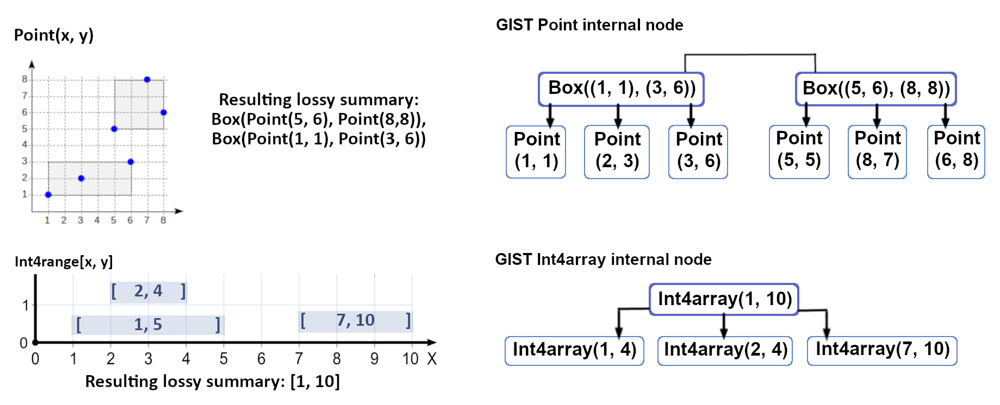
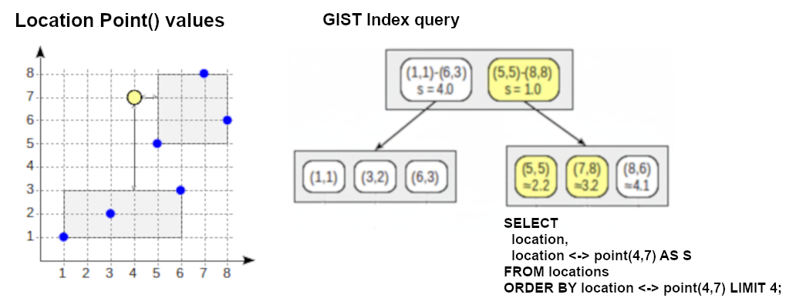
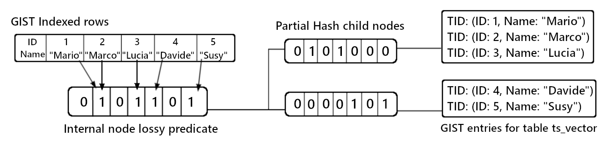

# Gist indexing method.

* [GIST index dat types structures and predicate nodes condition](gist-indexing-method..md#gist-index-data-types-structures-and-predicate-nodes-condition)
* [Operation class functions nodes structures and POLYGON bounding box predicates](gist-indexing-method..md#operation-class-functions-nodes-structures-and-polygon-bounding-box-predicates)
* [The GIST index node predicate navigation strategies](gist-indexing-method..md#the-gist-index-node-predicate-navigation-strategies)
* [Query clauses operators allowed for GIST indexes and the K-NN navigation strategy](gist-indexing-method..md#query-clauses-operators-allowed-for-gist-indexes-and-the-k-nn-navigation-strategy)
* [GIST text search queries with TSVECTOR data types](gist-indexing-method..md#gist-text-search-queries-with-tsvector-data-types)

A GiST index can be used to implement an **EXCLUDE constraint**, which prevents rows with **conflicting** column values from being inserted into the table.
\
The index is active during the INDEX CREATE and the table row operations.

The index is populated by the **indexed column values** included in its arguments; We can use the `WHERE` clause to filter a subset of rows, or use functions to transform the indexed column values.                                  They are organized into the GiST tree, which is used by the EXCLUDE constraint to perform an **optimized query** of the index to find conflicting values.

An EXCLUDE constraint uses its GiST index during INSERT and UPDATE operations to prevent data conflicts. It applies any functions from the index definition to the **new column values** and then uses the constraint's comparison operators to query the index for any conflicting rows.
\
The new data is held in the RAM memory for the duration of the operation, and if the check passes, the data is committed to both the table and the index in an atomic operation that maintains table consistency.

```sql
-- We fill the GIST with tsrange extended intervals 
create or replace FUNCTION sessione(tsrange, interval)
  RETURNS tsrange AS
$$
  SELECT tsrange( lower($1) - $2, upper($1) + $2 );
$$ 
LANGUAGE 'sql' IMMUTABLE;

-- The function returns the extended tsrange [11:45, 14:02]
select sessione('[15-09-2023 12:00, 15-09-2023 13:47]', '15 minutes'::interval);

-- We apply the WHERE condition to specify the rows in the GIST subset
create table lista(
  user_id TEXT, pal tsrange,
  exclude using GIST(lower(user_id)with =, sessione(pal,'2 hours'::interval) with &&)
    where ( lower(user_id) in ('freeuser', 'trialuser', 'bonususer') )
)

-- All user_id text get lower() before beinf used in the constraint
insert into lista(user_id, pal) values 
 ('freeuser','[2021-05-12 12:00, 2021-06-07 05:00 ]'), 
 ('Freeuser','[2021-06-07 07:00, 2021-06-07 12:00 ]'), //Error, same user and overlay
 ('freeuseR','[2021-06-07 09:01, 2021-06-07 12:00 ]'), //Same user but no overlay
 ('bonususer','[2021-05-12 12:00, 2021-06-07 05:00]'),//Different user even if overlay
 ('Luka','[2021-05-12 12:00, 2021-06-07 05:00 ]');    //Different user_id 

select * from lista;
```

### GIST index data types structures and predicate nodes condition

The GIST (**Generalized** Search Tree) tree adapts its internal organization based on the data type.
\
It creates a hierarchical structure where **lossy predicates** are used to define **internal nodes**, acting as **summaries** that represent all the data contained within their child nodes.

The GIST framework uses different internal node structures depending on the specific data type, using **bounding boxes** for spatial data or summarized ranges for ranged data types (like int4range, daterange, or tsrange).
\
It can define lossy predicates for data types that are part of the same **logical, contiguous space**, where the sequential space (like an area or a number line) that separates every value can be summarized. It's not suitable for distinct and unrelated sets of values, like arrays, that aren't part of a defined logical space and can't be grouped into a summary.

The GIST extensions can implement lossy structures for data types that don't natively support it, like text values using **bitmask predicates**, or for data types whose operation class rules aren't included in GIST, like integers needing the btree\_gist extension.

<figure><figcaption><p>GIST internal nodes for different data types</p></figcaption></figure>

A lossy predicate allows a query search to skip entire branches, as its **summary** contains all the **possible values** from its child nodes. Any matching value requires extra steps to validate, since the summary only indicates a possible match.

The internal nodes are not designed to **constantly update** their lossy predicates.
\
The GIST index **inserts** new entries into child nodes that already include them in their **summary** or modifies the node requiring the least change to fit the new entry; predicates do not change upon child entry deletions, as they are included in the summary lossiness, but a **node split** requires the predicates to be fully **recalculated** based on the entries in the new nodes.

A GIST index structure relies on different types of functions than a B-Tree; while a B-Tree creates the **same linear order** using the **sorting functions** specific to its data type, the GIST structure applies overlap and containment rules to its entries.

### Operation class functions nodes structures and POLYGON bounding box predicates

The **operation class functions** manage the creation and navigation of the lossy predicate nodes, handling multiple **structures** specific to the indexed **data types**.

The `Combine` function creates the internal node **lossy summary**; it combines its **child node** predicates into a new data type-specific structure.
\
The `Consistent` function manages the GiST tree navigation by **comparing** the query search value with the node's data-type-specific predicate. It's a binary function; if it returns false, the GiST framework ignores the entire branch.

The **Consistent** function contains all the possible data-type-specific operations.
\
The query planner analyzes its query values and operator to retrieve its corresponding pg\_amop strategy value, which is used by the Consistent function to validate the query search for the specific values.

```sql
-- Operation strategies are explicitaly included when creating a new operation class
CREATE OPERATOR CLASS gist__int_ops ... USING gist AS
  OPERATOR 3 &&, OPERATOR 6 =, OPERATOR 7 @, OPERATOR 8 ~
```

The GiST index organizes the spatial POINT data type using **bounding boxes**.
\
The boxes define the internal node predicates, summarizing the **spatial area** that contains all **points** in their child nodes. The Consistent function navigates the structure by checking if the query value is contained within these boxes, to then retrieve the actual **data row's point position** from the matching leaf node.

```sql
-- Each Point(x,y) represents a two-dimentional value, unlike the one-dimentional range
CREATE TABLE points ( id SERIAL PRIMARY KEY, p  POINT );

INSERT INTO points (p) VALUES
  (point '(1,1)'),(point '(3,2)'),(point '(6,3)'),(point '(5,5)'),(point '(7,8)');
CREATE INDEX points_p_gist_idx ON points USING GIST (p);

EXPLAIN SELECT * FROM points WHERE p <@ box '(2,1),(7,4)'; -- (3, 2), (6, 3)
--QUERY PLAN
--Index Scan using points_p_gist_idx on points  (cost=0.13..8.15 rows=1 width=20)
--  Index Cond: (p <@ '(7,4),(2,1)'::box)
```

The GiST index applies an extra **recheck step** to query results. It's **based on the data type**, not the query operation, and depends on how the operation class defines that data type.


A "lossy" data type, like POLYGON, is complex, so the GiST tree **stores it as a summarized bounding box** to save space. A **recheck** step is required to ensure a query result is not a false positive.                               It fetches the actual **polygon value** from the table and compares it to the query to confirm the match.
\
An "exact" data type, like POINT, is stored by the GiST index as its actual value. A query search match represents the actual value, so no additional recheck is needed.
\
The **GiST recheck** is based on lossy data types and is used to handle false positives in the resulting values. It's different from the **recheck in B-Trees** (like with bitmap scans), which has to confirm which rows on the matching 'lossy' disk pages actually contain the query values.

There is a difference between accessing the **logical definition** and the rules associated with the GiST index, and accessing its internal **physical structure**.

<details>

<summary>Accessing the GIST index structure data with the GEVEL extention</summary>

The **pageinspect** extention can't return any readable property about the GIST index structure. The extension uses its bt\_page\_items function to analyze the B-tree index, accessing its fixed, one-dimensional structure regardless of the data types currently being indexed. The **GiST's structure** varies based on its **operation classes**, which include custom ones. As a result, pageinspect can't feasibly store functions for all possible layouts to adapt to each GiST structure.

We access the internal structure properties of a GIST index using the GEVEL extension.                   The GEVEL is a **contrib debugger module** for GIST and GIN indexes in PostgreSQL. It provides functions to visualize high-level statistics, print the index's tree structure, and dump the individual keys stored in the index pages.

```sql
--https://github.com/BetaRavener/Gevel-Extension
select * from gist_stat('airports_coordinates_idx');
```

The **gist\_stat(index\_oid)** function returns high-level statistics for each **level** of the GiST index.  It starts at the leaf nodes (represented as 0) and reports the combined **properties** of **all entries** at each level, aggregating them from all the different branches.

> The **num\_pages** column returns the total number of physical disk pages used to store the entries at that level.&#x20;
>
> The **num\_tuples** column returns the total number of index entries (called "tuples" by the extension) stored at that specific tree level. It includes leaf entries (at level 0) and internal node predicates on higher-level pages.&#x20;
>
> The **num\_dead\_tuples** column returns the number of outdated entries in the index, which will be cleaned up by the VACUUM process.&#x20;
>
> The **free\_space** column returns the free space (in bytes) left on all pages at that specific level.&#x20;
>
> The **avg\_tuple\_len** column returns the average size (in bytes) of a single index entry at that level.

```sql
-- All nodes stats get summed and grouped by their level
SELECT * FROM gist_stat(16393);
level | num_pages | num_tuples | num_dead_tuples | free_space | avg_tuple_len
-------+-----------+------------+-----------------+------------+-------------
    0 |       150 |       2500 |              85 |      45120 |            32
    1 |        10 |        149 |               0 |       1024 |            36
```

The **gist\_tree(oid, max\_depth)** function visualizes the index's structure from the **top down**.      Its output returns a **text summary** of each index node's properties, using **indentation** to represent the **different levels**.                                                                                                                             Each line includes the node's level (Level), its physical page number (Page), the number of children in that page (nchildren), and the key (or predicate) that leads to that node.

```sql
-- It starts from the root level untill it reaches the leaf nodes (level 0)
SELECT * FROM gist_tree(12345, 3);

(Root Page, Level 2) Page 5, nchildren=2, key=BOX(0 0, 100 100)
    (Internal Page, Level 1) Page 10, nchildren=3, key=BOX(0 0, 50 50)
        (Leaf Page, Level 0) Page 15, nchildren=20, key=BOX(10 10, 20 20)
        (Leaf Page, Level 0) Page 16, nchildren=15, key=BOX(30 30, 40 40)
        (Leaf Page, Level 0) Page 17, nchildren=12, key=BOX(5 5, 25 25)
    (Internal Page, ...)
```

The **gist\_print(oid)** function returns a set of all keys stored in the index.
\
Each row in the output includes the entry's tree level (level), its boolean valid status (false means outdated), and the actual key value for that specific entry.

```sql
-- The most recent GEVEL forks use the OID instead of the index name
SELECT * FROM gist_print(12345);

-- The results can be filtered like a table query
SELECT * FROM gist_print(12345)
WHERE level = 0; //The leaf node entries

level | valid |             key
-------+-------+-----------------------------
     1 | t     | BOX(0 0, 50 50)
     1 | t     | BOX(50 50, 100 100)
     0 | t     | POINT(10 15)
     0 | t     | POINT(30 25)
```

</details>

### The GIST index node predicate navigation strategies


The GiST index algorithm used for the **index tree navigation** is not fixed; it varies based on the clauses and their specific operators.

The **query planner** defines a specific **execution plan** based on the query's operations, which are differentiated as 'indexing' or 'sorting' **operators** (defined in the pg\_amop **amoppurpose** column) and correspond to specific SQL **clauses**.

**Indexing operators**, like && (overlap) and @> (contains), return a **boolean value** from their internal predicate comparisons; they are used in WHERE clauses to filter and exclude non-matching branches from the search.
\
**Sorting operations**, like <-> distance, return a **value** from their internal predicate comparisons, which is used by the ORDER BY clause to build a priority queue from the branches defined in the root node, instead of excluding them.
\


The **clause** reflects the **logical properties** of its compatible operators. Indexing operators are binary, which means they can't ORDER BY measure a "more" or "less" overlap or containment state, as they return true/false values. Both operators are capable of retrieving entries from multiple GIST tree branches.

The **set of commands** included in the **execution plan** are determined by the query's clauses and operators.
&#x20;They determine which instance of the **pg\_am handler function** will be used for the **plan**, defining the **internal functions** needed to execute its included commands.

\-

MAYBE IMAGE FOR TEH TABLES system catalog retrieved, as the strategy value (defined by values and specially operator purpose in pg\_amop, implies its valid clause.)

\-

### Query clauses operators allowed for GIST indexes and the K-NN navigation strategy

The GIST framework's structure adapts each execution plan to the query's data types.
\
Each pg\_am handler instance uses the **internal functions** provided by the **data type's operation class**, which will specify how the plan's commands are executed and ensure they are compatible with that data type's specific **GIST structure**.
\


The execution plan specifies the GIST tree **navigation function** used for the query search.
\
The GIST generic framework allows its handler function to include **additional code** for specific high-level search strategies, which implements the specific query logic of its data type and clause.                                      The consistency function is the specific implementation of the indexing operator's binary logic. It navigates the tree by filtering the branches based on the query search value.

The database uses a **K-Nearest Neighbor** (K-NN) tree navigation strategy for distance operators (<->) applied to an ORDER BY query on a geometric or trigram data type.

```sql
-- The GIST indexes the Point entries into lossy bounding box predicates
SET enable_seqscan = off;
CREATE TABLE locations ( location POINT );

INSERT INTO locations (location) VALUES
    (point(20, 20)), (point(2, 2)), (point(5.1, 5.1)), (point(5, -10)), 
    (point(5, 5)),   (point(4.9, 4.9)), (point(5, 10)), (point(6, 5)),
    (point(-15, 5)), (point(5, 4));
CREATE INDEX idx_locations_gist ON locations USING gist (location);

-- The query <-> distance operator instructs the database to trigger a K-NN operation
-- It performs a SORTED SCAN, which can retrieve already sorted entries for their TID
SELECT 
  location,
  location <-> point(5,5) AS distance
FROM locations ORDER BY location <-> point(5,5) LIMIT 5;
--QUERY PLAN
--Index Scan using idx_locations_gist on locations (cost=0.13..8.33 rows=10 width=246)
--  Order By: (location <-> '(5,5)'::point)
```

The pg\_am handler function instance, used to execute the K-NN strategy, includes **extra support functions** which allow it to sort the query result values by distance, effectively enabling the unordered GIST entries to be ordered.

<figure><figcaption><p>K-NN query ordering TID entries by distance</p></figcaption></figure>

The query planner includes the **arguments** used to specify which **pg\_am handler function** is used for the execution plan.

> The **IndexScanDesc** is a runtime object created during plan execution; it's a pointer that references the index's Relation, which was created by the CREATE INDEX command and contains the operation class and its associated support functions (defined in the pg\_amproc system catalog)
>
> The **ScanKey** is a separate object which specifies the query instructions.
> \
> It's extracted by the query planner and includes the strategy value, representing the query operator, and the value used in the query operation.

The GiST framework also applies its **additional support functions** for the implementation of the GiST-based EXCLUDE constraint, which, similar to the K-NN strategy for an ORDER BY clause, requires a more complex logic to execute its specific WHERE query.

The EXCLUDE constraint applies its conflict search during INSERT and UPDATE commands.
\
The additional support function in the execution plan change the default behavior of the WHERE clause. The optimized conflict check operation will navigate the GIST tree only to find the first matching value in order to validate the exclusion constraint.

### GIST text search queries with TSVECTOR data types

The GiST index uses the **tsvector** data type for full-text queries. The tsvector organizes the text document's content into a list of **lexemes** (normalized words) and their **document positions**.

The **tsquery** data type stores the lexeme search terms, including the **logical operators** used in the query search operation. They are **built-in** components from PostgreSQL's **full-text search** (FTS) system, which provides **conversion functions** like **to\_tsvector()** and **to\_tsquery()**.                                                                    The text conversion includes setting to lowercase (**normalized**), removing common words (**stop words**), and reducing words into their root form (**stemming**).

```sql
-- We use ts_vector for the query value and ts_query for the query condition
select to_tsvector('There was a crooked man, and he walked a crooked mile') @@
    to_tsquery('man & (walking | running)');
```

A full-text search query using the **match operator** (@@) can be executed by both a GiST index, which creates a more general-purpose index, and a GIN index, which is more specific and contains more details.

The GiST tree organizes the lexemes into **lossy predicates** and requires a recheck step for each query result, which results in a smaller index size and faster updates.
\
The summary structure used for lexemes is defined as a **bitmask signature**, which uses the BITWISE OR operation to **combine** the smaller **bitmasks** defined by the **child node** entry values; these leaf signatures are created by hashing each lexeme to a bit position and setting it to 1. It is a lossy structure because of the limited number of available bit positions, as multiple lexemes can flip the same bit.

The GIST index stores its indexed tsvector columns as converted, lossy bitmasks.
\
Each **leaf node entry** contains the **signature** of a single tsvector value, while the internal nodes are created using the BITWISE OR operation, which represents the combine function provided by the tsvector operator class.
\
The insertion logic mantains the'minimize enlargement' behavior for any insert operation.

<figure><figcaption><p>Hashed table rows for bitmask signatures </p></figcaption></figure>

The tsquery (@@) query **requires two matching operations**: a faster one navigating and comparing the bitmask predicates, and a second, slower one comparing the tsvector values with the actual tsquery value.
\
It first uses the **consistency function** to quickly filter the branches that don't contain the hashed lexeme bits in their signatures. The **recheck step** consists of retrieving the actual **tsvector values** from their **TID** table row and re-applying the tsquery matching condition, to exclude any false positives from the query results.

The tsquery data type converts its text value using the same tsvector operations, but it also includes the logical operators that define the **search rules**.
\
It's **converted** into a signature bitmask to navigate the GIST tree, while its **internal logic** is applied only during the final **recheck step**. This set of rules is used by the query search operator (@@) to confirm the final results.

```sql
-- It includes logical operators (&(AND), |(OR), !(NOT)) in the lexemes
to_tsquery('english', 'quick & (cat | dog) & !fox')

-- The plainto_tsquery() automatically adds AND for all lexemes
-- The tsvector_ops operator class handles the tsvector queries
-- The tsquery_ops is used to handle comparison between tsqueries.
```

The GIST can add more data types compatible with its indexing method using extensions, like for [cube ](https://postgrespro.com/docs/postgresql/9.6/cube), [ltree](https://postgrespro.com/docs/postgresql/9.6/ltree), [intarray](https://postgrespro.com/docs/postgresql/9.6/intarray), [seg](https://postgrespro.com/docs/postgresql/9.6/seg) and pg\_trgm used for [trigrams](https://postgrespro.com/docs/postgresql/9.6/pgtrgm) data type.

1
