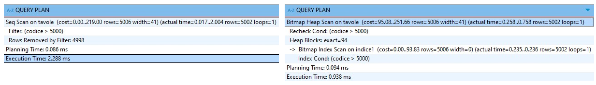

# Database 3:PostgreSQL Indexes, B-tree

1

1

An index is an additional **database structure** built with the specified columns of an existing table.

The index optimizes queries that reference its columns, which allows the query planner to avoid a **full table scan**.
&#x20;The size and speed of an index depend on its design and the type of data it holds.

The CREATE INDEX command creates an index for its specified **table columns**.
\
The <mark style="background-color:orange;">B-tree</mark> indexing method defines an index structure optimized for **equality** and **range** queries.

```sql
--Indexes are most effective on large datasets
CREATE TABLE tavole (
    id  SERIAL PRIMARY KEY, codice  INT
);

INSERT INTO tavole (codice, nome)
    SELECT FLOOR(RANDOM() * 10000) FROM GENERATE_SERIES(1, 10000);

--If no specified the database creates a B-tree index
CREATE INDEX indice ON tavole(codice);

--We disable the sec. scan to make the index be used by the query planner.
SET enable_seqscan = off/on;

--Explain Analyze returns the scan stats
explain analyze select * from tavole where codice > 5000;
```

<figure><figcaption><p>Sequential query scan and Bitmap index scan statistics</p></figcaption></figure>

The query planner uses an index if its **overhead cost** is lower than that of a sequential scan.
\
It also depends on the query clauses (e.g., LIKE or JOIN), as some are not supported by certain index types.

An index can be **implicitly created** by a constraint and is **automatically deleted** when its associated table is dropped.

```sql
--The unique constraint implicitly creates a b-tree index
CREATE TABLE intervalli (
    inizio INTEGER, fine INTEGER,
    UNIQUE (inizio, fine)
);

--Equivalent to an EXCLUDE with extendable comparison conditions
CREATE TABLE intervalli1 (
    inizio INTEGER, fine INTEGER,
    EXCLUDE USING btree (inizio WITH =, fine with =)
);
```

The CREATE INDEX includes the **option** argument using the WITH keyword.
\
It configures the **index access method** but offers a more limited set of available options compared to other index types.

```sql
--FILLFACTOR sets the percentage of a node that can be filled with entries.
CREATE INDEX my_index ON my_table (my_column) WITH (FILLFACTOR = 90);
```

The **placement** of the CREATE INDEX command influences the effect of certain options, as they are applied differently depending on whether the index is created on **existing data** or is filled later by INSERT **operations**.

```sql
--If placed after the INSERTs it will apply the FILLFACTOR option 
create table spazio( uno INT, due TEXT)

--It will populate the leaf nodes leaving a 30% empty dedicated for updates
create index spazio_idx on spazio(due) with (FILLFACTOR = 70);
insert into spazio select i, (md5(i::text),10) from GENERATE_SERIES(1,100) as i;  

--If before, it creates an empty index and treats any INSERT as a no FILLFACTOR update
create index spazio_idx on spazio(due) with (FILLFACTOR = 70);  
insert into spazio select i, (md5(i::text), 10) from GENERATE_SERIES(1,100) as i;
```

The CREATE UNIQUE INDEX command creates a **B-tree** that enforces **uniqueness** on its **indexed column values**. Some constraints, like UNIQUE, work by implicitly creating a B-tree index; the index command just explicitly creates the same structure to enforce the same rules.

A **partial index** is an index that contains only a **subset** of its indexed column values, created by adding a WHERE clause to the CREATE INDEX command.
\
It's applied similarly to a CHECK constraint, but instead of blocking invalid data from entering the table, it **limits which rows are included** in the index, while **allowing** all data into the **table** itself.
\
The smaller index allows for faster query scans and is affected by fewer table updates.

```sql
-- The index structure is reserved only for rows with uncommon values
CREATE TABLE orders (
    customer integer, status text
);
insert into orders(customer, status) values 
    (12, 'SERVED'), (1, 'PENDING'), (9, 'PENDING')
    
CREATE INDEX pending_clients ON orders (status) WHERE status = 'PENDING';
```

### The SYSTEM CATALOG query planner access

A query search including an indexed column requires additional catalog lookups.                                                           The **query plan** must determine if the query **operator** is **compatible** with the **index** included in the search and if the resulting index scan is more efficient than a default sequential scan.

The system determines the index's **operation family** by referencing its **relation name** in **pg\_class**, its properties in **pg\_index**, and the metadata from its associated access method in **pg\_opclass**.

```sql
--Different data types compatible for a cross-type operation
CREATE TABLE demo(
    val_int4 INT, val_bigi BIGINT
);
CREATE INDEX idx_int4 ON demo USING btree (val_int4);
CREATE INDEX idx_bigi ON demo USING btree (val_bigi);

--Their indexes are built using different operation classes
SELECT
  c.relname AS index_name,
  opc.opcname AS operator_class_name,
  opc.opcfamily AS operator_family_oid
FROM 
  pg_class AS c                              --c.oid | 770103| 770104
JOIN  pg_index AS i ON i.indexrelid = c.oid  --i.indclass | 1978| 3124
JOIN  pg_opclass AS opc ON opc.oid = i.indclass[0]
WHERE c.relname = 'idx_int4' or c.relname = 'idx_bigi';
--They are part of the same operation family
--opcmethod|opcname |opcfamily|
--      403|int4_ops|     1976|
--      403|int8_ops|     1976|
```

The planner analyzes the query's WHERE clause to extract the **operator** and its **data types**, which the **pg\_operator** system catalog then uses to identify the specific OID of the query operation.                                                    It then searches for a pg\_amop rule that **validates** the **operation OID** for the **operation family** of its indexed column.

```sql
--It stores Every possible combination of data types and operators and its OID
--The int4 and bigint data type OID are 23 and 20
select * where val_int4 = val_bigi;
      
select oid, oprcode, oprrest from pg_operator 
      where oprleft=23 and oprright=20 and oprname='='
--oid|oprcode|oprrest|
-- 15|int48eq|eqsel  |
```

The **pg\_amop** acts as a bridge, translating the high-level SQL operator into a specific strategy number used by the index's internal low-level code.

The **strategy number** represents a specific action, used by the pg\_am handler function to execute the correct index operation.

<pre class="language-sql"><code class="lang-sql">--It contains every valid pairing of a query operation and an index family.
<strong>select OID, amopstrategy, amopmethod from pg_amop 
</strong>    where amopopr=15 and amopfamily=1976;
--oid  |amopstrategy|amopmethod|
--10027|           3|       403|
</code></pre>

The query planner calculates the total **cost of an index scan** using the pg\_am system catalog metadata. It calls the amcostestimate handler function associated with the index, which first determines the query's selectivity by calling the **pg\_operator** specific **oprest** function. It then combines the selectivity with table statistics to estimate the I/O cost for the index scan.                                                                                             The planner compares this cost to the cost of a sequential scan to decide its **execution plan**.



The **pg\_amop** (Access Method Operator) system catalog stores all available **indexing rules,** which links the high-level comparison operators to their index strategies.                                          Each rule contains **metadata** that **describes** how the **index** access method **implements** a specific **query operation**. They are organized based on their operation **families**, with operation classes being a specific **subset of rules** that apply to an index access method.                                                            The pg\_amop defines the rules for using existing indexes, while **pg\_amproc** provides the **support functions** needed to build the index. Its columns include:

> **amopfamily**: It identifies the operator family the rule belongs to.                                                      **amopopr**: The **pg\_operator** OID of the query operator the rules applies to.                                                            **amoplefttype** / **amoprighttype**: The pg\_operator OID of the data types of the operator's left and right inputs.                                                                                                                         **amopstrategy**: The number that defines the **operator's concept** (e.g., "equality"). It's implemented within the access method's C-level code, which is called when the execution plan is run.                                                                                                                                                                                   **amopurpose**: It defines the rule's **role**, 's' for search (used in WHERE clauses) or 'o' for ordering (used in ORDER BY clauses).                                                                                                **amoppsortfamily**: It aplies only to ordering rules. It specifies the operator family that provides the sort logic. It's used by index types that rely on extensions to sort their entries.

```sql
--The operation family that includes the val_int4 = val_bigi operation
select * from pg_amop where amopopr=15 and amopfamily=1976;
amopfamily|amopopr|amoplefttype|amoprighttype|
      1976|     15|          23|           20|
------------+-----------+--------------------+      
amopstrategy|amoppurpose|amopsortfamily|
           3|s          |             0
```



The **pg\_operator** system catalog stores every **operator implementation** in the database.                      Each row, identified by a unique OID, describes a single operator by specifying the **data types** of its arguments and the function that implements its logic.

> **oprname**: The operator's symbol as text.                                                                                                               **oprleft/oprright**: The **data types OID** of the operator's left and right arguments.                    **oprcode**: The name of the **C function that implements** the **operator's logic** for the specified data types.                                                                                                                                                 **oprcom**: The OID of its corresponding **commutator operator**, which maintains the same logical result when the **arguments swap** positions.                                                                                       **oprnegate**: The OID of its corresponding **negator operator**. The operator that returns the **logical opposite result** while using the **same data type** arguments.                                                                **oprest** and **opjoin**: The **selectivity estimation functions**. The query planner uses them to estimate the percentage of matching rows and to evaluate the efficiency of the **index query plan**.

```sql
--All metadata properties of a int4 = bigit data type operation
--The opr prefix stands for operator
select * from pg_operator where oprleft=23 and oprright=20 and oprname='=';

oid|oprname|oprnamespace|oprowner|oprkind|oprcanmerge|oprcanhash|
 15|=      |          11|      10|b      |true       |true      |
---+-------+------------+--------+-------+-----------+---------------+
oprleft|oprright|oprresult|oprcom|oprnegate|oprcode|oprrest|oprjoin  |
     23|      20|       16|   416|       36|int48eq|eqsel  |eqjoinsel|
```

**Selectivity functions** are differentiated by the **query clause** they handle.                                                The **oprest** function is used for single-table WHERE clauses, while **opjoin** for JOIN clauses.      The **query planner** uses these estimates to compare the **cost of an index scan** against a sequential scan before executing the query.

The **commutator operator** varies depending on the original operator, as some operators maintain the same **logical result** regardless of their **argument order** (like a = b and b = a), while others need to change (like a < b and b > a). It allows the database to **convert** the query's search operator to fit **index** types that have a **limited set of operators**.

The **negator operator** maintains the **arguments' positions** but returns the **opposite logical** result of the original operator. The query planner uses them to handle searches that include a NOT clause, such as for comparison operators (< and >=) or equality operators (= and !=).

An operator OID can be associated with multiple operator families in the pg\_amop catalog.   The same operator can be used in different index access methods, and the query planner uses the listed compatible families to determine if the existing index actually supports the operator used in the query.

```sql
--The different failies and indexes that can handle the int4=bigint operation
SELECT opfname, opfmethod,amopfamily 
FROM pg_amop as amop
join pg_opfamily as opf on amop.amopfamily = opf.OID
WHERE amopopr = 15;
------------------------+---------+----------+
opfname                 |opfmethod|amopfamily|
integer_ops             |      403|      1976|
integer_ops             |      405|      1977|    --Hash
integer_minmax_ops      |     3580|      4054|    --BRIN
integer_minmax_multi_ops|     3580|      4602|    --BRIN using BLOOM filter
```



The **pg\_opclass** catalog stores the **definition** for all avaiable **operator classes**.                                                 Each row stores the **metadata properties** for an operator class, specifying the **data type** and **index** access method it **supports**.                                                                                                                                            It contains an OID pointer that references its parent **operator family**, which is the catalog that gathers the full set of rules and functions (from pg\_amop and pg\_amproc respectively) that execute the indexing process. The **operator class** itself doesn't contain the rules; it instead **specifies** the exact **subset** required for its data type.

> **OID**: A unique identifier for the operator class.                                                                                     **opcmethod**: The OID of the **index** access method supported by the operator class. **opcname**: The name of the operator class.                                                                                                   **opcintype**: The OID of the data type the operator class applies to.                                             **opcfamily**: The OID of the parent operator family the class belongs to, which is used to retrieve the associated indexing rules and functions.                                                                                    **opcdefault**: A boolean flag indicating if the operator class is used by default for its data type during the CREATE INDEX command.

```sql
--The operation class metadata that indexes a int4(23) value on a b-tree(403)
select * from pg_opclass where opcintype=23 and opcmethod = 403;
oid |opcmethod|opcname |opcfamily|opcintype|opcdefault|opckeytype|
----+---------+--------+---------+---------+----------+----------+
1978|      403|int4_ops|     1976|       23|true      |         0|
```



The **pg\_opfamily** system catalog lists the "families" that **group** related sets of **indexing rules**. Each **row** defines a **specific family** and provides an OID that other system catalogs use to link theirs compatible rules together.                                                                                                                                       The columns include opfmethod (the OID of the indexing method) and opfname (the human-readable name of the operation family).

```sql
--It lists all the operation families avaiable for the b-tree index (403)
select * from pg_opfamily where opfmethod = 403;

 oid|opfmethod|opfname     |opfnamespace|opfowner|
 397|      403|array_ops   |          11|      10|
1976|      403|integer_ops |          11|      10|
1994|      403|text_ops    |          11|      10|
 ...
```



The **pg\_am** system catalog lists all available **index access methods** for the PostgreSQL server. Each row stores **metadata** for the access method **templates** used in the CREATE INDEX command.                                                                                                                                                                                   It includes the official name (amname), its unique identifier (oid), and the internal **handler function** (amhandler) called by PostgreSQL to create and manage the index.

```sql
--It returns all avaiable index access method 
select * from pg_am as am;

oid  |amname|amhandler           |amtype|
-----+------+--------------------+------+
    2|heap  |heap_tableam_handler|t     |
  403|btree |bthandler           |i     |
  405|hash  |hashhandler         |i     |
  783|gist  |gisthandler         |i     |
 2742|gin   |ginhandler          |i     |
 4000|spgist|spghandler          |i     |
 3580|brin  |brinhandler         |i     |
65538|bloom |blhandler           |i     |
```



The **pg\_amproc** (Access Method Process) system catalog contains the indexes' **sorting functions**.                    The database retrieves and automatically triggers the specific support function for the **data type** being used during the CREATE INDEX command. This registry is shared among all of the database's indexes.

### The query panner EXPLAIN OUTPUT

The **query planner'**&#x73; EXPLAIN output is based on the **estimated number** of matching query values:

>
> It selects a **Sequential Scan** for a high number of matching table rows, as this avoids the overhead cost of an index lookup across numerous pages.
> \
> It selects an **Index Scan** for a precise query with few returning rows, as the index overhead cost is lower than reading the entire table.
> \
> It selects a **Bitmap Scan** for an intermediate number of matching rows.

The **Bitmap** structure **summarizes** a large set of matching table rows using **multiple scans**:

>
> The **Bitmap Index Scan** retrieves the **TID positions** of all disk pages containing the matching values and collects them into the temporary bitmap structure.
> \
> The **Bitmap Table Heap Scan** loads the bitmap into RAM, and **re-applies** the original **query** conditions to all its contained rows to find the exact matches.

The **EXPLAIN output** specifies the number of retrieved disk pages and the **type** of the **bitmap scan**:

> An **exact bitmap scan** creates a **more complex** bitmap that includes the **complete TID** of each index entry, which includes the tuple's specific row position.
> \
> A **lossy bitmap scan** is used when the total size of its index entries exceeds its allocated RAM, and it **saves space** by storing only the TID disk page number .

The **query planner** chooses its bitmap based on its RAM and CPU **costs**: an **exact bitmap** uses more RAM to store a detailed map but incurs a very low CPU cost because it can retrieve each row directly; conversely, a **lossy bitmap** uses less RAM by creating a simpler map, but it incurs a high CPU cost because it must re-apply the query's conditions to every row on the fetched disk pages.

The DMA (**Direct Memory Access**) manages the cost of an **I/O operation**, which includes the **seek cost** (time to find the disk page) and the **transfer cost** (time to load data into RAM).                                                      The seek cost is the highest component because it's based on **physical navigation**, and it's the same for retrieving either a **single matching row** or an **entire disk page**.
\
Although the query plan may include random I/O retrievals, their limited number maintains efficiency, as a single I/O operation can retrieve multiple matching entries.

The **query planner** estimates its cost by analyzing the **physical table heap structure**.                                              The **Clustering Factor** quantifies the **correlation** between the **logical order** of the index and the **physical storage order** of its correlated table rows. The database calculates it by sequentially reading a set of index entries and tracking the number of **unique disk pages accessed** using their TID.                                              A **low** clustering factor means the entries point to table rows stored in shared, **close disk pages**, while a **high** value indicates that the table rows are scattered and require more expensive random I/O accesses to **multiple disk page**s.                                                                                                                                                                   The index's logical order, created by its sorting function, is used to calculate the estimated cost for any query scan that **utilizes the index**.

The query planner defines its **execution plan** using the **table statistics** and its **data distribution**.                                It accesses the **pg\_class** catalog to retrieve the **reltuples** total row count and the **relpages** for the total disk pages occupied by the table, while the ANALYZE command collects data into **pg\_statistics** to determine the **selectivity** of the query condition, which is essential for estimating the cost of every possible **data retrieval scan**.



A **Sequential Scan** processes **all** the table rows in a series of **sequential I/O** operations based on their **insertion order**. Its estimated **cost** is based on the CPU cost for reading each row and the cost of reading every **disk page** occupied by the table.
\
It's efficient for queries that retrieve a large **percentage** of table's data (**low selectivity**), as the cost of reading the entire table is less than the overhead associated with using an index for almost every row.

```sql
-- It doesn't follow any index structure logic as it reads the entire page
CREATE TABLE tavole (
    codice integer, padding text         
);

-- The CPU cost is based on the table row size
-- The I/O accesses depend on the number of disk pages used by the table.
INSERT INTO tavole (codice, padding)
SELECT 
  floor(random() * 100000) + 1,
  'stringa ' || i  
FROM generate_series(1, 100000) AS i;

CREATE INDEX indice ON tavole (codice);
ANALYZE tavole;

EXPLAIN ANALYZE SELECT * FROM tavole WHERE codice < 80000;
/*
Seq Scan on tavole 
  (cost=... rows=80139 width=17) (actual time=... rows=79952 loops=1)
  Filter: (codice < 80000)     
  Rows Removed by Filter: 20048    
Planning Time: 0.229 ms Execution Time: 18.761 ms */           
```



The **Bitmap Scan** is selected for queries that cover a high percentage of the table but don't justify the use of a Sequential Scan, processed by **two different I/O** stages.
\
The **Bitmap Index Scan** accesses the **optimized index disk pages** to retrieve the matching TIDs.
\
The **Bitmap Heap Scan** reorders its disk pages by the TID block values of the retrieved matching rows. This new physical order allows for an optimized **clustered I/O** access, which uses a **linear** and **incremental** approach similar to sequential I/O.

```sql
-- The sum of the two I/O accesses cost is lower than a seq scan
CREATE TABLE tavole ( codice integer, padding text );

INSERT INTO tavole (codice, padding)
SELECT floor(random() * 100000) + 1, md5(random()::text)
FROM generate_series(1, 100000) AS i;

CREATE INDEX indice ON tavole (codice);
ANALYZE tavole;

EXPLAIN ANALYZE SELECT * FROM tavole WHERE codice < 30000;
/*
Bitmap Heap Scan on tavole 
  (cost=... rows=29942 width=17) (actual time=2.537..6.614 rows=29949 loops=1)
  Recheck Cond: (codice < 30000)
  Heap Blocks: exact=636
  ->  Bitmap Index Scan on indice 
        (cost=... rows=29942 width=0) (actual time=2.439 rows=29949 loops=1)
        Index Cond: (codice < 30000)      
Planning Time: 0.107 ms Execution Time: 7.951 ms */
```

The Bitmap Scan is a **single logical operation strategy** consisting of multiple I/O accesses (the **index scan** and the **heap scan**). Its EXPLAIN ANALYZE output returns a loops value of 1 because the **multi-step bitmap access** is a single, non-repeated operation, with a higher value typically indicating a nested loop join.
\
The bitmap index scan's **width** property returns 0 because the retrieved TIDs used to create the bitmap are not considered table columns.



An **Index Scan** is used for highly selective queries thst use the index structure to **minimize random I/O accesses** for its matching table rows.
\
Its query can include multiple separate indexed columns, as the planner will use the index with the highest selectivity for the **initial scan**, then apply the remaining conditions as a filter after retrieving the matching rows.
\
This process differs from an Index-Only Scan because it requires a random I/O access to the main table

```sql
-- The query planner chooses the index based on its selectivity
CREATE TABLE tavole ( codice integer, padding text );

-- The random nature of the MD5 strings ensures a high selectivity
-- It ensures the planner that it will return few rows to the filtering step.
INSERT INTO tavole (codice, padding)
SELECT 
  floor(random() * 100000) + 1,
  md5(random()::text)
FROM generate_series(1, 100000) AS i;

CREATE INDEX indice ON tavole (codice);
create index padding on tavole (padding);

ANALYZE tavole;

EXPLAIN ANALYZE SELECT * FROM tavole 
WHERE codice = 7549 and padding = 'b67ba9302c73e0e4c82762cae9905add';
/*
Index Scan using padding on tavole  
  (cost=0.42..8.44 rows=1 width=37) (actual time=0.158..0.161 rows=1 loops=1)
  Index Cond: (padding = 'b67ba9302c73e0e4c82762cae9905add'::text)  
  Filter: (codice = 7549)   
Planning Time: 1.781 ms Execution Time: 0.179 ms */
```

The **Index-Only Scan** retrieves all the requested **query values** directly from the index.
\
It applies I/O access to the **optimized index disk pages** instead of the main table disk pages accessed by the standard Index Scan.

```sql
-- It's used for query conditions with only columns from a composte index
-- Its larger structure requires more maintenance
create index paddinx on tavole(codice, padding);

EXPLAIN ANALYZE
SELECT * FROM tavole WHERE codice = 82425 and padding = 'b67ba...';
/*
Index Only Scan using paddinx on tavole  
  (cost=0.42..4.44 rows=1 width=37) (actual time=0.164..0.164 rows=0 loops=1)
  Index Cond: ((codice = 82425) AND (padding = 'b67ba...'::text))     
  Heap Fetches: 0                                 
Planning Time: 1.557 ms                                          
Execution Time: 0.189 ms  */
```



The EXPLAIN ANALYZE output describes the **properties** of the **table scan**.
\
They are divided into **estimated cost** values, calculated by EXPLAIN, and **actual** performance metrics, returned by ANALYZE after the query execution.
\
The **loops** value represents the number of times the [node ](#user-content-fn-1)[^1]was **executed**; a higher count indicates a complex join structure used for the scan.
\
The **width** value represents the average **byte size** of the table rows used in the scan. It's a static property used for the cost estimation and is not included in the runtime metrics of the actual cost.

### The EXPLAIN ANALYZE propeties

1

1

1

1

1

### GIST INDEXING

A GiST (Generalized Search Tree) index organizes **complex** and **non-linear data** into a balanced tree.
\
Its core algorithm acts as a flexible **framework**. It uses the operator class of the data type being indexed to define its internal logic and node structure.

The GIST index **access method** stores **multi-dimensional** data types, such as geometric data, images, arrays, timestamps, and full-text search strings. Its tree structure organizes the data based on **shared properties** specific to the indexed data type, resulting in a more complex index with slower operations.

```sql
--It can't be declared within a CREATE TABLE
--It provides multiple operator classes, each designed to index a specific data type
CREATE INDEX index_name ON table_name
USING gist (column_name);

CREATE INDEX text_search_idx ON documents
USING gist (to_tsvector('english', document_text));
```

It supports a wide range of specialized **comparison operators** for queries that access its indexed data types:

> Overlap (**&&**) and **containment** (**<@**, **@>**) for ranges values
> \
> Is Adjacent To (**-|-**): Checks if two ranges touch at their boundaries without overlapping.
> \
> Same As (**\~=**): Verifies if two geometric objects are identical.
> \
> Distance (**<->**): Orders results based on their proximity to a target object.
> \
> Strictly position (**<<** & **>>**): Checks if an object is positioned entirely to one side of another.
> \
> Text Match (**@@**): Performs a full-text search on a document

The database first uses the **indexed columns** from the WHERE clause to retrieve the corresponding table rows. It then applies the remaining conditions to that resulting set of data.

— -------------

The query planner creates its **excution plan** by estimating the most efficient WHERE clause condition.
\
The ANALYZE command accesses the column data statistics from the **pg\_statistics** system catalog.

The **cardinality** property represents the number of unique values in a column. We calculate it using the **n\_distinct** and **MCV**(Most Common Values) statistics.

The **selectivity** property estimates the number of returned rows from a WHERE clause.
\
The query planner uses the selectivity **estimation function**, specific to the comparison **operator**, to calculate the percentage of rows that will be returned by the query based on the column's cardinality.

```sql
//If multiple indexed columns, it will choose teh one with higher cardinality
//It wont accept the B-tree linear data types, for teh index creation, 
//If the specified daterange contains teh specified range, not just overlap,
-- Enable the trigram extension, which is needed for similarity searches
CREATE EXTENSION IF NOT EXISTS pg_trgm;

-- Create the table, we are not searching for prefix searches, adapt to the B-tree
-- But for fuzzy name matching, we works with teh GIST or GIN and the extention.
CREATE TABLE festivals (
    id SERIAL PRIMARY KEY,
    nome TEXT, dates daterange
);

-- The difference between teh extention anme and teh specific operation class form it being aplied to teh GIST creation.
CREATE INDEX idx_festivals ON festivals USING gist (dates);
CREATE INDEX idx_nome ON festivals USING gist (nome gist_trgm_ops);

-- Insert data with some similar names
INSERT INTO festivals (nome, dates) VALUES
('Festive Summer', daterange('2025-08-01', '2025-08-10')),
('Summer Festival ',    daterange('2025-07-30', '2025-08-02', '[]')),
('Somber Festival', daterange('2025-08-03', '2025-08-05', '[]')),
('Sun Fest', daterange('2025-08-02', '2025-08-05', '[]'));

-- Analyze the table for up-to-date statistics
ANALYZE festivals;

-- symilar name, condition and overlap.for daterange
EXPLAIN ANALYZE
SELECT * FROM festivals
WHERE nome % 'Summer Fest' AND dates @> daterange('2025-08-02', '2025-08-05', '[]');
```

#### IMMAGGINE

//The combined bitmap scan of multiple indexed columns doesnt return the bitmap for each scan, nly the bitmap of the final bitmpa after the BITMAPAND operation.

The query uses a **combined bitmap** to find rows that match both the **trigram** and the date **contain** conditions. It merges the separate bitmaps created by the columns index scans and uses the result to scan the table heap.

<details>

<summary>1111</summary>

The combined bitmap is the product of the BitmapAnd operation and is processed in memory (RAM).

The database performs a logical AND operation between the bitmap location pointers.
\
Both maps reference the same physical table, a pointer to a specific row or page identifies the exact same location in both. These shares locations are used to populate the combined bitmap.

The query planner creates the Recheck Condition directly from the original columns WHERE clauses. It aplies it for every row retieved by the combined bitmap.

The process still requires 2 series of I/O operations, the first for the index scans and the second for the table heap using the combined bitmap.

The BitmapAnd process can combine exact and lossy bitmaps; it uses the page value from the exact row pointers to confirm the lossy pages. The state of the combined bitmap will still depend on the total size of the shared pointers.

</details>

1

### DOUBLE LOSSY scan

\\

\\

1

### 1

### 1

### 1

1

### 1

### 1

1

1

1

[^1]: Logical operations that include I/O accesses
