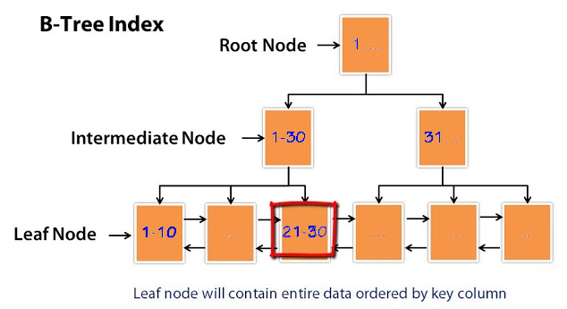
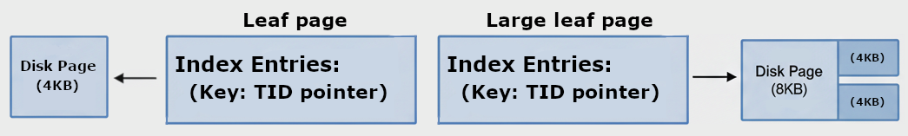
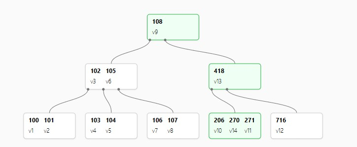
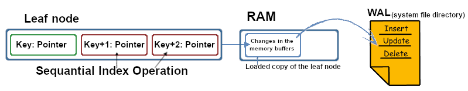
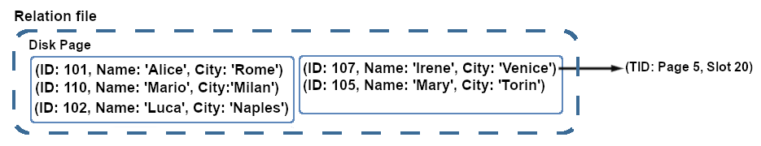

# B-tree, properties and

* 1
* 1
* 1
* 1

A B-tree index is designed to store **sequential data,** and it uses its **operation classes** to organize entries in a **linear** order.

It's a **multi-way balanced** tree optimized for consistent **single-entry** and **range** data retrieval.
\
It's `balanced` because all leaf nodes are located in the bottom level, ensuring every search passes through the same number of **layers**.
\
It is `multi-way` because each node can branch out into multiple **child nodes**, making the tree wider and minimizing the number of levels necessary for a query search.

\--IMMAGGINE editare--

The B-tree entries are stored in **physical disk pages**, while its structure is made of **logical nodes** that can have multiple roles depending on their position in the tree.

> The **root node**, located at the top of the tree, is the starting point for every query. It provides the initial pointers to the first set of internal nodes.
>
> The **internal nodes**, located between the root and leaf nodes, contain key-pointer pairs that direct the search to
> &#x20;the corresponding child node.
>
> The **leaf node**, located at the bottom of the tree, contains the actual entries.

An index entry is composed of a **key-pointer** pair. The `key` is the exact **column value** being stored in the b-tree, and its **size** depends on its data type and length. The `pointer` is a fixed size adress that points to the **location** of the entry data.

The role of a **pointer** depends on the node it's placed in:
\
In an **internal node**, the pointer acts as a roadmap, referencing the specific **child node** that includes the searched entry value in its range.
\
In a **leaf node**, the pointer is a specific **address** to the **physical location** of the **table row** containing the entry key **column value**; it can be a tuple identifier or a memory block notation.

In a standard B-tree, the single pointers in the internal nodes can be used to retrieve the actual table data, depending on the implementation.

<figure><figcaption><p>Each leaf node entry TID points to the table row</p></figcaption></figure>

B-tree **nodes** are designed to have the same size as a **disk page**. This allows the entire node to be retrieved in a single I/O operation, making the query require only one **disk access** on each index level.

A B-tree node can contain data equivalent to multiple disk pages (e.g., 4KB, 8KB, or 16KB), allowing the index to **adapt** efficiently to larger databases.

<figure><figcaption><p>Both will require a single I/O access to the disk </p></figcaption></figure>

The maximum size of a B-tree entry is 1/3 of the node it's placed in. This rule ensures that every node can branch out to a minimum number of child nodes, which helps maintain a wide, **horizontal index** structure.

The **order** (m) of a B-tree determines the maximum number of children an internal node can have.           It also defines the maximum number  (m−1) and the minimum number of keys (m/2) .an index can have.

In an internal node, pointers act as **dividers** that create **ranges** between their **key values**, which are then represented by the child nodes. In a leaf node, the the `m−1` key rule doesn't apply because each key-pointer pair points to the **single physical location** of its data.

An incomplete child node will only fill its empty spaces with entries that fall within the specific range implicitly defined by its parent node's pointers.

<figure><figcaption></figcaption></figure>

Once the number of **keys** in a node exceeds the index's order (m), the node **splits**.
\
A new parent internal node is created containing the **lowest median key** value. The original node's entries are split between the newly created **child nodes**, using the internal node's median key as the **divider**.

The internal node contains only single values, not ranges like its child nodes. It gets updated each time one of its children splits.
\
Once an internal node becomes full, it creates a new **parent internal node** with its median value.
\
It splits the internal node's entries and their corresponding child nodes between the original node and the new **sibling node**.

The **ranges** defined by the **internal node's** entries have different boundaries for the left and right sides.
\
The key-pointers for 5 and 12 will create child nodes that cover these respective ranges:                                               `x<5
, 5≤x<12
, x≥12`
\
All nodes are sorted horizontally in a linear order.

The database can perform an **index-only scan** on queries that use only **indexed columns** for all of their elements, including the SELECT list and all clauses (WHERE, ORDER BY, etc.).

```sql
//It skips the leaf pointer data retrieval and it returns the key values
create table dritto( uno INT, due TEXT )

insert into dritto(uno, due) values (12, 'penna'),(7, 'mano'),(3, 'foglio');
create index dritto_idx on dritto(uno);

explain analyze select uno from dritto where uno>=7;
```

It's a highly optimized **database operation** triggered by the query planner. It retrieves the data directly from the index structure, without using the entry TIDs to access its table row data.

1

— Somehng anticipating teh optimitation and WAL.

<details>

<summary>LINEAR INSERTS optimitaton</summary>

The index's INSERT operations are slowed down by **non-linear** or randomly generated data types.
\
They can cause unpredictable page splits and lead to inefficient leaf-node entry distribution, but they won' affect SELECT operations.

The PostgreSQL SERIAL and MySQL AUTO\_INCREMENT constructs create **efficient sequences** of column values in the index. They generate values in a linear order, allowing for an efficient leaf-node storage and reducing the node splits.

The database loads copies of frequently accessed data pages into its RAM cache, allowing it to update the pages without I/O operations. It then pushes the changes to the physical disk before the page split.

The database uses a sequential **Write-Ahead Log** (WAL) on the disk to prevent data loss.
\
Any change to a data page is first recorded in the WAL before it's applied to the page in the RAM cache. The database will replay the WAL operations to restore the data after a system crash.

The **entry's size** impacts the B-tree structure and efficency.
\
A **large key** data type causes the node to contain fewer entries before it splits, making the index taller and slowing down the data retrieval.
\
A **small key** data type may not provide enough unique values due to its shorter length.
\
An INT 32-bit integer has 2.1 billion possible values, while a BIGINT 64-bit integer has 9.2 quintillion values, offering more unique values in exchange for a larger entry size.

</details>

<figure><figcaption><p>All RAM changes are stored in as binary code for recoverability</p></figcaption></figure>

1

### INDEX MAINTENANCE on Update operation, for outdated entries.

The database stores a table's rows in a collection of **disk pages**, which is called a **table heap**.
\
It's optimized for size, and organized into unordered tuples, with each containing the column data for a single table row.

The database will require a table scan to retrieve tuple data from the heap, or an index scan.                                           The index includes a TID (Tuple Identifier) for each entry of its indexed columns, which is used to locate the specific tuple in the heap.

<figure><figcaption><p>The disk pages are stored within a relation file </p></figcaption></figure>

The table heap will append any new INSERT tuple to the end of the heap, without any page range condition or ordering like in the B-tree. On UPDATE operations, the new tuple's position depends on whether the updated **tuple columns** are part of a table's **index**.

An UPDATE value including an indexed column will be appended as a new tuple in the heap, and it creates a **new entry** in the **index**, which points to the **new version** of the **tuple** with its TID.
\
Any outdated tuple and index entry will be kept and handled by the later maintenance operations.
\
An UPDATE value that doesn't include an indexed column will instead result in a HOT update.

A **Heap-Only-Tuple**(HOT) UPDATE modifies the table heap without triggering an **index update**.
\
It adds a new version of the tuple to the **same disk page** as the old one. It also adds a **forward pointer** to the old tuple, which allows its index entry TID to find the correct data.
\
If there is no available space on the old tuple's disk page, it defaults to an indexed update.
\
The database management system contains the rules for the HOT update. The **query planner** provides the **execution plan** for the database after analyzing a query.

<figure><figcaption><p>The t_ctid tuple property gets updated with a forward pointer on HOT update</p></figcaption></figure>

### Maintenance

The **version bloat** forms when the index or the table heap gets full of outdated values.
\
A tuple is marked as dead on DELETE or UPDATE and will be removed after a **visibility check** during maintenance. An index entry isn't explicitly marked; its TID is checked to see if it points to a dead tuple.

— MAYBE image about TUPLE bloat and index outdated --

The REINDEX command is a global maintenance operation. It performs a complete table scan to **rebuild** the index from the **current tuples** in the table heap, which is then used to replace and update the old index.
\
It relies on a prior VACUUM visibility check to detect the live tuples; if not, it defaults to indexing all tuples, even outdated ones.

The BOTTOM-UP **defragmentation** process triggers when a full B-tree index page is about to split.
\
It is a **localized** and immediate maintenance operation that cleans up outdated **index entries**.

The VACUUM operation is a page-by-page maintenance process that **deletes** **dead tuples** in the table heap and **marks outdated index** entries for removal.
\
The VACUUM is triggered manually while the AUTOVACUUM is triggered on a schedule. The space from deleting dead tuples is not returned to the operator system; it is marked as **free internally** for new tuples in the same table heap.
\
A table heap's size is reduced by relocating its data to a smaller set of disk pages, which requires blocking all transactions. The VACUUM mantains the table heap under the MVCC conditions, mantaining concurrent access during UPDATE operations.

The VACUUM FULL command **removes dead tuples** by replacing the old table heap with a new one with only live tuples. It includes a REINDEX for the index, rebuilding it using the live tuples from the new table heap.

The VACUUM operation uses the **transaction IDs** to determine the visibility state of a tuple.
\
Every transaction is assigned a unique **XID**, which is assigned to the XMIN property of the new tuples it creates and the XMAX property of any tuples it updates or deletes.
\
The VACUUM sets its cleanup cutoff point based on the XID of the **oldest currently active transaction**. It will remove tuples with an XMAX value lower than the XID, as they are no longer visible to any ongoing transactions.

### Property

The **pgstattuple** extension provides **functions** that reveal low-level details about the database's **physical storage**. It returns properties like **bloat** and **unused space**, which are invisible to high-level commands like SELECT.                                                                                                                                                              It's included in the PostgreSQL, but must be first activated with the CREATE EXTENSION command.

The **pgstattuple()** function analyzes the physical layout of its table heap:

> **table\_len**: The total size of the table in bytes, including the empty and unassigned space. **tuple\_count/tuple\_percent**: The number of all tuples (both live and dead) and the percentage of the table's space they occupy.                                                                                                    **dead\_tuple\_count/dead\_tuple\_percent**: The number of dead tuples and the percentage of the table's space they occupy.                                                                                                                       **free\_space/free\_percent**: The amount of empty space on the table's pages, measured in bytes, and the percentage of reusable space in the table's total disk space.

The **pgstatindex()** function is part of the pgstattuple extension, and returns statistics about the physical properties of a B-tree index:&#x20;

> **tree\_level**: The number of levels in the index, from the root page down to the leaf pages. **leaf\_pages/internal\_pages**: The total number of leaf and internal pages that make up the index. **index\_size**: The total size of the index on disk, in bytes.                                                                                                                                                **avg\_tuple\_size**: The average size of each entry in the index, in bytes.                                                                                                           **avg\_leaf\_density**: It measures the **internal fragmentation**, represented by the average **percentage** of space used within each index leaf page. It's low in highly fragmented pages with empty and inefficent space and it's affected by the VACUUM operation.                                                                                                        **leaf\_fragmentation**: It measures the **external fragmentation**, showing how physically scattered the index's leaf pages are on the disk. A high value indicates that **logically sequential pages** are not **physically located** next to each other. It can slow down index scans, as the disk must jump between different locations to read the data.

The External fragmentation is related to an **index's activity**, not its size. A large but static index will have low fragmentation, while a smaller index with frequent updates will become highly fragmented. This condition is correlated with how the index handles **page splits**. The process is opportunistic, meaning it uses the first available disk page to store the new node's data.                                                                  The fragmentation measures the **physical distance** on the disk between leaf pages that are logically supposed to be right next to each other.

— CODEABOUT USING TEH EXTENTION TO ACCESS, also the system catalog access --

```sql
//We create a 10 concatenate series of md5 string algorit to increase teh size of the 
//insert.
//We longer strings y repeatng and appending them to each other in teh same column.
//We use additional fillfactor 70 to reduce teh avaiable sopace for teh insert and present, it will increase the number of nodes necessary as a part of teh space is reserved for the next updates on teh index.

create table spazio(
  uno INT, due TEXT
)

insert into spazio 
  select i, repeat(md5(i::text), 10) from GENERATE_SERIES(1, 100000) as i;
create index spazio_idx on spazio(due) with (FILLFACTOR = 70);	

SELECT 'space' as table_name, PG_SIZE_PRETTY(table_len), tuple_count, free_percent
FROM pgstattuple('spazio');

//The index returns the tree levels include the root level as 1.
SELECT 'space' as index_name, tree_level, 
  leaf_pages, internal_pages, PG_SIZE_PRETTY(index_size), avg_leaf_density
FROM pgstatindex('spazio_idx');

```

1

We can access a **table's** or **index's** structure using the **pg\_class** system catalog view.
\
The pg\_class is a built-in feature that provides a native view of the **metadata** for every database **relation**. Unlike extensions, it requires no installation. It returns high-level data **estimates**, which are calculated by the database during maintenance operations and doesn't scan the physical storage pages.

The **view** includes the following key columns:

> **relname**: The name of the relation
> \
> **relkind**: A code indicating the type of relation
> \
> **relpages**: The estimated number of disk pages used for the relation's storage.
> \
> **reltuples**: The number of tuples or index entries in the relation.
> \
> **oid**: The unique identifier used by the database to retrieve the relation's physical size.
> \
> **reloptions**: The storage options specified when the relation was created

```sql
//On the same spazio table as before
//The 'r' and 'i' relkind are for tables and indexes respetevly.
SELECT  relname, relkind, relpages, reltuples
  , PG_SIZE_PRETTY(PG_RELATION_SIZE(oid)), reloptions
FROM pg_class
WHERE relname LIKE '%spazio%'
ORDER BY relkind DESC;

relname   |relkind|relpages|reltuples|pg_size_pretty|reloptions     |
----------+-------+--------+---------+--------------+---------------+
spazio    |r      |    4546| 100000.0|36 MB         |NULL           |
spazio_idx|i      |    6644| 100000.0|52 MB         |{fillfactor=70}|
```

The database provides many specialized **system views** and **functions** that rely on the pg\_class master **catalog**.
&#x20;The unique OID stored in pg\_class is used to retrieve the relation's metadata from its specific directory.

<details>

<summary>More system view, access relations</summary>

We query system views or functions using the **relation's name**; PostgreSQL's internal process automatically retrieves the linked pg\_class **OID**, which is the actual value used internally by the **operating system functions** to access the metadata.

The **pg\_indexes system view** provides logical metadata about the indexes.
\
It returns the index's name, its table, its SQL script command, and its assigned tablespace.
\
The TABLESPACE keyword defines a custom directory for database files, storing them in a separate physical location from the default PostgreSQL data directory.

```sql
//We can access the assigned table 
SELECT tablename, indexname, indexdef, tablespace
FROM pg_indexes WHERE tablename = 'spazio';

//It can be defined in create table or index.
CREATE TABLE my_table (...) TABLESPACE new_disk;
CREATE INDEX my_index ON my_table (col) TABLESPACE faster_disk;
```

The **pg\_stat\_all\_tables()** function provides the table's **runtime statistics**.                                                        It includes the **row operation** counts, the number and types of **scans**, the number of live and dead **tuples**, and **timestamps** of the last maintenance operation.                                                                       The **statistics collector** provides the exact table activity paramethers from a dedicated runtime **directory**, enabling the efficient monitoring and validation of maintenance processes without requiring a full table scan.

```sql
//It represent how the table has been used, not its structure
//Unlike pg_class that provides estimates updated ON maintenance operations
SELECT relname, n_live_tup, n_dead_tup    //Tuples count
    , n_tup_ins, n_tup_upd, n_tup_del     //Rows table operations, of tuples
    , seq_scan, idx_scan                  //Table scans, sequential or by index
    , last_vacuum, last_autovacuum, last_analyze, last_autoanalyze
FROM pg_stat_all_tables 
WHERE relname = 'spazio';
```

The **pg\_stat\_all\_indexes()** provides similar statistics specific to the index, like the number of index entry reads.

The **pg\_relation\_size()** function returns the exact size of a database relation.                                                        It doesn't rely on the pg\_class metadata estimates, it queries operating system functions to access the **physical disk location** of the relation.

```sql
//It returns it in bytes, unless we pretty it, includeinf index and tables, 
select pg_relation_size('spazio_idx'), 
    pg_size_pretty(pg_relation_size('spazio_idx'));
```

The **pg\_total\_relation\_size()** function queries the same operating system functions as pg\_relation\_size() but includes the table's **additional structures**, like TOAST while excluding any associated indexes. A TOAST table stores column values that are too large to fit on a standard data page.

```sql
// Some code
//It doesnt work on indexes
select pg_total_relation_size('spazio'), 
    pg_size_pretty(pg_total_relation_size('spazio'));
```

The **pg\_table\_size()** function queries the same operating system functions as pg\_total\_relation\_size(), it accesses the table physical file to return the exact table size and its associated structures.                                                                                                                                                 The **pg\_indexes\_size()** shares the same queries but accesses different physical file locations, as it returns the combined sizes of all **indexes associated** with the specified table.

```sql
// Some code
select pg_table_size('spazio'), pg_size_pretty(pg_table_size('spazio'));

select pg_indexes_size('spazio');
```

</details>

1

1

1

1

1

1

Presentation of the bloat.

<details>

<summary>Esercizio Effetti VACUUM on failed HOT update and its inèact of properties</summary>

We used the pgstattuple and pgstatindex extensions to gather data on **table** and **index bloat.** This allows us to analyze the impact of VACUUM after a series of **sequential updates**.

We create two identical tables, one with autovacuum disabled, and populate each with 10,000 rows. We then create an index on the id column for both tables before we performed five consecutive **HOT updates** on a non-indexed column.

On the table without autovacuum, pgstattuple shows a **dead\_tuple\_count** of 5 and a high **dead\_tuple\_percent**. This reflects the five outdated **tuple versions** left in the table heap. The table with autovacuum has both properties at 0, as the background process has already cleaned up the outdated tuples.

```sql
//For both pgstattuple() and pgstatindex()
CREATE EXTENSION IF NOT EXISTS pgstattuple;

CREATE TABLE no_vacuum (id INT, nome TEXT) WITH (autovacuum_enabled = false);
CREATE TABLE table_vacuum (id INT, nome TEXT);

INSERT INTO no_vacuum SELECT i, MD5(i::TEXT) FROM GENERATE_SERIES(1,10000) i;
INSERT INTO table_vacuum SELECT i, MD5(i::TEXT) FROM GENERATE_SERIES(1,10000) i

//index andupdate on different columns id/name
CREATE index idx_no_vacuumed ON no_vacuum(id);
CREATE index idx_table_vacuumed ON table_vacuum(id);

DO $$
BEGIN
  FOR i IN 1..5 LOOP
    UPDATE no_vacuum SET nome = nome || 'x';
    UPDATE table_vacuum SET nome = nome || 'x';
  END LOOP;
END; $$;

//The AS table_name doesn't influence the pgstattuple() 
SELECT 'no_vacuum' as table_name, dead_tuple_count, dead_tuple_percent
FROM pgstattuple('no_vacuum');

//It returns the index bloat
SELECT 'idx_no_vacuumed' as index_name, 
          leaf_fragmentation, avg_leaf_density, index_size
FROM pgstatindex('idx_no_vacuumed');

//Table heap/Index properties of the AUTOVACUUM table
SELECT 'table_vacuum' as table_name, dead_tuple_count, dead_tuple_percent
FROM pgstattuple('table_vacuum');

SELECT 'idx_table_vacuumed' as index_name, 
          leaf_fragmentation, avg_leaf_density, index_size
FROM pgstatindex('idx_table_vacuumed');

VACUUM table_without_autovacuum;
//Once aplied to teh "no_vacuum" table, it equates its properties
```

The AUTOVACUUM only affects the internal fragmentation of the table it runs on.                    The GENERATE\_SERIES() INSERTs uses all **available space** on the disk pages because of the default FILLFACTOR of 100.                                                                                                                                             A Heap-Only Tuple (HOT) update requires free space on the page to store the new version of a row. Without any available space, the HOT **optimization fails**, and the system performs a standard update, creating a **new index** entry for every updated row.&#x20;

The AUTOVACUUM removes the **outdated entries** from a leaf page. The created empty space lowers the **avg\_leaf\_density**, which remains high in a non-vacuumed table.                                            The process doesn't affect the external fragmentation. The Leaf\_fragmentation represents how organized the data is within the **physical index structure**.&#x20;

The GENERATE\_SERIES() INSERTs maintain a low external fragmentation by creating an organized and contiguous series of data, while UPDATE operations increase it.                                     The string-based data types are **not ordered linearly** like integers, an updated entry will not be placed in a contiguous location next to its old value, even if the string is mostly the same.                   The external index structure can be reorganized by the REINDEX operation, which completely rebuilds the data's distribution across the index pages.

— IMMAGGINE I RITORNI DEI DATI AUTOVACUUM

A lower FILLFACTOR increases the chances for successful HOT updates, which in turn decreases the index size. The leaf\_fragmentation is also lower because fewer new pages are created and scattered across the disk, resulting in a more compact index structure. The avg\_leaf\_density, however, varies depending on the index's size.                                                                     The FILLFACTOR also slightly influences the table heap's dead\_tuple\_percent. It doesn't change the number of tuples inserted or which ones are considered live or dead, but it increases the number of disk pages needed to store the initial data. The larger table size results in a lower dead\_tuple\_percent.

```sql
//The FILLFACTOR infleunces the no_vacuum table heap and index
CREATE TABLE no_vacuum (
    id INT, nome TEXT
) WITH (autovacuum_enabled = false, FILLFACTOR = 80/60/40);
```

— IMMAGGINE ESEMPI FILLFACTOR

1

```sql
//The FILLFACTOR can influence even the AUTOVACUUM table/index
CREATE TABLE table_vacuum (
    id INT, nome TEXT
) with (FILLFACTOR = 50);
```

1

1

1

</details>

— METTI QUI L'IMMAGNE DEI DATI --

1

### COMPOSITE

A B-tree **composite index** includes multiple columns in its CREATE INDEX statement.
\
Each composite key is a combination of the indexed column values, and it points to a single TID.

```sql
//A single index with each key includes the 2 columns values
CREATE table multi( uno INT, due TEXT, tre INT );
insert into multi (uno, due, tre) values (12,'base', 22), (7,'pen',43), (17,'cup',19);

create index multi_idx on multi(uno, due);
```

The structure of a composite index is defined by its first CREATE INDEX column.
\
The B-tree uses the first **column's value** to define the ranges and distribution of its nodes.  All the following **columns' positions** within the composite key will depend on the placement of the first column value.
\
A **query** must include the **first column** in its WHERE condition to effectively **navigate** a composite index. A **latter column** would have to scan every entry to find a its value, resulting in an operation similar to a full table scan.

— IMMAGGINE OF COMPOSITE INDEX WITH FIRST KEY ordering --

We follow the "**left sort rule**" when creating a composite index to optimize its queries.                                                   We decice the **order of the columns** based on the type of data they contain and the **query** operations they're involved in.
\
It prioritizes columns with the highest **cardinality** (most unique values) as they allow the index to quickly filter a large number of rows.
\
It prioritizes columns involved in more **specific operations**, like equality checks (=), as they allow the index to filter out more specific results.
\
It doesn't prioritize columns used in the ORDER BY clause as they are used to sort results that have already been filtered at the end of the query.
\
We can include the ASC and DESC keywords in the CREATE INDEX statement to match the sort order of an ORDER BY clause. This allows the database to skip the sorting step in the query.

```sql
//Being the default sorting index as ASC
CREATE INDEX idx_products_price_desc ON products(price DESC);
SELECT * FROM products ORDER BY price DESC;

CREATE INDEX (col_a, col_b DESC)
WHERE col_a= ORDER BY col_DESC
```

1

### Table LOCK and CONCURRENCY option and MVCC

The database applies a **table lock** when creating an index, which prevents any other **operations** on the table's data.

We can avoid the inaccessibility period by using the CONCURRENCY keyword in the CREATE INDEX statement. It allows the database to create the index without locking the table, keeping it available for other operations.

The CONCURRENCY keyword builds the index in a temporary space, requiring **multiple scans** to include any tuple updates and maintain data consistency with the table heap. Once it's complete, the database applies the new **index** to the table.

```sql
//It keeps the table open for operation during long inserts like GENERATE_SERIES()
create table bloc( uno INT, due TEXT )

insert into bloc select i, md5(i::text) from generate_series(1, 10000) as i;
create index CONCURRENTLY on block(uno)
```

The MVCC (**Multi-Version Concurrency Control**) is a database method that manages concurrency.
\
**Concurrency** is a property of the **database management system** that allows it to handle multiple **transactions** on the same data unit simultaneously.
\
The MVCC provides a **consistent data** version for all transactions and prevents uncommitted changes from blocking other operations.
\
Multiple operations can maintain data concurrency, but not all of them employ the MVCC method.

The UPDATE operation employs the MVCC by not physically changing a tuple in the table heap.
\
It creates a **new version** of the tuple while keeping the old version available for any ongoing operation that started before the transaction was **commited**.
\
The process is a local read/write operation that leaves the outdated tuple for later maintenance operations like VACUUM.


The CONCURRENCY option applied to the CREATE INDEX operation doesn't use the MVCC.
\
It's a **schema-level operation** that maintains the concurrency of the table by avoiding a lock during index creation, allowing other operations to proceed.
\
It's not part of the MVCC approach because it **physically** creates and replaces an entire index instead of just **managing** local operations.

— Immaggine for MVCC maybe --

The first scan creates the **initial version** of the index by reading all the current table rows.
\
The second scan, triggered after the first is complete, verifies any **changes** made to the table during the initial index build, adding any new or updated tuples to the temporary index.
\
The final **data consistency** check validates the **atomic swap**, which is a single, indivisible action that replaces the old index with the new one.
\
The deleted tuples are handled by the standard VACUUM process, which marks their space as available.
\
An index created with the CONCURRENCY option will still contain entries that point to outdated tuples, they will be removed by later maintenance operations.

\--IMMAGGINE for concurrent triple scan --

We can apply a **constraint** directly to the values within an **index**.
\
The index's structure optimizes the constraint validation check on the current values, without having to scan the entire table. It's aplied only on constraint that implicitly create and use indexes, like UNIQUE and PRIMARY KEY.

```sql
CREATE UNIQUE INDEX CONCURRENTLY equipment_equip_id
ON equipment (equip_id);

ALTER TABLE equipment
ADD CONSTRAINT unique_equip_id UNIQUE USING INDEX equipment_equip_id;
```

Indexes can't be used to create multiple **logical partitions** of data from the **same column**.
\
The query planner has access to the index conditions but can't determine if they are mutually exclusive. It will check all relevant indexes, which adds overhead and makes the operation as slow as a table scan.
\
Instead we use the **declarative partitioning**, which is designed to handle this exact scenario.

```sql
//The query planner can't make any high-level logical partitionig analysis.
CREATE INDEX sales_2023_idx ON sales (sale_date) 
    WHERE sale_date BETWEEN '2023-01-01' AND '2023-12-31';

CREATE INDEX sales_2024_idx ON sales (sale_date) 
    WHERE sale_date BETWEEN '2024-01-01' AND '2024-12-31';
```

1

### Operation Familes and class

The B-tree assigns an **operation class** to each **data type** allowed within the index.
\
It contains the functions that set and maintain the linear sorting order of the index values, such as _sorting_ and _operator functions_.

— Immagine for operator classes --

The **sorting function** uses the **trichotomy rule** to determine the mathematical relationship between two values.
&#x20;It establishes the **initial sorted order** of the index and maintains it for every new entry added.

The **ordering relations** are the fundamental mathematical properties necessary for the **B-tree's linear order**.
&#x20;These rules are implicitly enforced by the sorting function.

> The index value must follow the **reflexive** rule (A=A), the **symmetric** rule (if A=B, then B=A), and the **transitive** rule (if A=B and B=C, then A=C) for the _equality operator_.
> \
> It must follow the **irreflexible** rule (A\<A is always false) and the **transitive** rule (A\<B, B\<C, then C\<A) for the less than (<) and more than (>) operators.
> \
> The **trichotomy** rule states that for any two values, A and B, only one of three conditions can be true: A\<B, A=B, or A>B. This rule ensures a single, **linear order**.

The **operator functions** handle the five comparison operations (<, >, =, ≤, and ≥) used for index **queries**.
\
A single-value query uses the (<) and (>) operators to **navigate** the B-tree index positions, then confirms the matching value using the (=) operator.
\
A range-value query uses the (≤) and (≥) operators to locate the start of the range and includes all entries until it finds the last key value that satisfies the condition.

**Operation families** group multiple operation **classes** for data types with equivalent **sorting rules**, like `int4` and `int8`, and allow for **cross-data type comparison** queries on the B-tree.

— MAYBE IMAGES FOR operator families, including and crossword --

The database identifies the different data types in the index query and checks if their operation classes are part of the same operation family. This allows it to **implicitly convert** one of the data types during the cross-data type comparison.

Some compatible data types, like NUMERIC and FLOAT, are not suitable for cross-data type comparisons. Their **different precision levels** would result in a converted NUMERIC value being different from the original, which breaks the transitive rule (A != A).

The metadata for the operation class functions is stored in the **pg\_amop** and **pg\_amoproc** system catalogs.

— Maybe I can check for real examples on teh postgresql output --

The **Access Method Operator** (`pg_amop`) system catalog is a central registry that links high-level comparison **operators** to their corresponding low-level **comparison functions**.                                                      The **metadata** for each entry contains a combination of the specific operator, data type, and index type used in the query. The database uses the information of the **matching entry** to retrieve the **operator class** that can process the query (from the **pg\_opclass** catalog).                                                                               The catalog includes an operator family column, which is used by the database to validate cross-data type comparisons in a query.

The **pg\_amproc** (Access Method Process) system catalog contains the indexes' **sorting functions**.                    The database retrieves and automatically triggers the specific support function for the **data type** being used during the CREATE INDEX command. This registry is shared among all of the database's indexes.

1

### B-TREE SUPPORT FUNCTIONS

The **support functions** are specialized methods contained within each _operator class_.
\
They optimize the B-tree's **core operations**, like the sorting function that sets and maintains the index's internal structure.

> The **ORDER** support function implements the **trichotomy** function for index entries.                                                    It compares two values and returns an int32 outcome representing their mathematical relationship. A specific version of this function is included for each data type allowed in the index.
>
> The **SortSupport** optional function optimizes index sorting.
> \
> It acts as a helper for the ORDER function, loading all the indexed column data into RAM where it's efficiently sorted using a **block-focused algorithm**. The query planner chooses to use it for **large datasets**, where the single-time overhead of loading data into RAM is less than the cost of multiple, single-comparison disk operations performed by the ORDER function.
> \
> The function's availability depends on the data type's operator class.
>
> The **in\_range** support function optimizes the index's range operations.
> \
> On select queries, it helps the database quickly find specific ranges without a full table scan.                                  On insert, it speeds up the top-down B-tree navigation to the correct child node by efficiently matching the inserted value to the ranges defined by the internal nodes.
>
> >

1

The **equalimage** support function is an optional helper for **index deduplication**.
\
It allows a B-tree index to store multiple table rows values in a single key, using a **posting list** of TIDs, and avoids the use of multiple keys for the same values.

The equalimage function is triggered for all **repeated values** within the index keys.
\
It applies a **semantic check** to validate the key deduplication, which allows the database to create a **canonical image** of the values. It also includes NULL entries, which, unlike in standard SQL, aren't considered unique and can be grouped together.

The database deduplicates values during the CREATE INDEX and REINDEX operations, automatically checking for equal values within the index. On INSERT and UPDATE it acts as a **conditioned lazy process**.

The deduplicated key's posting list must fit within its **single node**. It can't span across multiple nodes, and if its size exceeds the node's capacity, the duplicate values will be stored as separate keys.

Columns added to an index using the `INCLUDE` clause can't be deduplicated. They are stored in the node as part of the index's posting list and can't be further deduplicated.&#x20;

```sql
//They are called covering indexes and the INCLUDE column is not part of the key.
CREATE INDEX my_index ON my_table(indexed_col) INCLUDE (included_col);
```

The function only applies to a single column and requires a deterministic collation to consistently create a semantic image for values.

<details>

<summary>Collation and deterministic image</summary>

The deduplication process relies on the database's _deterministic rules_ applied to its comparison operations.

The database includes 2 types of **equality:**                                                                                                              The **byte-by-byte** equality, for data types like INT where it compares the exact match between 2 single values.                                                                                                                                                              The **logical equality**, for data types like TEXT where we compare the logical results of the values, like the strings "straße" and "strasse".
\
The deterministic rule ensures that any comparison will always yield the same result for the same values.

The **equalimage** function is triggered when the equality operator returns TRUE for repeated index values.
\
The **deterministic rule** conveys the validity of the operation to the **equalimage** function.                       It allows the function's **collation rules** to create a **semantic image** that's compatible with any value returning TRUE to the **equality** operator, rather than being based on the specific string composition.
\
The deterministic rule is active by default; if disabled, the comparison will still consider the logical values equal, but it won't allow equalimage to create the semantic image because the comparison is no longer consistent.

The equalimage function is only used once, during INDEX creation, to create the initial semantic image. On INSERT or UPDATE operations, the database relies on the deterministic result of the equality comparison to validate and add logically equal values to the posting list without needint to trigger the equalimage.

Certain compatible data types can't be deduplicated, such as FLOAT4 (REAL) and FLOAT8 (DOUBLE PRECISION), because of their different precision levels and how they handle specific values like +0 and -0.
\
If an indexed column can hold multiple compatible data types (e.g., VARCHAR and TEXT), their values can be deduplicated on the same semantic image.

1

</details>

1

### THE B+TREE

The B+tree is a streamlined version of the B-tree data structure.

The B+tree stores key-TID pairs only in the leaf nodes, using the internal nodes only for keys and child pointers. This is different from a standard B-tree, where the internal nodes also contain the TIDs of their single values that act as dividers.

The B+tree includes a **doubly linked list** that **horizontally** connects nodes at the same tree level.
\
It optimizes range values retrievals by avoiding to vertically traverse the tree.
\
It can slow down single-value queries because the search must always reach a leaf node, while a standard B-tree can retrieve the data from an internal node.

The B+tree **logical structure** is implemented differently depending n the _database management system_:

In MySQL, a B+ tree includes `previous` and `next` pointers for all nodes at every horizontal level, which allows for efficient horizontal retrieval of data.                                                                                                                       In PostgreSQL's, the B-tree only has the `previous` and `next` pointers at the last level for the leaf nodes.

Both follow the N keys for N+1 child pointers rule for their internal nodes.

The B+ tree is used for a table's primary key index. Its TID works as a unique row identifier.
\
It's created by default on CREATE TABLE when a primary key is included in a column definition, it optimizes data retrieval on the table's heap.

— Immaggine B+Tree --

1
