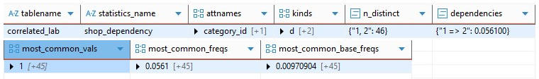

# PG statistics

* 1
* 1
* 1
* 1

The ANALYZE command updates the **pg\_statistic** and **pg\_class** system catalogs, which are used by the Query Planner to determine the **cost** of the chosen **execution plan**. The table rows processed by the _reservoir sampling_ store their column metrics in pg\_statistic to represent the table statistical properties:


**Null\_Frac**: A value between 0 and 1 representing the proportion of NULL values present in the sampled table set.&#x20;

**n\_distinct**: The number of unique, non-null column values found in the sampled rows.&#x20;

**Average Width**: The average physical length (in bytes) of the column's values.&#x20;

**Correlation**: A value (between -1 and +1) that represents the physical correlation between the logical order of the rows and their physical location on disk, with 0 being random.

**most\_common\_vals**: An array that holds the Most Common Values (MCV) that appear in the rows. **most\_common\_freqs**: The parallel array that holds the fractional frequency (proportion) for each corresponding MCV value.&#x20;

**Histogram Distribution**: The distribution of the values that aren't part of the MCV set, which informs the planner about the data spread of the column values.


```sql
-- The ANALYZE updates the system catalog statistical information
CREATE TABLE tavole ( codice integer, padding text );

INSERT INTO tavole (codice, padding)
SELECT floor(random() * 100000) + 1, md5(random()::text)
FROM generate_series(1, 100000) AS i;

ANALYZE tavole;
-- pg_stats is the user-friendly interface to the pg_statistic system catalog.
-- Both the most_common and the histogram_bounds are arrays
SELECT 
    tablename, attname AS column_name,
    null_frac, n_distinct, correlation,        
    most_common_vals, most_common_freqs, histogram_bounds 
FROM pg_stats WHERE tablename = 'tavole' AND attname = 'codice';
```

— IMMAGGINE

Database statistics utilize specific system columns depending on the **data type** of the column being analyzed, like most\_common\_vals and most\_common\_elems.

<details>

<summary>VALUES ADN ELEMETS IN PG_STATISTICS and more pg_statiscst</summary>

Statistics for **values**, as scalar data types (like integers and text), are based on how frequently the entire **data cell** appears in the column. The statistics for **elements**, as complex data types (like ARRAY or JSONB), track how often the **internal items** appear inside the data structures across the table rows.

The pg\_stats view includes specific columns reserved for multidimensional data types, like the **most\_common\_elem\_freqs** and **elem\_count\_histogram**. These columns appear in the view's **output structure**, but remain empty (NULL) if the analyzed table column doesn't contain a complex data type.

The n\_distinct metadata value varies based on its mathematical sign. A positive value returns the number of unique column values in the table statistics, while a **negative value** represents the **ratio** of unique values to total rows (where -1 is 100%).

The query planner uses it to calculate **cardinality**, providing either a **precise count** of unique values or a **stable percentage** estimate as the table scales. It includes the total unique values in both the MCV list and the histogram.

An **equi-height** **histogram** contains a fixed number of values across all **buckets**, while the **width** defined by its boundaries varies. Each bucket represents an equal fraction of the table rows, accurately reflecting the data's density.

</details>

— CREATE TABS FOR PG\_CLASS AND

The ANALYZE command updates the metadata columns in the **pg\_class** catalog:


**reltuples**: The estimated count of the live rows (tuples) in the table.

**relpages**: The estimated number of disk pages occupied by the table.&#x20;


The **pg\_statistic** data is stored in **binary** code. It's designed to be read by the **query planner** and requires an interpreter to be accessed. The **pg\_stats** is not a system catalog but a **system view**, a _virtual table_ created by a query. It formats the pg\_statistic data into a readable structure and joins columns from other catalogs, like **tablename** and **attname** (column name).

1

A single-value **equality clause** (=) calculates its **selectivity** by first checking the most\_common\_vals for the query value; if found, it returns the corresponding mcv frequency.                                                            The query planner estimates the **non-MCV** query value using the **residual frequancy** (using the formula 1 - the sum of all mcv frequencies), it then divides it by the number of remaining distinct values (subtracting the **mcv values** form the total **n\_distinct**), assuming a **uniform distribution**.                                                                               A **scalar range** (<, >) query analyzes the boundaries of the **histogram buckets** to detect which ones include the query values. The planner defines the specific range by using **linear interpolation** to "cut" the histogram bounds, in order to estimate the total frequency for the selected range.

The **frequency** and **selectivity** can share the same mathematical value, but they represent different data sources and stages within the **query planner process**.
\
The frequency is a **raw value** stored in the **pg\_statistic** metadata columns. It represents the **physical proportion** of specific values within the table rows.
\
The selectivity defines the **fraction** of rows selected by the **query clause**. The query planner calculates this value based on the frequency, but the result changes depending on the specific **query conditions** being estimated.
\
The probability is the conceptual term we use to interpret the selectivity value.

1

The **query planner** compares all **paths** in the **plan tree**, calculating the cost of each physical operation based on its **selectivity**, **correlation**, and **average row size**.
\
The **total cost** of an **execution plan** is determined by **data volume** and I/O efficiency. The planner calculates the volume by multiplying **selectivity row count** by the **avg\_width**. The **correlation** (ranging from -1 to 1) represents the **I/O cost**: high absolute values indicate ordered data suitable for index scans, while values near zero indicate scattered data that requires Bitmap or Sequential scans to avoid the random I/O cost.

The SELECT columns define the **output payload** and infleunce the query plan **cost** with their **avg\_width** value, while the WHERE clauses define the **estimation process** for the columns **selectivities**.
\
The planner retrieves the selectivies for multiple query conditions (equality or scalar) from the MCV list and the histogram bins as non-overlapping data sources. It **multiples** the selctivities values for 'AND' conditions while it **sums** it for 'OR'.

The query planner uses the conditional **independence assumption** when evaluating plans involving **multiple columns**.
\
It multiplies the **individual selectivity** of each column, assuming they are **unrelated**.                                    **Extended statistics** estimate the **functional dependencies** between correlated column values, which provides the ANALYZE process with additional data for a more accurate execution plan.

1

— EXTENDED STATISTICS

The CREATE STATISTICS command builds a **statistical object** for its specified table columns.                     It's not part of the standard pg\_stats view; instead it consists of multi-party entry distributed across two primary system catalogs **pg\_statistic\_ext** and **pg\_statistic\_ext\_data.**

The extended statistics metadata differ from the pg\_statistics. They cover **multivariate functional dependencies** and use them to enhance the standard query planner **estimation process**:&#x20;


**Initial Estimation**: The planner generates an initial estimate using standard pg\_stats metadata.&#x20;

**Stat Lookup**: It checks the pg\_statistics\_ext catalog for the specific columns included in the query.

**Override**: If matching columns are found, the planner overrides the _initial estimate_ to produce a more accurate execution plan.&#x20;

The planner can still partially apply the extended statistics for **some matching columns** while treating the remaining ones as independent.


The CREATE STATISTICS command requires running ANALYZE to **populate** the pg\_statistics\_ext\_data catalog with the actual **processed information**.

```sql
-- We create a table with correlated values using a SUBQUERY
CREATE TABLE correlated_lab ( category_id int, sub_category_id int );
-- It inserts table column values in different stages of the query
INSERT INTO correlated_lab (category_id, sub_category_id)
WITH source_data AS (
    SELECT (random() * 9 + 1)::int AS cat_id  --The +1 is there to avoid values 0
    FROM generate_series(1, 100000)
)
SELECT 
    cat_id, -- The first column
    CASE 
        WHEN cat_id = 1 THEN 1       -- Functional dependencies for value 1
        ELSE (random() * 4 + 1)::int -- random values (1-5) for the rest
    END
FROM source_data;
-- It collects the statistics for the single columns
ANALYZE correlated_lab;

-- The query planner estimates the selectivity from the separate columns
-- The rows being 0.05496 * 0.17 * 100000 = 944
select most_common_vals, most_common_freqs from pg_stats where tablename = 'correlated_lab';
-- category_id|  1|0.054966666, sub_category_id|  1|     0.1718|

-- The indipendent assumption creates an innacurate rows estimation
-- It results in a incorrect cost estimate and a suboptimal query plan for the table values
EXPLAIN (ANALYZE) SELECT * FROM correlated_lab 
WHERE category_id = 1 AND sub_category_id = 1;
-- Seq Scan on correlated_lab (rows=944 width=8) (rows=5642)

-- We create an extended statistic for the two columns of the 'mcv' type
-- It requires ANALYZE to actually fill the columns statistics
CREATE STATISTICS shop_dependency (mcv) 
ON category_id, sub_category_id FROM correlated_lab;
analyze correlated_lab;

-- The query planner accesses the frequency for the {1, 1} column combination values
-- The table rows estimations 0.57 * 100000 = 5700
select most_common_vals, most_common_freqs from pg_stats_ext 
where statistics_name = 'shop_dependency' 

EXPLAIN (ANALYZE) SELECT * FROM correlated_lab 
WHERE category_id = 1 AND sub_category_id = 1;
-- Seq Scan on correlated_lab (rows=5700 width=8) (rows=5642)
```

-— Find a way to cerate teh doubfle colun explenation

The query planner is **data-blind** when calculating the total selectivity of the query's condition.               Both pg\_stats and pg\_stats\_ext rely on directly **matching raw query values** against MCV lists or histogram buckets.                                                                                                                                                The planner can't process **math operations**, **function calls**, or **type casting** within a query condition, as it would be too expensive to transform the values to match the pg\_stats metadata. It instead falls back on generic selectivity estimates, such as 0.005 for equality and 0.33 for scalar operations.

— It can work for single colun exprs --

<details>

<summary>Single column expression.</summary>

The CREATE STATISTICS command can generate **functional statistics** for **columns expressions**. The ANALYZE applies the expression to **every table row** and **maps** the results to a **virtual column**, which provides the planner with the actual data distribution and removes the need for guesses.

The functional statistics are stored separately from multivariate dependencies. They **don't include** metadata columns like as n\_distinct and dependencies, which are reserved for multi-column relationships; instead, they store their own MCV and histogram values in the **pg\_stats\_ext\_exprs** catalog.

```sql
-- We create a table with rows with sequantial values form 1-100000
CREATE TABLE expression_test AS SELECT generate_series(1, 100000) AS id;

-- It uses the generic selectivity 0.005
ANALYZE expression_test;
EXPLAIN ANALYZE SELECT * FROM expression_test WHERE (id % 100) = 42;
--Seq Scan on expression_test (rows=500 width=4) (rows=1000)
--  Filter: ((id % 100) = 42), Rows Removed by Filter: 99000 

CREATE STATISTICS expr_stat ON (id % 100) FROM expression_test;

-- It gets a closer rows estimation with the functional statistics 
ANALYZE expression_test;
EXPLAIN ANALYZE SELECT * FROM expression_test WHERE (id % 100) = 42;
-- Seq Scan on expression_test (rows=1007 width=4) (rows=1000)
--  Filter: ((id % 100) = 42), Rows Removed by Filter: 99000
```

1

</details>

```sql
-- The pg_stats_ext maps the boolean expression results not its table values.
CREATE STATISTICS singlecol_expr ON (sub_category_id < 3) FROM correlated_lab;
-- It collects statistics for the returned BOOLEAN data types 

//Put image returning
statistics_name|expr                 |null_frac|avg_width|n_distinct|most_common_vals|most_common_freqs      |histogram_bounds|
---------------+---------------------+---------+---------+----------+----------------+-----------------------+----------------+
singlecol_expr |(sub_category_id < 3)|      0.0|        1|       2.0|{f,t}           |{0.59026664,0.40973333}|                |
```

— IMMAGGINE

We add the IF NOT EXISTS clause to the CREATE STATISTICS command to prevent errors if an **object** with that **name** already exists. The clause triggers a **silent skip** based solely on the name, regardless of the columns or expressions used in the definition.

1

### Multi column dependency

The CREATE STATISTICS command creates **multivariate dependencies** when applied to multiple columns. The statistical object, stored in **pg\_statistic\_ext**, acts as a **flag**. It instructs the ANALYZE command to calculate **additional statistics** for those specific columns.                                                          The ANALYZE process maintains a **single scan** of the table data from the disk. It adds a simultaneous **second track** that analyzes the relationships between **column combinations** rather than treating them as separate and independent.

The **pg\_statistic\_ext** system catalog contains the columns **definition** of the statistics that appear in the pg\_stats\_ext view.


**OID**: It's an unique identifier of the statistics object within the database
\
**stxrelid**: The OID value of the **pg\_class** table described by the statistics object.
\
**stxname**: It records the **object's name** in the CREATE STATISTICS command.
\
**stxnamespace**: It identifies the schema (namespace) where the object resides.
\
**stxowner**: The OID of the user managing the access.
\
**stxkeys**: It's an array that contains the columns **positions attributes** of the statistics object as **indexes**.
\
**stxkind**: A string that defines the different **types** of analysis enabled.
\
**stxexprs**: It stores the **expression** used in functional statistics objects.
\
**stxstattarget**: It defines the detail level of extended statistics compared to the individual columns they are composed of. A value of -1 inherits the highest **statistics\_target** from its component columns, while a value of 0 disables statistics collection for the object. A positive integer sets an **explicit limit** on the number of Multivariate MCV entries, regardless of individual column settings.


<pre class="language-sql"><code class="lang-sql">-- The null represents the default's -1 value
select * from pg_statistic_ext where stxname = 'shop_dependency';
--oid   |stxrelid|stxnamespace|stxowner|stxkeys|stxstattarget|stxkind|stxexprs|
<strong>--966703|  958515|        2200|      10|1 2    |             |{m}    |        |
</strong></code></pre>

The **pg\_statistic\_ext\_data** system catalog contains the statistical results of the extended statistical objects that appear in teh pg\_stats\_ext view.


**stxoid**: The pg\_statistic\_ext OID value that originated the data.&#x20;

**stxdinherit**: A boolean value (default false) indicating the scope of the statistics, it's true for statistics that apply to an entire **inheritance tree** (the table plus all its children/partitions).&#x20;

**stxdndistinct**: It stores a serialized map of **N-distinct coefficents** for each unique column combination. It uses positive integers for the unique values and negative integers as a ratio relative to the total rows.&#x20;

**stxdependencies**: It stores the functional dependency score for all the current **column values combinations**.&#x20;

**stxdmcv**: It stores the MCV list, which tracks the most common columns combination values. It uses an **internal binary format** to store combinations that include multiple data types, which requires a set-returning function like pg\_mcv\_list\_items() to be accesses.&#x20;

**stxdexpr**: It's an array of pg\_statistic objects. It stores the complete statistics set for the objects defined on columns expressions, using a serialized format.


```sql
-- The populated columns depend on the types defined in the CREATE STATISTICS command.
-- Close the output viewer after acessing the extended data, as it might get stuck
select * from pg_statistic_ext_data where stxoid = 966703;
--stxoid|stxdinherit|stxdndistinct|stxddependencies    |stxdmcv|stxdexpr|
--966703|false      |{"1, 2": 46} |{"1 => 2": 0.056100}|\xc25..|NULL    |
```

We can use the **pg\_mcv\_list\_items()** function to acccess the pg\_statistics\_ext\_data mcv values in a **virtual table**.

<details>

<summary>JOIN LATERAL DETAILED ACCESS, CROSS JOIN mathematical operator unnest vertical logial</summary>

The **inspection functions** convert binary pg\_statistics\_ext\_data into a structured, **multi-row format**. It provides more detailed, readable data than the standard pg\_stats\_ext view.

The LATERAL JOIN allows the inspection function to unnest filtered binary data that matches specific WHERE conditions. It references data dynamically from **preceding tables**, unlike a standard JOIN which connects static data between independent columns.

The function unnests a single row into multiple table rows to create a detailed dataset. The **cardinality expansion** transforms binary data into vertical rows of structured output. We apply this method to complex data types to create a visible output for analysis.

```sql
-- The LATERAL keyword accesses the previos columns for the function argument (d)
-- The CROSS JOIN manages the vertical expansion that creates the virtual table
-- It accesses the multiple entries returned by the set-returning function 
-- It creates multiple table rows to store the different results

SELECT m.values, m.frequency, m.base_frequency 
FROM pg_statistic_ext_data d    -- The pg_statistic_ext identifies the mcv data
JOIN pg_statistic_ext s ON s.oid = d.stxoid
CROSS JOIN LATERAL pg_mcv_list_items(d.stxdmcv) m
WHERE s.stxname = 'shop_full_stats';

stxname        |values|frequency           |
---------------+------+--------------------+
shop_dependency|{1,1} |              0.0561|
shop_dependency|{9,4} |0.029133333333333334|
shop_dependency|{5,2} |0.028933333333333332|
shop_dependency|{3,4} |              0.0289|
shop_dependency|{9,2} |              0.0289|
shop_dependency|{2,2} |              0.0289|
shop_dependency|{9,3} |0.028833333333333332|
shop_dependency|{5,4} |              0.0288|
shop_dependency|{6,2} |              0.0288|
...
```

</details>

1

The **pg\_stats\_ext** view presents the binary content of pg\_statistic\_ext\_data in a readable format.      Its columns distinguish between the statistics object’s **identification** metadata and the processed **statistical payload**.


**schemaname** / **tablename**: The logical schema and the specific table name referenced by the statistics object.                                                                                                                                               **statistics\_schemaname** / **statistics\_owner**: The schema and the database user who owns the statistics object.                                                                                                                                                          **statistics\_name**: It provides the unique object name assigned during the CREATE STATISTICS process. **attnames**: This array lists the specific table column names included in the statistics object definition. **exprs**: It contains the SQL expressions used for functional or expression-based statistics.                          **inherited**: A boolean value indicating if the statistics include data from child tables or partitions.                     **kinds**: This char\[] array lists the enabled statistic types: n-distinct (d), functional dependencies (f), most-common-values (m), or expressions (e).


```sql
-- The database fills the unusued statistics coluns with NULL
select 
    tablename, statistics_name,
    attnames, kinds, n_distinct,
    dependencies, 
    most_common_vals, most_common_freqs, most_common_base_freqs
FROM pg_stats_ext 
WHERE tablename = 'correlated_lab';
```

The extended statistics don't include histograms. They provide multi-column metadata, like **dependencies**, **mcv**, and **n\_distinct**.
\
Multi-dimensional histograms aren't supported because they are too complex to generate during the ANALYZE process; extended statistics aren't designed to estimate selectivity for range operations, (like < or >).


**n\_distinct**: It returns the estimated number of distinct **value combinations** for the specified columns, expressed as either a fixed integer or a ratio.&#x20;

**dependencies**: It lists the column **attribute index numbers** and a **score** between 0 and 1 that represents the level of correlation between its columns.&#x20;

**most\_common\_vals** / **most\_common\_val\_nulls**: These arrays contain the most **frequent combinations** of values for the specified columns and identify the NULL combinations.

**most\_common\_freqs** / **most\_common\_base\_freqs**: These columns report the **actual frequency** of each common value combination and the expected **frequency assumed** if the columns were independent. The **query planner** compares these values to detect real-world correlations.


<figure><figcaption><p>The allora</p></figcaption></figure>

The **stxkind** **array** column identifies the different **types** of statistical processes run during ANALYZE. It acts as a 'multi-tool' map, indicating which **payload columns** are populated within the pg\_stats\_ext view.

Each statistic type has a specific role: **functional dependencies** estimate **selectivity** for equality operators, **n\_distinct** calculates **cardinality** for GROUP BY and ORDER BY clauses, and **MCV** is used for operations within **query conditions**.

1

### The statistical object types&#x20;

The functional **dependency** (stxkind 'd') measures the **logical correlation** between the **columns** defined in a
&#x20;**statistics object**. It ranges from 0 to 1 and is derived from the data sample collected during ANALYZE.
\
It's a value-agnostic score that tracks the **global dependency level** between columns, rather than specific value combinations like an MCV. It represents a functional rule that measures how consistently a value in the first column determines the value in the second.

The dependency score factors in **dataset 'noise'**, which represents value pairs that **contradict** the logical dependencies. The planner uses the score to weight its total selectivity estimate for the query condition, accounting for both **correlated** and **coincidental** table rows.

The total multi-column **selectivity formula** uses the **dependency score** to weight the functional dependency against the independent 'noise'.
&#x20;It uses the _single-column selectivities_ from the pg\_stats mcv column.

```
//A dependency (d) of 0 means all columns are P(A)*P(B selectivity as independet)
//A dependency (d) of 1 signifies total correlation of columns between values as min(P(A), P(B))

The logical formula for the weighted slectivity calculation with the dependency is 

//The linear interpolation view of teh formulareflext the planner strategy
//It shows teh different selectivies the dependency creates a weighted average from

d * min(P(A), P(B)) + [(1-d) * P(A) * P(B)] //(Funtional dependnecy + indipendent assumptiopn)

//The factored formula used by teh postgreSQL uses P(A) as the common value
//The min(P(A), P(B)) is simplified as P(A) as in a functional dependency its teh first column to define the second column value
//This is the reason of the included overstimation in the formula which is preferredby teh planner to avoid the most complex retrieval processes in teh query plan reserved for smaller query executios
P(A) * (d + (1-d) * P(B))
```

The query planner uses the dependency formula only if the _MCV statistics are excluded_ from the extended statistics definition. The planner ignores the dependency estimation if the specific query value combinations appear in the MCV list.

```sql
-- A statistics object with more than 2 columns uses a greedy algorithm
-- Which lists the correlations and only uses the highest one in the formula
DROP STATISTICS shop_full_stats;

CREATE STATISTICS shop_full_stats (dependencies) 
ON category_id, sub_category_id FROM correlated_lab;
ANALYZE correlated_lab;

SELECT dependencies FROM pg_stats_ext s
WHERE tablename = 'correlated_lab' and statistics_name = 'shop_full_stats';
-- dependencies | {"1 => 2": 0.059133}|

-- The extract the single pg_stats columns selectivities
select most_common_vals, most_common_freqs
from pg_stats where tablename = 'correlated_lab';
--most_common_vals      | most_common_freqs
{3,2,5,9,7,6,4,8,1,10}|{0.11336,0.111,0.111,0.111,0.110,0.11076,0.1094,0.1091,0.0591,0.052}
{3,2,4,1,5}           |{0.2367,0.2330,0.2319,0.1775,0.12076}
-- The values being 0.11336666, 0.23193334 respectevly

-- It includes both the multi-column and the indipendent columns in its estimate
EXPLAIN analyze 
select * from correlated_lab where category_id = 3 and sub_category_id = 4;

-- The weighted selectivity formula
P(A) * (D + (1-d) * P(B))
(0.1133) * (0.0591 + (1-0.0591) * 0.2319) = 0.03141 * 100000 = 3141
-- Which is very close to the value estimated by the query planner
-- Seq Scan on correlated_lab  (rows=3144 width=8) (rows=2797 loops=1)|
--   Filter: ((category_id = 3) AND (sub_category_id = 4))
```

The functional dependency value describes the **structure**, not the content. Its formula, unlike MCV, doesn't depend on the query values combination.
\
It instead acts as a **mathematical generalization** applied to the existing single-column statistics.        It eliminates the need to store a large list of common combinations, allowing the planner to estimate selectivity for less common values that do not appear in the MCV statistics.

1

The **multivariate MCV** statistics (stxkind "m") provide the query planner with a list of specific column value combinations and their combined selectivities. The ANALYZE command scans the sampled data for **unique value combinations** and ranks them by **frequency**. It creates the most\_common\_vals, most\_common\_freqs, and most\_common\_base\_freqs columns within the pg\_stats\_ext view.

It **lists** the most common column value combinations, ignoring the 'noise' of rare or irregular pairs that don't form a significant part of the dataset. It provides a precise **cardinality estimate**.

<pre class="language-sql"><code class="lang-sql">-- We check the mcv frequancies
DROP STATISTICS shop_full_stats;

CREATE STATISTICS shop_full_stats (mcv) 
ON category_id, sub_category_id FROM correlated_lab;
ANALYZE correlated_lab;

-- Instead of the generic unnest() that requires additional inputs
-- We use the specialized pg_mcv_list_items() to access the binary data 
SELECT 
    m.values, m.frequency, m.base_frequency
FROM pg_statistic_ext s
JOIN pg_statistic_ext_data d ON s.oid = d.stxoid,
     pg_mcv_list_items(d.stxdmcv) m
WHERE s.stxname = 'shop_full_stats' AND m.values = '{3,4}';
<strong>--values|frequency           |base_frequency      |
</strong>--{3,4} |0.027866666666666668|0.025757316666666665|

-- The estimated selectivity returns teh cardinality being 0.0278 * 100000 = 2787
EXPLAIN analyze 
select * from correlated_lab
where category_id = 3 and sub_category_id = 4;
--Seq Scan on correlated_lab (rows=2787 width=8) (rows=2797 loops=1)|
--  Filter: ((category_id = 3) AND (sub_category_id = 4))
</code></pre>

1

The multivariate **n\_distinct** statistics (stxtype 'n') provide the query planner with the **total number** of **unique combinations** for the columns defined in the statistic object. It is a **summary statistic** that differs from MCV because it **doesn't list exact column-value combinations** and counts them regardless of their frequency. It prevents the planner from relyng on the independence assumption during GROUP BY, DISTINCT, and JOIN queries, though it does not affect filtering in WHERE clauses.

The single-column statistics include an n\_distinct pg\_stats column. The query planner uses these values for the independence assumption in multi-column queries, where it multiplies the individual n\_distinct values to estimate the total number of unique combinations. The ANALYZE command doesn't automatically fill the multi-column n\_distinct column because it can expensive to calculate for actual independent columns. It relies on the **user** to specify the statistic type when they **identify a correlation**.

```sql
-- The query planner first calculates the n_distinct using the indipendence assumption
DROP STATISTICS shop_full_stats;

CREATE STATISTICS shop_full_stats (ndistinct) 
ON category_id, sub_category_id FROM correlated_lab;
ANALYZE correlated_lab;

-- It would return 10*5 = 50 n_distinct values
SELECT attname, n_distinct
FROM pg_stats where tablename = 'correlated_lab';
--attname        |n_distinct|
--category_id    |      10.0| sub_category_id|       5.0|

-- It includes the columns index attributes
SELECT n_distinct FROM pg_stats_ext s
WHERE tablename = 'correlated_lab' and statistics_name = 'shop_full_stats';
-- In the table creation we defined a functional dependency for a column value
-- The category_id 1 would always include a sub_category_id values of 1
-- Only 9 values of the first column are indipendent, resulting in 9*5 +1 = 46
-- n_distinct  | {"1, 2": 46}|
```

1

The example on the GROUP BY requires additional explenation as its based on memory allocation and. maybe expandible.

The GROUP BY clause uses table **column attribute** values. It's not limited to the ones found in the n\_distinct JSON field in pg\_stats\_ext, as the planner can achieve a **partial optimization** even with columns outside the statistics. The **n\_distinct** extended statistics allow the query planner to avoid relying on the independence assumption when calculating the total number of unique column value combinations for the table's rows.

The query planner uses statistics to define the **aggregation strategy** for the GROUP BY clause.          It calculates the **required memory** by multiplying the estimated number of **unique groups** by the **row width** of the involved columns. This calculation determines if the Hash Aggregate or the Group Aggregate is used for the query execution.

The **Hash Aggregate** strategy is designed for query plans where the estimated number of unique groups (n\_distinct) is small enough to fit within the **work\_mem**. The **hash table** is a temporary structure that resides in **local memory** and is active only for the duration of the query. It stores the counts for all unique column combinations found during the scan, but it requires an additional ORDER BY clause as it doesnt sort the data for the query output.

The **Group Aggregate** strategy sorts and groups data directly from the table rows. It is designed for situations where the estimated number of n\_distinct groups is **too large** to fit within work\_mem. The process is divided into two operations: an **initial Sort** of the sequentially read table rows, followed by a **Grouping step** which sorts the data for the query output.

The **total number** of table rows **doesn't affect** the memory usage of the GROUP BY operation; it only affects the **execution speed**. The hash table is reserved for the unique combination values found during the table scan. The work\_mem usage details are returned in the query output.

```sql
-- It first processes the sequential scan due to the lack of WHERE clause
CREATE STATISTICS shop_full_stats (ndistinct) 
ON category_id, sub_category_id FROM correlated_lab;
ANALYZE correlated_lab;

-- The planner includes the aggregate node in the query ouput
explain ANALYZE
SELECT category_id, sub_category_id FROM correlated_lab GROUP BY 1, 2;

-- It uses the extended statistics n_distinct for a better estimate
HashAggregate (... rows=46 width=8) (... rows=46 loops=1) |
  Group Key: category_id, sub_category_id                 |
  Batches: 1  Memory Usage: 24kB                          |
  ->  Seq Scan on correlated_lab  (... rows=100000 width=8) (... rows=100000 loops=1)|
-- It returns all 46 column combinations
--category_id|sub_category_id|
--          7|              3|
--          4|              3|
--        ...|            ...|
```

1

The **hash table** stores key-value **pairs** with the **hash codes** and the count value in the table rows.
\
The **hashing** is a **one-way process**, which requires the table to store the **actual column values** for each **entry**. This is necessary to verify the key's identity and resolve **hash collisions** (where different values produce the same hash).
\
The amount of **work\_mem** occupied depends on the **size** of these **stored combinations**. If the table size exceeds the estimated memory limit, it creates a 'spill to disk' that slows down the operation.

<details>

<summary>EXPLAIN SELECTIVITY AND GROUP BY FOMULAS</summary>

The **Cardenas's** Formula describes how the query planner estimates the number of **unique groups** that will remain after a **WHERE** clause. This estimation is necessary to determine a more precise **work\_mem allocation**.
\
The formula uses both the **n\_distinct** statistics and the number of rows returned by the WHERE condition.

```sql
//The query planner calcukaes the work_mem allocartion by using 
--teh estimated n_distint values and teh cololumns width of teh 
--columns involved in the combinations.
-- N 

The D(n) As the n_distinct values estimated form a n number of returned 
--rows from teh clause.
= D * (1- (1- 1/D)^n)

Relative to a single row, the 1/d is the probability the filtered row is part of a single specified unique.
then 1-1/d is the probability its NOT part of its group
then (1-1/d))^n is the probability NONE of the filtered rows are not part of it
then 1 - (1-(1/d))^n is the probability that AT LEAST ONE of the filtered rows is part of the unique groups.
then D * (1 - (1-(1/d))^n) is the probability returns how many esmates of teh total unique groups are being included in teh filtered form teh rows where clause.

1071 * (1 - ((1 - (1/1071))^3000)) = 1006

In large datasets the formula gets siplied to a poussian distribution
D*(1-e^(-n/D))

1071*(1-e^(-3000/1071)) = 1005.94

as simplifing the (1-1/D)^D into 1/E
As we force teh D so we can use the e and do (1-1/D)^(D*(n/D))
to obtain teh eurel limit as e^-1 and then thats when we add the n/D to teh esponent
```

1

```sql
// Some code
CREATE TABLE correlated_lab1 (
    category_id int, sub_category_id int
);

-- Remember that the ::int type cionvertons rounds to the nearest integer, we +1 to avoid 0 values
INSERT INTO correlated_lab1 (category_id, sub_category_id)
WITH source_data AS (
    -- Step 1: Generate the primary column first
    SELECT (random() * 50 + 1)::int AS cat_id 
    FROM generate_series(1, 100000)
)
SELECT 
    cat_id, -- The first column
    CASE 
        WHEN cat_id <= 10 THEN cat_id  -- first 5
        ELSE (random() * 20 + 1)::int -- The random fallback
    END
FROM source_data;

ANALYZE correlated_lab1;

-- EVENR if two columns are the statistcs we only need the selectivity of the 
-- WHRERE clause conditions, from teh mcv, 51mcv values
select most_common_vals, histogram_bounds
from pg_stats
where tablename = 'correlated_lab1' and attname = 'category_id';
most_common_vals               |histogram_bounds|
-------------------------------+----------------+
{19,11,6,15,48,36,46,47,38, ...!                |

-- histogram null coz MCV includes, can include all combinations
SELECT sum(s.freq) as total_selectivity
FROM pg_stats,
     unnest(most_common_vals::text::int[], most_common_freqs) AS s(val, freq)
WHERE tablename = 'correlated_lab1' 
  AND attname = 'category_id'
  AND s.val < 3; -- Your scalar condition here
-- 0.03156

-- 51 and 21 distinct possible values for the columns: 1071
-- While for teh GROUP BY clause that follows teh WHERE we need 2 n_distinct vaues for teh.
SELECT attname, n_distinct
FROM pg_stats
where tablename = 'correlated_lab1';

-- 1067 without, 870
EXPLAIN ANALYZE
SELECT 
    category_id, sub_category_id 
FROM correlated_lab1 
WHERE category_id < 3  -- <--- The Trigger
GROUP BY 1, 2;

HashAggregate  (rows=1017 width=8) (rows=2 loops=1)                   |
  Group Key: category_id, sub_category_id, Batches: 1  Memory Usage: 73kB                                                                                       |
  ->  Seq Scan on correlated_lab1  (rows=3157 width=8) (rows=3065 loops=1)|
        Filter: (category_id < 3)
        Rows Removed by Filter: 96935
        
-- 
drop statistics shop_full_stats1;

CREATE STATISTICS shop_full_stats1 (ndistinct) 
ON category_id, sub_category_id FROM correlated_lab1;

ANALYZE correlated_lab1;
HashAggregate  (cost=1708.50..1716.98 rows=848 width=8) (actual time=12.650..12.654 rows=2 loops=1)                    |
  Group Key: category_id, sub_category_id, Batches: 1  Memory Usage: 49kB
  ->  Seq Scan on correlated_lab1 (rows=3100 width=8) (rows=3065 loops=1)
        Filter: (category_id < 3)
```

1

The Cardenas's formula **doesn't include** any factor to track functionally **correlated columns**; instead, it relies on the **n\_distinct** value provided by user-created **extended statistics**.
\
The query planner can also utilize the MCV list for multi-column statistics.                                               It uses the WHERE clause to **filter** the **MCV combinations** and identify exactly which ones will remain. It then subtracts these instances from the **n\_distant**, using the Cardenas's formula for the more rare values.
\
The sum of the matching MCVs and the estimated rare values is used by the query executor to allocate the **work\_mem** space for the hash table.

</details>

The reason GROUP BY requires extra data structures (like hash tables) compared to the WHERE clause is their different relationship with the data. The HashAggregate node stores the data state in memory to track unique combinations, while the WHERE stream filters the rows and pushes them directly to teh output node.
\
Both operations rely on statistics to estimate the query execution plan and the required work\_mem respectively-

The HashAggregate node is similar to a EXCLUDE GiST constraint in that both manage column uniqueness, but they differ in their role and storage. The GiST index is a permanent structure on disk used to enforce uniqueness, while the HashAggregate builds a temporary hash table in memory. The hash table doesn't exclude values, it uses the work\_mem space to group and count unique combinations before sending them to the output.

1

### Statistical target

The **statistics target** property is a single **value** (by default 100) that controls the **statistics size** (the number of histogram bins and MCV slots) and defines the **resolution** of the ANALYZE data columns.
\
An increased target increases the **rows** required for the **sampling set** and calculates more **complex correlations**. It slows the ANALYZE command used to collect the general table statistics, but it doesn't affect the EXPLAIN ANALYZE commands applied to queries, as they only utilize the **relevant statistics** for their **query output**.
\
A small statistics target for a much larger table risks creating false statistics, where small samples indicate non-existent correlations.

We **modify** the statistics target for **specific columns** using the ALTER TABLE ... ALTER COLUMN ... command, which overrides the default target value.
\
The ANALYZE process operates **table-wide** and uses the **highest target** between its columns for the sample size, which will include all other columns with a lower statistical target. This allows it to read the disk data only once while calculating the **single columns**' **pg\_stats** based on their **individual targets**.
\
The **multi-column statistics** objects don't inherit targets from their underlying columns; they require a separate configuration using ALTER STATISTICS ... SET STATISTICS ... .

```sql
-- It modifies a specific table colunn target statistic
alter table correlated_lab
alter column category_id set statistics 10;

-- It only needs the extended statistic name and to be set before ANALYZE
ALTER STATISTICS shop_full_stats SET STATISTICS 25;
ANALYZE correlated_lab1;
```

The statistics target acts as a **proportional value** representing both the **sampling size** and **storage capacity**, as a large sampling paired with small storage capacity would waste read time, while a small sample size with large storage would simply result in empty space.
\
The **target** acts as a **selectivity threshold** for statistics like histograms and MCVs, as it modifies the frequency required to add more **value combinations** and increases the number of histogram **bounds**.
\
It only **affects** columns that **physically list** their specific combinations, like MCVs; it doesn't limit the value returned by calculated estimates, like n\_distinct, that represent a count where a cap would provide incorrect information to the query planner.

The target determines how differently the statistics columns can be used to represent the same table data; a low target produces a small less precise MCV list and a large histogram needed to represent the remaining data, while a high target generates a large MCV list that includes all unique value combinations, removing the need for a histogram.

```sql
-- We create a table with many different values in both columns
CREATE TABLE correlated_lab2 ( category_id int, sub_category_id int );

INSERT INTO correlated_lab2 (category_id, sub_category_id)
SELECT (random() * 200 + 1)::int, (random() * 200 + 1)::int 
FROM generate_series(1, 10000);

-- We set a lower than defaultstatistic and a higher than rows one 
alter table correlated_lab2 alter column category_id set statistics 10;
alter table correlated_lab2 alter column sub_category_id set statistics 300;
ANALYZE correlated_lab2;

-- It will also cap the number of most_common_freqs values
-- While also transfering the the statistics to histogram_bounds
select attname, most_common_vals, most_common_freqs, histogram_bounds
from pg_stats where tablename = 'correlated_lab2';
--attname        |most_common_vals                             
--category_id    |{95,98,71,199,38,155,175,65,127,156}         
--sub_category_id|{154,69,148,158,127,169,25,12,54,161,176,193, ...}
--histogram_bounds                       |
--{1,20,39,58,79,100,119,139,160,180,201}|
--                                       |
```

We access the **columns statistics target** in the **pg\_attribute** system catalog.

```sql
-- We use a path including the schema where the table is located
-- The regclass type casting acts as a input converter for the table ID
-- It's used to find the matching table in teh pg_class without additional subqueries
SELECT attname, attstattarget FROM pg_attribute 
WHERE attrelid = 'public.correlated_lab'::regclass 
AND attname IN ('category_id', 'sub_category_id');
--attname        |attstattarget|
--category_id    |           10| sub_category_id|          300|
```

1

1

1

1
