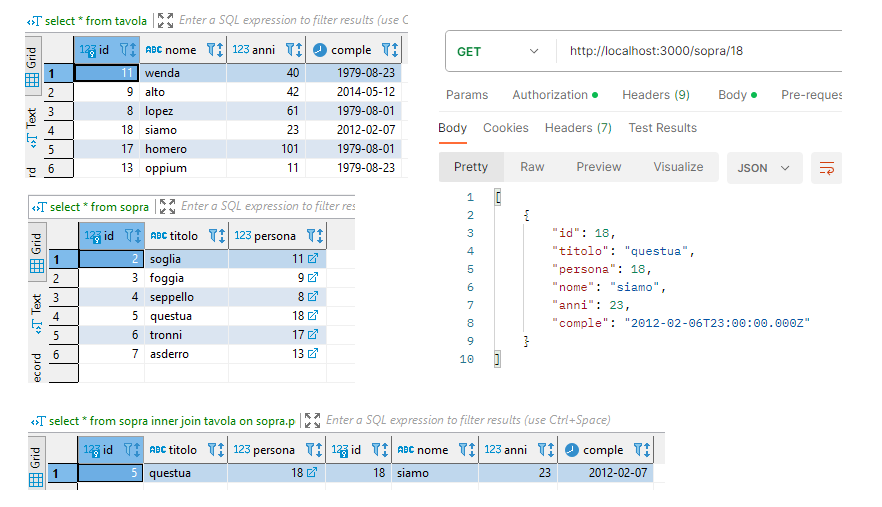

# Node-Postgres Module

* 1
* 1
* 1

### Database integration with Node-Postgres.

A **PostgreSQL server** can handle a limited number of **NodeJs client** connections. The initial connection "handshake" data exchange can slow down the application.&#x20;

The **node-postgres** (pg) library offers _connection pooling_ through its **pg-pool** module. This module creates a pool of reusable connections for database **query** requests.

We create a **new Pool** instance with the **credentials** to connect to the **database**, we add **SQL queries** to the Node endpoints and **res.rows** as an _array of objects_.

```jsx
const { Pool } = require('pg');

const pool = new Pool({
  user: 'postgres',
  host: 'localhost',
  database: 'postgres',
  password: 'mrlzarate',
  port: 5432
});

app.get("/hotels", function(req, res) {
    pool.query('SELECT * FROM hotels', (error, result) => {
        res.json(result.rows);
    });
});
```

<figure><figcaption><p>Database connection and SQL script row return</p></figcaption></figure>

To implement **CRUD** operations in a **pool.query()** we use **then()** and **catch()**.                                    &#x20;

<pre class="language-jsx"><code class="lang-jsx">//We added an alternative pool.query() on endpoint route query
//We separate the query declaration form its if statement value
http://localhost:3020/fila/?name=dodici
<strong>
</strong><strong>app.get("/fila", (req, res)=>{
</strong>  let nomefila = req.query.name
  let query;

  if( nomefila ){
     query = `select * from tavola where nome like '%${nomefila}%' order by id;`
  }

  pool
    .query(query)
    .then((result)=>{res.send(result.rows)})
    .catch((error)=>{res.send(error)})
})
</code></pre>

<details>

<summary>NodeJs Insert, Delete and update with $ variables and [] SQL queries</summary>

We separate the **query** and insert an array of **\[variables]** using **$**, based on their index.

```jsx
// $1/nome, $2/anni , $3/comple, we return the added row.
app.post("/insert", (req, res)=>{
  const {nome, anni, comple} = req.body
  
  let query=
    `Insert into tavola(nome, anni, comple) values( $1, $2, $3 ) returning *`

  pool
    .query( query, [nome, anni, comple] )
    .then( (result)=>{res.json(result.rows) })
    .catch( (error)=>{res.send(error) })
})
```

On **delete,** we return the deleted query using returning.

<pre class="language-jsx"><code class="lang-jsx"><strong>//If absent it will just deletewith no .rows
</strong><strong>app.get("/cancella/:index", (req, res)=>{
</strong>  let index = Number( req.params.index )

  let query=
      `delete from tavola where id=$1 returning * `

  pool
    .query( query, [index] )
    .then((result)=>{res.json(result.rows) })
    .catch((error)=>{res.send(error) })
})
</code></pre>

On **Update**, we can send a **patch** request, if a **key** is _not updated_ it will be **NULL**, and will return **error** if it's a **not null** key.

```jsx
//all empty req.body properties will update with NULL

app.patch("/scambia/:num", (req, res)=> {
  const { nome, anni, comple } = req.body
  const num = Number( req.params.num )

  let query= `UPDATE tavola SET nome=$1, anni=$2, comple=$3 WHERE id=$4`
  
  pool
    .query(query, [nome, anni, comple, num])
    .then((result) =>{ res.send("we have " + nome ) })
    .catch((e) =>{ res.send(e) });
});
```

</details>

A single endpoint can chain multiple **SQL queries**.



We put them one after the other (the **result.rows** will be from the last **SQL query**).

**Promise** chaining manages asynchronous database queries.                                                                                   The **.then()** callback executes upon successful queries, granting access to the returned **result**. The **.catch()** handler manages errors from each query in the chain.

```jsx
//"http://localhost:3020/remova/223"
//The first then(result) will return the rowCount of the delete
app.get("/remova/:index", (req, res)=>{
  let index = Number( req.params.index )

  pool.query(`delete from multi where age= ${index}`)
  .then(result => {  //returning * will retun the deleted row
    return pool.query(`select * from multi`);  //Select after delete on table
  })
  .then(result => {
    res.json(result.rows);  //returns remaining rows.
  })
  .catch(error => {
    res.status(500).json({ error: 'Database error' });
})
```



The **async/await** manages chained queries within a **try/catch** block for error handling.                            The **await** pauses execution until each query promise resolves, and catch handles any rejections.

```jsx
//We set await variables only if we use the returned results
//We skip it for table changes 
app.get("/remova/:index", async (req, res)=>{
  let index = Number( req.params.index )
  
  try {
    await pool.query(`delete from multi where age= ${index}`);
    const result = await pool.query(`select * from multi`);
    res.json(result.rows);
  } catch (error) {
    console.error(error);
    res.status(500).json({ error: 'Database error' }); // Handle errors!
  }
})
```



We **validate** the client's **req.body** data by **res.status(400)**.

```jsx
//If the req.body data is invalid we return an error status 400
if (
  !Number.isInteger(anni) || anni <= 0 ||
  typeof anni === "string" || typeof comple !== "string"
){
  return res
    .status(400)
    .send("The number of rooms should be a positive integer.");
}
```

<details>

<summary>Postgre database query data validation</summary>

We use an additional **pool.query()** to check if any of the **req.body** data is **repeated**.&#x20;

```jsx
//we return error status 400 if the first query finds a match
//We UPDATE a row with the req.body, while ALTER TABLEadds a row.
app.put("/nuovo/:num", (req, res)=>{
  let num = req.params.num
  const { nome, anni, comple } = req.body

  const query = 
    "select * from tavola where nome=$1"

  const query1 =
    "update tavola set nome=$1, anni=$2, comple=$3 where id=$4 returning *"

  pool
    .query( query, [nome] )
    .then( (result)=>{

      if (result.rows.length > 0) {
        return res
          .status(400)
          .send("This name already exist");
      } else {
          pool
            .query(query1, [nome, anni, comple, num])
            .then((result)=> res.json( result.rows ) )
            .catch((error)=> res.send( error ))
      }
    })
    .catch((error)=> res.send("no nome found in the table"))
})
```

</details>

To **Select Join reference tables** we need additional _conditions_.

```jsx
//we need the 2 int properties to be equal AND the referenced id params.value
app.get("/sopra/:num", (req, res)=>{
  let num = Number( req.params.num );
  let query = 'select * from sopra inner join tavola on tavola.id=sopra.persona 
               and sopra.persona = $1'

  pool
    .query(query, [num])
    .then((result)=>{ res.send( result.rows )})
    .catch((error)=>{ res.send(error) } )
})

```

<details>

<summary>PostgreSQL rules for reference foreign keys</summary>

A **foreign key** is a key that references a **primary** key in another table.

```sql
create table tavola(
  id      serial primary key,
  nome	  VARCHAR(15) not null,
  anni	  Int,
  comple  date
)

create table sopra(
  id	     SERIAL primary key,
  titolo     VARCHAR(15),
  persona    int references tavola(id)
)
```

PostgreSQL maintains **referential integrity** between tables. It will prevent the deletion of a primary key if it's _still referenced_ by a foreign key, ensuring that foreign keys are deleted first.

```sql
//we also use the first query to validate if there ARE rows to delete 
app.delete("/togli/:num", (req, res)=>{
  let num = Number( req.params.num )
  let query = "delete from sopra where persona = $1"
  let query1 = "delete from tavola where id = $1 returning *"

  pool
    .query( query, [num] )
    .then((result)=>{

        if( result.rows.length ){
          pool
            .query( query1, [num] )
            .then((result)=> res.json(result.rows))
            .catch((error)=> res.send(error))

        }else{  
          return res
            .send(400)
            .send((error)=> res.send(error))
        }
    })
    .catch((error)=> res.send("No element to delete" + error) )
})
```

</details>

<figure><figcaption><p>Select Inner Join on NodeJs Postman Response</p></figcaption></figure>

1
