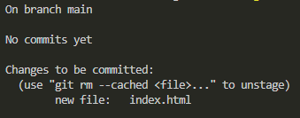
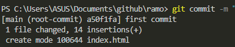

# Github

**Git** is an open-source **version control tool**, created in 2005.

**GitHub** is a _company_ that creates tools to use git founded in 2008.

We use the **terminal** to _create our git_ in the folder:

```
//the touch command doesn't work in windows

mkdir your_folder        //to create a folder
cd your_folder           //to move into a folder
cd ..                    //to exit a folder
git init                 //to start our git work

```

Any code of file will be added to the **staging environment,** we can check with **git status**:



<figure><figcaption><p>Not yet in the staging</p></figcaption></figure>



<figure><figcaption><p>not yet commited but in staging</p></figcaption></figure>



<figure><figcaption><p>commited changes with message</p></figcaption></figure>



We can **push** local code to a **GitHub repository**:

```

git remote add origin __github repository url__
git push -u origin main

```

We use **Branches** to test changes we can **merge** to the **main** code:

```

git checkout -b new_branch       //will create and move us to the new branch
git branch                       //to check which branch we are
git checkout main/other_branch   //to move branch, any changes will need to be commit
git restore .                    //will delete any un-committed changes

```

And even _branches can be pushed_ to a GitHub repository.

When other branches are pushed a **pull request** opens, to check proposed changes and to solve code conflicts.

We can then use **git pull** to set the repository code into our local machine.


