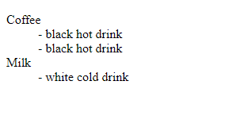

# HTML 1

* [Syntax and special uses](html-1-1.md#syntax-and-special-uses-1)
* [HTML head, meta and images](html-1-1.md#html-head-and-meta)
* [HTML features and format](html-1-1.md#vs-features-for-html)
* [Link CSS file](html-1-1.md#link-css-to-html-file)

## EMMET shortcuts

To start using EMMET shortcuts in VS code:  **! + enter.** To open the palette and check other languages use **crtl+shift+p.**

```css
<!DOCTYPE html>
<html lang="en">
<head>
    <meta charset="UTF-8">
    <meta http-equiv="X-UA-Compatible" content="IE=edge">
    <meta name="viewport" content="width=device-width, initial-scale=1.0">
    <title>Document</title>
</head>
<body>
    

</body>
</html>
```

To access your keybind in VScode use **F1**, normally it should be handled by the **tab** but in case go to **File>Preferences>Settings** and search this setting

```css
"emmet.triggerExpansionOnTab": true
```

Remember to use **Tab** at the end of the Emmet line.

### Syntax and special uses

```css
tag#id.class>child_tag*multiply+sibling^back_to_parent
ul>(li+p)*3 to multiply patterns
input:text / input:email / input:submit
h1>p.underline[style="color:red"]

input:t (ype)
input:s (ubmit)

form.form-inline.mb-3>input:t.form-control.mr-2+input:s.btn.btn-dark^ul.list-group>li.list-group-item*3   

<form action="" class="form-inline mb-3">
    <input type="text" name="" id="" class="form-control mr-2">
    <input type="submit" value="" class="btn btn-dark"></form>
<ul class="list-group">
    <li class="list-group-item"></li>
    <li class="list-group-item"></li>

</ul>
```

Or how we can use tags for HTML effects:

```
<hr> for the X axis black line
<br> (break)
<b>This is how you blod text </b>
<mark>we can have the yellow marker </mark>
<u>underline text </u>
<em>Fancy text </em>

```


### HTML Head and meta

Head tag is for a **link, meta** , and **title** in the window

```css
<head>
   <link rel="stylesheet" href="https://stackpath.bootstrapcdn.com/bootstrap/4.4.1/css/bootstrap.min.css" integrity="sha384-Vkoo8x4CGsO3+Hhxv8T/Q5PaXtkKtu6ug5TOeNV6gBiFeWPGFN9MuhOf23Q9Ifjh" crossorigin="anonymous">
   <meta name="viewport" content="width=device-width, initial-scale=1, shrink-to-fit=no">
 
    <!-- remember to use this to comment -->
 
   <title>Document</title>
</head>
```

### Images and others tags

You can call width / height in HTML tag

```css
img[width="200px" height="150px]
h2[style="margin-left:400px"]
```

```css
    <dt>Coffee</dt>
      <dd>- black hot drink</dd>
      <dd>- black hot drink</dd>
    <dt>Milk</dt>
      <dd>- white cold drink</dd>
```



**HTML** means HyperText Markup Language

### VS features for HTML

The last opened tag can be closed with<mark style="background-color:blue;">`</`</mark>. **Suggestions** appear while coding and can be forced with **crtl+space**. Vs code includes a color picker.

To format messy code use **crtl+k** then **crtl+f.**


### Link CSS to HTML file

Inside the head tag we can **link** an external CSS file.

```
<head>
    <!--in EMMET just a link+tab to create-->
    
    <link rel="styleshet" href="./css.css" />
</head>
```


> **Exercise**: Which parts are the **Tags** and which parts are the **Attributes**.

HTML tags are arranged in a hierarchy. This is sometimes called "nesting" tags or creating an HTML "tree". Between the opening `<article>` tag and the closing `</article>` tag there are three other tags. We call these "child" tags, because they have a parent-child relationship.

> **Exercise**: As a group, let's try to name all of the parent and child tags in the following example.

```markup
<article>
    <h1>Learning HTML</h1>
    <p>
        <span class="author">Author:</span>
        <a href="http://codeyourfuture.co">Code Your Future</a>
    </p>
    <p>Get to know the HTML basics.</p>
    <a href="http://html5rocks.com">Read Article</a>
</article>
```

### Begin Individual Exercises

During this module, you will use an [exercise project](https://github.com/CodeYourFuture/html-css-git-exercises) to practice what you learn. To begin, open the [repository](https://github.com/CodeYourFuture/html-css-git-exercises), scroll down and follow the instructions in the image below.

For now, stop after you complete exercises 1 and 2.

### Semantic HTML

When writing HTML code, you can use different tags to describe the content. Is it a navigation menu, a paragraph of text, or an article? By using the correct tag, you help search engines like Google or screen readers for the visually impaired.

> Semantic HTML is the use of HTML markup to reinforce the semantics, or **meaning**, of the information in webpages and web applications rather than merely to define its presentation or look. [Wikipedia](https://en.wikipedia.org/wiki/Semantic\_HTML)

We'll cover the following semantic tags and talk about their use on the [BBC News website](https://www.bbc.co.uk/news):

* `<header role="banner"></header>`
* `<footer role="contentinfo"></footer>`
* `<main role="main"></main>`
* `<nav></nav>`
* `<article></article>`
* `<aside role="complementary"></aside>`

There are more than 100 semantic tags. If you would like, you can [review several semantic tags](https://developer.mozilla.org/en-US/docs/Glossary/Semantics#Semantic\_elements).

> **Group Discussion**: How does semantic HTML relate to the [Separation of Concerns](broken-reference) that we discussed at the start of the class?

### Add CSS and JavaScript

During your application process, you wrote CSS code. Later in this course you will learn about JavaScript. Both are different languages from HTML.

A typical webpage will require three files, one for each language:

* `index.html`
* `styles.css`
* `main.js`

To use all of the files together, we have to tell the HTML code to load the other two files. Use the `<link>` tag to add the CSS file and the `<script>` tag to add the JavaScript:

```markup
<html>
  <head>
    <title>Example Webpage</title>
    <link rel="stylesheet" href="style.css">
  </head>
  <body>
    <p>My webpage content.</p>
    <script src="main.js"></script>
  </body>
</html>
```

The `<link>` tag must be placed in the `<head>` element. Usually, the `<script>` tag appears near the end of the `<body>` element of the HTML page:

> **Group Discussion**: How do these files relate to the [Separation of Concerns](broken-reference) that we discussed at the start of the class?

#### File Paths

The HTML file isn't always in the same directory as the CSS and JavaScript files. It is common for them to appear in an `assets` directory.

In the example above, the `<link>` would have to be:

```markup
<link rel="stylesheet" href="assets/style.css">
```

> Want to learn more? Read about [Relative Links](https://marksheet.io/html-links.html#relative-urls), [Absolute Links](https://marksheet.io/html-links.html#absolute-urls), and [how to choose the right one](https://marksheet.io/html-links.html#relative-or-absolute-links).

Complete exercises 3 and 4 from the [exercise project](https://github.com/CodeYourFuture/html-css-git-exercises).

### CSS Selectors

You learned about CSS selectors during your application. Let's review the most common selectors.

> You can review the most [Common Selectors](http://learn.shayhowe.com/advanced-html-css/complex-selectors/).

### CSS Properties

CSS properties allow you to change the way an element appears on your HTML page. You do this by assigning _values_ to _properties_. Consider the properties and values in CSS code below.

```css
p {
  color: darkslategrey;
  font-size: 16px;
  line-height: 1.8em;
}
```

> **Group Exercise**: Think of a chair. It might be green or red, tall or short. As a group, brainstorm as many properties and values as you can imagine for a chair.

### Box Model

In CSS, every element is a box. An image is a box. A link is a box. The area around this box can be modified with properties that we call margins, borders and padding. Here's a diagram showing what the box looks like.


Complete exercises 5, 6 and 7 from the [exercise project](https://github.com/CodeYourFuture/html-css-git-exercises).

### Advanced CSS Selectors

You can use more advanced CSS selectors to limit your selections. Read about [Child Selectors](https://learn.shayhowe.com/advanced-html-css/complex-selectors/#child-selectors), [Sibling Selectors](https://learn.shayhowe.com/advanced-html-css/complex-selectors/#sibling-selectors), [Pseudo Classes](https://learn.shayhowe.com/advanced-html-css/complex-selectors/#pseudo-classes), and other complex selectors.

Then complete exercise 8 from the [exercise project](https://github.com/CodeYourFuture/html-css-git-exercises).

### Git Branching

You have been using git to track the changes you make to your exercises project. Each time you commit, you save a copy of your files.

When you create a new branch, you create a separate line of commits.

With branches, you can work on two copies of your project and switch back and forth.

Complete exercise 9 from the [exercise project](https://github.com/CodeYourFuture/html-css-git-exercises) to learn how to use git branches.

> If you want to go deeper, read this article on [how git branching works](https://www.atlassian.com/git/tutorials/using-branches).

## Resources

Use the following resources to learn more about the topics we covered this week.

1. [HTML5 - semantic elements](https://developer.mozilla.org/en/docs/Web/Guide/HTML/HTML5)
2. [CSS Selectors - MDN](https://developer.mozilla.org/en-US/docs/Web/CSS/CSS\_Selectors)
3. [The Cascade - MDN](https://developer.mozilla.org/en-US/docs/Web/CSS/Cascade)
4. [Box Model - MDN](https://developer.mozilla.org/en-US/docs/Learn/CSS/Introduction\_to\_CSS/Box\_model)
5. [Box Model, box-sizing: border-box - CSS Tricks](https://css-tricks.com/international-box-sizing-awareness-day/)
6. [CSS specificity - MDN](https://developer.mozilla.org/en/docs/Web/CSS/Specificity)
