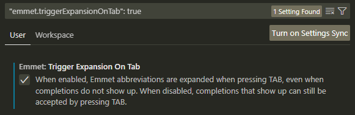
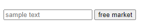

# HTML Tags and EMMET

* [Emmet syntax](html-1-1.md#emmet-html-syntax)
* [Special HTML tags](html-1-1.md#special-html-tags)
* [Link Head and Meta HTML tags](html-1-1.md#html-head-and-meta)

**HTML** means HyperText Markup Language.

## EMMET shortcuts

Use **crtl+shift+p or F1** to check if you have EMMET installed.

We can start an HTML page with **! + tab:**

```css
<!DOCTYPE html>
<html lang="en">
<head>
    <meta charset="UTF-8">
    <meta http-equiv="X-UA-Compatible" content="IE=edge">
    <meta name="viewport" content="width=device-width, initial-scale=1.0">
    <title>Document</title>
</head>
<body>
    

</body>
</html>
```

To set up EMMET on your **File>Preferences>Settings:**

<figure><figcaption><p>To enable the Tab on shortcut</p></figcaption></figure>

### EMMET HTML syntax



We use **>** for _nesting_ and **^** to _climb up_ **+** __ for _parenting, **.**_ and **#** for _class_ and _id_:

```
h1#id.class_parent>p.child*2+p.sibling^h1.same_parent
    
<h1 id="id" class="class_parent">
    <p class="child"></p>
    <p class="child"></p>
    <p class="sibling"></p>
</h1>
<h1 class="same_parent"></h1>

```

We can **()** group and **{}** for text:&#x20;

```
(h1.parent>p.child{4 words lorem})+p.sibling>lorem4

<h1 class="parent">
    <p class="child">4 words lorem</p>
</h1>
<p class="sibling">Lorem ipsum dolor sit.</p>

```

We can _multiply the lorem sample_ and **\[]** to add attrbutes

<pre><code><a data-footnote-ref href="#user-content-fn-1">h2[style="color: red"]</a>><a data-footnote-ref href="#user-content-fn-2">lorem*2</a>
<strong>
</strong><strong>&#x3C;h2 style="color: red">
</strong>    &#x3C;div>Lorem ipsum dolor sit amet consectetur adi ...&#x3C;/div>
    &#x3C;div>Recusandae consectetur aperiam laudantium, ...&#x3C;/div>
&#x3C;/h2>

</code></pre>



We can use **form** and **input** for **t**ext/**s**ubmit/**e**mail:

```
form.form-inline>input:t[placeholder="sample text"]+input:s.btn[value="button"]

<form action="" class="form-inline">
    <input type="text" name="" id="" placeholder="sample text">
    <input type="submit" value="free market" class="btn">
</form>

```

<figure><figcaption></figcaption></figure>

On head we can create a **link** to url pages:

```
<link rel="stylesheet" href="./style.css">
```



### Special HTML tags

```
<hr> for the X axis black line
<br> (break)
<b>This is how you blod text </b>
<mark>we can have the yellow marker </mark>
<u>underline text </u>
<em>Fancy text </em>

//we can have a line trought text
<del> Line trougth text </del> 

//and a hover to text-etiquette for others
<abbr title="smaller texto"> hover to read the smaller </abbr> 

```


### HTML Head and meta

The Head tag is for a **link, meta**, and **title** for _internal and external files_:

```css
<head>
   <link rel="stylesheet" href="https://stackpath.bootstrapcdn.com/bootstrap/4.4.1/css/bootstrap.min.css" integrity="sha384-Vkoo8x4CGsO3+Hhxv8T/Q5PaXtkKtu6ug5TOeNV6gBiFeWPGFN9MuhOf23Q9Ifjh" crossorigin="anonymous">
   <meta name="viewport" content="width=device-width, initial-scale=1, shrink-to-fit=no">
   <link rel="stylesheet" href="./style.css">

   <title>Title of the page</title>
</head>
```

To format code use **crtl+k** then **crtl+f.**

for numbers, we can use 1\_000\_000

For _**special syntax HTML**_ [check this website:](https://www.html.am/reference/html-special-characters.cfm)

```
//here some for example

<p>&#60 </p>        // <
<p>&#62 </p>        // >
<p>&#9824 </p>      // ♠

```

[^1]: can work with images too&#x20;

    ```
    img[width="200px" height="150px]
    ```

[^2]: includes the div for the entire text
