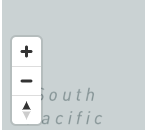
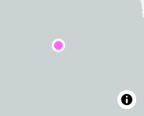
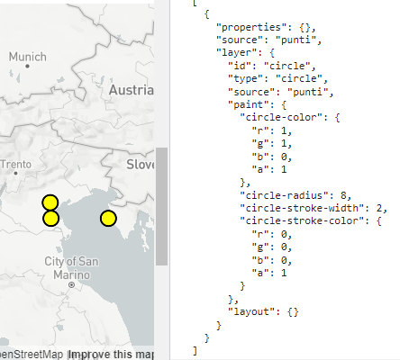
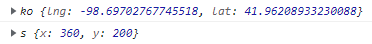
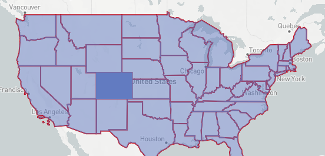
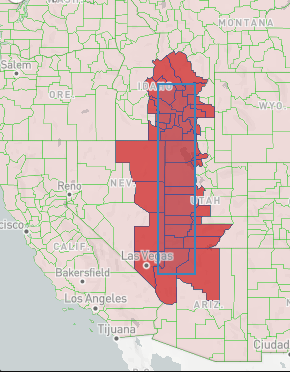

# Js 10

* uno
* due
* non

### Mapbox Map parameters and methods

The mapboxgl Map Object can be used to:



Starting from a basic map:


```
new mapboxgl.Map({
      container: "map", 
      style: "mapbox://styles/mapbox/streets-v11", 
      center: [12, 42, 
      zoom: 9, 
});
```


We can include:

```
new mapboxgl.Map({
  ...
  antialias: true,    
  bearing: 20,          //initial degree rotation
  bearingSnap: 45,      //max degree rotation before map snap to normal
  clickTolerance: 20,   //the pixels that need to be swept to get a drag before being a click
  cooperativeGestures: true,  //the zoom will need the crtl button but doesn't stops double click to zoom
  doubleClickZoom: false,     //to disable double-click zoom
  dragPan: false,       //will disable the drag move map
  dragRotate: false,    //won't allow rotate nor pitch 3D
  interactive: false,   //will disable any movement or zoom
  maxZoom, minZoom, maxPitch, minPitch:   //for limits (max) or immediate(min)
  pitchWithRotate: false      //will disable pitch 
})
```

We use **projection** to change the view of the map:

<table data-view="cards"><thead><tr><th></th><th></th><th></th><th data-hidden data-card-cover data-type="files"></th></tr></thead><tbody><tr><td>projection: "mercator" will create a continous map </td><td></td><td></td><td><a href="../.gitbook/assets/mercator.PNG">mercator.PNG</a></td></tr><tr><td>projection: "albers" will give us a conic projection</td><td></td><td></td><td><a href="../.gitbook/assets/albersConic.PNG">albersConic.PNG</a></td></tr><tr><td>projection: "equalEarth" will have rounded border</td><td></td><td></td><td><a href="../.gitbook/assets/ActualEarth.PNG">ActualEarth.PNG</a></td></tr></tbody></table>



For the Dom HTML map data we:

```
mappe.getContainer()         //will get the ENTIRE HTML mapboxgl map 
mappe.getCanvasContainer()   //will only get the .mapboxgl-canvas-container, used for layer styling
map1.getCanvas()             //will get the .mapboxgl-canvas

```

We can get or set the **current map bond coordinates**:

```
//we get an object with the North-East and South-West coordinates
mappe.getBounds()

mappe.getBounds()._sw.lng
mappe.getBounds()._ne.lat

//to set it we start with the SOUTH-WEST
mappe.setMaxBounds( [ 
  [mappe.getBounds()._sw.lng, frap.getBounds()._sw.lat] ,
  [mappe.getBounds()._ne.lng, frap.getBounds()._ne.lat] ]
)

//if we set maxBounds in map, if not we get null
mappe.getMaxBounds() 

//or get/set the Projection type and center
mappe.getProjection() 

mappe.setProjection({
  name: 'globe',
  center: [35, 55],
  parallels: [20, 60]    //lowers the distortions inside the 2 parallels
});

```

Then **min/max zoom** and **pitch**:

```
//to not allow zoom away/further from 0/24
mappe.setMinZoom(7.25)/ mappe.getMinZoom()
mappe.setMaxZoom(10.25)/ mappe.getMaxZoom()

//min/max pitch can go from 0/85
mappe.setMinPitch(10)/ mappe.getMinPitch()
mappe.setMaxPitch(80)/ mappe.getMaxPitch()

//or just, without blocking the zoom
mappe.setZoom(10)

```



We can add navigation controls with:

```
//we first create it, then we add it with its position

const navigato = new mapboxgl.NavigationControl()
mappe.addControl(navigato, "bottom-left");

```

<figure><figcaption></figcaption></figure>

then we can check it or remove it:

```
mappe.hasControl(navigato) )
mappe.removeControl(navigato);

```



The **map event listeners** can include _Layers_

<details>

<summary>Starting source</summary>

```
frap.on('load', () => {

    frap.addSource('places1', {
        'type': 'geojson',
        'data': {
          'type': 'FeatureCollection',
          'features': [
              {
                'type': 'Feature',
                'properties': {
                  'description': '<h2>la montagna</h2>'
                },
                'geometry': {
                  'type': 'Point',
                  'coordinates': [13, 45.2]
                }
              }
          ]
        }
    })
  
//we will use the ID later
    frap.addLayer({
      'id': 'places',
      'type': 'circle',
      'source': 'places1',
      'paint': {
        'circle-color': '#ff64fb',
        'circle-radius': 6,
        'circle-stroke-width': 3,
        'circle-stroke-color': '#ffffff'
      }
    });
  
})

```

&#x20;                                           

</details>

We can have:



First for the **mouse movements** in/out the map:

```
//when mouse gets out 
mappe.on("mouseout", ()=>{
  console.log( "MOUSE fuori" )
})

//only once when mouse gets into map
mappe.on("mouseover", ()=>{
  console.log("MOUSE dentro")
})

//each frame of movement IN the map
mappe.on("mousemove" , ()=>{
  console.log("MOUSE mosso")
})

```

We also have event listeners for when the **map is dragged/moved**:

```
//at the start/middle/end of the map movement

mappe.on("movestart", ()=>{
  console.log("MAPPA comincia mossa")
})

mappe.on("move", ()=>{
  console.log("MAPPA mossa")
})

mappe.on("moveend", ()=>{
  console.log("MOUSE smesso mossa")
})

```

For the Event to trigger on the **Layer** elements we:

```
//we use the Layer ID, to include more layers we ["places", "more"]

mappe.on("mouseover", "places", ()=>{
  console.log("MOUSE dentro")
})

```



We can start from the 2 phases on the **click**:

```
mappe.on("mousedown", ()=>{
  console.log("mouse got down")
})

//like the mouseDown we can use the preclick
mappe.on("preclick", ()=>{
  console.log("IS tis the first one")
})

mappe.on("mouseup", ()=>{
  console.log("mouse went up")
})

```

We also have **double click** and **right click**:

```
mappe.on("dblclick", ()=>{
  console.log("possible zoom")
})

//for context menu if right click on it
mappe.on("contextmenu", ()=>{
  console.log("inspect button")
})

```



For each scroll of the mouse wheel:

```
mappe.on("wheel", ()=>{
  console.log("la rotelina")
})

mappe.on("zoom",()=>{
  console.log("on double click or control zoom")
})

```

we can also have events for data/style loads:

```
mappe.on("data", ()=>{
  console.log("DATA somewhere")
})

mappe.on("styledata", ()=>{
  console.log("lo stile lo abbiamo qui")
})

```

we can use it for **Style**:

```
mappe.getStyle()
mappe.setStyle("mapbox://styles/mapbox/streets-v11")

//will be false if triggered while the ("load") still not done
mappe.isStyleLoaded()

```



These will work for different **Instances**:

```
mappe.on("move", ()=>{
  if( mappe.isMoving() ){
    console.log("will work on Pitch, Zoom and rotate")
  }
})

mappe.on("zoom", ()=>{
  if( mappe.isZooming() ){
    console.log("limited to zoom")
  }
})

mappe.on("rotate", ()=>{
  if( mappe.isRotating() ){
    console.log("limited to Rotate")
  }
})

```



### Querying features of Mapbox layers

We can use **queryRenderedFeatures()** to get an array of _GeoJSON Feature objects_ **** from any point in the mapboxgl map**:**

<details>

<summary><strong>Filter feature properties of a clicked query Point</strong></summary>

```
mappe.on('click', (e)=>{
  let band= mappe.queryRenderedFeatures(e.point, {
    layers: ["circle"]
  })

//we create an array of filter properties, like the source used for the layer
  const limited = [
    'properties',
    'source',
    'layer'
  ];
  
  const finito = band.map((feat) => {
    const tutto = {};
    
    //we create limited properties to the new object, using the original[prop]
    limited.forEach((prop) => {
      tutto[prop] = feat[prop];
    });

    return tutto;
  })

  //we get returned an object that we need to stringify
  console.log( JSON.stringify( finito, null, 2 ) )
  //the string will have 2 empty spaces
})

```

</details>

<figure><figcaption><p>On click() we filter the query specific features</p></figcaption></figure>

We can **include** the Query Features in the **event listener**:

```
// this is the same as 
// band= mappe.queryRenderedFeatures(e.point, { layers: ["state-fills"] })

frap.on("mousemove", "state-fills", (e)=>{

//and the e argument works only if the select layer is listened to
    e.features[0].properties.STATE_NAME == band[0].properties.STATE_NAME

    console.log( e.lngLat )    //will get the coordinates in the layer
    console.log( e.point )     //will get the position IN THE MAP X/Y width/height
})

```

<figure><figcaption><p>Coordinates and Pont position</p></figcaption></figure>

We can also **change the cursor** if in a Layer using **getCanvas()**:

```
//we can use feature.length or just E for the if statement
mappe.getCanvas().style.cursor = features.length ? 'pointer' : '';

```

An example with **query features and layers**:

<figure><figcaption><p>Hover on Layer event</p></figcaption></figure>

<details>

<summary>Paint layers and Hover query feature events</summary>

On load we:

```
//we need a variable for the current hovered
let hoveredStateId = null;

mappe.on('load', () => {

  frap.addSource('stati', {
    'type': 'geojson',
    'data': 'https://docs.mapbox.com/mapbox-gl-js/assets/us_states.geojson'
  });

//we separate line BORDERS from FILL
  frap.addLayer({
    'id': 'state-borders',
    'type': 'line',
    'source': 'stati',
    'layout': {},
    'paint': {
      'line-color': '#c80815',
      'line-width': 2
    }
  });

//because of the feature-state dependent fill-opacity expression
  frap.addLayer({
    'id': 'state-fills',
    'type': 'fill',
    'source': 'stati',
    'layout': {},
    'paint': {
      'fill-color': '#627BC1',
      'fill-opacity': [
        'case',
        ['boolean', ['feature-state', 'hover'], false],
        1,
        0.5
      ]
    }
  });


  frap.on("mousemove", "state-fills", (e)=>{

  //to update the hover effect on event
    if (hoveredStateId ) {
      frap.setFeatureState(
        { source: 'stati', id: hoveredStateId },
        { hover: false }
      );
    }
  
  //we set ID on current hover ID
    hoveredStateId = e.features[0].id;
      
  //we set the current ID as the hover paint effect
    frap.setFeatureState(
      { source: 'stati', id: hoveredStateId },
      { hover: true }
    );
    
  })

//we also add event for when out of the query
  frap.on('mouseleave', 'state-fills', () => {

    frap.getCanvas().style.cursor = '';

    if (hoveredStateId !== null) {
      frap.setFeatureState(
        { source: 'stati', id: hoveredStateId },
        { hover: false }
      );
    }

    hoveredStateId = null;
    pop.remove()
  });

})

```

</details>

We can also mix queryRenderedFeatures() and Layers:

<figure><figcaption><p>we select the Layer features objects by the query</p></figcaption></figure>

<details>

<summary>How to draw expandible square on canvas mapboxgl</summary>

First, we need the CSS for the box:

```
.boxdraw {
    background: rgba(56, 135, 190, 0.1);
    border: 2px solid #3887be;
    position: absolute;
    top: 0;
    left: 0;
    width: 0;
    height: 0;
}

```

Then we need the **Canvas** :

<pre><code><strong>map6.on("load", (e)=>{
</strong>  let canvas= map6.getCanvasContainer();

  let start;
  let current;
  let box;
  
  canvas.addEventListener('mousedown', mouseDown)

//on click down AND shift we start getting the position of the box
  function mouseDown(e) {
    if (!(e.shiftKey &#x26;&#x26; e.button === 0)) return;

    map6.dragPan.disable();
  //we disable the drag to keep the map still and get start position mousePos()
    start = mousePos(e);
  
  //both to update and finish the box
    document.addEventListener('mousemove', onMouseMove);
    document.addEventListener('mouseup', onMouseUp);
  }

  function mousePos(e){
    const rect = canvas.getBoundingClientRect();

  //on canvas, clientXY distance from top-left 0/0 we return width/height box mapbox Object
    return new mapboxgl.Point(
      e.clientX - rect.left - canvas.clientLeft,
      e.clientY - rect.top - canvas.clientTop
    );
  }

//on mousemove we have
  
  function onMouseMove(e) {
  //current moving XY canvas coordinates
    current = mousePos(e);

  // Append the box element if not yet
    if (!box) {
      box = document.createElement('div');
      box.classList.add('boxdraw');
      canvas.appendChild(box);
    }
    
    const minX = Math.min(start.x, current.x),
    maxX = Math.max(start.x, current.x),
    minY = Math.min(start.y, current.y),
    maxY = Math.max(start.y, current.y);
         
  //we translate the 0/0 boxdraw with the minXY and its width/height with maxXY
    const pos = `translate(${minX}px, ${minY}px)`;
    box.style.transform = pos;

    box.style.width = maxX - minX + 'px';
    box.style.height = maxY - minY + 'px';
  }
  
//we create the diagonal query with the start and ending point position on canvas
  function onMouseUp(e) {
    finish( [start, mousePos(e)] );
  }

//we remove the box events on mouse, so we dont stretch the box
  function finish(bbox) {
    document.removeEventListener('mousemove', onMouseMove);
    document.removeEventListener('mouseup', onMouseUp);

    map6.dragPan.enable();
  }
  
})
</code></pre>

We are gonna use the **\[start, mousePos(e)]** next

</details>

For the Souce and **filtered layers** we:

```
map3.addSource('counties', {
  'type': 'vector',
  'url': 'mapbox://mapbox.82pkq93d'
});

//fill inside colors
map3.addLayer(
  {
  'id': 'counties',
  'type': 'fill',
  'source': 'counties',
  'source-layer': 'original',
  'paint': {
    'fill-outline-color': 'rgba(0,200,0,0.3)',
    'fill-color': 'rgba(200,0,0,0.1)'
  }
  },
  'settlement-label'
); 

//we add a FILTER for the layer on hover
map3.addLayer(
  {
  'id': 'counties-highlighted',
  'type': 'fill',
  'source': 'counties',
  'source-layer': 'original',
  'paint': {
    'fill-outline-color': '#484896',
    'fill-color': 'rgba(200,0,0,0.8)',
    'fill-opacity': 0.75
  },
  'filter': ['in', 'FIPS', '']
  },
  'settlement-label'
);

```

Now that we got a **query features area** we:

```
//being bbox 2 X/Y mapboxgl point objects forming the diagonal of a square

function finish(bbox) {
  document.removeEventListener('mousemove', onMouseMove);
  document.removeEventListener('mouseup', onMouseUp);
  
  if (box) {
  //mapboxgl-canvas-container is parent of boxdraw, like mapboxgl-canvas
  //we remove if present to just get the hover layer  
    box.parentNode.removeChild(box);
    box = null;
  }

  if (bbox){
  //we do the same as with points 
    const features = map3.queryRenderedFeatures(bbox, {
      layers: ['counties']
    });
  //if number selected within the box exceeds
    if (features.length >= 1000) {
      return window.alert('Select a smaller number of features');
    }
  
  //between the selected on the layer we return the FIPS and use them in the filter
    const fips = features.map((feature) => feature.properties.FIPS);
  
    map3.setFilter('counties-highlighted', ['in', 'FIPS', ...fips]);
  }

}

```


