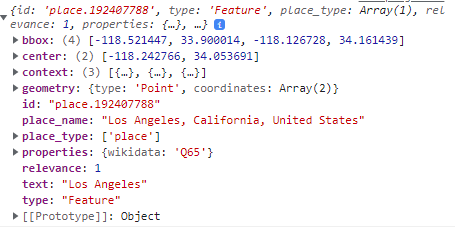
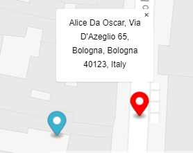

# JS 11

* we will start the Geocoding
* and the directions API

The _**Mapbox Geocoding API**_ allows us to **forward geocoding** and **reverse geocoding**:

Forward Geocoding is when we get the **coordinates from a string**:

<figure><figcaption><p>forward Geocoded</p></figcaption></figure>

<details>

<summary>Mapbox Geocoding template</summary>

```
//The forward geocoding query type is composed by

mapboxgl.accessToken =
"pk.eyJ1IjoibWlzdGVybGludXgiLCJhIjoiY2tnams0OGtzMDhqejJ4bGxmdWhia255YSJ9.htJI3nLHJoB62eOycK9KMA";

//we add the SDK accesscode
const mapboxClient = mapboxSdk({ accessToken: mapboxgl.accessToken });

mapboxClient.geocoding
 //here we put the arguments of the query
  .forwardGeocode({
    query: 'Campobasso',
  })
  .send()
  .then((response) => {
  if (
    !response ||
    !response.body ||
    !response.body.features ||
    !response.body.features.length
  ) {
    console.error('Invalid response:');
    console.error(response);
    return;
  }
  
  console.log( response.body.features ) 
});

```

</details>

The API returns a **GeoJson feature array** in Mapbox format:

<figure><figcaption><p>The single feature being returned</p></figcaption></figure>

We can filter the query with **extra arguments**:

<pre><code>mapboxClient1.geocoding
  .forwardGeocode({
    query: "colle",            //string address we are querying 
    fuzzyMatch: false,         //at false will search exact match query
    autocomplete: true,        //each typo will do one request to the API for closest
    limit: 2,                  //default 5, max 10, number of features returned
    language: ["de"],          //language can prioritize translated places
    proximity: [12.511, 41.891],  // [][] for more, closest queries to the array
    types: ["neighborhood"]    //limits features for type
    country: "Co"              //uses the short ISO 3166 alpha 2 names, may be broken
  })

<strong>//Place_types can be: country, region, district, place, locality, neighborhood, address, and poi
</strong>//poi being (Point of interest)

//region, neighborhood and place have bbox while points and poi don't
</code></pre>

In Reverse Geocoding we get strings locations **from coordinates:**

<figure><figcaption><p>We get closest POI on coordinates</p></figcaption></figure>

<details>

<summary>Reverse Geocoding on map click</summary>

The _reverse_ geocoding query is the same as the _forward_, we change the **query**:

```
map000.on("click", (e)=>{
  new mapboxgl.Marker()
    .setLngLat( [e.lngLat.lng, e.lngLat.lat] )
    .addTo( map000 )

  let prop= new mapboxgl.Popup() 

  mapboxClient.geocoding
    .forwardGeocode({
      query: e.lngLat.lng +", "+ e.lngLat.lat,
      types: ["poi"]
    })
    .send()
    .then((response) => {
      if (
        !response ||
        !response.body ||
        !response.body.features ||
        !response.body.features.length
      ) {
        alert("no place of interest nearbty")
        return;
      }

      prop.setText( response.body.features[0].place_name )

      new mapboxgl.Marker(red2)
        .setLngLat( [response.body.features[0].center[0], response.body.features[0].center[1] ] )
        .setPopup( prop )
        .addTo( map000 )
    });

}

```

</details>


