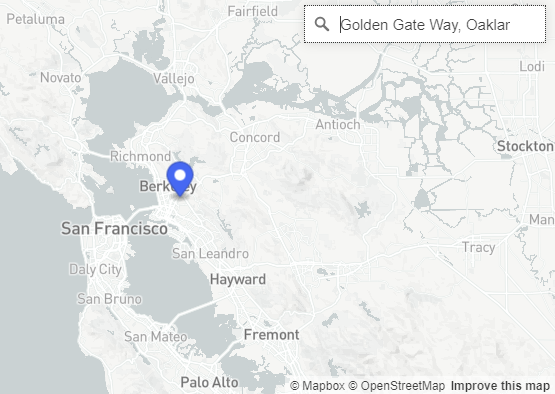
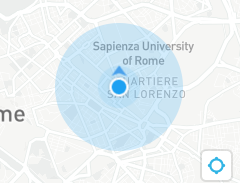
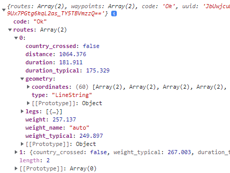
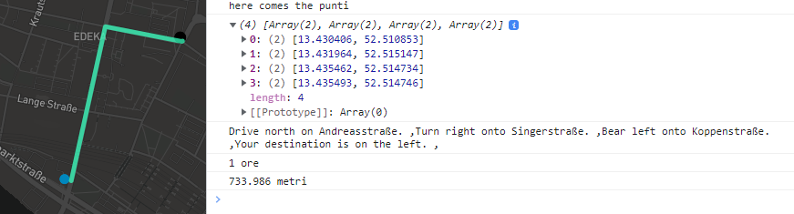

# JS 11

* we will start the Geocoding
* and the directions API

The _**Mapbox Geocoding API**_ allows us to **forward geocoding** and **reverse geocoding**:

Forward Geocoding is when we get the **coordinates from a string**:

<figure><figcaption><p>forward Geocoded</p></figcaption></figure>

<details>

<summary>Mapbox Geocoding template</summary>

```
//The forward geocoding query type is composed by

mapboxgl.accessToken =
"pk.eyJ1IjoibWlzdGVybGludXgiLCJhIjoiY2tnams0OGtzMDhqejJ4bGxmdWhia255YSJ9.htJI3nLHJoB62eOycK9KMA";

//we add the SDK accesscode
const mapboxClient = mapboxSdk({ accessToken: mapboxgl.accessToken });

mapboxClient.geocoding
 //here we put the arguments of the query
  .forwardGeocode({
    query: 'Campobasso',
  })
  .send()
  .then((response) => {
  if (
    !response ||
    !response.body ||
    !response.body.features ||
    !response.body.features.length
  ) {
    console.error('Invalid response:');
    console.error(response);
    return;
  }
  
  console.log( response.body.features ) 
});

```

</details>

The API returns a **GeoJson feature array** in Mapbox format:

<figure><figcaption><p>The single feature being returned</p></figcaption></figure>

We can filter the query with **extra arguments**:

<pre><code>mapboxClient1.geocoding
  .forwardGeocode({
    query: "colle",            //string address we are querying 
    fuzzyMatch: false,         //at false will search exact match query
    autocomplete: true,        //each typo will do one request to the API for closest
    limit: 2,                  //default 5, max 10, number of features returned
    language: ["de"],          //language can prioritize translated places
    proximity: [12.511, 41.891],  // [][] for more, closest queries to the array
    types: ["neighborhood"]    //limits features for type
    country: "Co"              //uses the short ISO 3166 alpha 2 names, may be broken
  })

<strong>//Place_types can be: country, region, district, place, locality, neighborhood, address, and poi
</strong>//poi being (Point of interest)

//region, neighborhood and place have bbox while points and poi don't

</code></pre>

In Reverse Geocoding we get strings locations **from coordinates:**

<figure><figcaption><p>We get closest POI on coordinates</p></figcaption></figure>

<details>

<summary>Reverse Geocoding on map click</summary>

The _reverse_ geocoding query is the same as the _forward_, we change the **query**:

```
map000.on("click", (e)=>{
  new mapboxgl.Marker()
    .setLngLat( [e.lngLat.lng, e.lngLat.lat] )
    .addTo( map000 )

  let prop= new mapboxgl.Popup() 

  mapboxClient.geocoding
    .forwardGeocode({
      query: e.lngLat.lng +", "+ e.lngLat.lat,
      types: ["poi"]
    })
    .send()
    .then((response) => {
      if (
        !response ||
        !response.body ||
        !response.body.features ||
        !response.body.features.length
      ) {
        alert("no place of interest nearbty")
        return;
      }

      prop.setText( response.body.features[0].place_name )

      new mapboxgl.Marker(red2)
        .setLngLat( [response.body.features[0].center[0], response.body.features[0].center[1] ] )
        .setPopup( prop )
        .addTo( map000 )
    });

}

```

</details>

The Mapbox **Geocoder** plugin adds a search bar from which to search places:

<pre><code><strong>//The MapboxGeocoder object uses the Mapbox Geocoding API to enable places search.
</strong><strong>
</strong><strong>mapboxgl.accessToken =
</strong>"pk.eyJ1IjoibWlzdGVybGludXgiLCJhIjoiY2tnams0OGtzMDhqejJ4bGxmdWhia255YSJ9.htJI3nLHJoB62eOycK9KMA";

const nolo= new MapboxGeocoder({
  accessToken: mapboxgl.accessToken,
  mapboxgl: mapboxgl,
})

mappe.addControl( nolo )

</code></pre>

<figure><figcaption></figcaption></figure>

<details>

<summary>MapboxGeocoder query parameters</summary>

```
//with the query parameters we can limit the results

const nolo= new MapboxGeocoder({
  accessToken: mapboxgl.accessToken,
  mapboxgl: mapboxgl,
  
  marker: false,        //at false it will remove the marker after selection
  placeholder: 'on the search bar text',
  countries: 'it',

 //bbox boundaries as an array of [minLon, minLat, maxLon, maxLat]
  bbox: [-122.30937, 37.84214, -122.23715, 37.89838],
  
 //for proximity points we have an object lon/lat
  proximity: {
    longitude: -122.25948,
    latitude: 37.87221
  }
})

```

We can even add **filters** on the search results

```
//we filter the results using the context.region property (region.754800)
//to find a region with a specific name

const nolo= new MapboxGeocoder({
  ...

  filter: function (item) {
    return item.context.some((i) => {

      return (
        i.id.split('.').shift() === 'region' 
        && i.text === 'città metropolitana di Milano'
      );
    
    });
  },

})

```

</details>

We can use the **geocoder events** to check the search results:

```
//the result event will trigger after the search

geocoder.on('result', (event) => {
  console.log(event.result.center) 
})

```

<details>

<summary>Using Layers on a Geocoder result</summary>

```
//we first start with an empty source for the coordinates yet to come
//then we add some layer paint properties

map3.on('load', () => {
  
  map3.addSource('single-point', {
    type: 'geojson',
    data: {
      type: 'FeatureCollection',
      features: []
    }
  });
  
  map3.addLayer({
    id: 'point',
    source: 'single-point',
    type: 'circle',
    paint: {
      'circle-radius': 10,
      'circle-color': '#448ee4'
    }
  });
  
})

//on results we get the source and set the Result data
geocoder.on("result",(event)=>{
  map3.getSource('single-point').setData(event.result.geometry);
})

```

</details>

We can use the GeolocateControl for the **geolocation API** to locate the user:

<figure><figcaption></figcaption></figure>

```
//we can track current position/ AND SHOW heading(direction)

const direct= new mapboxgl.GeolocateControl({
  positionOptions:{
    enableHighAccuracy: true
  },

  trackUserLocation: true,
  showUserHeading: true
})

//we can move the Geolocate
mappe.addControl(direct, "bottom-right")

```

### Mapbox Direction API

To use the **Direction API** mapbox gives us, we can use the SDK node.js client:

<figure><figcaption><p>route object</p></figcaption></figure>

```
//We already used the SDK in the Geocoder 

mapboxgl.accessToken =
"pk.eyJ1IjoibWlzdGVybGludXgiLCJhIjoiY2tnams0OGtzMDhqejJ4bGxmdWhia255YSJ9.htJI3nLHJoB62eOycK9KMA";

//From the SDK we use the .direction and THEN we getDirection
const directionsClient = mapboxSdk({ accessToken: mapboxgl.accessToken });

directionsClient.directions
  .getDirections({
    profile: 'driving-traffic',  //"driving" | "walking" | "cycling" movement options
    steps: true,                 //default false, shows direction route steps   
    geometries: "geojson",       //default "polyline", data type of directions
    
    annotations : ["duration", "distance", "speed", "congestion"],
    overview: "full",          //we need both to get extra metadata, more steps
    
   //we can put multiple direction coordinates
    waypoints: [
      {
        coordinates: [12, 42],
      },
      {
        coordinates: [12.01, 42.01]
      }
    ]
  })
  .send()
  .then( (response) => {
    const directions = response.body;    //routes[] are the directions
    let route= directions.routes[0]
    
    let punti= route.geometry.coordinates  //array of each step coordinate
    
    let dritte= route.legs[0].steps    //for the text we need maneuver
    let tripInstructions = '';
    for (const step of dritte) {
      tripInstructions += step.maneuver.instruction + " ,";
    }
    
    let tempo= route.duration    //in minutes
    let metri= route.distance    //in meters
  })

```

We can draw it using **expressions** and click over **waypoints**:

<figure><figcaption><p>we set the end waypoint on map click</p></figcaption></figure>

<details>

<summary>Using expressions to draw direction coordinates</summary>

We can __ **directions for 2 clicked map points**_:_

```
const directionsClient = mapboxSdk({ accessToken: mapboxgl.accessToken });

let start= []        //for clicked map position

//function LINEDRAW triggered each time 2 clicked on map
function andare(event){

directionsClient.directions
  .getDirections({
    profile: 'driving-traffic',   
    steps: true,
    geometries: "geojson",

    waypoints: [
      {
        coordinates: event[0],
      },
      {
        coordinates: event[1]
      }
    ]
  })
  .send()
  .then( (response) => {
    const directions = response.body;
    console.log( directions )

    let route= directions.routes[0]

    let punti= route.geometry.coordinates

    let dritte= route.legs[0].steps
    let tripInstructions = '';
    for (const step of dritte) {
      tripInstructions += step.maneuver.instruction + " ,";
    }

    let tempo= route.duration
    let metri= route.distance

   //GEOjson as source, using directions' coordinates punti
    const geojson = {
      type: 'Feature',
      properties: {},
      geometry: {
        type: 'LineString',
        coordinates: punti 
      }
    };

   //we cant repeat layers, so if already present we re-set its data
    if (map1.getSource('route')) {
      map1.getSource('route').setData(geojson);
    }else {
      map1.addLayer({
        id: 'route',
        type: 'line',
        source: {
          type: 'geojson',
          data: geojson        //GEOjson source
        },
        layout: {
          'line-join': 'round',
          'line-cap': 'round'
        },
        paint: {
          'line-color': '#38ffbe',
          'line-width': 5,
          'line-opacity': 0.75
        }
      });
    }
  })
}

//we get the templates for the points layer and GEOjson

let stampa = {
  type: 'FeatureCollection',
  features: [
    {
      type: 'Feature',
      properties: {},
      geometry: {
        type: 'Point',
        coordinates: []
      }
    }
  ]
};

let strato= {
  id: '',
  type: 'circle',
  source: {
    type: 'geojson',
    data: {
      type: 'FeatureCollection',
      features: [
        {
          type: 'Feature',
          properties: {},
          geometry: {
            type: 'Point',
            coordinates: []
          }
        }
      ]
    }
  },
  paint: {
    'circle-radius': 6,
    'circle-color': '#00870f'
  }
}
```

For the **points** on map click we:

```
//on map click

map1.on("load", ()=>{

  map1.on("click", (e)=>{
   //to remove a drawn style we remove the Layer and Source
    if( start.length == 2 ){
      map1.removeLayer('route')
      map1.removeSource('route')

      map1.removeLayer('end')
      map1.removeSource('end')

      start= []
    }
   //adding the clicked map point
    start.push( [e.lngLat.lng, e.lngLat.lat] )    

    if( start.length == 1 ){
     //we use the GEOjson template and just set the point coordinate
      stampa.features[0].geometry.coordinates= start[0]

      if (map1.getLayer('start')) {
        map1.getSource('start').setData(stampa);
      } else {
       //we use the layer template, with updated ID and coordinates
        strato.id= "start"
        strato.source.data.features[0].geometry.coordinates= start[0]

        map1.addLayer(
          strato
        );
      }
    }


  
  })
})

```

a

</details>


