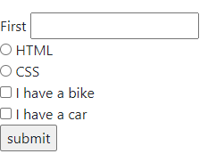
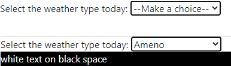
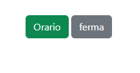
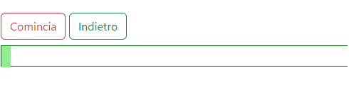
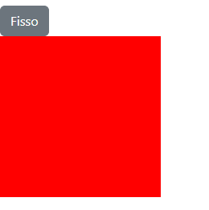

# JS 2, String array methods, If and Switch statements, let and var properties, HTML forms and js validation and setInterval()/setTimeout()

* [Let, Var and differences](js-2.md#undefined)
* [Text filter exercise](js-2.md#text-filter-javascript-and-dom-exercise)
* [Regex and string matching](js-2.md#regex-and-string-matching)
* [HTML forms and JS validation](js-2.md#html-forms-and-js-validation)
* [SetInterval in javascript](js-2.md#about-setinterval-on-button)
* [More on Text filter](js-2.md#text-filter-in-dom-with-javascript)

We can use **index** and array **methods** on **strings**:

```
//We can use the index but can't edit a string like an array
"string"[2]        //"r"
"string"[2] = "e"  //"string"

//We can also use more specific methods
"string".charAt(2)     //"r"
"string".charCodeAt    //114
```

<details>

<summary>slice(), substring(), concat() and split() methods on strings</summary>

We can't use **splice()** on strings, **slice()** doesn't edit the string, it creates a new one:

```
//slice(x,y), negative values start from the end of the string/array
let str = "Apple, Banana, Kiwi";
str.slice(7 , str.length)    //"Banana, Kiwi"
str.slice(6, -2);            //" Banana, Ki"
str.slice(5)                 //", Banana, Kiwi"

```

**substring( \[starting index, number of digits] )** can only be used on strings:&#x20;

```
str.substring(0, 5)          //"Apple"
```

**concat()** can work on strings too:

```
let ora= "orange"
str.concat("and ", ora)    //"Apple, Banana, Kiwi and orange"
```

**split()** returns an array from a **pattern separator**:

```
//it checks for (" ") and creates an array element from it
//We can limit the number of array elements

let siamo= "are you ready"
siamo.split("", 5)         //['a', 'r', 'e', ' ', 'y']
siamo.split(" ", 5)        //['are', 'you', 'ready']
siamo.split("   ", 5)      //['are you ready']
```

</details>

But **arrays** and **strings** are not of the same **type**:

```
typeof ["w","e","e","l"] //object
typeof "well"            //string
```

We can convert each other using **split()**, **toString()** and **join()**:

```
typeof "well".split("") == "w","e","e","l"     //object
["w","e","e","l"].toString()                   //"w,e,e,l"   
["w","e","e","l"].join("")                     //"well"
```

We use the **Typeof operator** and Array.isArray() to check the type of data:

```
Array.isArray("indeed".split(" ") ) //true
Array.isArray("indeed" )            //false
```

String data contains only 1 value and so is **primitive**, while Object contains more.

### If and Switch

The **IF statement** executes a block of code if its **condition** is true:

```
//else_if for other conditions, _else_ if no condition is true

if(true){
    return console.log("true")
}else if(){
}
else{
    return console.log("false")
}

```

For multiple **conditions** we can use **logical** operators:

```
//We can't 3<x<10 so we have to repeat the variable

if ((x === 5 || y > 3 || x <= 10) && (loggedIn || userName === 'Steve')) {
  //Run the code
}

if(x>3 && x<10){
  //code here
}

```

We can also use **switch** and **cases:**

<details>

<summary>Switch (if) statement</summary>

We use **break** to finish each **case** and default as the else{}.

```
switch (5) {
    case true:
	return console.log("number real")
	break;
    case false:
	return console.log("number not")
	break;
     default:
	return console.log("sdell")
}

```

If **more cases** share the same code.

```
const month = new Date().getMonth();

switch (month) {
	case 0:
	case 1:
	case 2:
		console.log("Winter");		// January, February, March
		break;
	case 3:
	case 4:
	case 5:
		console.log("Spring");		// April, May, June
		break;
	...
	default:
		console.log("No month");
}

```

</details>

```
//We use break to close the case and default as the last case

switch (5) {
    case true:
	return console.log("number real")
	break;
    case false:
	return console.log("number not")
	break;
     default:
	return console.log("sdell")
}

//if more than one case shares the same code 
const month = new Date().getMonth();

switch (month) {
	case 0:
	case 1:
	case 2:
		console.log("Winter");		// January, February, March
		break;
	case 3:
	case 4:
	case 5:
		console.log("Spring");		// April, May, June
		break;
	...
	default:
		console.log("No month");
}
```

Strings, numbers, and objects can have **falsy values**, which will be **false** in boolean:

<pre><code>- 0
- '': Empty string
- null
- undefined
- NaN

//typeof null being an object is an old bug
typeof null + " " + typeof undefined        //object, undefined

//null is a primitive value for "empty" variables
let vuoto = null
console.log( vuoto === null )        //true, assigned null value

//undefined is for the absence of a value, or non-existent keys in objects
<strong>let name;
</strong>console.log( name === undefined)     //true, initialized not assigned variable

</code></pre>

**Ternary operator** is a simplified conditional operator:

```
//The variable is used for returned values, works for if/else

let greeting = ( condition) ? 
	console.log("code returned for true")
	: 
	console.log("code returned for false");

```

We can use the **nullish coalescing operator** for _null/undefined_ values:

```
//using the ?? we get returned the right value if the left one is null/undefined

let amount = null;
let amount1 = 2

console.log(amount ?? 1)        // 1
console.log(amount1 ?? 1)       // 2
```

### Text filter javascript and DOM exercise

Check this code implementing **regex, forms, and setInterval**:



### Let, Var and differences

In 2015 the **let** keyword for variables was introduced:

```
//the main difference is in the scope of the variable

var z = 'hello';
var z = 'world';     //will allow to re-declare the variable
let j = 'hello';
let j = 'world';     //Syntax error on re-using the let keyword to re-assign

//Contrary to var global scope, let is limited to its block of code
let greeter = "hey hi";  
let times = 5;  
if (times > 3) {  
   var hello = "Say Hello JavaTpoint";   
   console.log(hello) 
}  
console.log(hello)    //it shouldn't be declared, error when using let

//var can be called out of its block, which is prone to errors 
```

The **different scope** can make the var accidentally change its value:

```
//here for example when calling the cb to see how the var=i changes in the for loop
//BUT being var global scoping it will change to 5 before the .push 

var callbacks = [];
(function() {
  var i;
  for (i = 0; i < 5; i++) {
    console.log("when does " + i + " change")
    callbacks.push( 
      function() { return i; } 
      );
  }
  console.log("is this " + i)
})();

console.log(callbacks.map( 
  function(cb) { return cb(); }  //resulting in [5, 5, 5, 5, 5]
  )
);

//If we had let the for loop would have increased and pushed the [1,2,3,4,5] instead
```

### Regex and string matching

We use **Regular Expression Search Methods** to search **patterns** in strings:

```javascript
//text pattern between // and letters for modifiers 
let pattern = /Lorem/i        //i is for case insensitive

vipsum.search(pattern)    //will return the index of the first match 
vipsum.search(/loreM/i)   //we can also put directly
```

To search **more specific patterns** with regex we can use:

```
//We get an array of the matched [letters] in the text
vipsum.match(/[qvgk]/g)    //['g', 'q', 'g', 'q', 'g', 'v', 'v', 'q']

//First match between 2 values (if we use g then it's the same as [])
vipsum.match( /[q|x]/ )    // ['m', index: 4, input: 'Lorem ...']

//We can also check for whitespaces (\s includes newlines)/new lines (\n only lines)
vipsum.match( /\s/g )    //(62)[' ', ' ', ' ', ' ', ' ', ' ', '\n',...]
vipsum.match( /\n/g )    //(4)['\n', '\n', '\n', '\n']

//Match the string /s+/ case insensitive and on the global string
vipsum.match( /s+/ig )    //(10)['s', 's', 's', 'SSS', 's', 's', 's', 's', 's', 's']
```

We use the **test()** method to **true/false if a pattern** is present on the string, while **exec()** to return a **pattern index** match and **input**:

```
//The regex goes first [pattern].test/exec(html) 
const primo= /lorem/i;
console.log( primo.test(html) );    //true 

//input being the entire string is taken upon
let yull = /ipsum/gi.exec(html)
console.log(yull)                  //['ipsum', index: 6, input: 'Lorem ipsum ... ']
```

Then we have the **.search()** and **.match() :**

```javascript
//.search() will return the index of the match if present
let visit = "Plant a tree!";
let n = visit.search(/plants/i);
console.log(n)                    //if no match then -1 return

//.match will return an array like exec.() but can contain multiple matches
console.log( "best is best".match(/best/g) )    //[best, best]

//Here we have html.search/match(___) when pattern is in ()
```

About variables used as **new regex patterns**:

```javascript
//We can get a value from the input to then create a new RegExp
let oltre = document.getElementById("cosa").value 

const regex =  new RegExp( "(" + oltre + ")", 'ig');    // /regex/ig
const kok = html.innerHTML.split( regex );  
```

About **stricter** filters:

```javascript
//We can use renex on a split() method (for white spaces for example)
let spaced = html.innerHTML.split( /(\s)/ )

//while if we want to check if the input is only white spaces we do this
primo.match(/^\s*$/)
```

### HTML forms and JS validation

We use **forms** to collect user **input**:



**\<Form>** is a container for **inputs/labels** and the **action** attribute allows us to **redirect** the form after submission:

```javascript
<form id="formula" method="post" action="https://www.ilpost.it/">
  <label for="unon">First</label>
  <input type="text" id="uno" name="unon"> <br>

  <input type="radio" id="html" name="fav_language" value="HTML">
  <label for="html">HTML</label><br>
  <input type="radio" id="css" name="fav_language" value="CSS">
  <label for="css">CSS</label><br>

  <input type="checkbox" id="vehicle1" name="vehicle1" value="Bike">
  <label for="vehicle1"> I have a bike</label><br>
  <input type="checkbox" id="vehicle2" name="vehicle2" value="Car">
  <label for="vehicle2"> I have a car</label><br>

  <input type="submit" value="submit">
</form>
```



The input function depends on its type:

```jsx
//It can be a radio button, a checkbox, or a text input
<input type="text" id="uno" name="unon">
<input type="radio" id="html" name="fav_language" value="HTML">
<input type="checkbox" id="vehicle1" name="vehicle1" value="Bike">

```

To access its content/**value** we:

```
let primo = document.querySelector("#vehicle1").value
```



**Label** identifies the input, they are assigned using "for" = "id" = "name"

```jsx
//The checkbox will be triggered even if click on the label
<input type="radio" id="javascript" name="fav_language" value="JavaScript">
<label for="javascript">JavaScript</label>:
```



We use the **\<form> id** and the **"submit" event** on the **"submit" type input**.

```jsx
//We need event.preventDefault() to not refresh the page on every submit

<form action="" id="btn">
    <input type="text" id="scritto">
    <input type="submit" value="javascript tick" >
</form>

const btn = document.querySelector('#btn');
btn.addEventListener("submit", (event) =>{
  event.preventDefault();
  let java = document.getElementById("scritto").value
  console.log(java)
})

```



<figure><figcaption><p>form with input labels</p></figcaption></figure>

For the **check status** and **value** of **radio/checkbox buttons,** we use the attributes **.checked** and **value**:

<details>

<summary>Radio and checkbox buttons submit</summary>

In a form we can put **label** and **input** in a different order:

```jsx
//we can separate or embed the tags
<form id="formula" method="post">
    <input type="radio" id="html" name="fav_language" value="HTML">
    <label for="html">HTML</label><br>
    
    <input type="checkbox" id="vehicle1" name="vehicle1" value="Bike">
    <label for="vehicle1"> I have a bike</label><br>

    <label for="c1"> 
        <input type="checkbox" name="color" value="red" id="c1">Red
    </label>
    <label for="c2">
        <input type="checkbox" name="color" value="green" id="c2"> Green
    </label>
    <label for="c3">
        <input type="checkbox" name="color" value="blue" id="c3">Blue
    </label>

    <input type="submit" value="submit">
</form>

```

In javascript, we check the **check state/value** of a single button or **queryselect()** many with the same attribute.

```
const formato = document.getElementById('formula');

let gippin = document.querySelector("#html")
let dess = document.querySelector("#vehicle1")

//.checked will return true/false if the button was clicked
//.value will return the value attribute even if not clicked
formato.addEventListener("submit", (event) => {
   event.preventDefault();

   console.log( gippin.checked )                 
   console.log( dess.value)                     

    let checkboxes = document.querySelectorAll('input[name="color"]:checked');
    let values = [];

    checkboxes.forEach((checkbox) => {
        values.push(checkbox.value);
        console.log( checkbox.value )
    });

}) 
//we need the queryselector() inside the event listener, will push
//all the values of the checked buttons in an array
```

</details>

<figure><figcaption><p>Checkbox/radio buttons form submit </p></figcaption></figure>

We use **select** to create a dropdown list.

<details>

<summary>Select in the DOM and JS</summary>

The **\<select>** in the HTML will be:

```jsx
<label for="weather">Select the weather type today: </label>
<select id="weather">
    <option value="">--Make a choice--</option>
    <option value="black">Sunny</option>
    <option value="white">Ameno</option>
</select>

<p id="well"></p>
```

When the **select** gets used it triggers the **"change" event,** we also use a js function to update the **CSS style**.&#x20;

```jsx
//we use the value of the <select> list
const select = document.querySelector('#weather');
const para = document.querySelector('#well');

function setWeather() {
  const choice = select.value;

  function update(bgColor, textColor) {
    para.style.backgroundColor = bgColor;
    para.style.color = textColor;
  }

  switch (choice) {
    case 'black':
      para.textContent = 'Text black on white space';
      update('white','black')
      break;
    case 'white':
      para.textContent = 'white text on black space';
      update('black','white')
      break;
    default:
      para.textContent = '';
  }
}

//We need a default "" case for when the value is ""
```

</details>

<figure><figcaption></figcaption></figure>

To push JS content into HTML DOM we can use **AppendChild()** or **innerHTML.**

&#x20;AppendChild() will **record** and **update** its content while innerHTML will **reset** it.

```jsx
<input type="text" name="name" id="txt_name" > 
<button onclick="kek()">
    ADD
</button>

<p id="demo"></p>
<p id="demani"></p>

//To push/append an element it needs to be createTextNode()
function kek(){
  let inside = document.getElementById("txt_name").value
  
  let textnode = document.createTextNode(inside+ " ");
  document.getElementById("demo").appendChild(textnode);  //will show past inputs

  let text;
  if (isNaN(inside) || inside < 1 || inside > 10) {
    text = "Input not valid";
  } else {
    text = inside + " I guess";
  }
  document.getElementById("demani").innerHTML = text;  //only current text value
}

```

We can **replace()** an **innerHTML** element using **regex**.

```jsx
let ipsum = document.getElementById("lorem")
let gulp =  ipsum.innerHTML.replace(/MagNi/gi, "Picoolo") 
ipsum.innerHTML = `<span >` +  gulp + `</span>` 
```

### Setinterval() and SetTimeout()

The **setInterval() method** calls a function at specified millisecond **intervals**, it returns an **ID** that can be used to stop it using **clearInterval()**:



```
<button class="btn btn-success" onclick="real()">Orario</button>
<button class="btn btn-secondary" onclick="stopped()">ferma</button>
<h3 id="attuale"></h3>
```

We **setInterval()** using the new Date() object (that updates itself) to create a clock:

```jsx
let attuale = document.getElementById("attuale")
let att;

//we create the variable for the setInterval() ID and use it to stop it
function current(){
    const date = new Date();
    attuale.innerHTML = date.toLocaleTimeString();
}

function real(){

    att= setInterval(() => {
        current()
    }, 1000);
}

function stopped(){
    clearInterval(att)
}
```

<figure><figcaption><p>setInterval() used with new Dat</p></figcaption></figure>



We draw a box and absolute background content:

```
<button class="btn btn-outline-danger" onclick="riempie()">Comincia</button>
<button class="btn btn-outline-success" onclick="svuota()">Indietro</button>
<div id="barra">
    <div id="parte"></div>
</div>

#barra{
    position: relative;
    width: 100%;
    height: 30px;
    border: 1px solid green;
}

#parte{
    position: absolute;
    width: 1%;
    height: 30px;
    background-color: lightgreen;
}
```

We use setInterval() to both increase and decrease width, but we need to **clearInterval()** before starting a new setInterval() with the **same ID**:

<figure><figcaption><p>CSS bar with increase/decrease setIterval() width</p></figcaption></figure>



```
<button class="btn btn-secondary" onclick="fer()">Fisso</button>
<div class="scatola">
</div>

#barra{
    position: relative;
    width: 100%;
    height: 30px;
    border: 1px solid green;
}

#parte{
    position: absolute;
    width: 1%;
    height: 30px;
    background-color: lightgreen;
}
```

We pass **parameters** to the **setTimeout function** by adding them in the setTimeout() method:

```
//We use a ternary operator to switch between the passed parameters
let scatola = document.querySelector(".scatola")

let andando= setInterval(boxe, 500, "red", "green")

function boxe(x1, x2){
    scatola.style.backgroundColor = 
    scatola.style.backgroundColor == x1 ? x2 : x1
}

function fer(){
    clearInterval(andando)
}

```

<figure><figcaption><p>setInterval() CSS parameters</p></figcaption></figure>



The **setTimeout() method** calls a function **once** after a number of milliseconds:



To **repeat** a setTimeout() function :

```jsx
<h2 id="stime" class="text-center"></h2>

//we need to put the setTimeout() in its own function
//and can be stopped with clearTimeout()
let stime= document.getElementById("stime")

function blue(){
    let arti= new Date()
    stime.innerHTML= arti.toLocaleTimeString();
    setTimeout( blue, 1000 )
}

blue()
```

<figure><figcaption><p>new Date() with setTimeout()</p></figcaption></figure>



We include **parameters** for the setTimeout function:

```jsx
<button class="btn btn-secondary" onclick="saluto()">arriva</button>

function greeting(x1, x2){
    console.log( x2 + " with some " + x1 )
}

function saluto(){
    setTimeout(
        greeting
    ,2000, "extra content", "starts")
}

//will return "starts with some extra content"
```


