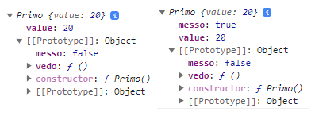

# JS 3 Array methods, Objects, Instances, prototypes, Object constructor and extends

* [Objects, methods, and keys](js-3.md#objects-methods-and-keys)
* [Object instances and prototype inheritance](js-3.md#object-instances-and-prototype-inheritance)
* [Object constructor and extends](js-3.md#object-constructor-and-extends)

### Filter(), map(), find() and forEach() on arrays

Some **methods** implement arrow **callback functions** in their **method call** and return true/false if the conditions apply, they are called **Predicate.**

Some methods are **Pure**, which means they return a new array without modifying the original.

**Includes()** return true/false for value existence in the array:

```jsx
//we can apply it directly on arrays, like most Predicate

[1,2,3,4,5].includes( 2 )        //true
```

**Map() will return a new array** applying its callback function, it's **pure**:

```jsx
let namesArray = ['elamin', 'antigoni', 'chris']
namesArray.sort().map( (x) => x.toUpperCase() )  //['ANTIGONI', 'CHRIS', 'ELAMIN',]

//or we can reference an external function (without calling it using () )
function upper(x){
    return x.toUpperCase()
}
namesArray.map(upper)
```

**.forEach()** won't return an array, but a looped **list of returns**:

```jsx
let anni = [1964, 2008, 1999, 2005, 1978, 1985, 1919]

anni.forEach( (x) => {
  console.log( 2022-x )    //separated results: 58 14 23 17 44 37 103
})  
```

You can use **forEach()** after a **map()/filter()** but not the opposite:

```jsx
//map() and filter() return arrays, while forEach() returns a list 

let numeronia = [4,6,8,2,4,1]              //the number is 6.../8/10
numeronia.map( (x)=> x+2 ).forEach( (x) => console.log( "the number is " + x )  
numeronia.filter((x)=>{return x>4 }).forEach((x)=> console.log("The number is " + x)
```

**.filter()** will return an array with the elements that satisfy the callback function condition, is **pure**:

```jsx
let anni = [1964, 2008, 1999, 2005, 1978, 1985, 1919]

const unicovo = anni.filter( (x) =>
  2022-x > 21        // [1964, 1999, 1978, 1985, 1919]
)

//We return object properties based on the filtered number of sauce/noodles
function quantities(layers) {
  return {
    noodles: layers.filter((layer) => layer === 'noodles').length * 50,
    sauce: layers.filter((layer) => layer === 'sauce').length * 0.2,
  }
}

quantities(["noodles", "noodles", "noodles", 'sauce'])  //{noodles: 150, sauce: 0.2}
```

To **filter(e) falsy values** and arrays remember always to put **e== true** as the first condition:

```jsx
//falsy values ("", null, false, NaN, undefined) can crash the code if we don't
//then we filter to return 2 values objects

var pairsByIndexRaw = [
    [0, 3], [1, 2], [2, 1], null, [1], false, "whoops", [1,2,4], "lo", 12
];

var pairsByIndex = 
    pairsByIndexRaw.filter((n) => n && typeof(n) == "object" && n.length == 2);
```

**.find()** will return the _first element matching_:

```jsx
var product1 = {
  id: 1,
  name: "Toaster X56 Plus",
  price: 12.98,
  stock: 105,
};

var producTs = [product1, ... ];

//The find() return won't be an array, unlike filter()
//products.find()   returns   { id: 4, name: 'Star Ship', price: 100, stock: 5 }
//products.filter() returns [{ id: 4, name: 'Star Ship', price: 100, stock: 5 }]

//We can find() objects properties from arrays
function add(x){
    return producTs.find((xx) => xx.id == x)
}

add(1)
```

**findindex()** works as a find() but is focused on indexes:

```jsx
//finding the first even number on an array OR its index

let stack= [1,3,4,5,6]

[...stack].find((x)=>x%2==0) )            //4 is the number
[...stack].findIndex( (x)=> x%2==0 )      //2 is its index
```

**Map()** and **Filter()** have different returns:

```jsx
let quatt = {
    cosa: [2, 9 ,6, 2 ]
}

quatt.cosa.filter( (x)=> x<10 )    //[ 2, 9, 6, 2 ]
quatt.cosa.map( (x)=> x<10 )       //[ true, true, true, true ]
```

**Some()** run tests on _each element_ of an array, returning **true/false** if at **least one satisfies** the **callback function** :

```jsx
let pairs = [1,4,0,12,7]

function nullifing(ind){
  return ind == 10 && ind == 4
}

//and it will return true/false, without returning an array of results for each
console.log(pairs.some(nullifing))      //true
console.log(pairs.map(nullifing))       //[false, true, false, false, false]
```

**Every()** check if all values of the array satisfy the callback function:

```jsx
//it returns true/false

[2,4,5,6,7].every( (x)=>x>= 2 )    //true
[2,4,5,6,7].every( (x)=>x> 2 )     //false   
```

**Reduce()** returns a single value, it calls its reducer function on an accumulated initialValue.                          Used in _Function Programming_, doesn't modify the array, it returns a new one.

```jsx
//initialValue is not a parameter, if absent first/second array values are used
//reduce() is equivalent to the "for...in" loop
const array1 = [1, 2, 3, 4];

const initialValue = 10;
const sumWithInitial= array1.reduce((accumulator,currentValue,currentIndex, array)=>{
    return accumulator + currentValue
  }, initialValue //The starting value in accumulation
);//20

//We can reduce() objects properties value, initialValue is needed
const objects = [{ x: 1 }, { x: 2 }, { x: 3 }];
const sum = objects.reduce(
  (accumulator, currentValue) => accumulator + currentValue.x,
  4,
); //4 +1 +2 +3 = 10
```

For a practical ReactJs example on Reduce() check [Parallax](../react/react-spring-3-usespringvalue-usechain-usetrail-indeterpolation-and-parallax./parallax.md).

```jsx
let arr = [1, 2, 3, 4];

//It loops through the array and return a single value
arr.reduce((accumulator, start) => accumulator + start, 0)    //0+1,+2,+3,+4= 10
```

**Reverse()** modifies the original array, it is **pure**.

**Flat()** creates a _new array_ with all sub-array elements concatenated a, it is pur the same level:

```jsx
//We can ...spread the elements of a nested array 
let deck= [1,2,3,4, 3]

deck.map((number, index)=>{
  if(number==3){
    deck.splice(index, 1, [3,3,3])
  }
})

deck             //[1, 2, Array(3), 4, Array(3)]
deck.flat()      //[1, 2, 3, 3, 3, 4, 3, 3, 3]

//We can specify the nested levels to flat(2) or flat(Infinity)
```

**FlatMap()** returns a new array by applying the callback function to each element and **flattens** it:

```jsx
let schab= [1,2,3,4,5,3]

schab.flatMap((card) => card === 3 ? [card, card, card] : [card])
//[1, 2, 3, 3, 3, 4, 5, 3, 3, 3]
```

To loop through _arrays_ we use **for() and while().**

```jsx
//for() is a more specific loop with a set counter and stop limit
for(let tin= 0; tin < limes.length; tin++ ){
    console.log(tin)        //0,1,2,3,4,...(limes.length-1)
}

//while() only needs its condition with an external counter
let x= 0;

while( x < limes.length ){
  console.log( x )          //0,1,2,3,4,...(limes.length-1)
  x += 1
}
```

### Objects, methods, and keys

**Objects** are variables that contain a collection of named values, stored in **property: value** pairs:

```
//and when we want to extract the property/value we:
const car = {
  type:"Fiat", 
  model:"500", 
  color:"white",
};

car.type              //Fiat
Object.keys(car)      //['type', 'model', 'color']  as an array we can also get
Object.keys(car)[0]   //type

//contrary to other languages the key is locked to "string" type
//you don't need to "" it unless using special syntax like "-[]/1234 5"
```

We can create **objects** out of **variables** as _property:values_ pairs:

```
const a123 = 'foo';
const b123 = 42;
const c123 = {};

const object3 = { a123, b123, c123 };

console.log( object3.a123 )    //"foo"
```

Objects can be **edited** by assigning a new property:value and use _\[variables]_ to **dynamically access** property values::

```
//To edit and add car properties
car.type = {first: "BMW", later: "wolk"}    //it changes the "Fiat" 
car.age = [49, 50];        //will add a new array property

let uno = "age"
car[uno] = 33        //We use variables to access objects' properties using []

//we can fill an empty object 
const person = {};
person.firstName = "John";
person.lastName = "Doe";

//To delete properties and values we use the delete keyword
delete car.color;

//To check if the key exists in the object
car.hasOwnProperty("color")        //true/false if it exist 
```

Or we could use **Object.assign()** to change an object property:

```
//we need 2 arguments, the objects and the { new property }
const obj12={
    tre: "well"
}

Object.assign( obj12, { tre: 12345 } );
console.log( obj12 )                    //{tre: 12345}
```

How we handle _**undefined/null**_ results in _objects_:

```
//to avoid having a JS error while accessing a nested non-existing property

const obj = {
  address: {
    street: 'Trincomalee Highway',
    city: 'Batticaloa',
  }
};

console.log(obj.residence)          //undefined, for a non-existing property
console.log(obj.residence.street)   //Javascript error when accessing nested property
console.log(obj.residence?.street)  //undefined, wont block the page on JS error for nested property
```

We can also use **instanceof** to check if empty or null objects are still _objects_:

```
//empty objects still count as objects

let lettera= {
}
let nulla= Object.create(null)

lettera instanceof Object        //true
({})    instanceof Object        //true
nulla   instanceof Object        //false, even if Object.create is used
```

**Primitive Data types** can be _objects_ with or without **coercion**, being Javascript a **weakly typed language:**

```
//Coercion will temporarily change the datatype of a variable in order to make
//an invalid operation work

"parola".length    //6, it shouldn't work coz primitive strings don't have properties like .length
Number(2) + 3      //5, you shouldn't be able to sum objects with primitives

//there is a difference between 

let parola1= "stringa"    
let parola= new String("stringa")

(parola1 instaceof String/Object)   //false both for string literal/primitive
(parola instaceof String/Object)    //true both, new Strings() creates an object and a string

//It works for new Number() and New Boolean() too.
```

With different types of data, we can use **Object.keys()** **iterable** on them:

```
//and we can use it on the array

Object.keys(car.nuovo)        //will return the indexes as an array ['0', '1', '2']
Object.keys(car.altro)        //will return properties [ 'uno', 'due', 'tre' ]
Object.keys(car.altro.due)    //will be of the array inside the object ['0', '1', '2', '3', '4']
```

**Object Methods** are functions stored in the object that can use **.this** for properties in the object:

```
//The fullo object method can use the property:values of the object it's in
const car = {
  type: "Fiat", 
  model: "500", 
  color: "white",
  fullo: function() {
    return this.type + " " + this.model;
  },
  fullon: function(type, model) {
    return type + " " + model;
  }
};

person.fullo()                        //Fiat 500 
person.fullon(car.type, car.model)    //Fiat 500
person.fullo                          //[Function (anonymous)]
```

Property functions can be shortened:

```
const tost={
  property: function (parameters) {},
}

const tost1={
  property(parameters){},
}

```

We use **Object.keys()/values()/entries()** to access an object data or a **for...of loop**.

```
const person = {
  firstName: 'John',
  lastName: 'second',
  cars: [
    {name: "Ford", models:["Fiesta", "Focus", "Mustang"] },
    {name:"BMW", models:["320", "X3", "X5"] },
  ]
}

Object.keys(person)     //['firstName', 'lastName', 'cars']
Object.values(person)   //['John', 'second', Array(3)]
Object.entries(person)  //[['firstName', 'John'], ['cars', Array(3)] ]

//We use the for...of to loop through its [keys, values] pairs
for (const [key, val] of Object.entries(person)) {
  console.log([key, val]);       //['name', 'Porter'],['age', 32], ['cars', Array(3)]
}
```

**Objects methods** can edit and return their own properties:

```
let univa ={
    name: "wallace",
    molti: ["uno", 2, 3, 45],
    money: 0,
    aggiung: function(inn){
        this.nuovo = inn        //univa.aggiung("this") add a new property
    },
    ancori: function(on){
        this.nuovo += " " + on  // .ancori("new") we add to new property "this new"
    },
    yunn: function(oll){
        this.molti.push(oll)    //univa.yunn( 23 ) adding to property array
    },
    spicc: function(we){
        this.money += we       //univa.spicc(24) "finally, you got it"
    },                         //univa.spicc(-16) "no money ;(?"  with money=8< 10
    compra: function(){
        if(this.money > 10){
            return "finally, you got it"
        }else{
            return "no money ;(?"
        }
    }
}

```

### Object Instances and Prototype inheritance

Javascript doesn't have **Static types** or **Static dispatching,** everything is an instance(object) or a function(constructor), and even functions are instances of a function constructor.

Every object has a built-in _private Object property_ **\[\[prototype]]**, that can be swapped or edited:

```
//It can be created and it has to be an object (which also has a [prototype]

const uno={
  ol: "siamo",
  __proto__:{
    ol: "siamo stati",
    vid: "quasistati",
    __proto__:{
      rin: "secondo"
    }
  }
}

//The [prototype] chain is accessed with uno.__proto.__proto__ etc
//{ ol: "siamo" } -> { ol: "siamo stati", vid: "quasistati" } -> {rin: 'secondo'} --> Object.prototype --> null

//can be accessed with Object.getPrototypeOf(uno) -> { ol: "...", vid: "..." }
```

The **\_\_proto\_\_** property and **Object.setPrototypeOf**(to, from) allow objects to inherit \[prototype]:

```
//Now the child object has the parent object properties and can call/edit them

const genitore={
  dopp: 3,
  metodo(){
    return this.dopp + 10
  }
}

const fig={
  __proto__: genitore
}

Object.setPrototypeOf(fig, genitore)

//Searching the methodo it will follow the __proto__ chain and find it in [prototype]
console.log( fig.metodo() )    //13    

fig.dopp= 12
console.log( fig.metodo() )    //22
```

We set up _\_\_proto\_\__ with the **.prototype** method:

```
function Scatola(rega){
  this.ecco= rega
}

Scatola.prototype.aggiungi= function(){
  return this.ecco + " è il nostro"
}

//We can create anonymous new objects 
const katt= [
  new Scatola(11),
  new Scatola(12),
  new Scatola(13),
]

//Object.getPrototypeOf(new Scatola()) === Scatola.prototype
```

**Instances** are **new** objects created from a constructor class functions:

```
function doSomething() {
  this.oltre= "acido"
}

doSomething.prototype.lin= "accidenti"

//The new Instance will inherit the constructor __proto__
let finn= new doSomething()
finn.liberi= "muriatico"

console.log( doSomething.oltre )        //Both undefined, even if the property is
console.log( doSomething.lin )          //in the constructor and prototype
console.log( doSomething.prototype.lin) //"accidenti"

```

<figure><figcaption><p>Instance object with prototype</p></figcaption></figure>

**Objects.create()** inherit the parent object as \_\_proto\_\_ while **instances** inherit the **constructor \[prototype]** as **\_\_proto\_\_**.

```
//The parent object becomes part of the __proto__ chain
const a1 = { a: 1 };
const b1 = Object.create(a1);

b1.__proto__    //{ a: 1 }

//On constructor functions instead
function foo() { }
function Bar() { }

Bar.prototype = Object.create(foo.prototype);

const bar = new Bar();
bar.__proto__ == Bar.prototype == foo{}

```

**Javascript** uses **prototypical objects** as _Templates_ from which **new** Objects **inherit** properties and methods (states and behaviors) in their \[\[prototype]].

Arrays and RegEx, for example, come with **\[\[prototype]]** included :

```
//Prototype function start with capital letter

function Person(name){
  this.name = name;
  this.mee = function(){
    return this.name + " welcome"
  }
}

//[prototype] won't be present in primitive data type BUT in their instances
let num= 5                //won't have [prototype]
let num= new Number(5)    //will have [prototype]:number

//Arrays and RegEx are instances
let fila= [1,2,3,4]      //new Array(1, 2, 3, 4);
const regexp = /abc/;    //new RegExp("abc");

//[[prototype]] and __protot__ are different from .prototype

```



To access the \[\[prototype]] methods and properties:

```
console.log( fila.__proto__ )
console.log( Object.getPrototypeOf(fila) )
```

<figure><figcaption><p>An array object __proto__ (a constructor function)</p></figcaption></figure>



.prototype is different and mostly used in **inheritance:**

```
//Simple objects won't have .prototype
console.log( fila.prototype )     //undefined
console.log( Array.prototype )    //actual prototype

//some older built-in prototypes are instances
console.log( Number.prototype )     //number 0
console.log( Array.prototype )      //empty array
console.log( RegExp.prototype )     // /(?:)/.

```



All Javascript **Objects inherit** \[\[prototype]], a property/function that contains all the _properties and methods available_ to the object.

Any method/property in the prototypical **object constructor function** body can _be added_ to the **prototype,** which is **more memory efficient** and allows for **object-specific syntax:**

<pre><code>//This can only be done to the Construction Object, not the instance/object
<strong>let prim = new Primo(11)
</strong>
Primo.prototype.somma1 = function(){
  return "ecco il numero " + this.value + " and " + this.somma(10) 
}

console.log( prim.somma1() )      //ecco il numero 11 and 22

</code></pre>

![The new method is in the \[\[prototype\]\]](../.gitbook/assets/added.PNG)

We use **.hasOwnProperty()** on **Instances** to check the **constructor function properties:**

```
//Any new method/property will be added to the Instances, even after
let secondo = new Primo(33)

Primo.prototype.messo= false
Primo.prototype.retro= function(){
  console.log( this.messo+ " is our way")    //false is our way
}

secondo.hasOwnProperty("messo")            //false
secondo.__proto__.hasOwnProperty("messo")  //true
```

**This** values returned from prototype.**methods** will become **instance properties**,

```
//It will remain false in prototype but will become new property in instance
let nino = new Primo()

Primo.prototype.messo= false
Primo.prototype.vedo= function(){
  if(!this.messo){
    this.messo= true
  }
}

console.log( nino )
nino.vedo()
console.log( nino )

```

<figure><figcaption><p>Instance prototype returned new This instance</p></figcaption></figure>

We can use **Object.assign** to more easily add properties and methods to prototypes:

```
//we need Object.assign(target, list of add-ons)

Object.assign(
  Rings.prototype,
  {
    texttogo: function(){
      return "ecco la stringa"
    },
    theme: "giallo",
    color: function(){
      return this.theme
    }
  }
)

let anello = new Rings()
anello.theme      //"giallo
```

A constructor function can **inherit another constructor**, its instances will have access to both:

```
//Using the Rings() constructor 
function Potato(sauce){
  this.sauce= sauce
}

Potato.prototype= new Rings()
let tomato = new Potato("ketchup")

tomato.texttogo()       //"ecco la stringa"
tomato.color("red")     //"giallo / red"
tomato.theme            //"giallo"

//If the prototype constructor is changed 
Potato.prototype= new Rings1()

let tomato1 = new Potato("mustard")
tutto.theme           //undefined

```



```
//A normal constructor will have [[property]] Object and constructor potato
function Potato(sauce){
  this.sauce= sauce
}

Potato.prototype.ordine= function(cosa){
  this.sauce = cosa
}

```

.PNG>)



```
function Potato(sauce){
  this.sauce= sauce
}

Potato.prototype= new Rings()    //no argumenst mean undefined property values
let tomato = new Potato("mayo")

```





**.Call()** is a Javascript method, it invokes (call) **a method from another object** using **this.**owner object as an argument.

```
//This allows us to use any object with uno/due property as argument
function Cosa(uno2, due2){
  this.uno= uno2
  this.due= due2
}

Cosa.prototype.altro= function(){
  return this.uno + " " + this.due + " is the other"
}

//uno/due are normally set on new instance
let occa= new Cosa("numero", "second")

//but we can create an external object with the same properties to use in .call()
const exem = {
  uno: "ecco",
  due: "altro"
}
console.log( occa.altro.call(exem))      //ecco altro is the other

//when adding more arguments, the order matters
Cosa.prototype.ancora = function(sapore, forma){
  return this.uno + " is the " + sapore + " " + this.due + " is indeed " + forma
}

occa.ancora.call(exem, "1", "quadrato")    //ecco is the 1 altro is indeed quadrato

```

**instanceof** checks if a prototype chain of an **instance** has **a constructor.prototype,** returning a boolean value**:**

```
function Pro(){ this.primo= "primo" }

function Hamb(){ this.meat= "secondo" }
Hamb.prototype = new Pro()

function Potato(){}
Potato.prototype = new Hamb()

let dove = new Potato()

(dove.primo + " / " + dove.meat)    //primo / secondo
(dove instanceof Potato)            //true
(dove instanceof Pro)               //true
(Hamb instanceof Pro)               //false
```

We can use **instanceof** for other types of data too:

```
//Primitive boolean, string, and number data are not instances
let str= 'This is a literal string';
let obj= new String('String');

//The obj is gonna have a [[prototype]] string, while the primitive won't 
console.log(str instanceof String)     //false
console.log(obj instanceof String)     //true

//which also means is instanceof Object
console.log(str instanceof Object)    //false
console.log(obj instanceof Object)    //true

```

### Object constructor and extends

**Functions are callable objects,** so they can contain properties and methods:

We use **Constructions functions** as templates to create new objects using the **new** keyword:

```
//The constructor function arguments are passed by the instances
function Person(first, last, age, eye) {    
    this.firstName = first;                     
    this.lastName = last;                    
    this.age = age;
    this.eyeColor = eye;
    this.minimal = function(age){                   
        this.age = age
        return this.age + " maybe"
    };
    this.summary = function(){                      
        return this.eyeColor + " " + this.firstName
    }
}

let myFather = new Person("John", "Doe", 50, "blue");
myFather.summary(12)    //10, blue John

```

We can use **extends** to extend function constructors, **super()** calls the previous constructor to include **all its properties**:

```
function Animal(name){
    this.name = name,
    this.speak =  function speak(){
        console.log(`${this.name} makes a noise.`);
    }
}

//A new class names and extends the constructor, added methods outside constructor{}
class Dog extends Animal {
  constructor(surname, altro) {
    super(surname); 
    this.more = altro
  }

  speak() {
    console.log(`${this.name} barks.`);
  }
}

//The extended instance has 1 argument for the super and another for its own props 
let d = new Dog('Mitzie', "maybe");    
//Dog { name: 'Mitzie', speak: [Function: speak], more: 'maybe' }

```

**Extends** also extends the **\[\[prototype]] chain:**

```
// d--> Dog.prototype --> Animal.prototype --> Object.prototype --> null
```

The **Class keyword** was introduced in 2015, it doesn't change Javascript's **prototype-based nature** but helps to make syntax more in line with C++ and Java.

It creates **construction Objects templates** whose properties and methods can be **inherited** by other objects, called instances:

```
//it needs a constructor that keeps the properties and parameters

class Parv{
  constructor(rin){
    this.all= rin
  }
  dardo= function(){
    return this.all + " more"
  }
}

let rag = new Parv("winn")
console.log( rag.dardo() )      //winn more
```

Instances can **modify the inherited** \[prototype] into new properties:

```
function Vehicle(make, model) {
    this.make = make;
    this.model = model;
}

Vehicle.prototype.start = function() {
    console.log(this.make + ' ' + this.model + ' starts');
};

var volkswagen = new Vehicle('Volkswagen', 'Golf');

volkswagen.start();                 // Volkswagen Golf start
volkswagen.start= function(){
    console.log(this.make + ' ' + this.model + ' is kinda starting');
} 
volkswagen.start()                  //Volkswagen Golf is kinda starting

```

We can also use **get()** for methods and more _super_:

```
function Quada(alte, larg){
  this.alte = alte,
  this.larg = larg
}

const triang = new Quada(200, 100)

class Vast extends Quada{
  constructor(quado, all ,moe){
    super(quado, all)      //Quada(alte, larg)
    this.moe = moe
  }
  get minus(){return this.alte + this.larg}
  getAge() {
    return "winning " + this.alte
  }
}
//the difference between get minus()/getAge()

const parall = new Vast(100, 200, "bilanciato)
console.log( parall.minus )                      //300 we dont need the () for get
console.log( parall.getAge() + parall.moe)       //300 bilanciato

```
