# JS 3

* [Objects, methods, and keys](js-3.md#objects-methods-and-keys)
* [ES6 syntax and more objects](js-3.md#es6-syntax-and-more-objects)
* [Object constructor and extends](js-3.md#object-constructor-and-extends)

### Filter(), map(), find() and forEach() on arrays

Some **methods** implement arrow **callback functions** in their **method call** and return true/false if the conditions apply, they are called **Predicate.**

**Includes()** return true/false for value existence in the array:

```
//we can apply it directly on arrays, like most Predicate

[1,2,3,4,5].includes( 2 )        //true

```

**Map() will return a new array** applying its callback function:

```
let namesArray = ['antigoni', 'chris', 'elamin']
namesArray.sort().map( (x) => x.toUpperCase() )        //['ANTIGONI', 'CHRIS', 'ELAMIN',]

//with callback functions we can also use functions in calls without the ()
function upper(x){
    return x.toUpperCase()
}
namesArray.map(upper)

```

**.forEach()** is different:

```
//it doesn't return an array, but it still loops trought the array 
let anni = [1964, 2008, 1999, 2005, 1978, 1985, 1919]

anni.forEach( (x) => {
  console.log( 2022-x )    //we will get a list of results not an array, 58 14 23 17 44 37 103
})

//you can use a forEach after a .map() but not the opposite
let numeronia = [4,6,8,2,4,1]
numeronia.map( (x)=> x+2 ).forEach( (x) => console.log( "the number is " + x))  //the number is 6...

```

**.filter()** will return an array with only the ones that satisfy:

```
//It will create a new array with only the passed elements if we store it with
let anni = [1964, 2008, 1999, 2005, 1978, 1985, 1919]
const unicovo = anni.filter( (x) =>
  2022-x > 21
)

console.log( "these people can drive " + unicovo)    //these people can drive 1964,1999,1978,1985,1919

//we can also add callback functions to objects values using filter

function quantities(layers) {
  //we filter and array noodles, we count them and multiply as object values
  return {
    noodles: layers.filter((layer) => layer === 'noodles').length * 50,
    sauce: layers.filter((layer) => layer === 'sauce').length * 0.2,
  }
}

quantities(["noodles", "noodles", "noodles", 'sauce'])      //{noodles: 150, sauce: 0.2}

```

About how to **.filter() falsy values** and _arrays_ in the callback function:

```
//to filter the falsy values ("", null, false, NaN, undefined), the array (which is an object) and the .lenght 2 

var pairsByIndexRaw = [
    [0, 3], [1, 2], [2, 1], null, [1], false, "whoops", [1,2,4], "lo", 12
];

var pairsByIndex = pairsByIndexRaw.filter((n) => n && typeof(n) == "object" && n.length == 2);

```

**.find()** on the other hand, will return the _first_ element matching:

```
var product1 = {
  id: 1,
  name: "Toaster X56 Plus",
  price: 12.98,
  stock: 105,
};

var producTs = [product1, ... ];

//we use find() not only to return the first element matching but also to not have an array
//products.find()would return    { id: 4, name: 'Star Ship', price: 100, stock: 5 }
//products.filter() would return [ { id: 4, name: 'Star Ship', price: 100, stock: 5 } ]

function add(x){
    return producTs.find( (xx)=> xx.id == x)
}

add(1)    //being producTs an array of objects we can use the method to find one with id property

```

**findindex()** works as a find() but is focused on indexes:

```
//finding the first even number on an array OR its index

let stack= [1,3,4,5,6]

[...stack].find((x)=>x%2==0) )            //4 is the number
[...stack].findIndex( (x)=> x%2==0 )      //2 is its index

```

**Map() and filter()** can be different when returning properties and objects, especially if used with **.forEach()**:

```
let quatt = {
    cosa: [2, 9 ,6, 2 ]
}

//they return different values
quatt.cosa.filter( (x)=> x<10 )    //[ 2, 9, 6, 2 ]
quatt.cosa.map( (x)=> x<10 )       //[ true, true, true, true ]

//and to chain you will have to use filter(), we can use forEach() INSIDE .filter() but not the opposite, 
//.forEach doesnt return an array for .filter to work() / .filter does create an array that can get .forEach()
quatt.cosa.filter( (x)=> x<10 ).forEach( (x) =>  console.log( "This shoudl work with " + x ) )    //This shoudld work with 2 

//having an array of objects and properties with arrays 
let terzo = {
    name: "terzo",
    totali: 30,
    already: 8,
    dove: {
        citta: "naples",
        posto: "sud"
    },
    cosa: [ 10,5,6, 3]
}

let quatt = {
    name: "quatt",
    totali: 12,
    already: 8,
    dove: {
        citta: "roma",
        posto: "centro"
    },
    cosa: [2, 9 ,6,2 ]
}

let tutti = [primo, secondo, terzo, quatt]
//we can have an object with methods 
let app = {
    cibo: function(x){
        let fin = []
        tutti.map((xx) =>{
            if(xx.cosa.includes(x) ){
                return fin.push( xx.name )
            }
        })
        return fin
    },
//with map we need an extra array to push the specific properties of the if()
    filto: function(zona){
        return tutti.filter( (x)=> x.dove.posto == zona ).length
    }
//filter() returns the objects as an array and we get the length
}

console.log( app.cibo(10) )            //[ 'terzo' ]
console.log( app.filto("centro")  )    // 1 ,we get the length of the array of objects filtered

```

**Some()** run tests on _each element_ of an array, returning **true/false** if at **least one satisfies** the **callback function** :

```
//we can use logic operators without using .forEach()

let pairs = [1,4,0,12,7]

function nullifing(ind){
  return ind == 10 && ind == 4
}

//and it will return true/false, without returning an array of results for each
console.log(pairs.some(nullifing))      //true
console.log(pairs.map(nullifing))       //[false, true, false, false, false]

```

**Every()** checks if all values of the array satisfies the callback function:

```
//it returns true/false

[2,4,5,6,7].every( (x)=>x>= 2 )    //true
[2,4,5,6,7].every( (x)=>x> 2 )     //false   

```

before we start with objects let's check the **for() and while() loop**

```
//for() is a more specific loop with a set counter and stop limit
for(let tin= 0; tin < limes.length; tin++ ){
    console.log( tin)        //0,1,2,3,4,(limes.length-1)
}

//but sometimes you may need a looser condition for the loop, also some object keys in advance
//we can get the values for properties in the wedges, object["string"] = number

function limesToCut4(wedgesNeeded, limes) {
    let index = 0;
    const wedges = {
        'small': 6,
        'medium': 8,
        'large': 10
      }
    while(wedgesNeeded > 0 && index < limes.length){
        if(limes[index]) {
            wedgesNeeded -= wedges[limes[index]] ;
            index++;
        } else {
            return index;
        }
    }
    return index;
}

console.log( limesToCut(0, ['small', 'large', 'medium']) )        //we get 0

//while( condition ) we can modify the index somewhere else and then close it with else

```

### Objects, methods, and keys

**Objects** are variables that contain a collection of named values, stored in **property: value** pairs:

```
//and when we want to extract the property/value we:
const car = {
  type:"Fiat", 
  model:"500", 
  color:"white",
};

car.type              //Fiat
Object.keys(car)      //['type', 'model', 'color']  as an array we can also get
Object.keys(car)[0]   //type

//contrary to other languages the key is locked to "string" type
//you don't need to "" it unless using special syntax like "-[]/1234 5"
```

Objects can be **edited** by assigning a new property:value and use _\[variables]_ to **dynamically access** property values::

```
//we don't need keywords 
car.type = "BMW"     //it changes the "Fiat" 
car.age = 50;        //will add a new property age: 50

let uno = "age"
car[age] = 50        //we can both add and access objects using variables

//also we can add different types of data
car.nuovo = [1,2,3]            //like array
car.altro = {uno: [1,2,3,4,5], due: [1,2,3,4,5], tre: [1,2,3,4,5]}        //and objects of arrays

//we can also use this on an empty object
const person = {};
person.firstName = "John";
person.lastName = "Doe";

//To delete properties and values we use the keywords
delete car.color;

//To check if the key exist in the object
car.hasOwnProperty("color")        //true/false if it exist 
```

How we handle _**undefined/null**_ results in _objects_:

```
//to avoid having a JS error while accessing a nested non-existing property

const obj = {
  address: {
    street: 'Trincomalee Highway',
    city: 'Batticaloa',
  }
};

console.log(obj.residence)          //undefined, for a non-existing property
console.log(obj.residence.street)   //Javascript error when accessing nested property
console.log(obj.residence?.street)  //undefined, wont block the page on JS error for nested property
```

We can also use **instanceof** to check if empty or null objects are still _objects_:

```
//empty objects still count as

let lettera= {
}
let nulla= Object.create(null)

lettera instanceof Object        //true
({})    instanceof Object        //true
nulla   instanceof Object        //false, even if Object.create is used

```

**Primitive Data types** can be _objects_ with or without **coercion**, being Javascript a **weakly typed language:**

```
//Coercion will temporarily change the datatype of a variable in order to make
//an invalid operation work

"parola".length    //6, it shouldn't work coz primitive strings don't have properties like .length
Number(2) + 3      //5, you shouldn't be able to sum objects with primitives

//there is a difference between 

let parola1= "stringa"    
let parola= new String("stringa")

(parola1 instaceof String/Object)   //false both for string literal/primitive
(parola instaceof String/Object)    //true both, new Strings() creates an object and a string

//It works for new Number() and New Boolean() too.
```

With different types of data, we can use **Object.keys()** on them:

```
//and we can use it on the array

Object.keys(car.nuovo)        //will return the indexes as an array ['0', '1', '2']
Object.keys(car.altro)        //will return properties [ 'uno', 'due', 'tre' ]
Object.keys(car.altro.due)    //will be of the array inside the object ['0', '1', '2', '3', '4']

```

**Object Methods** are functions stored in the object that can use **.this** for properties in the object:

```
//the function stored in the fullo method can use the property:values of the object it's in
const car = {
  type:"Fiat", 
  model:"500", 
  color:"white",
  fullo: function() {
    return this.type + " " + this.model;
  },
  fullon: function(type, model) {
    return type + " " + model;
  }
};

person.fullo()                        //Fiat 500 
person.fullon(car.type, car.model)    //Fiat 500
person.fullo                          //[Function (anonymous)]

```

We can use the **for()** loop with both properties and values of an object:

```
const person = {
  firstName: 'John',
  lastName: 'second',
  cars: [
    {name:"Ford", models:["Fiesta", "Focus", "Mustang"] },
    {name:"BMW", models:["320", "X3", "X5"] },
    {name:"Fiat", models:["500", "Panda"] }
  ]
}

//Instead of doing the .forEach on the Object.keys(__) we do a loop
Object.keys(person).forEach(function (x) {
  console.log(person[x]);
});

//with for(), we set the counter/Object.keys IN object and also use it for vlues too
for (let x in person) {                  //key        object[key]=value
  console.log( x + ": " + person[x] )    //firstName: John,             lastName: second
}

//as for the array, its keys would be the index, we can also go beyond for nested properties
for (let i in myObj.cars) {
  yy = myObj.cars[i].name + " " ;
  console.log( yy )                  //this will print the "Ford" name but
  
  for (let j in myObj.cars[i].models) {
    y = myObj.cars[i].models[j] + " ";
    console.log( y )                 //also the array elements of the name[i] "Fiesta Focus Mustang" 

  }
}

```

We can also **return property values** as _arrays_ with for() and **.values()**:

```
//This is useful with NODElist

let objin = {
  name: "Porter",
  age: 32
};

//in 2017 it was introduced the .values to go along with .keys()
console.log(Object.values(objin));        //['Porter', 32]
console.log(Object.keys(objin));         //['name', 'age'] 

//we can also get an array using .map with obj11["property-name"]
const vals = Object.keys(obj11).map(key => obj11[key]);

//or we can get arrays or property:values couples, 
for (const [key, val] of Object.entries(obj222)) {
  console.log([key, val]);                            //['name', 'Porter'],['age', 32]
}

//We can use for Object loop to rebuild an object

function scaleRecipe1(recipe, portions) {
  const scaled = recipe                    //taking the passed object

  for (let ingredient in scaled) {
    scaled[ingredient] *= portions/2       //we get the key from for and use object[key] to modify the values   
  }
  return scaled                            //then we get the object
}

```

This can help us for more precise loops of if statement:

```
const prepTime = {
    'Pure Strawberry Joy': 0.5,
    'Energizer': 1.5,
    'Green Garden': 1.5,
    'Tropical Island': 3,
    'All or Nothing': 5
  }

//IF between the properties/keys is present the parameter we return the VALUE of the property
function timeToMixJuice(name) {
    if(Object.keys(prepTime).includes(name)) {
      return prepTime[name]
    } else {
      return 2.5;
    }
}

//timeToMixJuice("Energizer")            //1.5

```

**Methods** can edit and return other properties:

```
let univa ={
    name: "wallace",
    molti: ["uno", 2, 3, 45],
    money: 0,
    aggiung: function(inn){
        this.nuovo = inn
    },
    ancori: function(on){
        this.nuovo += " " + on
    },
    yunn: function(oll){
        this.molti.push(oll) 
    },
    spicc: function(we){
        this.money += we
    },
    compra: function(){
        if(this.money > 10){
            return "finally, you got it"
        }else{
            return "no money ;(?"
        }
    }
}

univa.aggiung("this")     //we first add a new property this.nuovo and then we set its value 
univa.ancori("new")       //at "this", then with ancori method we change it with "this new"
univa.yunn( 23 )          //we can have the argument be added at an array property, this.molti.push(oll) 
univa.spicc(24)           //univa.compra() would return "finally, you got it" with money 24 > 10
univa.spicc(-16)          //"no money ;(?"  with money=8< 10

```

**Javascript** uses **prototypical objects** as _Templates_ from which **new** Objects **inherit** properties and methods (states and behaviors):

```
//We start with a prototype function, starting with a Capital letter

function Person(name){
  this.name = name;
  this.mee = function(){
    return this.name + " welcome"
  }
}

```

![The \[\[Prototype\]\] showing which methods properties are present](../.gitbook/assets/prototype.PNG)

All Javascript **Objects inherit** \[\[prototype]], a property/function that acts as a **map** for all the _properties and methods avaiable_ to the object&#x20;

Any method/property in the prototypical **object constructor function** body can instead _be added_ to the **prototype,** which is **more memory efficient** and allows for **object-specific syntax:**

```
//This can only be done to the Construction Object, not the instance/object

let prim = new Primo(11)

Primo.prototype.somma1 = function(){
  return "ecco il numero " + this.value + " and " + this.somma(10) 
}

console.log( prim.somma1() )      //ecco il numero 11 and 22

//If we wanted we could access JUST the [[prototype]] 
console.log( prim.__proto__ ) 
//but we are still referencing the constructor prototype, the one that actually has it
console.log( Primo.prototype )
//if we tried to get the .prototype from the Instance/object
console.log( prim.prototype )      //undefined

console.log( prim ) 
//And the object prototype will be changed
```

![The new method is in the \[\[prototype\]\]](../.gitbook/assets/added.PNG)

About **inheritance** and **.hasproperty()** in _Instances_:

```
//Any new method/property will be added to the Instances, even those precedents

let secondo = new Primo(33)
console.log( secondo )

Primo.prototype.messo= false
Primo.prototype.retro = function(){
  console.log( this.messo+ " is our way")    //false is our way
}

console.log( secondo )
//Both secondo are gonna now have the .retro() method and .messo property

//In Instances/objects we can use .hasOwnProperty() for True/False on specific properties
secondo.hasOwnProperty("messo")    //True, secondo has the intance messo

```

After defining default values and .methods, we can modify properties inside instances

```
//We start with default values and a method that interacts with it

Primo.prototype.messo= false
Primo.prototype.vedo= function(){
  if(!this.messo){
    this.messo= true
  }
}

console.log( prim )
prim.vedo()
console.log( prim )

```



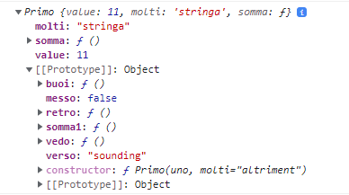

This is before the method .vedo() is called, **both have the method and default property in prototype.**



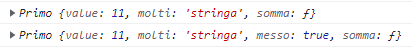

Even if both had the .messo property in the prototype, after the method the second one has the .messo **property in the object body**.



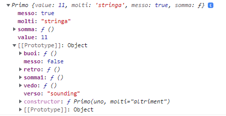

It's prim.messo **property changed** (true) after the .vedo() method and **we still have** the \[\[prototype]] messo with its default values in our instance.

```
//the instance prim now has a different property from prototype

prim.messo        //true

```



We can use **Object.assign** to more easily add properties and methods to prototypes:

```
//we need Object.assign(target, list of add-ons)

Object.assign(
  Rings.prototype,
  {
    texttogo: function(){
      return "ecco la stringa"
    },
    theme: "giallo",
    color: function(){
      return this.theme
    }
  }
)

```

We can make a _constructor_ Object **Inherit an entire constructor**, and have _access_ to its \[\[prototype]], the instance will have a **chain of prototypes**, inheriting multiple constructor prototypes:

```
//While using the created Rings constructor

function Potato(sauce){
  this.sauce= sauce
}

//You don't need to add the arguments to the constructor
Potato.prototype= new Rings()

let tomato = new Potato("ketchup")
console.log(tomato.inn)      //undefined, from the this.inn Rings property

//now any instance of Potato has access to Rings properties and methods
console.log(tomato.texttogo() )      //"ecco la stringa"
console.log(tomato.color() )         //giallo

//doing that to an Instance won't work
//And inheriting another will invalidate all previous access

Potato.prototype= new Extra()
console.log(tomato.texttogo() )    //error .texttogo is not a function

```



```
//A normal constructor will have [[property]] Object and constructor potato

function Potato(sauce){
  this.sauce= sauce
}

Potato.prototype.ordine= function(cosa){
  this.sauce = cosa
}

```

.PNG>)



```
//its [[prototype]] changed and even its constructor is now Rings, with its properties

function Potato(sauce){
  this.sauce= sauce
}

Potato.prototype= new Rings()    //no argumenst mean undefined property values
let tomato = new Potato("ketchup")

```

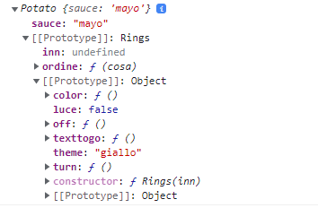



**.Call()** is a Javascript method, it invokes (call) **a method from another object** using **this.** owner object as an argument.

```
//The method we created requires 2 properties called UNO and DUE 

function Cosa(uno2, due2){
  this.uno= uno2
  this.due= due2
}

//we could use any .uno and .due property from objects
Cosa.prototype.altro= function(){
  return this.uno + " " + this.due + " is the other"
}

let occa= new Cosa("numero", "second")

const exem = {
  uno: "ecco",
  due: "altro"
}

//Even if the function didn't have a parameter, with .call() we can use ANOTHER
//object as argument and pass the .uno and .due property
console.log( occa.altro.call(exem))      //ecco altro is the other

//we can even add more arguments, the order of which is important

Cosa.prototype.ancora = function(sapore, forma){
  return this.uno + " is the " + sapore + " " + this.due + " is indeed " + forma
}

occa.ancora.call(exem, "dolce", "quadrato")    //ecco is the dolce altro is indeed quadrato
//we used both properties and arguments

```

We use **.call()** in order to **inherit just some** properties or methods from the **constructor object**:

```
//we .CALL() the constructor function, with THIS. HAMB object as argument, and
//arguments for ITS properties

function Hamb(meat, sauce1){
  Potato.call(this, sauce1, meat)
  this.meat= meat
}

let chicken = new Hamb("pollo", "garlic", "upwards")

```



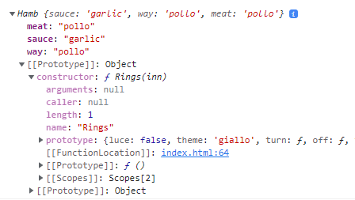

It will indicate Rings constructor but **It won't have access to its methods**, just its properties.



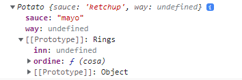

The object has access to its methods if they are with the \[\[prototype]]



**instanceof** checks if a prototype chain of an **instance** has **a constructor.prototype,** returning a boolean value**:**

```
//From our previous code
//after the Potato.prototype= new Rings()
//let tomato = new Potato("ketchup")

tomato instanceof Potato        //True tomato gets to be instance of both 
tomato instanceof Rings         //True

chicken instanceof Hamb     //true
chicken instanceof Potato   //false the .call() inherits just the properties, not any prototype

```

More about **.constructor** and **.constructor.prototype:**



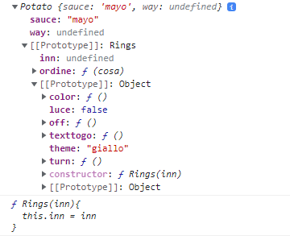

```
//from the first line you see is an instance of Potato{properties}
//its [[prototype]] is gonna be Rings, which tomato is instaceof
//Also, Potato.prototype.ordine is inside [[prototype]] with the 
//Rings[[prototype]] and inside of it there is the Rings() methods
console.log( tomato )

//the constructor is gonna be the function constructor body, without the 
//prototype.methods added
console.log( tomato.constructor )

```

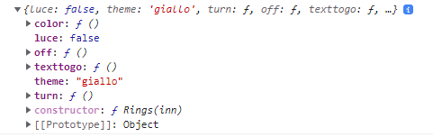

```
//[[prototype]] Rings => [[prototype]] Object => the list of methods and
//properties assigned to Tomato.constructor (Ring)

tomato.constructor.prototype

```



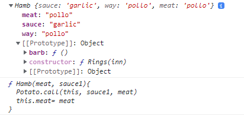

```
//chicken only is an instance of Hamb, its [[prototype]] is just object
//Its actual constructor isn't Rings, its Hamb
console.log( chicken )
console.log( chicken.constructor )

```

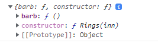

```
//Its constructor prototype ends up being

console.log( chicken.constructor.prototype )

```



We can use **instanceof** for other types of data too:

```
//It can help to see the difference between a primitive typeof and an Object
//for Booleans, strings and numbers

let str= 'This is a literal string';
let obj= new String('String');

//The obj is gonna have a [[prototype]] string, while the primitive won't 
console.log(str instanceof String)     //false
console.log(obj instanceof String)     //true

//which also means is instanceof Object
console.log(str instanceof Object)    //false
console.log(obj instanceof Object)    //true

```

Using **instanceof** in any **if statement** requires:

```
//you need an extra () if working with FALSE instanceof

if(!(chicken instanceof Rings )){
  console.log("its not an instaceof then this apply")
}

if(!chicken instanceof Rings){
  console.log("this will never apply")
}

//!chicken will be evaulated before, so it will end up as False instaceof Rings, which can't happen
```

We build a **construction function** in which we use **other construction as property**:



```

class Size{
  constructor(uno= 80, due=60){
    this.width= uno;
    this.height= due;
  }
}

Size.prototype.resize = function(uni, dui) {
  this.width = uni
  this.height = dui
}

```



```

class Position{
  constructor(uno=0, due=0){
    this.x= uno;
    this.y= due;
  }

  move(newuno, newdue){
    this.x= newuno;
    this.y= newdue;
  }
}

```





```
//We assign the property screenSize the instance of Size with set arguments
//size and position can work without parameters thanks to their default values

class ProgramWindow{
  constructor(){
      this.screenSize = new Size(800, 600)
      this.size= new Size()
      this.position= new Position()
  }
}

//and we can access the height and width property from the screenSie property
const prop = new ProgramWindow()
console.log( prop.screenSize.width )    //800
console.log( prop.screenSize.height )   //600

```

Next we have a **resize()** method that will resize any new object that surpasses the set width, height of screenSize:

```
//the Size1 width and height will be resized IF it's bigger than the difference
//between the fixed screenSize and the current position X Y

//with Math.min is a simpley way to do Size1.width < topwidth
//We also use Math.max(1) to cerrect the lower value to 1 if negative

  resize(Size1){

    const topheight= this.screenSize.height - this.position.y
    const topwidth= this.screenSize.width - this.position.x

    const neoheight= Math.max(1, Math.min(Size1.height, topheight))
    const neowidth= Math.max(1, Math.min(Size1.width, topwidth))

    this.size.resize(neowidth, neoheight)
    Size1.width= this.size.width
    Size1.height= this.size.height
  }
  
//to access the method itself we need to first create an instace of it
const programWindow = new ProgramWindow();

//Then we create an instace we want to use as argument of said method
let max= new Size(850, 650)

programWindow.resize(max)
console.log(max)      //its height and width will be resized at 800, 600, based on
                      //the screenSize and 0,0 position
```

We do a symilar operation with the **move()** method:

```
//it's symilar to the previous method, the position object in the parameter
//will be modyfied if it plus the Size exceed teh screenSize proportions

  move(Pos){
    const topheight= this.screenSize.height - this.size.height
    const topwidth= this.screenSize.width - this.size.width

    const neoheight= Math.max(0, Math.min(Pos.y , topheight))
    const neowidth= Math.max(0, Math.min(Pos.x , topwidth))

    Pos.x= neowidth
    Pos.y= neoheight

    this.position.move(neowidth, neoheight)
  }

//both methods modify the property of out new ProgramWindow() instance
const programWindow2 = new ProgramWindow();

const newPosition2 = new Position(410, 750);
programWindow2.move(newPosition2);
console.log( newPosition2 )        //410, 540
//Position.Y exceeds the screenSize so with default Size.height at 60, we round at 540

const newSize2 = new Size(1000, 1000);
programWindow2.resize(newSize2);
console.log(newSize2)             //390, 60
//Both sizes will be resized BASED on the previous position results, that changed
//the Size() and Position() that ProgramWindow uses as instances

```

We can **optimize** the entire process further:

```
//we use the instance objects as argument for the Instance method

function changeWindow(prowin){
  prowin.move(new Position(100, 150))
  prowin.resize(new Size(900, 900))

  return prowin
}

//we use the instace as argument
const updatedWindow = changeWindow( new ProgramWindow() );
console.log( updatedWindow )    //position be 100, 150 while size be 800, 450

```

### ES6 syntax and more objects

We can use a **Default parameter** in a function:

```
function defaultParameter(name = "sam") {
  return console.log( name);
}

defaultParameter("oltre")    //"oltre"
defaultParameter()           //"sam"

```

We can also use the **spread/rest operator** for arrays and objects:

```
//The REST operator can store the latter portion of the array,
//It has to be the last element of the array because it can't be followed by a comma
let [uno, ...due] = [1,2,2,3,4,5,6,8]
console.log( due )                      //[2, 2, 3, 4, 5, 6, 8]

//The SPREAD operator can sum arrays or use it to perform operations
const oneToFive = [1, 2, 3, 4, 5];
const oneToTen = [...oneToFive, 6, 7, 8, 9, 10];

console.log(oneToTen)        //[1, 2, 3, 4, 5, 6, 7, 8, 9, 10]

//We can use it as .concat() method followng the order of the function parameters
function combineArrays(arr1, arr2, arr3) {
  return [...arr3 , ...arr2, ...arr1];
}
combineArrays( [12, 34], [23, 45], [100] )    //[ 100, 23, 45, 12, 34 ]

//Or as .split("") method on strings
let siamo = "siamo"
[...siamo]                   //['s', 'i', 'a', 'm', 'o']
siamo.split("")              //['s', 'i', 'a', 'm', 'o']

//Or for Math operations without needing to loop/filter the array elemets
let mat = [1, 25, 50, 100]
let maximus = Math.max( ...mat )              //100 

```

This allows us to work with **Index** _without_ \[] or methods:

```
//For example by using REST on the other arrays elements, we don't get an array in this case
//instead of using .shift()
let deck = [1,1,1,2,3,4,55,6,6,5,4,6]

function getFirstCard(deck) {
    const [uno, ...rest] = deck
    return uno
}

console.log( getFirstCard(deck) )        // 1  

//and we can use the SPREAD to change the order of array indexes
let deck1 = [1,500,1,2,3,55,6,5,4,6]

function getFirstCard(deck) {
  const [uno, due, ...rest] = deck
  return [due, ...rest, uno]
}

console.log( getFirstCard(deck1) )        //[500, 1, 2, 3, 55, 6, 5, 4, 6, 1]

```

As for using them **as parameters and variables** remember that:

```
//we can destruct the array parameter of a function

let deck = [ 100, 23, 45, 12, 34 ]

function first( [uno,due, ...resto ]=deck ){
  return [...rest, uno, due]      //[45, 12, 34, 100, 23]
  return [rest, uno, due]         //[Array(3), 100, 23]
}

//resto variable can be used without the ..., instead of just passing its values it becomes an array
//we can use it to also pick indexes

function second([,due]= deck ){
  return due          //2
  return [due]        //[2] if you need it as an array
}

```

And in _**objects**_** ** we can edit the properties:

```
const dog = {
  name: "Lucas",
  age: 7,
  breed: "cocker"
}

const dogOwner = { ...dog, owner: "Juan", breed: "cocker spaniel"}
//we changed the breed and added a "OWNER" property in the new object
console.log( dogOwner )          //{ name: 'Lucas', age: 7, breed: 'cocker spaniel', owner: 'Juan' }

```

We can use **destructuring assignment** syntax to extract values from arrays (or objects):

```
//we can assign variable to array elements in order
const x = [1,2,3,4,5] 
const [well, lol] = x
console.log( well )            // 1
console.log( lol )             // 2
//and in case we want to skip some we useempty comma
let [ , , ,wen] = x
console.log( wen )             //4

let horse = {
  name: "uni",
  age: 10,
  breed: "winn"
}

//we keep the objects property name on objects as parameters
function destructuring(obj) {
  let { name, age, breed } = obj
  return age ;
}
destructuring(horse)              //10

let {name, breed} = horse
console.log( breed )              //"winn"
```

We can use it in different ways:

```
let [firstName, surname] = "John Doe oltre".split(' ');    //the .split returnes [ 'John', 'Doe', 'oltre' ]
console.log( firstName, surname )    //"John Doe" we can assign the first 2 values 

//we can add properties to pre-existent objects
let novo = { 
  tent: 1,
  cove: 2
}
let {
  missin= "more", 
  ultras="verona", 
  tent
} = novo
console.log( novo )      //{ tent: 1, cove: 2 } even if added 
console.log( missin )    //"more" we cant see the property on object but we can call it

```

And for _nested objects,_ we can assign:

```
let scato = {
  yuse: {
    mode: "wannabe",
    ultro: 1234
  },
  listato: [123, 456],
  alto: true
}

//so, we can assign object properties {yuse} and array [listato]
let {
  yuse: {
    mode, 
    ultro
  },
  listato: [unato, duato]
} = scato

//and we can call an objects and array element
console.log( unato + " " + mode)    //123 wannabe

```

In **functions** we can also return assigns:

```
function guiss(q,w){
    let tron = q+w
    let bron = q-w
    return [tron, bron]
}

let [gui, pui] = guiss(5,1)        //the returns will be in array order
console.log( gui, pui )            //6, 4

```

We can deconstruct an array of function **return results**:

```
//function to get the longest word in a string
//without the rest pattern we couldn't work on the array by .split() and .map() for length
function longino(sent){
  return Math.max(
    ...sent.split(" ").map(word=> word.length )
  )
}

console.log( longino("Lorem ipsum dolor sit amet consectetur, adipisicing elit. Assumenda, consequatur?"))

```

And in **function parameters**:

```
let obb = {
    type: "working",
    uno: 123,
}
//here we need to use the same name in the objects
const dritto = ( {type, uno } ) => (type, uno)
console.log( dritto(obb) )                      //working 123

//we can nest a new object to the existing object
obb.new = {
    citta: "unova",
    number: 34
}
//and to call it in the parameter we just need an extra {} for the object
const dentro = ( {new:{number} } ) => console.log(number + " this is the nested values")
dentro(obb)                  //34 this is the nested values

let options = {
  title: "Js book",
  items: ["Item1", "Item2"]
};

//we create a default property in the function parameter
function showBook({
  title = "Javascript",
  pages = 200,
  species  = "programming",
  items = []    //we get the default things EXCEPT THE ITEMS THAT ARE GONNA BE FROM OBJECT
}) {
  console.log(`${title} ${species} ${pages}`); // Javascript programming 200
  console.log(items); // Item1, Item2
}

showBook(options);  //setting the object used

```

And we can also get **.entries()** for property/key-value pairs:

```
//for arrays we have
let frut = [123, "wall", "proll"]   //we get index and value
const f = frut.entries()            //[ 0, 123 ],[ 1, 'wall' ],[ 2, 'proll' ]

//for Objects we would need a loop to show the array iteration object
let ultron = {
  doing: "firsto",
  dell: "secondo"
}
Object.entries(ultron)      //[ [ 'doing', 'firsto' ], [ 'dell', 'secondo' ] ]
//we get the an array with arrays of pairs

const l = Object.entries(ultron)
for(let x of l){
  console.log( x )          //  ['doing', 'firsto'], ['dell','secondo']
}

```

### Object constructor and extends

**Functions are callable objects,** so they can contain properties and methods:

We use **Constructions functions** as template to create new objects using the **new** keyword:

```
function Person(first, last, age, eye) {            //we set the properties/VALUES
    this.firstName = first;                         //we assign its internal properties with the parameter value
    this.lastName = last;                    
    this.age = age;
    this.eyeColor = eye;
    this.minimal = function(age){                   //methods that can modify the this.properties
        this.age = age
        return this.age + " maybe"                  //and then return 
    };
    this.summary = function(){                      
        return this.eyeColor + " " + this.firstName
    }
}
               //we need to call a new function constructor
let myFather = new Person("John", "Doe", 50, "blue");
myFather.minimal(10) , myFather.age, myFather.summary(12)    //10 maybe, 10, blue John

```

Using **Prototype** we can add properties and methods to already objects:

```
//the property added won't be visible in console.log( myFather )
Person.prototype.bahamas = "volato"
//it will be set in the [[prototype]] property

//we add the properties and methods to the constructor BUT has to be called on the new
Person.prototype.masuda = function(yoga){
    return this.age + " and also " + this.minimal(yoga)
}
//both methods use this.age but masuda() uses the this.age 12 THEN minimal() changes it to 900
myFather.masuda( 900 )                 //123 and also 900 maybe

```

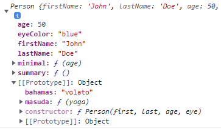

We can use **extends** to extend pre-existing function constructor:

```
function Animal(name){
    this.name = name,
    this.speak =  function speak(){
        console.log(`${this.name} makes a noise.`);
    }
}

//we put the new objects FIRST extends (old object)
class Dog extends Animal {
  constructor(surname, altro) {
    super(surname); // call the super class constructor and pass in the NAME parameter
    this.more = altro
  }
                    //and if we want to add methods we them outside constructor
  speak() {
    console.log(`${this.name} barks.`);
  }
}

let d = new Dog('Mitzie', "maybe");    //Dog { name: 'Mitzie', speak: [Function: speak], more: 'maybe' }
//Dog takes 2 arguments that will be used in contructor() and super('Mitzie') will be Animal(name)

```

The **Class keyword** was introduced in 2015, it doesn't change Javascript's **prototype-based nature** but helps to make syntax more in line with C++ and Java.

It creates **construction Objects** whose properties and methods can be **inherited** by other objects, called instances:

```
//it needs a constructor that keeps the properties and parameters
//while the methods are outside

class Parv{
  constructor(rin){
    this.all= rin
  }
  dardo= function(){
    return this.all + " more"
  }
}

let rag = new Parv("winn")
console.log( rag.dardo() )      //winn more
```

We can also use **get()** for methods and more _super_:

```
function Quada(alte, larg){
  this.alte = alte,
  this.larg = larg
}

const triang = new Quada(200, 100)

class Vast extends Quada{
  constructor(quado, all ,moe){
    super(quado, all)      //with 2 arguments we can put at super() from Quada(alte, larg)
    this.moe = moe
  }
  get minus(){return this.alte + this.larg}
  getAge() {
    return "winning " + this.alte
  }
}
//the difference between get minus()/getAge()

const parall = new Vast(100, 200, "bilanciato)
console.log( parall.minus )                      //300 we dont need the () for get
console.log( parall.getAge() + parall.moe)       //300 bilanciato

```
