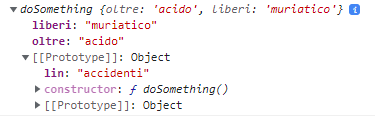
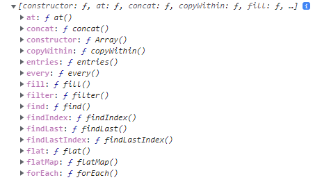

# JS 3

* [Objects, methods, and keys](js-3.md#objects-methods-and-keys)
* [ES6 syntax and more objects](js-3.md#es6-syntax-and-more-objects)
* [Object constructor and extends](js-3.md#object-constructor-and-extends)

### Filter(), map(), find() and forEach() on arrays

Some **methods** implement arrow **callback functions** in their **method call** and return true/false if the conditions apply, they are called **Predicate.**

Some methods are **Pure**, which means they return a new array without modifying the original.

**Includes()** return true/false for value existence in the array:

```
//we can apply it directly on arrays, like most Predicate

[1,2,3,4,5].includes( 2 )        //true

```

**Map() will return a new array** applying its callback function, it's **pure**:

```
let namesArray = ['elamin', 'antigoni', 'chris']
namesArray.sort().map( (x) => x.toUpperCase() )  //['ANTIGONI', 'CHRIS', 'ELAMIN',]

//or we can reference an external function (without calling it using () )
function upper(x){
    return x.toUpperCase()
}
namesArray.map(upper)
```

**.forEach()** won't return an array, but a looped **list of returns**:

```
let anni = [1964, 2008, 1999, 2005, 1978, 1985, 1919]

anni.forEach( (x) => {
  console.log( 2022-x )    //separated results: 58 14 23 17 44 37 103
})  
```

You can use **forEach()** after a **map()/filter()** but not the opposite:

```
//map() and filter() return arrays, while forEach() returns a list 

let numeronia = [4,6,8,2,4,1]              //the number is 6.../8/10
numeronia.map( (x)=> x+2 ).forEach( (x) => console.log( "the number is " + x )  
numeronia.filter((x)=> x>4 ).forEach((x)=> console.log( "The number is " + x )
```

**.filter()** will return an array with the elements that satisfy the callback function condition, is **pure**:

```
let anni = [1964, 2008, 1999, 2005, 1978, 1985, 1919]

const unicovo = anni.filter( (x) =>
  2022-x > 21        // [1964, 1999, 1978, 1985, 1919]
)

//We return object properties based on the filtered number of sauce/noodles
function quantities(layers) {
  return {
    noodles: layers.filter((layer) => layer === 'noodles').length * 50,
    sauce: layers.filter((layer) => layer === 'sauce').length * 0.2,
  }
}

quantities(["noodles", "noodles", "noodles", 'sauce'])  //{noodles: 150, sauce: 0.2}
```

To **filter(e) falsy values** and arrays remember always to put **e== true** as the first condition:

```
//falsy values ("", null, false, NaN, undefined) can crash the code if we don't
//then we filter to return 2 values objects

var pairsByIndexRaw = [
    [0, 3], [1, 2], [2, 1], null, [1], false, "whoops", [1,2,4], "lo", 12
];

var pairsByIndex = 
    pairsByIndexRaw.filter((n) => n && typeof(n) == "object" && n.length == 2);
```

**.find()** will return the _first element matching_:

```
var product1 = {
  id: 1,
  name: "Toaster X56 Plus",
  price: 12.98,
  stock: 105,
};

var producTs = [product1, ... ];

//The find() return won't be an array, unlike filter()
//products.find()   returns   { id: 4, name: 'Star Ship', price: 100, stock: 5 }
//products.filter() returns [{ id: 4, name: 'Star Ship', price: 100, stock: 5 }]

//We can find() objects properties from arrays
function add(x){
    return producTs.find((xx) => xx.id == x)
}

add(1)
```

**findindex()** works as a find() but is focused on indexes:

```
//finding the first even number on an array OR its index

let stack= [1,3,4,5,6]

[...stack].find((x)=>x%2==0) )            //4 is the number
[...stack].findIndex( (x)=> x%2==0 )      //2 is its index

```

**Map()** and **Filter()** have different returns:

```
let quatt = {
    cosa: [2, 9 ,6, 2 ]
}

quatt.cosa.filter( (x)=> x<10 )    //[ 2, 9, 6, 2 ]
quatt.cosa.map( (x)=> x<10 )       //[ true, true, true, true ]
```

**Some()** run tests on _each element_ of an array, returning **true/false** if at **least one satisfies** the **callback function** :

```
let pairs = [1,4,0,12,7]

function nullifing(ind){
  return ind == 10 && ind == 4
}

//and it will return true/false, without returning an array of results for each
console.log(pairs.some(nullifing))      //true
console.log(pairs.map(nullifing))       //[false, true, false, false, false]
```

**Every()** check if all values of the array satisfy the callback function:

```
//it returns true/false

[2,4,5,6,7].every( (x)=>x>= 2 )    //true
[2,4,5,6,7].every( (x)=>x> 2 )     //false   

```

**Reduce()** needs an **accumulator** parameter to return a single value, sum of the array elements**:**

```
let arr = [1, 2, 3, 4];

//It loops through the array and return a single value
arr.reduce((accumulator, start) => accumulator + start, 0)    //0+1,+2,+3,+4= 10
```

**Reverse()** modifies the original array, it is **pure**.

**Flat()** creates a _new array_ with all sub-array elements concatenated a, it is pur the same level:

```
//We can ...spread the elements of a nested array 
let deck= [1,2,3,4, 3]

deck.map((number, index)=>{
  if(number==3){
    deck.splice(index, 1, [3,3,3])
  }
})

deck             //[1, 2, Array(3), 4, Array(3)]
deck.flat()      //[1, 2, 3, 3, 3, 4, 3, 3, 3]

//We can specify the nested levels to flat(2) or flat(Infinity)
```

**FlatMap()** returns a new array by applying the callback function to each element and **flattens** it:

```
let schab= [1,2,3,4,5,3]

schab.flatMap((card) => card === 3 ? [card, card, card] : [card])
//[1, 2, 3, 3, 3, 4, 5, 3, 3, 3]
```

To loop through _arrays_ we use **for() and while().**

```
//for() is a more specific loop with a set counter and stop limit
for(let tin= 0; tin < limes.length; tin++ ){
    console.log(tin)        //0,1,2,3,4,...(limes.length-1)
}

//while() only needs its condition with an external counter
let x= 0;

while( x < limes.length ){
  console.log( x )          //0,1,2,3,4,...(limes.length-1)
  x += 1
}
```

### Objects, methods, and keys

**Objects** are variables that contain a collection of named values, stored in **property: value** pairs:

```
//and when we want to extract the property/value we:
const car = {
  type:"Fiat", 
  model:"500", 
  color:"white",
};

car.type              //Fiat
Object.keys(car)      //['type', 'model', 'color']  as an array we can also get
Object.keys(car)[0]   //type

//contrary to other languages the key is locked to "string" type
//you don't need to "" it unless using special syntax like "-[]/1234 5"
```

We can create **objects** out of **variables** as _property:values_ pairs:

```
const a123 = 'foo';
const b123 = 42;
const c123 = {};

const object3 = { a123, b123, c123 };

console.log( object3.a123 )    //"foo"
```

Objects can be **edited** by assigning a new property:value and use _\[variables]_ to **dynamically access** property values::

```
//To edit and add car properties
car.type = {first: "BMW", later: "wolk"}    //it changes the "Fiat" 
car.age = [49, 50];        //will add a new array property

let uno = "age"
car[uno] = 33        //We use variables to access objects' properties using []

//we can fill an empty object 
const person = {};
person.firstName = "John";
person.lastName = "Doe";

//To delete properties and values we use the delete keyword
delete car.color;

//To check if the key exists in the object
car.hasOwnProperty("color")        //true/false if it exist 
```

Or we could use **Object.assign()** to change an object property:

```
//we need 2 arguments, the objects and the { new property }
const obj12={
    tre: "well"
}

Object.assign( obj12, { tre: 12345 } );
console.log( obj12 )                    //{tre: 12345}
```

How we handle _**undefined/null**_ results in _objects_:

```
//to avoid having a JS error while accessing a nested non-existing property

const obj = {
  address: {
    street: 'Trincomalee Highway',
    city: 'Batticaloa',
  }
};

console.log(obj.residence)          //undefined, for a non-existing property
console.log(obj.residence.street)   //Javascript error when accessing nested property
console.log(obj.residence?.street)  //undefined, wont block the page on JS error for nested property
```

We can also use **instanceof** to check if empty or null objects are still _objects_:

```
//empty objects still count as objects

let lettera= {
}
let nulla= Object.create(null)

lettera instanceof Object        //true
({})    instanceof Object        //true
nulla   instanceof Object        //false, even if Object.create is used
```

**Primitive Data types** can be _objects_ with or without **coercion**, being Javascript a **weakly typed language:**

```
//Coercion will temporarily change the datatype of a variable in order to make
//an invalid operation work

"parola".length    //6, it shouldn't work coz primitive strings don't have properties like .length
Number(2) + 3      //5, you shouldn't be able to sum objects with primitives

//there is a difference between 

let parola1= "stringa"    
let parola= new String("stringa")

(parola1 instaceof String/Object)   //false both for string literal/primitive
(parola instaceof String/Object)    //true both, new Strings() creates an object and a string

//It works for new Number() and New Boolean() too.
```

With different types of data, we can use **Object.keys()** **iterable** on them:

```
//and we can use it on the array

Object.keys(car.nuovo)        //will return the indexes as an array ['0', '1', '2']
Object.keys(car.altro)        //will return properties [ 'uno', 'due', 'tre' ]
Object.keys(car.altro.due)    //will be of the array inside the object ['0', '1', '2', '3', '4']
```

**Object Methods** are functions stored in the object that can use **.this** for properties in the object:

```
//The fullo object method can use the property:values of the object it's in
const car = {
  type: "Fiat", 
  model: "500", 
  color: "white",
  fullo: function() {
    return this.type + " " + this.model;
  },
  fullon: function(type, model) {
    return type + " " + model;
  }
};

person.fullo()                        //Fiat 500 
person.fullon(car.type, car.model)    //Fiat 500
person.fullo                          //[Function (anonymous)]
```

Property functions can be shortened:

```
const tost={
  property: function (parameters) {},
}

const tost1={
  property(parameters){},
}

```

We use **Object.keys()/values()/entries()** to access an object data or a **for...of loop**.

```
const person = {
  firstName: 'John',
  lastName: 'second',
  cars: [
    {name: "Ford", models:["Fiesta", "Focus", "Mustang"] },
    {name:"BMW", models:["320", "X3", "X5"] },
  ]
}

Object.keys(person)     //['firstName', 'lastName', 'cars']
Object.values(person)   //['John', 'second', Array(3)]
Object.entries(person)  //[['firstName', 'John'], ['cars', Array(3)] ]

//We use the for...of to loop through its [keys, values] pairs
for (const [key, val] of Object.entries(person)) {
  console.log([key, val]);       //['name', 'Porter'],['age', 32], ['cars', Array(3)]
}
```

**Objects methods** can edit and return their own properties:

```
let univa ={
    name: "wallace",
    molti: ["uno", 2, 3, 45],
    money: 0,
    aggiung: function(inn){
        this.nuovo = inn        //univa.aggiung("this") add a new property
    },
    ancori: function(on){
        this.nuovo += " " + on  // .ancori("new") we add to new property "this new"
    },
    yunn: function(oll){
        this.molti.push(oll)    //univa.yunn( 23 ) adding to property array
    },
    spicc: function(we){
        this.money += we       //univa.spicc(24) "finally, you got it"
    },                         //univa.spicc(-16) "no money ;(?"  with money=8< 10
    compra: function(){
        if(this.money > 10){
            return "finally, you got it"
        }else{
            return "no money ;(?"
        }
    }
}

```

Javascript doesn't have **Static types** or **Static dispatching,** everything is an instance(object) or a function(constructor), and even functions are instances of a function constructor.

\-----------------

Every object has a _private Object property_ **\[\[prototype]]**, that can be swapped or edited:

```
//It can be created and it has to be an object

const uno={
  ol: "siamo",
  __proto__:{
    ol: "siamo stati",
    vid: "quasistati",
    __proto__:{
      rin: "secondo"
    }
  }
}

//The [prototype] chain is accessed with uno.__proto.__proto__ etc
//{ ol: "siamo" } --> { ol: "siamo stati", vid: "quasistati" } --> {rin: 'secondo'} --> Object.prototype --> null

```

We can use **\_\_**_**proto\_\_**_ in objects for **inheritance**:

```
//The parent object doesn't need it

const genitore={
  dopp: 3,
  metodo(){
    return this.dopp + 10
  }
}

const fig={
  __proto__: genitore
}

//The child object fig can use methods from the parent object, when needing this.dopp
//property, not being present in the child, it will search for it in the [[prototype]]
console.log( fig.metodo() )    //13    

fig.dopp= 12
console.log( fig.metodo() )    //22
//after we set a new property it will use it instead

```

Setting up \_\__proto_\_\_ can be done with .prototype:

```
function Scatola(rega){
  this.ecco= rega
}

Scatola.prototype.aggiungi= function(){
  return this.ecco + " è il nostro"
}

//We can create anonymous new objects 
const katt= [
  new Scatola(11),
  new Scatola(12),
  new Scatola(13),
]

//Object.getPrototypeOf(new Scatola()) === Scatola.prototype

```


We can also set _other construction functions_ as \[\[prototype]]:

```
function Base() {}
function Derived() {}

//we can set Derived.[[prototype]] to be Base.[[prototype]]
Object.setPrototypeOf(
  Derived.prototype,
  Base.prototype,
);

//we made the [[prototype]] chain longer
console.log( Derived.prototype )        //Base {constructor: ƒ}

//and it would be
const obje = new Derived();
// Derived.prototype ---> Base.prototype ---> Object.prototype ---> null

```

When creating instances from constructors, the **constructor.prototype** **will become the \[\[prototype]] of the instance:**

```
console.log( Derived.prototype )    //Base {constructor: ƒ}
console.log( obje.__proto__ )       //Base {constructor: ƒ}
console.log( obje.prototype)        //undefined

//Object.getPrototypeOf(Constructor.prototype) === Object.prototype

```

**Instances** are new objects with methods and properties copied from a class:

```
function doSomething() {
  this.oltre= "acido"
}

doSomething.prototype.lin= "accidenti"

//You can simply add properties to the instance
let finn= new doSomething()
finn.liberi= "muriatico"

console.log( doSomething.oltre )        //Both undefined, even if the property is
console.log( doSomething.lin )          //in the constructor and prototype
console.log( doSomething.prototype.lin) //"accidenti"

//.liberi and .oltre will be included in the constructor 

```

<figure><figcaption></figcaption></figure>

We can also use **Object.create()** to set the \[\[prototype]] and properties of a new object:

```
//This allow us to create null prototypes with
Object.create(null)

const a1 = { a: 1 };

const b1 = Object.create(a1);
// b ---> a ---> Object.prototype ---> null

```

Or we can set the **prototype** as a **new instance,** and use **.isPrototypeOf()** to check the instance prototype:

```
function Foo() {}
function Bar() {}
function Baz() {}

console.log( Bar.prototype )        //Object.prototype

//We chain the Baz1.prototype-> Bar1.prototype--> new Foo()  
//Bar.prototype = Object.create(Foo.prototype);
Bar.prototype= new Foo()
Baz.prototype= new Bar()

console.log( Bar.__proto__)        //Foo {}
console.log( Baz.__proto__)        //Foo {} [[Prototype]]:Foo1

const foo1 = new Foo();
const bar1 = new Bar();
const baz1 = new Baz();

//The prototype of Baz1, Bar1, Foo1 are the same and present in the intance baz1
//By checking the prototype chain we find that Bar and baz1.__proto__ are a new Foo()
console.log(Baz1.prototype.isPrototypeOf(baz1));    // true
console.log(Bar1.prototype.isPrototypeOf(baz1));    // true
console.log(Foo1.prototype.isPrototypeOf(baz1));    // true

//This means that Baz1 instanceof all 3
console.log( baz1 instanceof Baz1)    //true
console.log( baz1 instanceof Bar1)    //true
console.log( baz1 instanceof Foo1)    //true

//bar1.__proto__ is a steps ahead of Baz1.prototype and the opposite for Baz1 and foo1 
console.log(Baz1.prototype.isPrototypeOf(bar1));    // false
console.log(Baz1.prototype.isPrototypeOf(foo1));    // false

//baz1 was created by new Baz1(), which is Baz.prototype= new Bar(), so it's its prototype
console.log(Bar1.prototype.isPrototypeOf(baz1));    // true
console.log(Bar1.prototype.isPrototypeOf(foo1));    // false
//even if Foo1() is contained in Bar1 , Baz.prototype= new Bar(), it's step ahead 

console.log(Foo1.prototype.isPrototypeOf(bar1));    // true
console.log(Object.prototype.isPrototypeOf(baz1));  // true

//the prototype chain for baz1 being
//baz1->Baz1.prototype-> Bar1.prototype-> Foo1.prototype-> Object.prototype-> null

```

This can be useful when needing specific prototypes to be part of instances:

```
//Some properties or methods present in Foo1 have to be present for example

if (Foo1.prototype.isPrototypeOf(baz1)) {
  console.log( "baz1 is the correct instance to use")
}

```


**Javascript** uses **prototypical objects** as _Templates_ from which **new** Objects **inherit** properties and methods (states and behaviors) in their \[\[prototype]].

Arrays and RegEx, for example, come with **\[\[prototype]]** included :

```
//Prototype function start with capital letter

function Person(name){
  this.name = name;
  this.mee = function(){
    return this.name + " welcome"
  }
}

//[prototype] won't be present in primitive data type BUT in their intances
let num= 5                //won't have [prototype]
let num= new Number(5)    //will have [prototype]:number

//Arrays and RegEx are intances
let fila= [1,2,3,4]      //new Array(1, 2, 3, 4);
const regexp = /abc/;    //new RegExp("abc");

//[[prototype]] and __protot__ are different from .prototype

```



To access the \[\[prototype]] methods and properties:

```
console.log( fila.__proto__ )
console.log( Object.getPrototypeOf(fila) )

```

<figure><figcaption></figcaption></figure>



.prototype is different and mostly used in **inheritance:**

```
//Simple objects won't have .prototype
console.log( fila.prototype )     //undefined
console.log( Array.prototype )    //actual prototype

//some older built-in prototypes are instances
console.log( Number.prototype )     //number 0
console.log( Array.prototype )      //empty array
console.log( RegExp.prototype )     // /(?:)/.

```



All Javascript **Objects inherit** \[\[prototype]], a property/function that contains all the _properties and methods avaiable_ to the object.

Any method/property in the prototypical **object constructor function** body can _be added_ to the **prototype,** which is **more memory efficient** and allows for **object-specific syntax:**

```
//This can only be done to the Construction Object, not the instance/object

let prim = new Primo(11)

Primo.prototype.somma1 = function(){
  return "ecco il numero " + this.value + " and " + this.somma(10) 
}

console.log( prim.somma1() )      //ecco il numero 11 and 22

//If we wanted we could access JUST the [[prototype]] 
console.log( prim.__proto__ ) 
//but we are still referencing the constructor prototype, the one that actually has it
console.log( Primo.prototype )
//if we tried to get the .prototype from the Instance/object
console.log( prim.prototype )      //undefined

console.log( prim ) 
//And the object prototype will be changed
```

![The new method is in the \[\[prototype\]\]](../.gitbook/assets/added.PNG)

About **inheritance** and **.hasOwnProperty()** in _Instances_:

```
//Any new method/property will be added to the Instances, even those precedents

let secondo = new Primo(33)

Primo.prototype.messo= false
Primo.prototype.retro= function(){
  console.log( this.messo+ " is our way")    //false is our way
}

console.log( secondo )
//Both secondo are gonna now have the .retro() method and .messo property

//In Instances/objects we can use .hasOwnProperty() for True/False on specific properties
secondo.hasOwnProperty("messo")    //True, secondo has the intance messo
Object.hasOwn( secondo, 'messo')   //True, we can also use it

secondo.hasOwnProperty("retro")    //False, retro method is not in the constructor
secondo.__proto__.hasOwnProperty('retro')    //True, the method is in the prototype
Object.getPrototypeOf(secondo).hasOwnProperty('messo')

```

After defining default values and .methods, we can modify properties inside instances

```
//We start with default values and a method that interacts with it

Primo.prototype.messo= false
Primo.prototype.vedo= function(){
  if(!this.messo){
    this.messo= true
  }
}

console.log( prim )
prim.vedo()
console.log( prim )

```





This is before the method .vedo() is called, **both have the method and default property in prototype.**





Even if both had the .messo property in the prototype, after the method the second one has the .messo **property in the object body**.





It's prim.messo **property changed** (true) after the .vedo() method and **we still have** the \[\[prototype]] messo with its default values in our instance.

```
//the instance prim now has a different property from prototype

prim.messo        //true

```



We can use **Object.assign** to more easily add properties and methods to prototypes:

```
//we need Object.assign(target, list of add-ons)

Object.assign(
  Rings.prototype,
  {
    texttogo: function(){
      return "ecco la stringa"
    },
    theme: "giallo",
    color: function(){
      return this.theme
    }
  }
)

```

We can make a _constructor_ Object **Inherit an entire constructor**, and have _access_ to its \[\[prototype]], the instance will have a **chain of prototypes**, inheriting multiple constructor prototypes:

```
//While using the created Rings constructor

function Potato(sauce){
  this.sauce= sauce
}

//You don't need to add the arguments to the constructor
Potato.prototype= new Rings()

let tomato = new Potato("ketchup")
console.log(tomato.inn)      //undefined, from the this.inn Rings property

//now any instance of Potato has access to Rings properties and methods
console.log(tomato.texttogo() )      //"ecco la stringa"
console.log(tomato.color() )         //giallo

//doing that to an Instance won't work
//And inheriting another will invalidate all previous access

Potato.prototype= new Extra()
console.log(tomato.texttogo() )    //error .texttogo is not a function

```



```
//A normal constructor will have [[property]] Object and constructor potato

function Potato(sauce){
  this.sauce= sauce
}

Potato.prototype.ordine= function(cosa){
  this.sauce = cosa
}

```

.PNG>)



```
//its [[prototype]] changed and even its constructor is now Rings, with its properties

function Potato(sauce){
  this.sauce= sauce
}

Potato.prototype= new Rings()    //no argumenst mean undefined property values
let tomato = new Potato("ketchup")

```





**.Call()** is a Javascript method, it invokes (call) **a method from another object** using **this.** owner object as an argument.

```
//The method we created requires 2 properties called UNO and DUE 

function Cosa(uno2, due2){
  this.uno= uno2
  this.due= due2
}

//we could use any .uno and .due property from objects
Cosa.prototype.altro= function(){
  return this.uno + " " + this.due + " is the other"
}

let occa= new Cosa("numero", "second")

const exem = {
  uno: "ecco",
  due: "altro"
}

//Even if the function didn't have a parameter, with .call() we can use ANOTHER
//object as argument and pass the .uno and .due property
console.log( occa.altro.call(exem))      //ecco altro is the other

//we can even add more arguments, the order of which is important

Cosa.prototype.ancora = function(sapore, forma){
  return this.uno + " is the " + sapore + " " + this.due + " is indeed " + forma
}

occa.ancora.call(exem, "dolce", "quadrato")    //ecco is the dolce altro is indeed quadrato
//we used both properties and arguments

```

We use **.call()** in order to **inherit just some** properties or methods from the **constructor object**:

```
//we .CALL() the constructor function, with THIS. HAMB object as argument, and
//arguments for ITS properties

function Hamb(meat, sauce1){
  Potato.call(this, sauce1, meat)
  this.meat= meat
}

let chicken = new Hamb("pollo", "garlic", "upwards")

```





It will indicate Rings constructor but **It won't have access to its methods**, just its properties.





The object has access to its methods if they are with the \[\[prototype]]



**instanceof** checks if a prototype chain of an **instance** has **a constructor.prototype,** returning a boolean value**:**

```
//From our previous code
//after the Potato.prototype= new Rings()
//let tomato = new Potato("ketchup")

tomato instanceof Potato        //True tomato gets to be instance of both 
tomato instanceof Rings         //True

chicken instanceof Hamb     //true
chicken instanceof Potato   //false the .call() inherits just the properties, not any prototype

```

More about **.constructor** and **.constructor.prototype:**





```
//from the first line you see is an instance of Potato{properties}
//its [[prototype]] is gonna be Rings, which tomato is instaceof
//Also, Potato.prototype.ordine is inside [[prototype]] with the 
//Rings[[prototype]] and inside of it there is the Rings() methods
console.log( tomato )

//the constructor is gonna be the function constructor body, without the 
//prototype.methods added
console.log( tomato.constructor )

```


```
//[[prototype]] Rings => [[prototype]] Object => the list of methods and
//properties assigned to Tomato.constructor (Ring)

tomato.constructor.prototype

```





```
//chicken only is an instance of Hamb, its [[prototype]] is just object
//Its actual constructor isn't Rings, its Hamb
console.log( chicken )
console.log( chicken.constructor )

```


```
//Its constructor prototype ends up being

console.log( chicken.constructor.prototype )

```



We can use **instanceof** for other types of data too:

```
//It can help to see the difference between a primitive typeof and an Object
//for Booleans, strings and numbers

let str= 'This is a literal string';
let obj= new String('String');

//The obj is gonna have a [[prototype]] string, while the primitive won't 
console.log(str instanceof String)     //false
console.log(obj instanceof String)     //true

//which also means is instanceof Object
console.log(str instanceof Object)    //false
console.log(obj instanceof Object)    //true

```

Using **instanceof** in any **if statement** requires:

```
//you need an extra () if working with FALSE instanceof

if(!(chicken instanceof Rings )){
  console.log("its not an instaceof then this apply")
}

if(!chicken instanceof Rings){
  console.log("this will never apply")
}

//!chicken will be evaulated before, so it will end up as False instaceof Rings, which can't happen
```

In this **exercise**, we build a **construction function** in which we use **other construction as property**:



```

class Size{
  constructor(uno= 80, due=60){
    this.width= uno;
    this.height= due;
  }
}

Size.prototype.resize = function(uni, dui) {
  this.width = uni
  this.height = dui
}

```



```

class Position{
  constructor(uno=0, due=0){
    this.x= uno;
    this.y= due;
  }

  move(newuno, newdue){
    this.x= newuno;
    this.y= newdue;
  }
}

```





```
//We assign the property screenSize the instance of Size with set arguments
//size and position can work without parameters thanks to their default values

class ProgramWindow{
  constructor(){
      this.screenSize = new Size(800, 600)
      this.size= new Size()
      this.position= new Position()
  }
}

//and we can access the height and width property from the screenSie property
const prop = new ProgramWindow()
console.log( prop.screenSize.width )    //800
console.log( prop.screenSize.height )   //600

```

Next we have a **resize()** method that will resize any new object that surpasses the set width, height of screenSize:

```
//the Size1 width and height will be resized IF it's bigger than the difference
//between the fixed screenSize and the current position X Y

//with Math.min is a simpley way to do Size1.width < topwidth
//We also use Math.max(1) to cerrect the lower value to 1 if negative

  resize(Size1){

    const topheight= this.screenSize.height - this.position.y
    const topwidth= this.screenSize.width - this.position.x

    const neoheight= Math.max(1, Math.min(Size1.height, topheight))
    const neowidth= Math.max(1, Math.min(Size1.width, topwidth))

    this.size.resize(neowidth, neoheight)
    Size1.width= this.size.width
    Size1.height= this.size.height
  }
  
//to access the method itself we need to first create an instace of it
const programWindow = new ProgramWindow();

//Then we create an instace we want to use as argument of said method
let max= new Size(850, 650)

programWindow.resize(max)
console.log(max)      //its height and width will be resized at 800, 600, based on
                      //the screenSize and 0,0 position
```

We do a symilar operation with the **move()** method:

```
//it's symilar to the previous method, the position object in the parameter
//will be modyfied if it plus the Size exceed teh screenSize proportions

  move(Pos){
    const topheight= this.screenSize.height - this.size.height
    const topwidth= this.screenSize.width - this.size.width

    const neoheight= Math.max(0, Math.min(Pos.y , topheight))
    const neowidth= Math.max(0, Math.min(Pos.x , topwidth))

    Pos.x= neowidth
    Pos.y= neoheight

    this.position.move(neowidth, neoheight)
  }

//both methods modify the property of out new ProgramWindow() instance
const programWindow2 = new ProgramWindow();

const newPosition2 = new Position(410, 750);
programWindow2.move(newPosition2);
console.log( newPosition2 )        //410, 540
//Position.Y exceeds the screenSize so with default Size.height at 60, we round at 540

const newSize2 = new Size(1000, 1000);
programWindow2.resize(newSize2);
console.log(newSize2)             //390, 60
//Both sizes will be resized BASED on the previous position results, that changed
//the Size() and Position() that ProgramWindow uses as instances

```

We can **optimize** the entire process further:

```
//we use the instance objects as argument for the Instance method

function changeWindow(prowin){
  prowin.move(new Position(100, 150))
  prowin.resize(new Size(900, 900))

  return prowin
}

//we use the instace as argument
const updatedWindow = changeWindow( new ProgramWindow() );
console.log( updatedWindow )    //position be 100, 150 while size be 800, 450

```

### Object constructor and extends

**Functions are callable objects,** so they can contain properties and methods:

We use **Constructions functions** as template to create new objects using the **new** keyword:

```
function Person(first, last, age, eye) {            //we set the properties/VALUES
    this.firstName = first;                         //we assign its internal properties with the parameter value
    this.lastName = last;                    
    this.age = age;
    this.eyeColor = eye;
    this.minimal = function(age){                   //methods that can modify the this.properties
        this.age = age
        return this.age + " maybe"                  //and then return 
    };
    this.summary = function(){                      
        return this.eyeColor + " " + this.firstName
    }
}
               //we need to call a new function constructor
let myFather = new Person("John", "Doe", 50, "blue");
myFather.minimal(10) , myFather.age, myFather.summary(12)    //10 maybe, 10, blue John

```

Using **Prototype** we can add properties and methods to already objects:

```
//the property added won't be visible in console.log( myFather )
Person.prototype.bahamas = "volato"
//it will be set in the [[prototype]] property

//we add the properties and methods to the constructor BUT has to be called on the new
Person.prototype.masuda = function(yoga){
    return this.age + " and also " + this.minimal(yoga)
}
//both methods use this.age but masuda() uses the this.age 12 THEN minimal() changes it to 900
myFather.masuda( 900 )                 //123 and also 900 maybe

```


We can use **extends** to extend pre-existing function constructor:

```
function Animal(name){
    this.name = name,
    this.speak =  function speak(){
        console.log(`${this.name} makes a noise.`);
    }
}

//we put the new objects FIRST extends (old object)
class Dog extends Animal {
  constructor(surname, altro) {
    super(surname); // call the super class constructor and pass in the NAME parameter
    this.more = altro
  }
                    //and if we want to add methods we them outside constructor
  speak() {
    console.log(`${this.name} barks.`);
  }
}

let d = new Dog('Mitzie', "maybe");    //Dog { name: 'Mitzie', speak: [Function: speak], more: 'maybe' }
//Dog takes 2 arguments that will be used in contructor() and super('Mitzie') will be Animal(name)

```

**Extends** also extends the **\[\[prototype]] chain:**

```
// d--> Dog.prototype --> Animal.prototype --> Object.prototype --> null
```

The **Class keyword** was introduced in 2015, it doesn't change Javascript's **prototype-based nature** but helps to make syntax more in line with C++ and Java.

It creates **construction Objects templates** whose properties and methods can be **inherited** by other objects, called instances:

```
//it needs a constructor that keeps the properties and parameters
//while the methods are outside

class Parv{
  constructor(rin){
    this.all= rin
  }
  dardo= function(){
    return this.all + " more"
  }
}

let rag = new Parv("winn")
console.log( rag.dardo() )      //winn more
```

Instances can still **modify the inherited** \[\[prototype]] from their constructor:

```
function Vehicle(make, model) {
    this.make = make;
    this.model = model;
}

Vehicle.prototype.start = function() {
    console.log(this.make + ' ' + this.model + ' starts');
};

var volkswagen = new Vehicle('Volkswagen', 'Golf');

volkswagen.start();                 // Volkswagen Golf start
volkswagen.start= function(){
    console.log(this.make + ' ' + this.model + ' is kinda starting');
} 
volkswagen.start()                  //Volkswagen Golf is kinda starting

```

We can also use **get()** for methods and more _super_:

```
function Quada(alte, larg){
  this.alte = alte,
  this.larg = larg
}

const triang = new Quada(200, 100)

class Vast extends Quada{
  constructor(quado, all ,moe){
    super(quado, all)      //with 2 arguments we can put at super() from Quada(alte, larg)
    this.moe = moe
  }
  get minus(){return this.alte + this.larg}
  getAge() {
    return "winning " + this.alte
  }
}
//the difference between get minus()/getAge()

const parall = new Vast(100, 200, "bilanciato)
console.log( parall.minus )                      //300 we dont need the () for get
console.log( parall.getAge() + parall.moe)       //300 bilanciato

```
