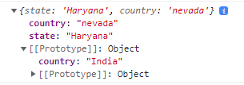
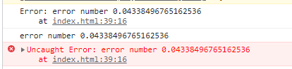

# JS 5

* ERROR and stuff
* there is more
* accidenti

We can use **ES6** Syntax for **default parameter** in a function:

```
function defaultParameter(name = "sam") {
  return console.log( name);
}

defaultParameter("oltre")    //"oltre"
defaultParameter()           //"sam"

```

We can also use the **spread/rest operator** on arrays and objects:

```
//The REST operator can store the latter portion of the array,
//It has to be the last element of the array because it can't be followed by a comma
let [uno, ...due] = [1,2,2,3,4,5,6,8]
console.log( due )                      //[2, 2, 3, 4, 5, 6, 8]

//The SPREAD operator can sum arrays or use it to perform operations
const oneToFive = [1, 2, 3, 4, 5];
const oneToTen = [...oneToFive, 6, 7, 8, 9, 10];

console.log(oneToTen)        //[1, 2, 3, 4, 5, 6, 7, 8, 9, 10]

//We can use it as .concat() method followng the order of the function parameters
function combineArrays(arr1, arr2, arr3) {
  return [...arr3 , ...arr2, ...arr1];
}
combineArrays( [12, 34], [23, 45], [100] )    //[ 100, 23, 45, 12, 34 ]

//Or as .split("") method on strings
let siamo = "siamo"
[...siamo]                   //['s', 'i', 'a', 'm', 'o']
siamo.split("")              //['s', 'i', 'a', 'm', 'o']

//Or for Math operations without needing to loop/filter the array elemets
let mat = [1, 25, 50, 100]
let maximus = Math.max( ...mat )              //100 

```

This depends on **iterals,** including objects, **spread** enumerates/expands its elements while **rest** "condenses" them:

```
//we can .concat() objects, but if same properties overwrite happens

const obj1 = { foo: 'bar', x: 42 };
const obj2 = { foo: 'baz', y: 13 };

console.log( {...obj1, ...obj2} )    //{foo: "baz"; x: 42; y: 13 } including a [[prototype]]

//BUT you won't be able to iterate an object into an array in any way

const obje = { key1: 'value1' }
const hel = { key2: "value2"}
console.log( [ ...obj, ...hel] )    //ERROR, obje is not iterable

const obj = { 0: "a", 1: "b", length: 2 };
const [a, b] = obj;                //ERROR obj ot iterable

//BUT ALSO you can iterate arrays into objects
//in an array, all indices are enumerable's own properties 

const array = [11, 21, 31];
console.log( {..array} )    //{ 0: 11; 1: 21; 2: 31 }

```

Also kind of fringe but we can **parse variables over functions**:

```
//We can take a function returned values

function f(){
    return [12, 13]
}

const [a,b]= f()

console.log(a, b)    //12, 13

```

This allows us to work with **Index** _without_ \[] or methods:

```
//For example by using REST on the other arrays elements, we don't get an array in this case
//instead of using .shift()
let deck = [1,1,1,2,3,4,55,6,6,5,4,6]

function getFirstCard(deck) {
    const [uno, ...rest] = deck
    return uno
}

console.log( getFirstCard(deck) )        // 1  

//and we can use the SPREAD to change the order of array indexes
let deck1 = [1,500,1,2,3,55,6,5,4,6]

function getFirstCard(deck) {
  const [uno, due, ...rest] = deck
  return [due, ...rest, uno]
}

console.log( getFirstCard(deck1) )        //[500, 1, 2, 3, 55, 6, 5, 4, 6, 1]

```

As for using them **as parameters and variables** remember that:

```
//we can destruct the array parameter of a function

let deck = [ 100, 23, 45, 12, 34 ]

function first( [uno,due, ...resto ]=deck ){
  return [...rest, uno, due]      //[45, 12, 34, 100, 23]
  return [rest, uno, due]         //[Array(3), 100, 23]
}

//resto variable can be used without the ..., instead of just passing its values it becomes an array
//we can use it to also pick indexes

function second([,due]= deck ){
  return due          //2
  return [due]        //[2] if you need it as an array
}

```

And in _**objects**_** ** we can edit the properties:

```
const dog = {
  name: "Lucas",
  age: 7,
  breed: "cocker"
}

const dogOwner = { ...dog, owner: "Juan", breed: "cocker spaniel"}
//we changed the breed and added a "OWNER" property in the new object
console.log( dogOwner )          //{ name: 'Lucas', age: 7, breed: 'cocker spaniel', owner: 'Juan' }

```

We can use **destructuring assignment** syntax to extract values from arrays (or objects):

```
//we can assign variable to array elements in order
const x = [1,2,3,4,5] 
const [well, lol] = x
console.log( well )            // 1
console.log( lol )             // 2
//and in case we want to skip some we useempty comma
let [ , , ,wen] = x
console.log( wen )             //4

let horse = {
  name: "uni",
  age: 10,
  breed: "winn"
}

//we keep the objects property name on objects as parameters
function destructuring(obj) {
  let { name, age, breed } = obj
  return age ;
}
destructuring(horse)              //10

let {name, breed} = horse
console.log( breed )              //"winn"
```

We can use it in different ways:

```
let [firstName, surname] = "John Doe oltre".split(' ');    //the .split returnes [ 'John', 'Doe', 'oltre' ]
console.log( firstName, surname )    //"John Doe" we can assign the first 2 values 

//we can add properties to pre-existent objects using __proto__ (the [[prototype]] of the object)

let novo = { 
  tent: 1,
  cove: 2
}

novo.__proto__.gron = "il nuovo"
console.log( novo.unn )      //"il nuovo"

```

We can edit \[\[prototype]] also using **.setPrototypeOf(),** for additional objects**:**

```
let har = {
  state: "Haryana",
  country: "nevada"
}

let inn = {
  country: "India"
}

Object.setPrototypeOf(har, inn);

//it the first object body properties still take priority so you will get
console.log(har.country)    //"nevada"

```

<figure><figcaption><p>har.__<em>proto</em>__.country will be "india"</p></figcaption></figure>

And for _nested objects,_ we can assign**:**

```
//You can deconstruct object but you neeed to keep the property's name
let scato = {
  yuse: {
    mode: "wannabe",
    ultro: 1234
  },
  listato: [123, 456],
  alto: true
}

//so, we can assign object properties {yuse} and array [listato]
let {
  yuse: {
    mode, 
    ultro
  },
  listato: [unato, duato]
} = scato

//and we can call an objects and array element
console.log( unato + " " + mode)                        //123 wannabe
console.log( scato.listato[0] + " " + scato.yuse.mode ) //123 wannabe

```

You can also use **deconstruct objects as parameters**, but need to keep the property name:

```
//The decostructed properties will pass the property VALUE
const meta11={
    uno: "darth",
    more:{
        lazer: "guns",
        ammo: "fire"
    }
}

function show11( {more:{lazer}} ){
    console.log( lazer )
}

show11(meta11)        //"guns"
//we can also have objects parameters AND default values in functions

function drawChart({ size = 'big', coords = { x: 0, y: 20 }, radius = 25 } = {}){
  console.log(size, coords, radius);
}

drawChart( {
  coords: { x: 18, y: 30 },
  radius: 130,
});
//"big {x: 18, y: 30} 130", ALSO, coords object will return both default properties
//ONLY IF the coords: argument is totally absent

```

In **functions** we can also return assigns:

```
function guiss(q,w){
    let tron = q+w
    let bron = q-w
    return [tron, bron]
}

let [gui, pui] = guiss(5,1)        //the returns will be in array order
console.log( gui, pui )            //6, 4
```

We can deconstruct an array of function **return results**:

```
//function to get the longest word in a string
//without the rest pattern we couldn't work on the array by .split() and .map() for length
function longino(sent){
  return Math.max(
    ...sent.split(" ").map(word=> word.length )
  )
}

console.log( longino("Lorem ipsum dolor sit amet consectetur, adipisicing elit. Assumenda, consequatur?"))

```

And in **function parameters**:

```
let obb = {
    type: "working",
    uno: 123,
}
//here we need to use the same name in the objects
const dritto = ( {type, uno } ) => (type, uno)
console.log( dritto(obb) )                      //working 123

//we can nest a new object to the existing object
obb.new = {
    citta: "unova",
    number: 34
}
//and to call it in the parameter we just need an extra {} for the object
const dentro = ( {new:{number} } ) => console.log(number + " this is the nested values")
dentro(obb)                  //34 this is the nested values

let options = {
  title: "Js book",
  items: ["Item1", "Item2"]
};

//we create a default property in the function parameter
function showBook({
  title = "Javascript",
  pages = 200,
  species  = "programming",
  items = []    //we get the default things EXCEPT THE ITEMS THAT ARE GONNA BE FROM OBJECT
}) {
  console.log(`${title} ${species} ${pages}`); // Javascript programming 200
  console.log(items); // Item1, Item2
}

showBook(options);  //setting the object used

```

We can also **Loop** through a **deconstruct object parameter**:

```
//We loop trought an array of objects

const people = [
  {
    name: 'MIKE',
    family: {
      mother: 'Jane Smith',
      father: 'Harry Smith',
      sister: 'Samantha Smith',
    }
  },
  {
    name: 'TOM',
    family: {
      mother: 'Norah Jones',
      father: 'Richard Jones',
      brother: 'Howard Jones',
    }
  }
];

//while being const we can't modify property n and father, AND first we deconstruct
//Then we loop with OF array
for (const { name: n, family: { father } } of people) {
  console.log(`Name: ${n}, Father: ${father}`);
}

//Name: MIKE, Father: Harry Smith; Name: TOM, Father: Richard Jones

```

And we can also get **.entries()** for property/key-value pairs:

```
//for arrays we have
let frut = [123, "wall", "proll"]   //we get index and value
const f = frut.entries()            //[ 0, 123 ],[ 1, 'wall' ],[ 2, 'proll' ]

//for Objects we would need a loop to show the array iteration object
let ultron = {
  doing: "firsto",
  dell: "secondo"
}
Object.entries(ultron)      //[ [ 'doing', 'firsto' ], [ 'dell', 'secondo' ] ]
//we get the an array with arrays of pairs

const l = Object.entries(ultron)
for(let x of l){
  console.log( x )          //  ['doing', 'firsto'], ['dell','secondo']
}
```

****

****

**Error is a javascript object**, with **.message** being its main **property**:

```
//we can create Error objects with their message, THEN throw them if we want to block
//the code with red messages

let errore= "Error number " + Math.random()
const blokka= new Error(errore)    //we include in () the Error.message

console.log(blokka)
console.log(blokka.message)
throw blokka                       //throw new Error(errore)

//when we throw we block the entire code sequence

```

<figure><figcaption><p>we get the error printed and its .message property</p></figcaption></figure>

To work with Errors _without blocking the code_ we use **TRY** and **CATCH**:

```
//We use TRY to see if we get a throw Error, if we do we CATCH the (error) and perform an action

try{
    throw new Error("printed after try")
}catch(errorino){
    console.log(errorino.message)
    //we get printed the error.message without blocking the code 
}

```

