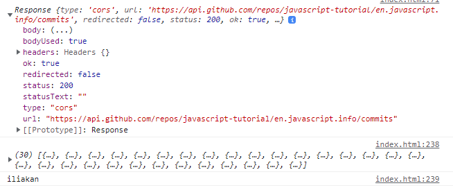

# JS  6

* Promises
* kinda

A **Promise** is an **object,** it **resolves** or **rejects** an **asynchronous function** and its value, it has the methods _promise.then(), promise.catch() and promise.finally(),_ from Promise.prototype:

```
//It can take one or both parameters (resolve, eject), for the.() and catch() 

const myPromise = new Promise(function (resolve, reject) {
  let sampleData = [2, 4, 6, 8];

  if (sampleData[1]) {
    //both resolve/reject RETURN the value in ()
    resolve( "resolved string" );  
  } else {
    reject('An error occured!');
  }
});

myPromise
  .then(function (e) {
    console.log(e);          //4
  })
  .catch(function (error) {
    throw new Error(error);  //if reject we get Error('An error occured!')
  })
  .finally(function () {
    console.log('PROMISE COMPLETED');  //printed in any case
})

```

The **.then()** method can take 2 arguments, they are callback functions, for the cases of the Promise _resolve_ and _reject,_ while catch() has only one for handling errors:

```
const promise1 = new Promise(function (resolve, reject) {
  (5> 10) ? resolve('Successo !') : reject("not pervenuted")
});

promise1.then(function (value, none) {
  console.log(value)      // expected output: "Successo!"
  console.log(none )      //(in promise) not pervenuted?
});

```

**Promise.all()** takes an _iterable_ of promises as input, and returns a promise:

```
console.log(                //Promise {<pending>}
  Promise.all([1,2,3,4])    //  [[Prototype]]: Promise
)                           //  [[PromiseState]]: "fulfilled"
                            //  [[PromiseResult]]: Array(4), [[Prototype]]: Array(0)

```

Promise.all() needs **all its promises** to be resolved, it will wait until _all promises are fulfilled_:

```
const p1 = Promise.resolve(3);
const p2 = 1337;
const p3 = new Promise((resolve, reject) => {
  setTimeout(() => {
    resolve("foo");
  }, 5000);
});

//after 5 seconds we get
Promise.all([p1, p2, p3]).then((values) => {
  console.log(values);         //[3, 1337, "foo"]
});

```

We can use **.catch()** to check each single promise:

```
const ph1 = new Promise((resolve, reject) => {
  setTimeout(() => resolve('p1_delayed_resolution'), 1000);
});

const ph2 = new Promise((resolve, reject) => {
  reject(new Error('p2_immediate_rejection'));
});

Promise.all([
  ph1.catch((error) => error),
  ph2.catch((error) => error ),
]).then((values) => {
    console.log(values[0]);           // "p1_delayed_resolution"
    console.error(values[1]);         // "Error: p2_immediate_rejection"
})

//if we did Promise.all([ph1, ph2]) we would just get the Error p2

```

### Api and Fetch()

Fetch() allows us to **send network request** and **load information,** without reloading the page, it returns an **Promise**:

```
//without an [options] the fetch() is just a GET downloading content from the url

let promise = fetch(url, [options])    //[options] can be methods/headers

```

At this stage we don't have a body yet, we check the **HTTPS status** for errors:

```
let response = await fetch(url);

if (response.ok) { 
  //if HTTP-status is 200-299 get the response body
  let json = await response.json();
} else {
  alert("HTTP-Error: " + response.status);
}

```

The **response** promise object _provides_ methods to access it in **various formats**:

```
response.text() return the text/string of the response 
response.json() parse the response as JSON 
response.formData() – return the response as FormData object
response.blob() – return the response as Blob (binary data with type),
response.arrayBuffer() – return the response as ArrayBuffer (low-level binary data),

```

The **response** needs to be **await**, for code that has yet to return we use **async functions**.



<pre><code>async function test2()
{
  let url = 'https://api.github.com/repos/javascript-tutorial/en.javascript.info/commits';
  
  //without options this is a GET response object
  let response = await fetch(url2);

  //we then Parse it as a json()
<strong>  let commits = await response.json(); 
</strong>
  console.log(response11)
  console.log(commits7)
  console.log(commits7[0].author.login);
}

test2()</code></pre>



```
async function simple(){
  fetch('https://api.github.com/repos/javascript-tutorial/en.javascript.info/commits')
    .then(response =>{
      console.log( response )
      return response.json()
    })
    .then(commits => {
      console.log( commits )
      console.log(commits[0].author.login)
      return commits[0].author.login
    });
    
}

simple()
```



<figure><figcaption><p>Response.body / response.json() / a specific property</p></figcaption></figure>

We can use **await** on simple **promises**:

```
async function pleaseWait() {
  const promise = new Promise((resolve, reject) => {
   setTimeout(() => resolve(console.log('hello')), 1000)
  })

  await promise
  console.log('world')

  return 42
}
//hello (1 second) world (at the end)
```

_Promises_ can only change **from pending to fulfilled** or pending to rejected. They cannot change from fulfilled back to pending or rejected back to pending.

The **Blob** object can represent data as a file-like object that doesn't need to be in a javascript-native format, like **images**.

The **Blob()** _method_ in the response returns a promise that resolves with a blob:

```
//it will return empty("") if its prototype.type is opaque

async function blob(){

  //it won't work with shortened URL
  let response = await fetch(' https://www.cdc.gov/nceh/features/lightning-safety/lightning-safety_600v2px.jpg?_=99663 ');

  //Promise to resolve in a Blob object 
  let blob = await response.blob(); 

  //after creating an HTML tag
  let img = document.createElement('img');
  img.style = 'position:fixed;top:10px;right:10px;width:100px';
  document.body.append(img);

  //we go back to the URL
  img.src = URL.createObjectURL(blob);

  setTimeout(() => { 
  //hides it by revoking its URL call, necessary in case you don't need it anymore
  img.remove();
    URL.revokeObjectURL(img.src);
  }, 3000);

}

```

The **URL.createObjectURL()** is a static method that creates an URL representing the object given.

The **headers** read-only property of the **Response** interface contains the Headers object associated with the response:

```
async function zero(){
  let response = await fetch('https://api.github.com/repos/javascript-tutorial/en.javascript.info/commits');
  
  console.log( response.headers.get('Content-Type'));  
  //application/json; charset=utf-8

  //we can also loop trought the map-like key/value pairs
  for (let [key, value] of response.headers) {
    console.log(`${key} = ${value}`);
  }

}

zero()

```

The **bind()** method allows us to keep THIS argument when in a callback function:



```
//we can also use method on other objects

const person = {
  firstName:"John",
  lastName: "Doe",
  fullName: function () {
    return this.firstName + " " + this.lastName;
  }
}

const member = {
  firstName:"Hege",
  lastName: "Nilsen",
}

let fullName = person.fullName.bind(member);
console.log( fullName )    //Hege Nilsen
//It won't appear in the member object as a method, its a single operation bind to the object

```



```
//when used in a callback function

const persona = {
  firstName:"Not a",
  lastName: "Callback",
  display: function () {
    console.log( this.firstName + " " + this.lastName)
  }
}

persona.display()      //Not a Callback
setTimeout( persona.display, 3000)    
//If I did add the () it would execute but it wouldnt do the 3 seconds timeout

//we bind the method to its object
let bloccato= persona.display.bind( persona )
setTimeout( bloccato, 5000)    //Not a Callback after 5 seconds

```





The **Request()** object will go from the client to the server:

```
//It will come with a method(Get if empty) and can be fetch()

async function finn(){
  const request = new Request('https://www.mozilla.org/favicon.ico' );
  console.log( request.method )    //GET method

  fetch(request)
    .then((response) =>{
      console.log( response)       //status and body
    })
}

finn()
//if posting Object JSON you will need to stringify first
```

Some Promise() based exercises solutions



```
//the function returns a promise, it fetch() from API and can reject

const promisify = () => new Promise((resolve, reject) => {
  this.api.request(text, (result) => {
    result ? reject(result) : resolve();
  })
})
    
return promisify()  //   try
  .catch(promisify) // retry one
  .catch(promisify) // retry two
  
//each catch will work for each reject
```



```
//in catch() we can use the fetch() argument, when fetching it again

return this.api
      .fetch(text)
      .catch(() => {
        return this.request(text).then(() => this.api.fetch(text));
      })
      .then((res) => {
        if (res.quality < minimumQuality){
          throw new QualityThresholdNotMet(text);
        }
        return res.translation;
      });

```




