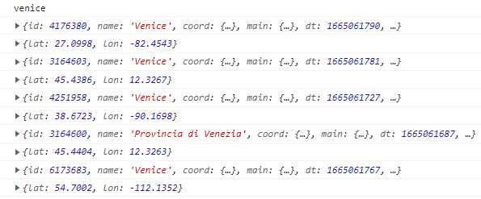
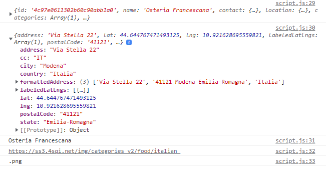
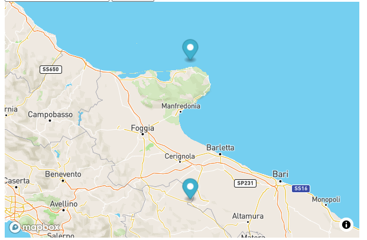
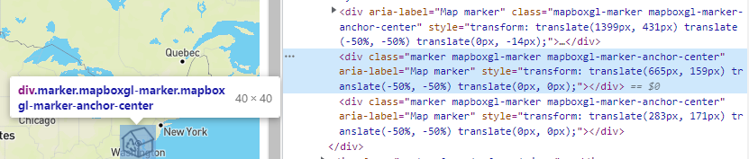

# JS 8

* Geolocation API

**HTML Geolocation API** allows the _browser_ to make an API **call** on the user position:

```
//we can deconstruct the position argument to get the COORDinateS

navigator.geolocation.getCurrentPosition( async ( {coords: {latitude, longitude}}) =>{

    console.log("We are at lat " + latitude + " and lon " + longitude) 

  }, showError
);

/we can add a callback function for all the possible errors

function showError(error) {

    if(error){
      switch(error.code) {
        case error.PERMISSION_DENIED:
          user.innerHTML = "User denied the request for Geolocation."
          break;
        case error.POSITION_UNAVAILABLE:
          user.innerHTML = "Location information is unavailable."
          break;
        case error.TIMEOUT:
          user.innerHTML = "The request to get user location timed out."
          break;
        case error.UNKNOWN_ERROR:
          user.innerHTML = "An unknown error occurred."
          break;
      }    
    }
}

```

We can use [Weatherbit API](https://www.weatherbit.io/api/weather-current) to fetch weather information:



```
//In order to use the API we need an base URL and a key 

let bit= "https://api.weatherbit.io/v2.0/current?lat=35.7796&lon=-78.6382&key=API_KEY&include=minutely"
let bitkey= "6669a6fd01c14380aac859c88b82b495"

let weatherbit= 
"https://api.weatherbit.io/v2.0/current?lat=" + latitude +"&lon=" + longitude +"&key=" + bitkey 

let response= await fetch(weatherbit)
let jason= await response.json()

console.log( jason.data[0] )    //to access weather info
```



```
let bit= "https://api.weatherbit.io/v2.0/current?lat=35.7796&lon=-78.6382&key=API_KEY&include=minutely"
let bitkey= "6669a6fd01c14380aac859c88b82b495"

let weatherbit= 
"https://api.weatherbit.io/v2.0/current?lat=" + latitude +"&lon=" + longitude +"&key=" + bitkey 

fetch( weatherbit )
  .then(response =>{
      return response.json()
  })
  .then(commits => {
      console.log( commits.data[0] )
  });

```



We can also _modify the fetch URL_ based on the data we have available:

```
const APIKEY = "1313cd4c0f364f82aa120509835e4786";
let URL = `https://api.weatherbit.io/v2.0/current?key=${APIKEY}`;

//we use the city URL or the lat/lon if city not available
let risultato= city
    ? "&city=" + city
    : `&lat=0&lon=0`

let risposta= await fetch( `${URL}${risultato}` )
let dati= await risposta.json()

let {city_name, temp, lat, lon, weather } = dati.data[0]
return [lon, lat];


//If we return the coordinates we can .THEN() with the data returned

  getweather().then((response)=>{

    cent= [response[0], response[1]]

    var mapp = new mapboxgl.Map({
      container: "map", 
      style: "mapbox://styles/mapbox/streets-v11", 
      center: cent, 
      zoom: 9, 
    });
    
  }
```

We can also use [openweathermap ](https://openweathermap.org/api)API to fetch **cities with similar names**:

```
//when using this API for coordinates it ended up being less precise
//also this URL is specific for cities with similar names

let openkey= "dc439c07940578bea7bddf0375c7074c"
let cerca= `http://api.openweathermap.org/data/2.5/find?q=${citta}&appid=${openkey}`

let risposta= await fetch( cerca )
let jass= await risposta.json()

console.log( citta )

for(let x=0; x< jass.list.length; x++){
    console.log( jass.list[x] )
    console.log( jass.list[x].coord )
}

```

<figure><figcaption><p>Similar cities come with their weather and coordinates</p></figcaption></figure>

We can use the [Foursquare ](https://developer.foursquare.com/docs/places-api-getting-started)API to fetch **cities locations**:



```
//The second Key is just a string of random digits

let foursquare= 'https://api.foursquare.com/v2/venues/explore?near=';
let access= 'OZATO4USDMG5ZYJMKY54YTK4Y2TPDWK34PSUG3GIV0RULAXP';

let accesspri= 'OSXQJ50AFX20J2HNOHKFGPWKVVNYNSP13IOGOB5YETXLPLR4'; 

let cit= city.value    //name, we can also choose the &limit=__
const urlToFetch = `${foursquare}${cit}&limit=10&client_id=${access}&client_secret=${accesspri}&v=20180101`;

let response= await fetch(urlToFetch)
let commit= await response.json()
let lista= await commit.response.groups[0].items.map((item) => item.venue)
//To filter the metaData and items with venus

console.log( lista[0] )
console.log( lista[0].location )    //we get lan, lon position
console.log( lista[0].name  )       //we get the name of the place

console.log( lista[0].categories[0].icon.prefix )
console.log( lista[0].categories[0].icon.suffix  )    
//`${immagine.prefix}bg_64${immagine.suffix}` to shiw the icon

```



<figure><figcaption><p>from location we get .address </p></figcaption></figure>



### Designing maps with MapBox

MapBox is a **javascript library** to build interactive maps using _OpenGL_ to render in 2d or 3d.

First, we **import** [MapBox.gl](https://docs.mapbox.com/#maps) .js and .css:

```
<script src="https://api.mapbox.com/mapbox-gl-js/v2.8.2/mapbox-gl.js"></script>
<link href="https://api.mapbox.com/mapbox-gl-js/v2.8.2/mapbox-gl.css" rel="stylesheet" />

//you can use different links in case there are problems    
<script src='https://api.mapbox.com/mapbox.js/v3.3.1/mapbox.js'></script>
<link href='https://api.mapbox.com/mapbox.js/v3.3.1/mapbox.css' rel='stylesheet' />

<link href="https://api.mapbox.com/mapbox-gl-js/v2.10.0/mapbox-gl.css" rel="stylesheet">
<script src="https://api.mapbox.com/mapbox-gl-js/v2.10.0/mapbox-gl.js"></script>

```

We need an **HTML** id for the **map**:

```
//We can add it through javascript

<div id="map" style="width: 400px; height: 300px; text-align: center;"></div>
```

For the javascript we need:

```
mapboxgl.accessToken =
  "pk.eyJ1IjoiY29kZW1hb3oiLCJhIjoiY2toYXlnbzg1MWg4YzMwbDJ5YXYyMngwOSJ9.vcMw1P0hoburAql8VyDTtQ";

//we start with the map class
let centrino = [0, 0];
let zoomino= 1;

//container will use the map ID on HTML
var mapp = new mapboxgl.Map({
  container: "map",                             
  style: "mapbox://styles/mapbox/streets-v11", 
  center: centrino,           //this is the center coords array for the map
  zoom: zoomino,              //this s the zoom level
});

//Then add multiple markers
new mapboxgl.Marker()
  .setLngLat( centrino )    //array [longitude, latitude]
  .addTo(mapp);             //map to which be added

//if we wanted to modify the current map we can:
centrino= [response[0], response[1]]
zoomino= 9

var mapp = new mapboxgl.Map({
    container: "map", 
    style: "mapbox://styles/mapbox/streets-v11", 
    center: centrino, 
    zoom: zoomino, 
});
//but we also need to repeat the map or the changes to work

```

The **mapbox Styles API** includes map styles for the maps:

<pre><code><strong>
</strong><strong>mapbox://styles/mapbox/satellite-streets-v11  //for the satelite view 3D
</strong>mapbox://styles/mapbox/navigation-night-v1    //dark with traffic color roads
mapbox://styles/mapbox/dark-v10               //normal dark
mapbox://styles/mapbox/streets-v11            //clear map
mapbox://styles/mapbox/light-v10              //gray map
</code></pre>

**Markers** are a method in mapboxgl.js, they rappresent a set of coordinates, with **icon** being the **visual** part:

```
//you can put multiple by just repeating the code

new mapboxgl.Marker()
    .setLngLat( centrino )    //array [longitude, latitude]
    .addTo(mapp);             //map to which be added

```

<figure><figcaption></figcaption></figure>

To add **custom marker**s we can add them as **HTML tags on the map**, or **add them on the style**:



We need a GEOjson with the coordinates **features:**

```
const geojson = {
    type: 'FeatureCollection',
    features: [
      {
        type: 'Feature',
        geometry: {
          type: 'Point',
          coordinates: [-77.032, 38.913]
        },
        properties: {
          title: 'Mapbox',
          description: 'Washington, D.C.'
        }
      }
    ]
};

```

The **Marker** method can be used to **add** DIV tags and CSS class to the Map:

```
for (const feature of geojson.features) {
    const el = document.createElement('div');
    el.className = 'marker';

//we append the tag to the Marker
    new mapboxgl.Marker(el)
        .setLngLat(feature.geometry.coordinates)
        .addTo(mapp1);
}
```

We just add a background-image as the **icon**

```
.marker {
    background-image: url('https://img.icons8.com/ios/344/3d-recycle-center.png');
    background-size: cover;
    width: 40px;
    height: 40px;
    cursor: pointer;
}

```

The Marker is added Inside the mapbox map

<figure><figcaption><p>included with its own CSS class</p></figcaption></figure>



We will need a **.loadImage()** _after the map done loading_**:**

```

mapp.on('load', () => {

    //We first load the image
    mapp.loadImage(
        'https://img.icons8.com/ios/344/3d-recycle-center.png',
        (error, image) => {
        if (error) throw error;
     
        //we addImage to the Style
        mapp.addImage('cat', image);
        
        //
        mapp.addSource('pointo', {
        'type': 'geojson',
        'data': {
            'type': 'FeatureCollection',
            'features': [
                {
                    'type': 'Feature',
                    'geometry': {
                        'type': 'Point',
                        'coordinates': centrino
                    }
                },
                {
                    'type': 'Feature',
                    'geometry': {
                        'type': 'Point',
                        'coordinates': [ 21 , 41 ]
                    }
                }
            ]
//we can also add how many times it features in the mapp style
            }
        });


```

**s**

**s**

**s**




