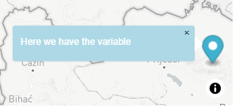
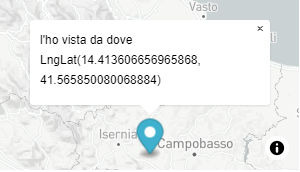
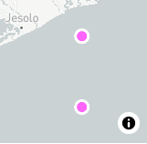
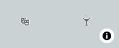

# JS 9

* mapbox datasets
* mapbox styles

We use Mapbox studio to design map styles trougth **tilesets** and **GEOjson** data.

```
//GEOjson to rappresent map data: 

{
  "features": [
    {
      "type": "Feature",
      "properties": {
        "title": "Lincoln Park",
        "description": "A northside park that is home to the Lincoln Park Zoo"
      },
      "geometry": {
        "coordinates": [-87.637596, 41.940403],
        "type": "Point"
      }
    }]
}

features.geometry(coordinates) and features.properties(other data)
```

_Datasets_ are editable collections of GEOjson:

<figure><figcaption><p>here we can draw new points and add features.properties to it, (title and description) or upload a GEOjson</p></figcaption></figure>

We export the dataset to create a new **Tileset**, a map is divided into tiles for performance.

_Tilesets_ are **used as source** in map style **layers** (where we can add symbol custom icons).

<figure><figcaption><p>After we style the layer</p></figcaption></figure>

After **making our style public** on mapbox studio we can also use its tileset source:

```
//we pass the point PROPERTY of the click EVENT to the tileset style layer 

mapp.on('click', (event) => {

    const features = mapp.queryRenderedFeatures(event.point, {
      layers: ['chicago-parks']
    });
    if (!features.length) {
      return;
    }

    const feature = features[0];
//if it matches it will generate a Popup, setting its LngLat and HTML
  
    const popup = new mapboxgl.Popup({ offset: [0, -15] })
    .setLngLat(feature.geometry.coordinates)
    .setHTML(
      `<h4>${feature.properties.title}</h4><p>${feature.properties.description}</p>`
    )
    .addTo(mapp);

});
```

<figure><figcaption><p>this PopUp could be edited trought its css .mapboxgl-popup-content </p></figcaption></figure>

We can add a **flyTo animation** effect _between the points_ :

```
//instead of click we start it on LOADed map

mapp2.on('load', (e)=>{

  const features = mapp2.queryRenderedFeatures(e.point, {
    layers: ['chicago-parks']
  });
  if (!features.length) {
    return;
  }
  
  let index= 0
  
  for(const x of features) {
    index+= 1
    
    setTimeout(() => {
      mapp2.flyTo({ 
        center: x.geometry.coordinates,
        zoom: 13
      });

    //Markers don't need to be added, already in the style

    }, 2000 * index);
  //each point gets 2000 of timeout before passing to the other
}

```

### MapBox Markers, events, and properties

The **Marker** component can take a _property argument object_:

```
//we first create the div in which
let contenuto1= document.createElement("div")
contenuto1.className= "location1"    //we could use a CSS class properties OR

contenuto1.style.backgroundImage= 'url("https://img.icons8.com/bubbles/2x/user-female.png")'
contenuto1.style.backgroundSize= "cover"
contenuto1.style.width= "60px"
contenuto1.style.height= "60px"

//we then create an object for the .Marker()
let propieta1={
    element: contenuto1,    //gets the DOM as Marker
    draggable: true,
    rotation: 30,
    //scale: 0.8            //these 2 works on default marker
    //color: red        
    offset: [ 100, -20]    //X Y offset
}

new mapboxgl.Marker( propieta1 )
    .setLngLat( [14, 45.2] )
    .addTo( map )

```



For _Marker()_ **events** we use on():&#x20;

```
//we can attack events on defined markers

let muove= new mapboxgl.Marker(scansa)
    .setLngLat( [14, 45] )
    .addTo(map)

//we can get the current dragged Markers coordinates
function mosso(){
    let posto= muove.getLngLat()
    console.log( "[" + posto.lng + " " + posto.lat + "]")
}

//then on the on() we can put the events
muove.on("dragend", mosso)    //will trigger once at the end 

muove.on("drag", mosso)       //will trigger for each pixel of drag

muove.on("dragstart", ()=>{
    console.log("Just Started")    //will trigger once at the start
})

```



We also can **set()** and **get()** the marker properties:

```
muove.setRotation(10)      //we SET the marker's property   
muove.getRotation()        //we GET the marker's rotation

muove.isDraggable()          //we GET if draggable
muove.setDraggable= false    //false stops its draggable property

muove.setOffset([20, 30])
muove.getOffset()   

muove.setLngLat()         
muove.getLngLat()                

muove.getPopup()          //to get the Popup if present
muove.togglePopup()       //open close Popup

muove.remove()            //to remove the Marker
```



We can also use **Geojson** for the Markers data**:**

```
const geojson = {
    'type': 'FeatureCollection',
    'features': [
        {
            'type': 'Feature',
            'properties': {
            'message': 'Foo',
            'iconSize': [60, 60]
            },
            'geometry': {
            'type': 'Point',
            'coordinates': [12, 44.5] 
            }
        },
        ...
    ]
};

for (const marker of geojson.features) {

    const el = document.createElement('div');
  
    const width = marker.properties.iconSize[0];
    const height = marker.properties.iconSize[1];
    let lng= marker.geometry.coordinates[0]
    let lat= marker.geometry.coordinates[1]

    el.className = 'marker';
    el.style.backgroundImage = `url(https://www.tabaccheriaguzzi.it/images/product/91/HABNOS-2-02.jpg)`;
    el.style.width = `${width}px`;
    el.style.height = `${height}px`;

    el.style.backgroundSize= 'cover'
    el.style.backgroundPosition= "center"

    el.style.borderRadius = '50%'
    el.style.cursor = 'pointer'
  
    //we create the Popup
    let pop= new mapboxgl.Popup()
      ..setHTML( `<p>${lng} and ${lat}</p>`)
  
    //makes the div created as the marker
    let marki = new mapboxgl.Marker(el)
        .setLngLat(marker.geometry.coordinates)
        .addTo(map);
        .setPopup(pop)
 
}

```

<figure><figcaption><p>each is a DIV element in the map</p></figcaption></figure>

### Mapbox PopUps, properties, and events.

First let's see how to **bind a Popup to a Merker**:

```
//we create a popUp to append to a Merker

let kers= new mapboxgl.Popup()
    .addText("using the variable we can add stuff later")

let ker= new mapboxgl.Marker(drag)
    .setLngLat( [13.5, 45] )
    .addTo(map)
    .setPopup(kers)

```

<figure><figcaption></figcaption></figure>

Now for the **Popup Properties**:

```
let promp= {
    className: "rad",        //will add a .class to the popup
    closeButton: false,      //if you want to remove the X close button
    closeOnClick: false,     //to close or not on click outside Popup
    closeOnMove: true,       //to close on mapmove or zoom
    offset: [ 20, -50],      //X Y offset
}

let kers= new mapboxgl.Popup(promp)

```

And for the **PopUp Event** and **Instance members:**



```
//events On Popup variables

kers.on("open", ()=>{
    console.log("will on PopUp click open")
})

kers.on("close", ()=>{
    console.log("will work on closeOnClick PopUps")
})
```



```
//the .getLngLat() are the same for Popup and Marker
kers.getLngLat()       
ker.getLngLat()        

kers.setLngLat()        //we can place the Popup in coordinate
kers.getElement()       //gets the HTML Dom of the Popup

kers.setHTML("<h1> Siamo sicuri?</h1>")      
kers.setText("Popup text")                   

kers.setMaxWidth("400px")        //still don't know how it styles
kers.getMaxWidth()

kers.addClassName("cls")         //CSS class needs to be more specific
kers.removeClassName("cls")      //on the Popup
kers.toggleClassName("cls")      //will add/remove the class on teh Popup

kers.setOffset([0, 0])           //at [0,0] its the Marker point

kers.remove()                    //will keep the marker but not the Popup

ker.togglePopup()                //will open/close on Marker

let div= document.createElement("div")
div.innerText("text on Node HTML element")

kers.setDOMContent(div)
```

The specific class **to style the Popup**:

```
.cls.mapboxgl-popup .mapboxgl-popup-content{
    color: white;
    background-color: lightblue;
    width: 400px;
}
```

<figure><figcaption><p>added colors and larger Width</p></figcaption></figure>



We can have events on **Markers** used on **Popup** instance:

```
let citta = new mapboxgl.Popup()
let macchia= new mapboxgl.Marker(lacera)

macchia.on("dragend", ()=>{
  citta.setText("l'ho vista da dove " + macchia.getLngLat() )
})
```

<figure><figcaption><p>on Marker event we GET and use it on Popup</p></figcaption></figure>

### Style Geojson sources with Mapbox layers

We add the **Geojson as a source** (with ID):

```
map.on('load', () => {
  map.addSource('places1', {
      'type': 'geojson',
      'data': {
        'type': 'FeatureCollection',
        'features': [
            {
              'type': 'Feature',
              'properties': {
                'description': '<h2>la montagna</h2>'
              },
              'geometry': {
                'type': 'Point',
                'coordinates': [13, 45.2]
              }
            },
            ...
        ]
      }
  })

//Its source uses the ID
  map.addLayer({
    'id': 'places',
    'type': 'circle',
    'source': 'places1',
    'paint': {
      'circle-color': '#ff64fb',
      'circle-radius': 6,
      'circle-stroke-width': 3,
      'circle-stroke-color': '#ffffff'
    }
  });
  
})
```

<figure><figcaption><p>Circle stroke is the border</p></figcaption></figure>

For the **Popup on Hover** :

<pre><code>//we add the Popup properties
  const popup = new mapboxgl.Popup({
    closeButton: false,
    closeOnClick: false
  });
  
//if on map mouse enters the places layer
  mapp0.on('mouseenter', 'places', (e) => {
  
    // Change the cursor style as a UI indicator.
    mapp0.getCanvas().style.cursor = 'pointer';

    // Copy coordinates array.
    const coordinates = e.features[0].geometry.coordinates; //.slice() ?
    const description = e.features[0].properties.description;
    //the description is gonna be the HTML on the properties

    //if the map moves and another popUp gets focused it wont change the already opened
    while (Math.abs(e.lngLat.lng - coordinates[0]) > 180) {
      coordinates[0] += e.lngLat.lng > coordinates[0] ? 360 : -360;
    }
    
<strong>  //we just add content and position to the created Popup
</strong>    popup.setLngLat(coordinates).setHTML(description).addTo(mapp0);
  });
</code></pre>

We also need to include a **remove() Popup on Hover off**:

```
//on mouseLeaving from the Layer points we remove the pointer and Poup

  map.on('mouseleave', 'places', () => {
  
    map.getCanvas().style.cursor = '';
    //empty style cursor on mouseleave is giving the pointer to only mouseenter
    popup.remove();
  });

```

We can use **Mapbox data** in our **source**:&#x20;

```
map.addSource('iconi', {

  'type': 'geojson',
  'data': {
    'type': 'FeatureCollection',
    'features': [
    {
      'type': 'Feature',
      'properties': {
        'description': '<p> teatro </p>',
        'icon': 'theatre-15'    //its from mapbox we could use bar-15, etc
      },
      'geometry': {
        'type': 'Point',
        'coordinates': [11.5, 41.7] 
      }
    }
    ...
})

map.addLayer({
  'id': 'iconi1',
  'type': 'symbol',
  'source': 'iconi',
  'layout': {
    'icon-image': '{icon}',    //how we include the icon
    'icon-allow-overlap': true
  }
});

```

<figure><figcaption><p>yet to see if their color can be changed</p></figcaption></figure>

The code is the same as the **Hover**:

```
map.on('click', 'iconi1', (e) => {
    ...
}
```


