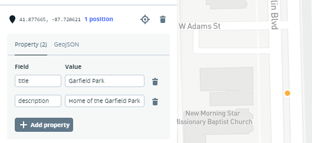
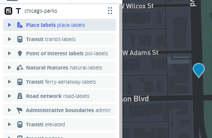
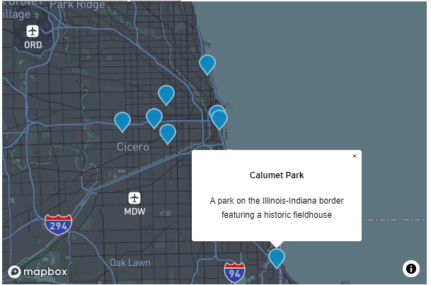
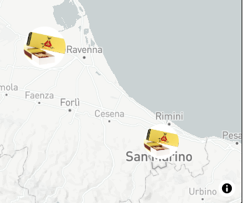
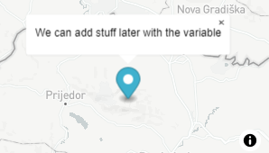

# JS 9

* mapbox datasets
* mapbox styles

We use Mapbox studio to design map styles trougth **tilesets** and **GEOjson** data.

```
//GEOjson to rappresent map data: 

{
  "features": [
    {
      "type": "Feature",
      "properties": {
        "title": "Lincoln Park",
        "description": "A northside park that is home to the Lincoln Park Zoo"
      },
      "geometry": {
        "coordinates": [-87.637596, 41.940403],
        "type": "Point"
      }
    }]
}

features.geometry(coordinates) and features.properties(other data)
```

_Datasets_ are editable collections of GEOjson:

<figure><figcaption><p>here we can draw new points and add features.properties to it, (title and description) or upload a GEOjson</p></figcaption></figure>

We export the dataset to create a new **Tileset**, a map is divided into tiles for performance.

_Tilesets_ are **used as source** in map style **layers** (where we can add symbol custom icons).

<figure><figcaption><p>After we style the layer</p></figcaption></figure>

After **making our style public** on mapbox studio we can also use its tileset source:

```
//we pass the point PROPERTY of the click EVENT to the tileset style layer 

mapp.on('click', (event) => {

    const features = mapp.queryRenderedFeatures(event.point, {
      layers: ['chicago-parks']
    });
    if (!features.length) {
      return;
    }

    const feature = features[0];
//if it matches it will generate a Popup, setting its LngLat and HTML
  
    const popup = new mapboxgl.Popup({ offset: [0, -15] })
    .setLngLat(feature.geometry.coordinates)
    .setHTML(
      `<h4>${feature.properties.title}</h4><p>${feature.properties.description}</p>`
    )
    .addTo(mapp);

});
```

<figure><figcaption><p>this PopUp could be edited trought its css .mapboxgl-popup-content </p></figcaption></figure>

We can add a **flyTo animation** effect _between the points_ :

```
//instead of click we start it on LOADed map

mapp2.on('load', (e)=>{

  const features = mapp2.queryRenderedFeatures(e.point, {
    layers: ['chicago-parks']
  });
  if (!features.length) {
    return;
  }
  
  let index= 0
  
  for(const x of features) {
    index+= 1
    
    setTimeout(() => {
      mapp2.flyTo({ 
        center: x.geometry.coordinates,
        zoom: 13
      });

    //Markers don't need to be added, already in the style

    }, 2000 * index);
  //each point gets 2000 of timeout before passing to the other
}

```

### MapBox Markers, events, and properties

The **Marker** component can take a _property argument object_:

```
//we first create the div in which
let contenuto1= document.createElement("div")
contenuto1.className= "location1"    //we could use a CSS class properties OR

contenuto1.style.backgroundImage= 'url("https://img.icons8.com/bubbles/2x/user-female.png")'
contenuto1.style.backgroundSize= "cover"
contenuto1.style.width= "60px"
contenuto1.style.height= "60px"

//we then create an object for the .Marker()
let propieta1={
    element: contenuto1,    //gets the DOM as Marker
    draggable: true,
    rotation: 30,
    //scale: 0.8            //these 2 works on default marker
    //color: red        
    offset: [ 100, -20]    //X Y offset
}

new mapboxgl.Marker( propieta1 )
    .setLngLat( [14, 45.2] )
    .addTo( map )

```



For _Marker()_ **events** we use on():&#x20;

```
//we can attack events on defined markers

let muove= new mapboxgl.Marker(scansa)
    .setLngLat( [14, 45] )
    .addTo(map)

//we can get the current dragged Markers coordinates
function mosso(){
    let posto= muove.getLngLat()
    console.log( "[" + posto.lng + " " + posto.lat + "]")
}

//then on the on() we can put the events
muove.on("dragend", mosso)    //will trigger once at the end 

muove.on("drag", mosso)       //will trigger for each pixel of drag

muove.on("dragstart", ()=>{
    console.log("Just Started")    //will trigger once at the start
})

```



We also can **set()** and **get()** the marker properties:

```
muove.setRotation(10)      //we SET the marker's property   
muove.getRotation()        //we GET the marker's rotation

muove.isDraggable()          //we GET if draggable
muove.setDraggable= false    //false stops its draggable property

muove.setOffset([20, 30])
muove.getOffset()   

muove.setLngLat()         
muove.getLngLat()                

muove.remove()            //to remov ethe Marker

```



We can also use **Geojson** for the Markers data**:**

```
const geojson = {
    'type': 'FeatureCollection',
    'features': [
        {
            'type': 'Feature',
            'properties': {
            'message': 'Foo',
            'iconSize': [60, 60]
            },
            'geometry': {
            'type': 'Point',
            'coordinates': [12, 44.5] 
            }
        },
        ...
    ]
};

for (const marker of geojson.features) {

    const el = document.createElement('div');
  
    const width = marker.properties.iconSize[0];
    const height = marker.properties.iconSize[1];
    let lng= marker.geometry.coordinates[0]
    let lat= marker.geometry.coordinates[1]

    el.className = 'marker';
    el.style.backgroundImage = `url(https://www.tabaccheriaguzzi.it/images/product/91/HABNOS-2-02.jpg)`;
    el.style.width = `${width}px`;
    el.style.height = `${height}px`;

    el.style.backgroundSize= 'cover'
    el.style.backgroundPosition= "center"

    el.style.borderRadius = '50%'
    el.style.cursor = 'pointer'
  
    //makes the div created as the marker
    let marki = new mapboxgl.Marker(el)
        .setLngLat(marker.geometry.coordinates)
        .addTo(map);
  
    //the setPop() requires an entire Popup() argument to work
    marki.setPopup(new mapboxgl.Popup()
        .setHTML( `<p>${lng} and ${lat}</p>` )
    )
}

```

<figure><figcaption><p>each is a DIV element in the map</p></figcaption></figure>

### Mapbox PopUps, properties, and events.

First let's see how to **bind a Popup to a Merker**:

```
//we create a popUp to append to a Merker

let kers= new mapboxgl.Popup()
    .addText("using the variable we can add stuff later")

let ker= new mapboxgl.Marker(drag)
    .setLngLat( [13.5, 45] )
    .addTo(map)
    .setPopup(kers)

```

<figure><figcaption></figcaption></figure>

Now for the **Popup Properties**:

```
let promp= {
    className: "rad",        //will add a .class to the popup
    closeButton: false,      //if you want to remove the X close button
    closeOnClick: false,     //to close or not on click outside Popup
    closeOnMove: true,       //to close on mapmove or zoom
    offset: [ 20, -50],      //X Y offset
}

let kers= new mapboxgl.Popup(promp)

```

