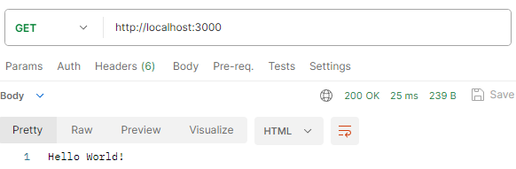

# NODE 1

* 1
* 1
* 1
* 1

**NodeJs** is a server-side javascript environment for app development.

We use **ExpressJs**, an open-source NodeJs framework, to handle HTTPS requests with routing support.

The **REST** (Representational State Transfer) **API** exchanges data between applications through **HTTPS methods** like _GET, PUT, POST_, and _DELETE_. **(**Client-> API -> Database -> Database data**).**

To start a **NodeJs server** we import/require **express methods** and create **routes** for each **endpoint** :

```
- new Init         //We start up a package.json file

//Each route has an Endpoint and handler function
const express = require('express');
const app = express();

app.get('/', (req, res) => {
    res.send("Hello World!");
});

//listen() sets the localhost: endpoint 
app.listen(3000, () => console.log("Server is up and running"))

//node server.js to start the server
```

The **endpoint** is the part of the _URL_ that comes after **/**.

Contrary to _React_, the server needs to re-start to update, to avoid that we **npm install nodemon**.

```
//In the package.json we create a custom script 

"scripts": {
  "start": "nodemon server.js"      //now is npm start
}

```

**Postman** is a scalable testing tool, it can retrieve information sent by the **server routes**.

<figure><figcaption><p>The Get method retries the res.send() from the server</p></figcaption></figure>

1

1

1

1

1

1

1
