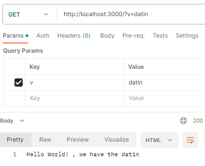

# NODE 1

* 1
* 1
* 1
* 1

**NodeJs** is a server-side javascript environment for app development.

We use **ExpressJs**, an open-source NodeJs framework, to handle HTTPS requests with routing support.

The **REST** (Representational State Transfer) **API** exchanges data between applications through **HTTPS methods** like _GET, PUT, POST_, and _DELETE_. **(**Client-> API -> Database -> Database data**).**

To start a **NodeJs server** we import/require **express methods** and create **routes** for each **endpoint** :

```
- new Init         //We start up a package.json file

//Each route has an Endpoint and handler function
const express = require('express');
const app = express();

app.get('/', (req, res) => {
    res.send("Hello World!");
});

//listen() sets the localhost: endpoint 
app.listen(3000, () => console.log("Server is up and running"))

//node server.js to start the server
```

The **endpoint** is the part of the _URL_ that comes after **/**.

Contrary to _React_, the server needs to re-start to update, to avoid that we **npm install nodemon**.

```
//In the package.json we create a custom script 

"scripts": {
  "start": "nodemon server.js"      //now is npm start
}

```

**Postman** is a scalable testing tool, it can retrieve information sent by the **server routes**.

**Queries** are the url part that comes after a **?...=**, it is used to _pass information_ from the endpoint to the **server routes**.

```
//We request them with req.query.___, and add them to the endpoint
//we add a query with ?(name set in route)=(query value) in the URL

app.get('/', (req, res) => {
  let cava = req.query.v
  res.send("Hello World! , we have the " + cava );
});

```

<figure><figcaption><p>Postaman Get method for a URL with query</p></figcaption></figure>

<details>

<summary>Multiple queries for Math operations routes</summary>

To add **multiple queries** to the url we use **&**:

```
http://localhost:3000/add?value1=12&value2=21
```

**Queries values** are strings by default, we convert them for math functions.

```
//We first add the route endpoint and then the query values

app.get("/add", function (req, res) {
    let sum1 = Number( req.query.value1 )
    let sum2 = Number( req.query.value2 )   
    res.send("The result is " + (sum1 + sum2 ));
});

```

</details>

**Parameters** too can pass data to the routes, it is included in the **endpoint** and requested with **req.params.\_\_\_**.

```
http://localhost:3000/add1/12/74

//we pass its multiple values in the Endpoint
app.get("/add1/:primo/:second", function (req, res) {
    let sum1 = Number( req.params.primo )
    let sum2 = Number( req.params.second )
    res.send("The result is " + (sum1 + sum2 ));
});

```

1

1

1

1

1
