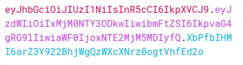

# NodeJs1: Server request/responses with Postman, CORS, and JWT authentification

* [Modify a local JSON file with Postman POST data](./#modify-a-json-file-with-postman-post-data)
* [CORS and JWT autentification](./#cors-and-jwt-autentification)

**NodeJs** is a server-side javascript environment for app development.

We use **ExpressJs**, an open-source NodeJs framework, to handle HTTPS requests with routing support.

The **REST** (Representational State Transfer) **API** exchanges data between applications through **HTTPS methods** like _GET, PUT, POST_, and _DELETE_. **(**&#x43;lient-> API -> Database -> Database dat&#x61;**).**

To start a **NodeJs server** we import/require **express methods,** each route will include an **endpoint** and its **handler function**:

```jsx
- npm Init         //We start up a package.json file

//The endpoint sets where the request and response is gonna take place
const express = require('express');
const app = express();

app.get('/', (req, res) => {
  res.send("Hello World!");
});

//listen() sets the localhost: endpoint 
app.listen(3000, () => console.log("Server is up and running"))

//node server.js to start the server
```

The **endpoint** is the part of the _URL_ that comes after **/**.

Contrary to _React_, the server needs to re-start to update, to avoid that we **npm i nodemon**.

```jsx
//In the package.json we create a custom script 

"scripts": {
  "start": "nodemon server.js"      //now is npm start
}
```

**Postman** is a scalable testing tool, it can retrieve information sent by the **server routes**.

**Queries** are the url part that comes after a **?...=**, it is used to _pass information_ from the endpoint to the **server routes**.

```jsx
//We request them with req.query.___, and add them to the endpoint
//we add a query with ?(name set in route)=(query value) in the URL

app.get('/', (req, res) => {
  let cava = req.query.v
  res.send("Hello World! , we have the " + cava );
});
```

<figure><figcaption><p>Postaman Get method for a URL with query</p></figcaption></figure>

<details>

<summary>Multiple queries for Math operations routes</summary>

To add **multiple queries** to the url we use **&**:

```
http://localhost:3000/add?value1=12&value2=21
```

**Queries values** are strings by default, we convert them for math functions.

```jsx
//We first add the route endpoint and then the query values

app.get("/add", function (req, res) {
    let sum1 = Number( req.query.value1 )
    let sum2 = Number( req.query.value2 )   
    res.send("The result is " + (sum1 + sum2 ));
});
```

</details>

**Parameters** are _properties_ attached to the **URL**, prefixed with **(:)** on the **endpoint**, and requested with **req.params.\_\_\_**.

```jsx
//http://localhost:3000/add1/12/74

//we pass its multiple values in the Endpoint
app.get("/add1/:primo/:second", function (req, res) {
    let sum1 = Number( req.params.primo )
    let sum2 = Number( req.params.second )
    res.send("The result is " + (sum1 + sum2 ));
});
```

For more information about **Middlewares** check [here](express.js-routing-and-middleware.md).

### Modify a JSON file with Postman POST data

To _**body-parse** request body_ elements we **use()** the **express.json()** built-in _middleware_.                          We install file-system **(fs)** which will allow us to **update server files**.

```jsx
//Unlike normal middleware, it doesn't need to be included in routes
//
//This allows request.body to be available in route paths.
app.use(express.json())

npm i file-system
const fs = require("fs")
```

We **req**uest the **body** from _Postman_ Post and update the imported **JSON** array using **fs**.

```jsx
//we set the new object ID to be the last of the JSON.
const quotes = require("./quotes.json");  //[{}, {}, {}, ...]

app.post("/quotes", function(req, res){
  const corpo = req.body
  corpo.id = quotes.length

  quotes.push( corpo )
  fs.writeFileSync("./quotes.json", JSON.stringify(quotes));

  res.send( "Pushed one" )
})
```

<figure><figcaption><p>Postman POST and updated JSON (with changed ID)</p></figcaption></figure>

Both **Post** and **Put** Postman **methods** can _update and create_ elements, **Put** is _**idempotent**_, its results remain the same not matter how many times it's repeated.

<details>

<summary>PUT and DELETE method update on JSON file </summary>

To **update** the JSON file with the Postman POST body, we **filter** both its **ID** and its **parameter** so it keeps the updated object ID.

```jsx
//Splice() uses the index so we need to lower it

app.put("/quotes/:id", function(req, res){

  const messo= req.body
  let index= Number( req.params.id )

  if( index > quotes.length-1 || messo.id > quotes.length-1 ){
    res.send("object to update not present")
  }else{

    quotes.splice( index-1 , 1, messo )

    fs.writeFileSync("./quotes.json", JSON.stringify(quotes));
    res.send("We updated the Json array")
  }
})
```

To **DELETE** a JSON element by its **ID** parameter, we **filter()** it and use the matching element index to **splice()**.

```jsx
//album returns an array, we [0] to extract its index

app.delete("/quotes/:id", function(req, res){
  let canc = Number( req.params.id )

  let album = quotes.filter((el) => {
    return el.id == canc
  });

  const index = quotes.indexOf(album[0]);
  quotes.splice( index, 1 )
  
  fs.writeFileSync("./quotes.json", JSON.stringify(quotes));
  res.status(200).json({ succes: true });
})
```

</details>

### CORS and JWT autentification

**CORS**, _Cross-Origin Resource Sharing_, allows servers to set specific **origins** for their **request**.           Origins are defined by their **protocol HTTP** and **port** number.

HTTP is a _stateless protocol_, it won't record any request data, so to **authenticate** the user and to share data between the browser and server we used **sessions**.

**Session objects** track users by comparing their **cookies** (string files downloaded on website access) to the ID session. When **users** make a **request** _(log in)_ it checks if they have an already open session and what permits they have.

**Sessions** need storage space and extra security when sent to the server, they make the app harder to scale, and it's hard to implement on apps that contain many back-end micro-services or _don't use the browser for their cookies_.

<figure><figcaption><p>Sessions cookies and session ID </p></figcaption></figure>

The **JSONWebToken** (JWT) _registers_ the user directly **to the app** without any sessions.                       **JSON** stands for _Javascript Object Notation_, a text-based data format transferable between all languages and standard syntax for APIs.

The **JWT** is made of **clains** (string sections) separated by a comma, clains are encoded in <mark style="background-color:blue;">code-64</mark>.

The **first** _header_ clain contains the **hashing algorithm** and the token **type.**                                                   The **second** contains the JSON object sent to the user, visible to anyone.                                                      The **third** is a **secret hash**, kept by the **server** and it resets if the original request changes.

<figure><figcaption><p>JWT token</p></figcaption></figure>

### Implementing JWT registration to the server

The JWT user server will have this structure.

```jsx
/server
server.js
/utils
  generateJWT.js
  auth.js
/routes
  user.js
```

Check the [CORS section](cors-implementation.md) to know more about the configuration.

```jsx
//Implement the CORS middleware
const express = require("express");
const app = express();
app.use(express.json());
const cors = require("cors");

const corsOptions = {
  origin: "http://localhost:3000"    
};
app.use(cors(corsOptions));

const user = require("./routes/user.js");
app.use("/user", user);
```

The /user route will handle all user server calls, check the [Express routing](express.js-routing-and-middleware.md) section for more.

<details>

<summary>Server routing, bcrypt and File-System modules</summary>

We request the **user** destructed **form data** to update/check the database, using bcrypt for the password and fs to edit the database js file.

```jsx
//We either filter or add depending on sign-in/sign-up
const express = require("express");
const bcrypt = require("bcrypt");   
const fs = require("fs"); 
const router = express.Router(); 

const usersDb = require("../database/db.json");
const generateJWT = require("../utils/generateJWT");

const authenticate = require("../middleware/authentificate.js");

router.post("/sign-up", async (req, res) => {
  const { name, email, password } = req.body;

  try {
    const user = await usersDb.filter(user => user.email === email);
    if (user.length > 0) {
      return res.status(400).json({error: "User already exist!"});
    }

    const salt = await bcrypt.genSalt(10);
    const bcryptPassword = await bcrypt.hash(password, salt);
    let newUser = {
      id: usersDb.length,
      name: name,
      email: email,
      password: bcryptPassword
    }

    usersDb.push(newUser);
    await fs.writeFileSync('./database/db.json', JSON.stringify(usersDb));
     
    const jwtToken = generateJWT(newUser.id);
    return res.status(201).send({jwtToken: jwtToken, isAuthenticated: true});

  } catch (error) {
    console.error(error.message);
    res.status(500).send({error: error.message});
  }
});

module.exports = router;
```

</details>

<figure><figcaption><p>Created Post user in teh JSON database and JWT user response.send()</p></figcaption></figure>

We set the utilities following the [JWT section](jwt.md)



We store the JWT key in a safe place, like an **env** file.

```jsx
//Exported and used as middleware in /user
const jwt = require("jsonwebtoken");
require("dotenv").config();

function generateJWT(user_id) {
  const payload = {
    user: {
      id: user_id
    }
  };

  return jwt.sign(payload, process.env.jwtSecret, { expiresIn: "1h" });
}

module.exports = generateJWT;
```



We access the JWT from the **request.header** property and check if it's expired.

```jsx
//We require the jwt and dotenv modules
const jwt = require("jsonwebtoken");
require("dotenv").config();

function authenticate (req, res, next) {

  let token = req.header("authorization");

  if (!token) {
    return res.status(403).send({ 
      message: "Authorization denied", 
      isAuthenticated: false }
    );
  }
  token = token.split(" ")[1];

  try {
    const verify = jwt.verify(token, process.env.jwtSecret);
    req.user = verify.user;

    next();
    
  } catch (err) {
    res.status(401).send({message: "Not valid", isAuthenticated: false});
  }
};

module.exports = authenticate; 
```



<figure><figcaption><p>Sign-in JWT and JWTBearer on Postman with code 200 res.send()</p></figcaption></figure>
