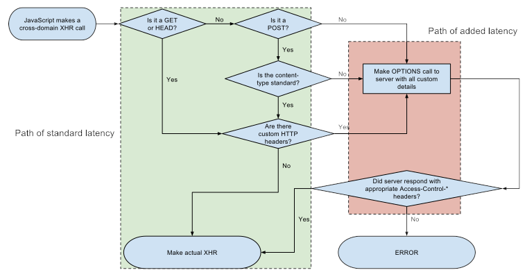

# CORS implementation

* 1
* 1
* 1

**CORS** is a security feature that specifies the **origins** from which client _frontend apps_ can make **cross-origin** requests, implemented by the **server** and enforced by the **browser**.

When the frontEnd sends a **cross-origin fetch request**, the browser automatically switches from enforcing the same-origin policy to _CORS mode_.                                                                                                    In this mode, the browser checks for **CORS headers** in the **server response**. If the headers are valid, the browser allows the **response data** to be accessible on the **client side**.

```jsx
//Client cross-origin fetch request
async function passa(e){
  e.preventDefault()
  let richiesta={
    method: "GET",
  }

  let response = await fetch("http://localhost:3030/aggiungi", richiesta)
  ...
}

//CORS implementation on the server
app.all('*', (req, res, next) => {
  res.header('Access-Control-Allow-Origin', 'http://localhost:3000');
  res.header('Access-Control-Allow-Methods', 'GET, OPTIONS');

  next()
});

//server method response
app.get("/aggiungi", (req, res)=> {
  res.send( [{"prima": "andante"}, {"take": "it easy"}] )
})
```

<details>

<summary>Browser request and Server response Headers</summary>

The **Sec-Fetch-Mode** and **Sec-Fetch-Site** headers are part of the browser's Fetch Metadata Request Headers.

The **Sec-Fetch-Mode** header indicates whether the browser is in CORS mode or not.             The **Sec-Fetch-Site** header indicates the relationship between the **origin** of the _request initiator_ (fetch client) and the origin of the _resource being requested_ (server), which can be same-origin, same-site, or cross-site.&#x20;

In our case the **request initiator** and the **requested resource** have the same **host** (e.g., localhost) but different ports (e.g., 3000 and 3030), so they are considered same-site.

```jsx
//Browser request
GET /aggiungi HTTP/1.1
Host: localhost:3030
Accept: "*/*"
Referer: http://localhost:3000/
Origin: http://localhost:3000
Connection: keep-alive
Sec-Fetch-Mode: cors
Sec-Fetch-Site: same-site
If-None-Match: W/"28-jqnw96poGUiTc4i1XKkVczvt1Z8"
```

The server responds with a **Keep-Alive** header, which is a response to the **Connection: keep-alive** request header sent by the browser.                                                                                                        The **Keep-Alive** header specifies the **timeout** period, in seconds, during which the connection will remain active and reusable for subsequent requests, after which the connection will be closed if no new requests are sent.

```jsx
//Server response 
HTTP/1.1 304 Not Modified
X-Powered-By: Express
Access-Control-Allow-Origin: http://localhost:3000
Access-Control-Allow-Methods: GET, OPTIONS
ETag: W/"28-jqnw96poGUiTc4i1XKkVczvt1Z8"
Date: Tue, 11 Jun 2024 10:10:58 GMT
Connection: keep-alive
Keep-Alive: timeout=5
```

</details>

<figure><figcaption></figcaption></figure>

1

1
