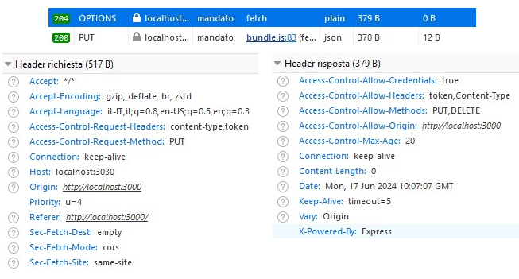

# CORS implementation

* [Cors simple options properties.](cors-implementation.md#cors-simple-options-properties)
* [Cors options and preflight request](cors-implementation.md#cors-options-and-preflight-requests)

**CORS** (Cross-Origin-Resource-Sharing) is security feature that specifies the **origins** from which client frontend apps can make cross-origin requests, implemented by the **server** and enforced by the **browser**. It is necessary to avoid **CSRF** (Cross-Site-Request-Forgery).

When the frontEnd sends a **cross-origin fetch request**, the browser automatically switches from enforcing the same-origin policy to _CORS mode_.                                                                                                    In this mode, the browser checks for **CORS headers** in the **server response**. If the headers are valid, the browser allows the **response data** to be accessible on the **client side**.

```jsx
//Client cross-origin fetch request
async function passa(e){
  e.preventDefault()
  let richiesta={
    method: "GET",
  }

  let response = await fetch("http://localhost:3030/aggiungi", richiesta)
  ...
}

//CORS implementation on the server
app.all('*', (req, res, next) => {
  res.header('Access-Control-Allow-Origin', 'http://localhost:3000');
  res.header('Access-Control-Allow-Methods', 'GET, OPTIONS');

  next()
});

//server method response
app.get("/aggiungi", (req, res)=> {
  res.send( [{"prima": "andante"}, {"take": "it easy"}] )
})
```

<details>

<summary>Browser request cross-fetch headers </summary>

The **Sec-Fetch-Mode** and **Sec-Fetch-Site** headers are part of the browser's Fetch Metadata Request Headers.

The **Sec-Fetch-Mode** header indicates whether the browser is in CORS mode or not.             The **Sec-Fetch-Site** header indicates the relationship between the **origin** of the _request initiator_ (fetch client) and the origin of the _resource being requested_ (server), which can be same-origin, same-site, or cross-site.&#x20;

In our case the **request initiator** and the **requested resource** have the same **host** (e.g., localhost) but different ports (e.g., 3000 and 3030), so they are considered same-site.

```jsx
//Browser request
GET /aggiungi HTTP/1.1
Host: localhost:3030
Accept: "*/*"
Referer: http://localhost:3000/
Origin: http://localhost:3000
Connection: keep-alive
Sec-Fetch-Mode: cors
Sec-Fetch-Site: same-site    //A domain/subdomain request is cross-origin
If-None-Match: W/"28-jqnw96poGUiTc4i1XKkVczvt1Z8"
```

The server responds with a **Keep-Alive** header, which is a response to the **Connection: keep-alive** request header sent by the browser.                                                                                                        The **Keep-Alive** header specifies the **timeout** period, in seconds, during which the connection will remain active and reusable for subsequent requests, after which the connection will be closed if no new requests are sent.

```jsx
//Server response 
HTTP/1.1 304 Not Modified
X-Powered-By: Express
Access-Control-Allow-Origin: http://localhost:3000
Access-Control-Allow-Methods: GET, OPTIONS
ETag: W/"28-jqnw96poGUiTc4i1XKkVczvt1Z8"
Date: Tue, 11 Jun 2024 10:10:58 GMT
Connection: keep-alive
Keep-Alive: timeout=5
```

</details>

<figure><figcaption><p>The complete  CORS  server/browser procedure</p></figcaption></figure>

We can **npm install cors** module to implement CORS more easily. A cors without its options object allows any fetch request.

```jsx
//Implementing the cors middleware
const cors = require("cors");
app.use( cors() )
```

The CORS module **options object** customizes the server's CORS behavior, and is equivalent to defining a custom middleware function.



Each option property value is equivalent to a response header.

```jsx
const cors = require("cors");

const corsOptions = {
  origin: "http://localhost:10000", 
  methods: [`DELETE`,  `PUT`],
  allowedHeaders: ["Content-Type"],
};

app.use( cors(corsOptions) )
```



Both send the CORS headers in teh server response

```jsx
app.all('*', function(req, res, next) {
  res.header('Access-Control-Allow-Origin', 'http://localhost:10000');
  res.header('Access-Control-Allow-Methods', 'PUT, DELETE');
  res.header('Access-Control-Allow-Headers', 'Content-Type');
  
  next();
});
```



### Cors simple options properties.

The **CORS** option properties configure the **server response headers**, but some are specific to **simple requests** while others are specific to preflight requests.

```jsx
//complete cors options object
let corsOptions = {
  origin: ['https://example.com', 'https://another-example.com'],
  allowedHeaders: ['Content-Type', 'Authorization', 'Accept'],
  exposeHeaders: ['Content-Length', 'X-Custom-Header'],
  credentials: true,

  methods: ['GET', 'PUT', 'DELETE'],
  maxAge: 3600,
}
```

We define as **simple requests** any request that doesn't require a _preflight_ check, doesn't pose a risk of modifying server data in a harmful way, and uses _safe HTTP methods_ such as GET, HEAD, OPTIONS, or POST with a limited set of content types.

The **cors** options properties used on simple requests are **origin**, **credentials**, **allowHeaders** and **exposeHeaders**.

The <mark style="background-color:blue;">origin</mark> property specifies the **protocol, host, and port** of the frontend client that's allowed to make the **fetch request**. By default, its value is \*, which allows requests from all origins.

```jsx
//The Access-Control-Allow-Origin in the server response  
//Protocol: HTTP, Host/domain: localhost, Port 3000 
//The Port may be already included in the frontEnd URL
const corsOptions = {
  origin: "http://localhost:3000" 
};
```

The <mark style="background-color:blue;">allowedHeaders</mark> property specifies the **header data** types that are allowed to be **sent** from the **fetch** request, including custom headers (which will trigger a preflight), used to stop malicious scripts,

The safelisted CORS headers that won't trigger a preflight are **Accept, Accept-Language, Content-Language, and Content-Type** with specific values like _multipart/form-data_, or _text/plain_.                   Any non-safelisted header not included in the allowedHeaders will block the cors request.

```jsx
//This header won't trigger a preflight
let fetchOption= {
  method: "POST", 
  body: "mode=cors",
  headers: {
    "Content-Type": "text/plain", 
    "Custom": "element"
  }
}

//We can remove Content-Type, but not Custom
const corsOptions = {
  origin: "http://localhost:3000", 
  allowedHeaders: ["Content-type", "Custom"],
};
```

The allowedHeaders will trigger a preflight request for custom headers or non-safelisted header values.

<details>

<summary>The "Content-Type":"application/json" on POST methods</summary>

The **POST** method is considered a simple method, and won't trigger a preflight request. However, if the request includes a **Content-Type** header with an **application/json value**, it will trigger a preflight request.

```jsx
//Any data sent by the POST methods needs to be JSON
let oggetto= {
  method: "POST", 
  body: JSON.stringify({"posto": "piano", "action": "sintetic"}),
  headers: {
    "Content-Type": "application/json",
    "Accept": "application/json"
  }
}

//The content-Type doesn't need to be declared in the allowHeaders 
//but its value will trigger a preflight
const corsOptions = {
  origin: "http://localhost:3000", 
  allowedHeaders: ["Accept", "Accept-Language", "Content-Language"],
};
```

</details>

The <mark style="background-color:blue;">exposeHeaders</mark> property controls which response headers are accessible on the client-side, preventing sensitive data exposure.                                                                                                                              By default, it's an empty array, only allowing a limited set of safe headers (e.g. Cache-Control, Content-Language, Content-Type) to be visible, without requiring explicit declaration.

The **exposeHeaders** property bypasses the server's permission check, enabling direct access to response headers in the client, thereby avoiding an additional **OPTIONS request** for each header access.

```jsx
//We can't edit the headers in the client
async function sentData(){
  let oggetto= {
    method: "POST",
    body: JSON.stringify({"user1": "dude"}),
    headers: {
      "Content-Type": "application/json",
      "Accept": "application/json",
    }
  }

  let resp = await fetch("http://localhost:3030/heads", oggetto)
  console.log(resp.headers);              // Log all response headers
  console.log(resp.headers.get("token")); // Get specific header

  let json = await resp.text()
}
```

If a header is not included in **exposeHeaders**, it will be inaccessible to the client-side code, even if the server **set()** it. It affects only the CORS response headers and won't block the cors request nor trigger a preflight.

```tsx
//Server side code
//The Content-Type is already being exposed
const cors = require("cors");

const corsOptions = {
  origin: "http://localhost:3000", 
  allowedHeaders: ["token"],  //if removed blocks the cors request
  exposedHeaders: ["token"],  //if removed hides the header.get() on client
};

app.use(cors(corsOptions)); 

//All fetch headers are avaiable in the server, even without exposeHeaders
app.post("/heads", (req, res)=>{
  console.log( "req.body" )
  console.log( req.headers['content-type'] )  //application/json

  //To be avaiable in the client headers need to be set(), even without send()
  res.header("Content-Type", "application/json");
  res.send("non ci siamo")
})
```

In a **CORS** request, the <mark style="background-color:blue;">credentials</mark> property is used in both the **client-side** fetch request and the **server-side** CORS option object, but with different purposes. On the client-side, credentials specifies whether and from which origin the credentials will be shared.

In the **client** fetch request it can take one of three values, **omit** (default), which excludes credentials; **same-origin**, which includes credentials only if the request is made to the same origin as the server; or **include**, which includes credentials regardless of the request origin.

```jsx
//Fetch request credentials
let oggetto= {
  method: "POST",
  body: JSON.stringify({"sent": "data"}),
  headers: {
    "Content-Type": "application/json",
    "Accept": "application/json",
  },
  credentials: `include`
}
```

On the server-side, the **credentials** property in the CORS option object is a boolean value that indicates whether the server allows credentials to be included in the request.

```jsx
//The Access-Control-Allow-Credentials in the server response 
const corsOptions = {
  origin: "http://localhost:3000", 
  credentials: true,  //false won't block the fetch request
};
```

### Cors options and preflight requests

The **maxAge** and **methods** properties are only triggered during the browser's **preflight OPTIONS request**.

A **preflight** request returns the _headers_ and _methods_ allowed by the server, it triggers based on **fetch options** properties that may cause side-effects to the server, like PUT/DELETE methods and non-safelisted **allowHeaders** values.

The **browser** initiates the preflight request and checks the response cors headers to allow the fetch request.

```css
//The preflight request includes additional headers compared to the fetch request:
Access-Control-Request-Method: It contains the HTTP methodthat will be used 
in the actual fetch request.
Access-Control-Request-Headers: It contains a comma-separated list of the 
non-simple headers that will be used in the actual fetch request.
 
//The server will respond with the CORS headers: 
Access-Control-Allow-Method/Request
```

<details>

<summary>The preflight Fetch request and server response</summary>

A preflight is a type of OPTIONS request, often used to query the capabilities of the server.

```jsx
//A POST wouldn't trigger the preflight
//A single value can trigger the preflight 
async function nonval(){

  let oggetto= {
    method: "PUT",
    body: JSON.stringify({"primo": "parte", "predappio": "altrime" }),
    headers: {
      "Content-Type": "application/json",
      "Accept": "application/json",
      "token": "custom-data"
    },
    credentials: `include`
  }

  let resp = await fetch("http://localhost:3030/mandato", oggetto)    
  let json = await resp.text()
}
```

The cors properties sent in the response headers.

```jsx
const cors = require("cors");

const corsOptions = {
  origin: "http://localhost:3000", 
  methods: ["PUT",`DELETE`],
  allowedHeaders: ["token", "Content-Type"],
  credentials: true,
  maxAge: 20,
};

app.use(cors(corsOptions)); 
```

</details>

<figure><figcaption><p>The preflight OPTIONS request</p></figcaption></figure>

The <mark style="background-color:blue;">methods</mark> property specifies the array of methods allowed to be sent in the request.

```jsx
//It will block only non-simple methods
//To limit GET, POST and HEAD methods use headers 
const cors = require("cors");

const corsOptions = {
  origin: "http://localhost:3000", 
  methods: ["PUT",`DELETE`]
};

app.use(cors(corsOptions));
```

The <mark style="background-color:blue;">maxAge</mark> property sets the validity period cache of a preflight OPTIONS response cache, in seconds, any successive request from the same origin/method will skip its preflight request.

The **browser** has a built-in cache period for OPTIONS responses and can store multiple OPTIONS cache, no cache will be shared even if from the same origin.

```jsx
//The Access-Control-Max-Age Server response header ONLY in the preflight response
const corsOptions = {
  origin: "http://localhost:3000", 
  maxAge: 20,
};
```

Different responses return different **HTTP codes**, a preflight OPTIONS response has code **204**, success but no return content, a server response has code **200**, success and return content, and cached responses have code **304**, no modified resource.

The **ETag** (Entity Tag) is a _response header_ that identifies a specific _version_ of a resource. It prevents simultaneous updates of the same resource and ensures that clients don't retrieve outdated content. The ETag is **included** in all responses, regardless of whether the response is cacheable or not.

The **If-None-Match** request header is used in conjunction with the ETag. It contains the cached ETag value from a previous response and is sent with subsequent requests to check if the resource has been updated. If they match then the cached response value is used.

The If-None-Match header is limited to GET and HEAD requests, which retrieve resources, and is not included in requests that edit or update data, such as POST, PUT, and DELETE, as they do not return a response resource.

<figure><figcaption><p>The if-none-match and ETag headers in an GET request</p></figcaption></figure>

1
