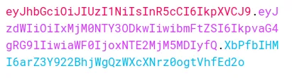

# JWT signing and verification

* 1

A JSON Web Token (**JWT**) is a compact, URL-safe, digitally signed token used for authentication and information exchange.

It's properties are:

> <mark style="color:yellow;">Scalability</mark>: JWTs can be easily generated, distributed, and verified across multiple servers due to being stateless and self-contained.
>
> <mark style="color:yellow;">Flexibility</mark>: JWT tokens can be used across multiple domains, devices, protocols and services, including APIs and databases.
>
> <mark style="color:yellow;">Security</mark>: JWT ensures its authenticity through a **digital signature**, which prevents any editing during transmission. This signature is generated using a cryptographic **sign()** method that combines the user data stored in the token with a secret key, and is then appended to the token.
>
> <mark style="color:yellow;">Performance</mark>: As **self-contained** tokens, JWTs enable fast verification, outperforming traditional session-based authentication methods that require database queries.
>
> <mark style="color:yellow;">Safe on transmission</mark>: JWT can be protected from external scripts and session fixation attacks. It can be sent in the **Authorization** header, or via **cookies** that require additional security flags (e.g., httpOnly and secure) but offer a built-in expiration date
>
> <mark style="color:yellow;">Easy revocation</mark>: JWTs can be revoked by deleting the token, eliminating the need to invalidate sessions.

We **npm install jsonwebtoken** and **sign()** it, adding an **expiresIn** date object.                                            The **payload** should contain non-sensitive user _identification data_, such as a user ID, and be signed with a secret key, like in an **.env** file.

```jsx
//An .env file can be kept from the git commits in the gitignore
jwtSecret = "migracodeAuthJan2021"

//An external JWT generator to be imported in different files
const jwt = require("jsonwebtoken");
require("dotenv").config();

function generateJWT(user_id) {
  const payload = {
    user: {
      id: user_id
    }
  };

  return jwt.sign(payload, process.env.jwtSecret, { expiresIn: "1h" });
}

module.exports = generateJWT;
```

Instead of using the Authentication header, which requires **Axios** to be included in requests, we use **cookies** to send the JWT from the server, automatically including it in all successive **requests**.

```jsx
//Also we don't use localstorage, which is more vulnerable to external scripts
const generateJWT = require("../utils/generateJWT");
const jwtToken = generateJWT(2);

//Multiple ways to send the cookie
//Remember to sue expire on res.cookie() and max-age on header.
res.cookie( 'jwt', jwtToken, { expires: new Date(new Date().getTime() + 120 * 1000), 
    httpOnly: true, sameSite: "none", secure: true} )
res.header("Set-Cookie", `jwt=${jwtToken}; Domain=localhost; Max-Age=120; 
    httpOnly; Secure; SameSite=None;`);

return res.status(201).send({isAuthenticated: true});
```

The JWT is a **base64**-encoded string divided into three parts.                                                                        The **Header**, containing the token type and the hashing algorithm used for signing.                                 The **Payload**, which comprises the JSON object carrying the user data.                                                      The **Signature**, a secret hash generated by the server using the Header and Payload along with the secret key.

<figure><figcaption><p>Base 64 conversts binary data into an ASCII string, used for non readable data</p></figcaption></figure>

To **verify** a valid and not revoked JWT, we compare its UNIX **expiration** timestamp with the current **Date()** and its secret key. If the verification fails, it returns an error.

```jsx
//We can pass request data to the next() route
function authenticate(req, res, next) {
  let jwtUser = req.headers.cookie
  jwtUser = jwtUser.split("=")[1];

  const verify = jwt.verify(jwtUser, process.env.jwtSecret);
  req.user = verify.user;  //{ id: 2 }
  console.log( verify )   //{ user: { id: 2 }, iat: 1720449351, exp: 1720452951 }

  next();
}

//We can add a try/catch block for a verify() error after next()
router.post("/auth", authenticate, (req, res) => {
  console.log( req.user )  //{ id: 2 }

  res.status(200).send({ isAuthenticated: true });
}
```

1
