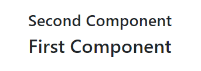
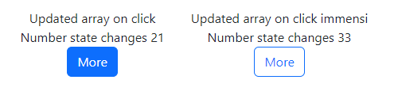
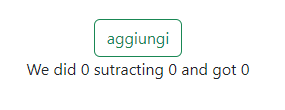
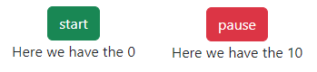
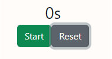
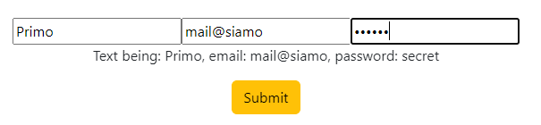
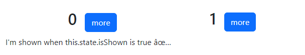
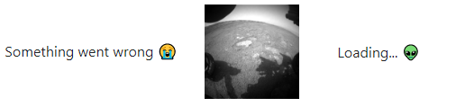

# REACT 1, React props, event handlers, basic useState(), useEffect(), React forms/inputs and Class components

* [React Props, event handlers and useState](react-1.md#react-props-event-handlers-and-usestate)
* [React useEffect with setInterval()](react-1.md#react-useeffect-with-setinterval)
* [ReactJs forms, inputs, and submit](react-1.md#reactjs-forms-inputs-and-submit)
* [Class component, useState() and fetch()](react-1.md#class-component-usestate-and-fetch)

**Node.js** is a _javascript environment_, we use **npm** (Node Package Manager) to install **modules** and use a **packages.json** file to track them.

To create a **React** application folder we run:

```
npx create-react-app (name of the app)

//its /public folder contains the app root
//its /src folder has the different page components
```

**React** is a _javascript library_ used for user interface, based on single-role **components**.

We **render DOM** elements in the **React components** by **abstracting** HTML tags using **jsx**.

<details>

<summary>Render React DOM elements guide</summary>

With Javascript, we needed to createElement, content, a selector, and then **render**:

```
<script type="text/javascript">
  var divNode = document.createElement('div');
  divNode.innerText = 'Hello World';

  var rootElement = document.querySelector('#root');
  rootElement.appendChild(divNode);
</script>

```

On **React** we can:

```
const element = React.createElement("div", {
  children: "Hello World",
});

const rootElement = document.querySelector("#root");
ReactDOM.render(element, rootElement);

```

**JSX** is syntax sugar used to shortcut the createElement:

```
const element = <div>Hello World</div>;

const rootElement = document.querySelector("#root");
ReactDOM.render(element, rootElement);
```

Then we implement it on **components**:

```
import React from "react";
import ReactDOM from "react-dom";

function HelloWorld() {
  return <div>Hello World</div>;
}

export default Base

//we will use the root in App.js
const root = ReactDOM.createRoot(document.getElementById('root'));
```

</details>

A **component** needs to **import** React and can reference multiple components, called child components, but can export only one.

```
//components are shortened versions of <Primo> </Primo> to put code in-between
//we can use Arrow functions for the components
import React from 'react';

const Primo =() =>{
  return(
    <div> <h1>Second component </h1> </div>
  )
}

const Secondo =() =>{
  return(
    <div> <h2>First component</h2> </div>
  )
}

const App =() =>{
  return(
    <div>
      <Primo />
      <Secondo />
    </div>
  )
}

export default App;
```

<figure><figcaption><p>rendered React component</p></figcaption></figure>

We use **CamelCase** for **component names** to differentiate from default HTML tags.:

We use _javascript expressions_ and **{}** to render logic and variables on **JSX**.

<details>

<summary>React javascript expression guide</summary>

We put **javascript** before the **return** of the component.

```
//we can work with arrays, methods and objects
const Second =() =>{
  const linea= ["uno", "molti", "terzi"]

  const oggetto= {
    soggetto: "nome",
    predicato: 12_000
  }
  
  return(
     <div>
       This is a sum: {1 +2 +3}        //6
       molti: {linea.join(" / ") }     //uno / molti / terzi
       two object {oggetto.soggetto} and {oggetto.predicato} //nome and 12000
     </div>
  )
}
```

We can invoke **functions and render loops**:

```
const Primo =() ={

  function object(zona){
    return zona.capital + " and " + zona.province
  }
  const area={
    capital: "lichsteiner",
    province: "vicini"
  }
  const serie= ["meant", 23, "to be"]

  return(
    <div>
      We invoke the function: {object(area)}  //lichsteiner and vicini
      <ul>
        {
          serie.map((x) =>{
            return(                          
              <li>The element is: {x} </li>  //The element is: meant 
            )
          })
        }
      </ul>
    </div>
  )
}
```

</details>

### React Props, event handlers and useState

**Props** are **arguments** passed into React **components,** they are **read-only** and can't be **updated.**

```
//we use it when importing/exporting components
//we declare props argument key and THEN we add properties

const Basic= (props) =>{
  return(
    <div> We use the props here: {props.name} </div>
  )
}

export default Basic

//The property values change depending on the component which is used
import Base from './components/Basso'

const App= () =>{
  return(
    <Base name="Mozafar" />    //We use the props here: Mozafar
  )
}

export default App;
```

<details>

<summary>Props used with javascript expression</summary>

We can edit the **props** property using **javascript expressions**:

```
//we export the props component with expressions
const Base= (props) =>{
  console.log(props)

  return(
    <div id={ "numero-" + props.numba } >
      The name is {props.name} and number {props.numba}
      <div>nuovo valore: {props.numba + 12} </div>
    </div>
  )
}

export default Base
```

to then assign the **props values** on the rendering components:

```
//and properties values can be expressions themselves
import Base1 from './components/Basso'

let anni= Math.floor( Math.random()*100 )
const App= () =>{
                                           //console.log(
  return(                                  //{name: "Mozafar", numba: 5} )
    <div>                                  //<div id="numero-5">
      <Base1 name="Mozafar" numba={anni}/> //The name is Mozafar and number 5
    </div>                                 //nuovo valore: 17
  )
}

export default App;
```

</details>

We can add **Event Handlers** to React components, like **onClick()**, **onChange()** or **onSubmit()**:

```
//We put the callback function in {} as an expression
const Ano= () =>{
  let add= 0;
  function more(){  
    add += 1
    console.log("Added " + add)    //added 2/3/... 
  }

  return(
    <div>
      <button className='btn btn-warning' onClick={more}>Clikka</button>
    </div>
  )
}
```

We can pass **useState()** and **functions** using **props**:

<details>

<summary>useState() and functions on props</summary>

We use the useEffect() hook to set-up a setInterval() based on isActive and isPaused useState().

Then we **pass** useState() and the functions to the \<Tempo> **prop**

```
import Tempo from "./Timer.js"
import Nub from "./Numeri.js"

const [isActive, setIsActive] = useState(false);
const [isPaused, setIsPaused] = useState(true);
const [time, setTime] = useState(0);

useEffect(()=>{
    let interval= null

    if (isActive && isPaused === false) {
        interval = setInterval(() => {
          setTime((time) => time + 10);
        }, 100);

      } else {
        clearInterval(interval);
      }
      return () => {
        clearInterval(interval);
      };
}, [isActive, isPaused, time])

const handleStart = () => {
    setIsActive(true);
    setIsPaused(false);
};
  
const handlePauseResume = () => {
    setIsPaused(!isPaused);
};
  
const handleReset = () => {
    setIsActive(false);
    setTime(0);
};

return(
    <div>
        <Nub time={time} />

        <Tempo
            isActive={isActive}
            isPaused={isPaused}
            handleStart={handleStart}
            handlePauseResume={handlePauseResume}
            handleReset={handleReset}
        />
    </div>
)

```

We can then use the **prop function** and the **prop useState()** in the imported component:&#x20;

```
//We call the prop.functions with the onClick() event listener
//We use the ternary operator with the returned prop.useState()

const Tempo = (props) =>{
    
    const StartButton = (
        <div className="btn btn-warning"
             onClick={props.handleStart}>
          Start
        </div>
    );

    const ActiveButtons = (
        <div className="btn-grp">
          <div className="btn btn-danger" 
               onClick={props.handleReset}>
            Reset
          </div>
          <div className="btn btn-primary" 
               onClick={props.handlePauseResume}>
            {props.isPaused ? "Resume" : "Pause"}
          </div>
        </div>
      );
      
    return (
        <div className="Control-Buttons">
          <div>{props.isActive ? ActiveButtons : StartButton}</div>
        </div>
    );

}

```

After the useEffect() setInterval() is started we can **render** its **useState()** using **another component**.

```
//we can continue to edit the props.useState()
<Nub time={time} />

const Num= (props) =>{

    return(
        <div>
            <h1>Sono passati {props.time/100} secondi </h1>
            <h2>E sono passati { Math.floor( (props.time/6000 ))} minutos </h2>
        </div>
    )
}

```

</details>

We use the React Hook **useState** to track the **state** of a component and **update** it:

<details>

<summary>Updating Reactjs  useState() </summary>

We use **destructuring** on the imported **useState object**, into a current state **variable,** and a set **function** to **update** it.

```
//We use .concat() instead of .push() to create a new state array that will 
//get re-rendered on React (instead of just changing current with .push())

import React , { useState } from 'react';

const Ray= () =>{
  let [rar, setRar] = useState([])
  let [uno, setUno] = useState( 21 )

  function innio(){
    setRar( rar.concat("immensi") )
    setUno( 33 )
  }

  return(
    <div>
      <div>Updated array on click {rar}</div>
      <div>Number state changes {uno}</div>
      <button className='btn btn-outline-primary' onClick={innio}>More</button> 
    </div>
  )
}
```

</details>

<figure><figcaption><p>useState() after onClick() </p></figcaption></figure>

We can **pass** the useState() and its **setter function** as **props**:

```
//and use the setter function to change the useState

const [versus, setVersus] = useState(false)

<GameStart 
  versus={versus}
  setVersus={setVersus}
/>

<button className="btn btn-danger ms-1" disabled={props.versus} 
        onClick={ ()=> props.setVersus(true) }> 
  Stand 
</button>
```

### React useEffect with setInterval()

We use the **useEffect(function, dependency)** **hook** to **synchronize** a component with an external **variable.**

```
//useEffect triggers on render, with the setState() change being a render 
//the setTimeout continues, we use empty [] dependency to render it once

let [esempio, setEsempio]= useState(0)

useEffect(() => {
  setTimeout(() => {
    setEsempio((esempio) => esempio + 1);
  }, 1000);
}, [] );

<div>aumentiamo di uno qui {esempio}</div>
```

When a **dependency state** changes the **useEffect** renders:

<details>

<summary>useEffect with dependency useState</summary>

We need 2 **states**, one for the **dependency** change and the other for the **javascript expression.**

```
//When the count1 state changes onClick() the useEffect updates the 
//calculation1 state and we render the javascript expressions

const [count1, setCount1] = useState(0);
const [calculation1, setCalculation1] = useState(0);

useEffect( () =>{
  setCalculation1(()=> Math.pow(count1, 2) - count1*2 )
}, [count1])

<button className="btn btn-outline-success" 
        onClick={()=> setCount1((c)=> c + 1)} >
  aggiungi
</button>
<p>
  We did {Math.pow(count1, 2)} subtracting {count1*2} and got {calculation1}
</p>
```

</details>

<figure><figcaption><p>useEffect function rendering after onClick state</p></figcaption></figure>

We can implement **javascript expression** using **ternary-operators** for DOM content:

```
//we need to use {` ${``} `} for strings

<button className={`btn btn-${ lancetta ? `danger`: `success` }`}
        onClick={()=> setLancetta((w)=> !w ) }
>
  {lancetta ? "pause" : "start" }
</button>

//for variables we don't need ""
const [texto, setTexto] = useState("start")

<button>{lancetta ? texto : "no button" }</button>

```

We can also use **&&** to **render** React components:

```
//Similar to a ternary-operator but without the else, won't render if no condition
{record && 
  <h4>This is rendered only if condition</h4>
}
```

We can use a **useEffect()** hook to **start/pause a setInterval(),** to do so we need 2 useState() dependencies.

One for the **onClick()** starter event and another for the **useState()** time-limit we want to use to stop it

```
//We need the return clearTimeout() to limit the setInterval() to once at the time
//We use the lancetta to true/false the useEffect setInterval() 
//and we use the other dependency useState() to stop it with clearInterval()

const [tempato, setTempato] = useState(0)
const [lancetta, setLancetta] = useState(false)
let interval;

useEffect( ()=>{

  if(lancetta){    
    interval= setInterval( ()=>{
      setTempato((temp)=> temp + 1)
    }, 500)
  }

  if( tempato == 10 ){
    setLancetta( false )
    clearInterval(interval)
  }

  return () =>{
    clearInterval(interval)
  }
}, [lancetta, tempato] )

```

<figure><figcaption><p>useEffect dependency used with setInterval()</p></figcaption></figure>

We can also trigger **setInterval()** and **clearInterval()** using the same **dependency** in the **useEffect condition**:

<details>

<summary>Reset/Restart single button with useEffect</summary>

The **stop/pause button** will reset the current seconds but **not the setInterval()**, for that we use the **reset** button.

```
//We use the true/false switch and javascript expressions

<div className="text-center fs-2 font-weight-bold">
  {seconds}s
</div>

<div className="text-center">
  <button className={`btn btn-${isActive ? `danger`:`success`}` }
          onClick={ ()=> setIsActive((x)=> !x) }>
    {isActive ? 'Pause' : 'Start'}
  </button>
  <button className="btn btn-secondary" onClick={reset}>
    Reset
  </button>
</div>
```

We use useEffect() **conditionals** to trigger the **setInterval()**.

We reset(seconds), and we **clearInterval()** but we **also re-start**, by using setIsActive(!isActive) to **trigger** the useEffect() conditional **again** while keeping the gradi counter.

We stop seconds and active using **reset()**.

```
//We need to include both triggers and state counters in the dependencies

const [seconds, setSeconds] = useState(0);
const [gradi, setGradi] = useState(0)
const [isActive, setIsActive] = useState(false);

function reset() {
  setSeconds(0);
  setIsActive(false);
}

useEffect(() => {
  let interval = null;
  if (isActive) {

    interval = setInterval(() => {
      setSeconds(seconds => seconds + 1);
      setGradi(gradi => gradi + 1)
    }, 500);

  } else if (!isActive && seconds !== 0) {
    clearInterval(interval);
    setSeconds(0)
    setIsActive(!isActive);
  }
  
  return () => {
    clearInterval(interval);
  }
}, [isActive, seconds, gradi]);
```

</details>

<figure><figcaption><p>start/reset/re-start on single button</p></figcaption></figure>

Including a **function** inside **useEffect()** dependencies will _<mark style="color:orange;">Error: This dependency changes on every render.</mark>_

We use the React Hook **useCallback()** to call the function only when Its dependency changes.

```
//We call also include the entire function within useEffect() without useCallback()

const [message, setMessage] = useState('');

const createOptions = useCallback(() => {
  return {
    serverUrl: 'https://localhost:1234',
    roomId: roomId
  };
}, [roomId]);                     //✅ Only changes when roomId changes

useEffect(() => {
  const options = createOptions();
  return () => options();
}, [createOptions]);              //✅ Only changes when createOptions changes
```

To implement **font-awesome** in **Reactjs** we:

```
//First we install its npm 
npm i --save @fortawesome/fontawesome-svg-core
npm install --save @fortawesome/free-solid-svg-icons
npm install --save @fortawesome/react-fontawesome

//then we import and use it
import { FontAwesomeIcon } from '@fortawesome/react-fontawesome'
import { faStopwatch } from '@fortawesome/free-solid-svg-icons'

<h1> Welcome to the store 
  <FontAwesomeIcon icon={faStopwatch} />
</h1>
```

To **deploy** a **Reactjs** app GitHub repository on [_**Netlify**_ ](https://app.netlify.com/sites/wondrous-bubblegum-23cd24/overview)we edit the **package.json**:

```
//so it can be deployed even if it has warnings
"scripts": {
  "start": "react-scripts start",
  "build": "react-scripts build",
  "test": "CI=true react-scripts test"
}

```

### ReactJs forms, inputs, and submit

We render **input controlled-components** using useState() and callback functions.

```jsx
//onChange() will trigger for each type in the input
const [reminder, setReminder] = useState("");

function handleChange1(e) {
    e.preventDefault();
    setName(e.target.value);
}

<form>
  <input
    type="text"
    name="reminder"
    value={reminder}
    onChange={handleChange}
  />
</form>

<p>Inserted text {reminder}</p>
//the input value will be rendered as a useState()
```

<details>

<summary>Complete form, input and submit ReactJS</summary>

On the DOM, we add the **onSubmit()** attribute to the **\<form>** component.

```jsx
//We use the same callback function for all inputs
//the onSubmit() will trigger for any button pressed within <form>

<form onSubmit={mandasotto}>
  <input
    type="text"
    placeholder="Chillin"
    name="reminder"
    value={reminder}
    onChange={handleChange}
  />
  <input
      type="text"
      placeholder="mail"
      name="email"
      value={email}
      onChange={handleChange}
  />
  <input
    type="password"
    placeholder="pass "
    name="password"
    value={password}
    onChange={handleChange}
  />

  <p>Text being: {reminder}, email: {email}, password: {password} </p>

  <button className="btn btn-warning">Submit</button>
</form>
```

We use **target.name** to select which useState() gets which **target.value** to **render.**

While **onSubmit()** we print the current **useStates()**.

```jsx
const [reminder, setReminder] = useState("");
const [email, setEmail] = useState("")
const [password, setPassword] = useState("")

function handleChange(event) {

  if(event.target.name === "reminder"){
      setReminder( event.target.value );
  }else if(event.target.name === "email"){
      setEmail( event.target.value );
  }else if(event.target.name === "password"){
      setPassword( event.target.value );
  }

}

function mandasotto(event){
  event.preventDefault()
  console.log(reminder + " " + email + " " + password )
}

```

</details>

<figure><figcaption><p>fotm, input and submit with rendered values</p></figcaption></figure>

We can also render **uncontrolled input components**, using the **useRef hook,** we set the callback function and the useState **outside** of the **input** component

```jsx
//We set the ref={} on the input and then use it in useEffect

const [name, setName] = useState('Ravi');
const input = useRef();

useEffect(() => {
  input.current.onkeyup = handleChange1;
  input.current.value = name;
});

function handleChange1(e) {
  e.preventDefault();
  setName(e.target.value);
}

<div>
  Name:
  <input type='text' ref={input} />
</div>
<div>Name is: {name}</div>
```

### Class component, useState() and fetch()

Apart from **function components**, there are also **Class components**.

We need the **component React hook** and the **render(){} method** for the DOM.

```
//Class components are the older type of React components
//we implements functions like this.methods
import React, {Component} from "react"

class Num extends Component{
  lude = () =>{
    console.log("kinda we got")
  }

  render() {
    return (
      <div>
        <h1>I can smell your</h1>
        <button className="btn btn-warning" onClick={this.lude}>super</button>
      </div>
    )
  }
}

export default Num
```

<details>

<summary>Class components with useState(), setState() and external component</summary>

We can't use the useState() hook in a class component, we can initialize multiple useState() in the **state object**.

We use a **this.method** with a callback function to **setState()**.

```
// Some code
const Message = () => <p>I'm shown when this.state.isShown is true ✅</p>;

class Num extends Component{
  state = {
    away: 0
  }

  increment = () => {
    this.setState((x)=>{
      return{
        away: x.away + 1
      }
    });
  }

  render() {
    return (
      <div>
        <div className="d-flex justify-content-center align-content-center">
          <h1 className="mx-3">{this.state.away}</h1>
          <button
            className="btn btn-primary my-2"
            onClick={this.increment}    
          >
            more
          </button>
        </div>
        {this.state.away ? null : <Message />}
      </div>
    )
  }
}
```

We can use **external functions** with a toggle operator.

</details>

<figure><figcaption><p>Class component useState()</p></figcaption></figure>

<details>

<summary>Class component Fetch setState()</summary>

We use **componentDidMount()** to render after a **fetch()**.

```
//we then render a useState() on the img attribute

class Num extends Component{
  state = {
    isLoading: true,
    imgSrc: null,
    date: "2019-01-01",
  }

  componentDidMount(){
    fetch(
      `https://api.nasa.gov/mars-photos/api/v1/rovers/curiosity/photos?earth_date=${
        this.state.date
      }&api_key=gnesiqnKCJMm8UTYZYi86ZA5RAnrO4TAR9gDstVb`
    )
    .then(res => res.json())
    .then(data => {
      this.setState({
        isLoading: false,
        imgSrc: data.photos[0].img_src
      });
    });
  }

  render() {
      return (
        <div>
          {this.state.isLoading ?
            <p className="my-5">Loading... 👽</p>
          :
          <div className="row container justify-content-center my-5">
            <div className="col-3">
              
            </div>
          </div>
          }
        </div>
      )
  }
}
```

To catch a **fetch() error** we add an extra **then()** and useState().

```
class Num extends Component{
  state = {
    imgSrc: null,
    date: "2019-01-01",
    error: null
  }

  componentDidMount() {
    const roverName = "disinterest";
    fetch(
      `https://api.nasa.gov/mars-photos/api/v1/rovers/${roverName}/photos?earth_date=${
        this.state.date
      }&api_key=gnesiqnKCJMm8UTYZYi86ZA5RAnrO4TAR9gDstVb`
    )
    .then(res => {
      if (res.ok) {
        return res;
      } else {
        throw new Error("HTTP error");
      }
    })
    .then(res => 
        res.json()
    )
    .then(data => {
      this.setState({
        isLoading: false,
        imgSrc: data.photos[0].img_src
      }); 
    })
    .catch(error => {
      this.setState({
        isLoading: false,
        error: error
      });
    });
  }

  render() {
      return (
        <div>
          {this.state.error ?
            <p className="my-5">Something went wrong 😭</p>
          :
            <div className="row container justify-content-center my-5">
              <div className="col-3">
                
              </div>
            </div>
          }
        </div>
      )
  }
}
```

</details>

<figure><figcaption><p>Class component error catch, fetch, and isloading</p></figcaption></figure>
