# REACT 2, React routes, Input props and onChange(), React form onSubmit() and formData, input multiple attribute and input file images rendering

* [Using \<Outlet/> with React Routes](react-2.md#using-less-than-outlet-greater-than-with-react-routes)&#x20;
* [React Input Props and onChange() event handler](react-2.md#react-input-props-and-onchange-event-handler)
* [React Form onSubmit() event handler and FormData()](react-2.md#react-form-onsubmit-event-handler-and-formdata)
* [Input file image render and multiple input attribute](react-2.md#input-file-image-render-and-multiple-input-attribute)

We use **Client-side routing** to render **\<Routes> components** without requesting **external documents**.

Routing is not included in react, we need to in import Components from **react-router-dom**.

<pre class="language-jsx"><code class="lang-jsx">npm i react-router-dom

//We change the name of Browser
<strong>import {
</strong>  BrowserRouter as Router,
  Link,
  Route,
  useParams,
  Routes,
  Outlet,
  useRouteError
} from "react-router-dom";

</code></pre>



We render **Router>Routes>Route** in the return, the **element component** is linked to the **URL path**.

We use /\* for the **nested Routes** that will inherit the **parent URL**

```jsx
//put the <Router/> in a separate file from the imported rendered elements
return(
  <div>
    <Router>

      <Routes>
        <Route path="/" element={<Binge />} errorElement={<Sbaglia />} />
        <Route path="/venere/*" element={<Venere />} />
      </Routes>

    </Router>
  </div>
)
```

The **/** Route is the "**Home**" URL, we use **\<Link>** to **navigate** to the URL PATH,&#x20;

<pre class="language-jsx"><code class="lang-jsx">//we only need the /(path name) for the TO link.

<strong>const Binge = () =>{
</strong>  return(
    &#x3C;div>
      &#x3C;ul>
        &#x3C;li> &#x3C;Link to="/">Home&#x3C;/Link> &#x3C;/li>
        &#x3C;li> &#x3C;Link to="/venere">Bergamo&#x3C;/Link> &#x3C;/li>
      &#x3C;/ul>
    &#x3C;/div>
  )
}
</code></pre>

<figure>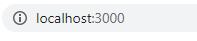<figcaption><p>Home / route</p></figcaption></figure>



On the route element component, we use a **variable route path**.

The URL PATH **depends on the \<Link>** and inherits the parent URL.

```jsx
//The path will change depending on the Link, and we can link 2 to one route

return(
  <div>
    <Link to="primem" >Click to nuovo or primo? </Link>
    <Link to="secondum" >Click to nuovo or secondum? </Link>

    <Routes>
      <Route path=":nuovo/*" element={<Primo />} />
    </Routes>
  </div>
)

```

<figure>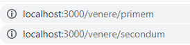<figcaption><p>URL path on variables </p></figcaption></figure>

1

1

1



We cut the /\* from the path, any extra Route won't inherit the PATH URL.

```jsx
//this is done for the ending routes

return(
  <div>
    <Link to="secondo"> To secondo </Link>

    <Routes>
        <Route path=":meaning" element={<Secondo />} />
    </Routes>
  </div>
)

```

<figure>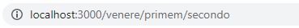<figcaption><p>variable URL Path</p></figcaption></figure>



### Using \<Outlet /> with React Routes&#x20;

**Route elements** **replace** their _previous Route elements_ **unless** they are **fixed components outside Router** (like navbars and other UI components).

**\<Outlet />** can **render** parent routes with their **children's routes** element by **nesting** their **\<Route>**



Nested \<Route/> elements can use \<Outlet/> to keep rendering their parent route element.

<pre class="language-jsx"><code class="lang-jsx"><strong>&#x3C;Router>
</strong>  &#x3C;Routes>
    &#x3C;Route path="/" element={&#x3C;Home />}> 
      &#x3C;Route path="primo" element={&#x3C;Primo/>}>&#x3C;/Route>
    &#x3C;/Route>

    &#x3C;Route path="secondo" element={ &#x3C;Secondo/> }>&#x3C;/Route>
  &#x3C;/Routes>
&#x3C;/Router>
</code></pre>



**\<Outlet/>** renders the **\<Route> nested** element while keeping the current one.

```jsx
function Home(){

  return(
    <div>
      <h3>Homepage</h3>

      <div className="remove">
        <li> <Link to="primo"> Outlet element</Link> </li>
        <li> <Link to="secondo"> Replaced route element </Link> </li>
      </div>

      <Outlet />
    </div>
  )
}
```

Any **link path** outside the nested will be rendered alone.

```jsx
//Primo will render with Home while Second by itself

function Primo(){

  return(
    <div className="text-center">
      <p>Outlet component</p>
    </div>
  )
}

function Secondo(){

  return(
    <div className="text-center">
      <p>Replaced Route component</p>
    </div>
  )
}
```



<figure>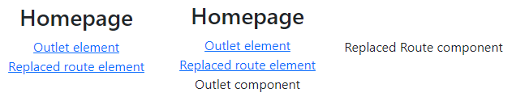<figcaption><p>Outlet nested component and not</p></figcaption></figure>


<details>

<summary>Render Route element components with useParams() variables</summary>

We create a **router** with the homepage and the **variable route** for the link **pat**hs.

```jsx
<Router>
  <Routes>
    <Route path="/" element={<House />} />
    <Route path=":variable/*" element={<Topic />} />
  </Routes>
</Router>
```

On the homepage, we _loop_ and _render_ the **object properties** as **paths.**&#x20;

```jsx
//The imported getSites() returns the array of objects to loop
import { getSites } from "../Content";
import Final from "./Final";

let topico = getSites();

<div>
  <ul>
    {topico.map(({ id, name }) => (
      <li key={id}>
        <Link to={id}> {name} </Link>
      </li>
    ))}
  </ul>
  
</div>

```

On the variable path, we extract the **current route** with **useParams()** and _render_ its corresponding _component_.

```jsx
//while also passing the :variable path as a prop.
import Primo from "./Primo";
import Secondo from "./Secondo";
import Terzo from "./Terzo";

function Topic() {
  const { variable } = useParams();

  const modules = {
    Primo,
    Secondo,
    Terzo
  };

  const Module = modules[variable];

  return (
    <div className="d-flex justify-content-center">
      <div className="d-block">
        <h1 className="text-center"> {variable} </h1>

        <Module fonte={variable} />
      </div>
    </div>
  );
}
```

On each of the variable route **components**, we _loop_ and _render_ their **resources** property.

We set the **Final** _Route element_ in the variable path to render it with the previous elements.

```jsx
//The Final component will render the resource id/name as :articolo path
import { getResor } from "../Content";
import Final from "./Final";

function Primo(prop) {
  let risorsa = getResor(prop.fonte);

  return(
    <div>
      <ul>
        {risorsa.resources.map((id) => (
          <li key={id.id}>
            <Link to={id.id}>{id.name}</Link>
          </li>
        ))}
      </ul>

      <Routes>
        <Route path=":articolo" element={<Final />} />
      </Routes>
    </div>
  )
}
```

The Final component renders the name and id props of the resource array elements.

```jsx
//We need both the path variables to use the imported getDesc()
import { getDesc } from "../Content";

function Final() {
  const { variable, articolo } = useParams();
  let { name, description } = getDesc({ variable, articolo });

  return (
    <div>
      <h4> {name} </h4>
      <p> {description} </p>
    </div>
  );
}

```

We **export** the **array** of objects and the **function** to filter its properties.

```jsx
//We render and loop the id/name for the route paths

const topico = [
  {
    name: "This is the Primo window",
    id: "Primo",
    resources: [
      {
        name: "Why React Hooks?",
        id: "why-react-hooks",
        description: `In this post you'll ...`
      },
      ...
    ]
  },
  ...
]

export function getSites() {
  return topico;
}

export function getResor(fonte) {
  return topico.find(({ id }) => id == fonte);
}

export function getDesc({ variable, articolo }) {
  return topico
    .find(({ id }) => id == variable)
    .resources.find(({ id }) => id == articolo);
}

```

</details>


Router variable Routes with variable components


### React Input Props and onChange() event handler

ReactJs **input props** allow us to have **controlled inputs**, in which we set an input's **value** using useState() and can edit it using an **onChange()** event handler.

We re-**set** the value of the **useState()** based on the input current **e.target.value** (target being a property of the event interface, referencing the input).

```
const [costo, setCosto] = useState(0)

<div>
  <label htmlFor="cash" className="form-label">How much spending?</label>
  <input id="cash" type="range" className="form-range" value={costo} 
         onChange={(e)=> setCosto(e.target.value)} name="costo" />
  <p className="text-center">Price being: {costo}$</p>
</div>

```

<figure>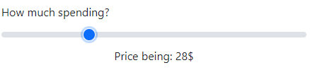<figcaption><p>Changing input value gets rendered with useState()</p></figcaption></figure>

<details>

<summary>useState() with number input</summary>

When **updating** an **integer useState()** outside the input we need to convert it with **Number()**, to maintain the single useState().

```
//while on the input onChange() is teh same as before

<input type="number" className="form-input" value={numba}
       onChange={(e)=> setNumba(e.target.value)} />
<button type="button" className="btn btn-sm btn-secondary" 
        onClick={()=> setNumba((x)=> Number(x) + 10) }>
  Add 10
</button>

```

</details>

<figure>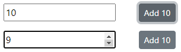<figcaption><p>Input number with Onchange</p></figcaption></figure>

**Text** and **radio/checkbox** inputs use **defaultValue/checked** for the default value prop, if the checkbox doesn't have a value prop on submit its value will be  "on".

```
//We use an useState() to set a defaultChecked(works for value too)
const [lenguage, setLenguage] = useState( "Hindi" );

<div className="form-check">
  <input type="radio" name='language' defaultChecked={true} value="hindi"
         onChange={(e)=> setLenguage(e.target.value) } />
  <label >Hindi</label>
</div>
<div className="form-check">
  <input type="radio" name='language' value="spanish"
         onChange={(e)=> setLenguage(e.target.value) } />
  <label>Spanish</label>
</div>

```

<figure><figcaption><p>Defaultchecker() value set</p></figcaption></figure>

We use the **useId()** **React hook** to avoid conflicts when re-rendering multiple **labels/inputs**.

```
//We can add strings to the useId() to avoid callin it multiple times

const testo= useId()

<form className="row">
  <div className="col-6">
    <input id={testo} type="text" className="form-control" 
           defaultValue="any useState()" />
  </div

  <div className="col-6">
    <div className="form-check">
      <label htmlFor={testo + "check"} className="form-check-label">checked</label>
      <input id={test + "check"} type="checkbox" checked={true}  
      value="any useState()" className="form-check-input" />
    </div>
  </div>

  <div className="col-4">
    <button className="btn btn-primary">Submit</button>
  </div>
</form>

```

<figure>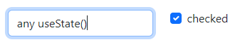<figcaption><p>defaultValue text and checked checkbox</p></figcaption></figure>

We use the **max/min** input prop to set its _submit conditions_, the event handler **onInvalid()** is triggered when the submit fails.

```
//For text input we use min/manLenght

<form>
  <input type="text" className="form-control" maxLength="10" minLength="4"
         onInvalid={()=> {console.log("riprova")}}/>

  <div>
    <label htmlFor={testo} className="form-label">Numeri</label>
    <input id={testo} type="number" className="form-control" min="120" max="400" />
  </div>

  <button className="btn btn-primary">Submit</button>
</form>

```

<figure><figcaption><p>The error messae on failed submit is included</p></figcaption></figure>

### React Form onSubmit() event handler and FormData()

A **type="submit" button** will trigger the **form onSubmit()** event handler.

```
//You can use type="reset" to reset the form or type="button" to not form submit

<form onSubmit={invia}>
  <input type="text" className="form-control" name="elemento" 
         value={mino} onChange={(e)=> setMino(e.target.value)} />

  <input type="checkbox" name="checked" className="form-check-input" />

  <button type="submit" className="btn btn-primary">Submit</button>
</form>
```

We then use **new FormData(form, submitter)** **interface** to render the _e.target HTML form_ from onSubmit(), as a **name/value iterable**.

We finally use the **Object.fromEntries(iterable)** static method to convert the _FormData_ into an _Object._

```
//The keys/names are gonna be in alphabetical order

const [mino, setMino] = useState("")

function manda(e){
  e.preventDefault()

  let forma= e.target
  let formdata = new FormData(forma)
  let dati = Object.fromEntries(formdata.entries())

  console.log(dati)
}
```

<figure>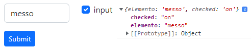<figcaption><p>form onSubmit() and formData object</p></figcaption></figure>

We use **FormData methods** to edit the form object.

We can use **append(key, value)** and **set(key, value)** to add a new key/value pair, **delete(key)** to remove one, **get(key)** to return the first _value_ associated with the key, and **has(key)** which returns _true/false_ depending if the key is present.

```
//Values will be converted in strings (like "true" and "96")

let form= e.target
let formdata= new FormData(form)

formdata.append("nuovo", 101)
formdata.set("vecchio", "penny")

console.log( formdata.get("nuovo") )    //"101"
formdata.delete("nuovo")  
console.log( formdata.has("nuovo") )   //"false"
```

We can use the **entries(), keys()**, and **values()** methods to return a key/values, keys, and values **iterable**.

```
//In order to get the values we need to loop the iterable

for (const pair of formdata.entries()) {
  console.log( pair );          //["checked", "on"], ["elemento","messo"]
}

formdata.values()               //checked, elemento
formdata.keys()                 //on, messo
```

### Input file image render and multiple input attribute

On **type="file" \<input>** we use the **accept** property which sets the **MIME file types** we can submit. We can use accept= "audio/\*_" and "image/\*_" and "video/\*" in case we want to accept any file type.

```
//With multiple accept properties we use (,), we use the formdata for image src

<div className="col-3">
  <form onSubmit={immagine} className="text-center">
    <div className="mb-3">
      <label htmlFor="nsa" className="form-label"></label>
      <input id="nsa" type="file" className="form-control" 
             name="sauce" accept=".png, .webp"/>
    </div>

    <button type="submit" className="btn btn-primary">Submit</button>
  </form>
</div>

<div className="col-3" >
  
  <p> {digitale} </p>
</div>

```

<figure>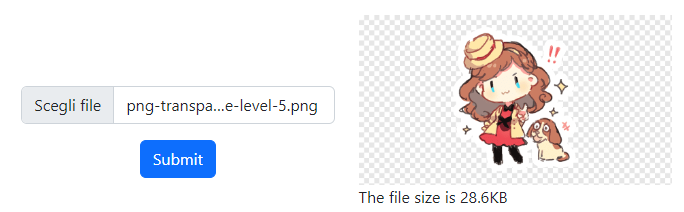<figcaption><p>form-control file input and image submit</p></figcaption></figure>

Its returned formdata will be an object of image properties, the **lastModified** (the UNIX epoc number) in milliseconds, its **size** in bytes, the file's **name**, and its MIME **type**.

<details>

<summary>Input image file formdata</summary>

The **accept** property isn't enough to filter the input files so we use a **server-side** function.

```
//We post the image only if its file type is Included in out array

const fileTypes = [
  'image/apng',
  'image/bmp',
  'image/gif',
  'image/jpeg',
  'image/pjpeg',
  'image/png',
  'image/svg+xml',
  'image/tiff',
  'image/webp',
  `image/x-icon`
];

function tipo(poster){
  return fileTypes.includes(poster.type)
}

```

The **Byte** is the basic unit of file storage, based on the **binary** system the **Kilobyte** will be 1024 bytes (2^10) while the **Megabyte** is 1024^2.

```
//we convert the image file size 

function grande(size){
  if(size < 1024) {
    return size + 'bytes';
  } else if(size > 1024 && size < 1048576) {
    return (size/1024).toFixed(1) + 'KB';
  } else if(size > 1048576) {
    return (size/1048576).toFixed(1) + 'MB';
  }
}

```

To render the image src we need to **URL.createObjectURL()** the entire **image object**.

```
//We useState() to render the src in the DOM

function immagine(e){
  e.preventDefault()

  let form= e.target
  let formdata= new FormData(form)
  let result= Object.fromEntries(formdata.entries())

  if(tipo(result.sauce)){
    let abb = grande(result.sauce.size)
    setDigitale("The file size is " + abb )
    setVedere( URL.createObjectURL(result.sauce) )
  }
}

```

</details>

<figure>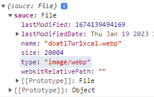<figcaption><p>Image formdata properties</p></figcaption></figure>

The **multiple input attribute** allows submitting of multiple values in a single input.

If used on a **type="text"** input, the values need to be _separated with a comma_ (,), any space will be cut in the formdata value.

If added to **\<select> it will expand its size**, we will use ctrl + click to multiple select on pc (while we get a **pop-up on mobile**)

<details>

<summary>Multiple attribute &#x3C;input> and Javascript expression render</summary>

We can limit the **size** of an **\<select>** after we add multiple.

```
//we use the useId() hook to create id for the input/labels

let base = useId()

<form onSubmit={manda}>
  <div className="my-3">
    <label htmlFor={base+"one"} className="form-label">Multi email</label>
    <input id={base+"one"} type="email" name="posta" 
            className="form-control" multiple />
  </div>

  <div>
    <label htmlFor={base+"tre"} className="form-label">Multi files</label>
    <input id={base + "base"} type="file" className="form-control" 
            name="imma" accept="image/*" multiple/>
  </div>

  <div className="my-3">
    <label htmlFor={base+"due"} className="form-label">Multi select</label>
    <select id={base + "due"} name="insieme" className="form-select" 
            size="3" multiple>
      <option value="primo">uno</option>
      <option value="secondo">due</option>
      <option value="terzo">tre</option>
      <option value="quarto">quattro</option>
      <option value="quinto">cinque</option>
      <option value="sei">sei</option>
    </select>
  </div>

  <button className="btn btn-primary">submit</button>
</form>

```

We will **render** the **javascript expressions** after the formdata is submitted.

```
//they are not components tho, they are useState() with node elements

<div className="col-7">
  <div className="row text-center">
      <h3> Images sent to: {mail} </h3>
  </div>

  <div className="row align-items-center">
    {gruppo}
  </div>

  <div className="row my-2">
    <p> The selected values: {choice}</p>
  </div>
</div>

```

</details>

<figure>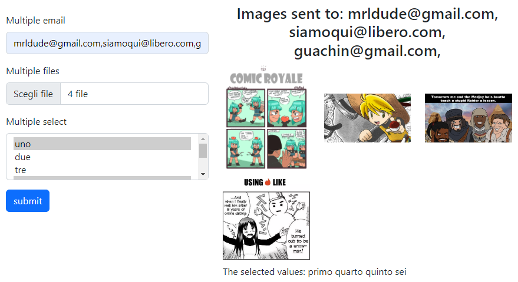<figcaption><p>multiple input submit and render</p></figcaption></figure>

<details>

<summary>Rendering formdata entries for multiple &#x3C;input></summary>

The **formdata** object from a **multiple** \<input> will only show the LAST value of each **name/key** but the **formdata iterable** will keep track of every multiple input value.

We use an **useState(\[])** to render an array of **React node elements** as a **javascript expression {}**.

We can't use push() for the useState() because it returns the array's length, not the edited array, while **concat()** returns the "new" array.

```
//The image property value is an object so we need {} to deconstruct it
//We use array deconstruct in the setter useState() function
//The multiple type="text" input formdata will return all the values at once

const [gruppo, setGruppo] = useState( [] )
const [ mail, setMail ] = useState("")
const [ choice, setChoice ] =useState([])

function manda(e){
  e.preventDefault()

  let form= e.target
  let formdata= new FormData(form)
  
  for(const sor of formdata.entries()){
    if( sor[0] == "imma" ){
    
      const {size, name, lastModified, type} = sor[1]

      setGruppo( gru => [
        ...gru, 
        <div className="col-4" key={lastModified} >
          
        </div>
      ])
    }else if( sor[0] == "insieme" ){

      setChoice( mal => [
        ...mal,
        <span key={sor[1]}>
          {sor[1] + " "}
        </span>
       ]
      )
    }
  }

  let formula= Object.fromEntries(formdata.entries())

  let uno = formula.posta.split(",")

  for( const sent of uno ){
    setMail(item => item + sent + ", " )
  }
}

```

</details>

<figure>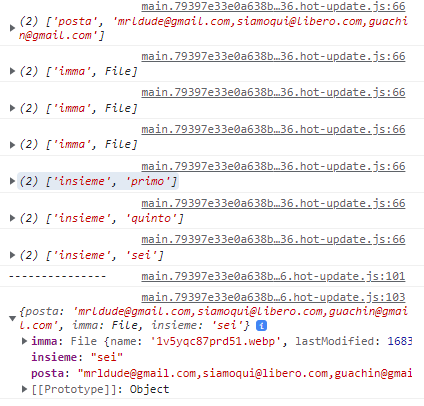<figcaption><p>multiple input formdata object</p></figcaption></figure>
